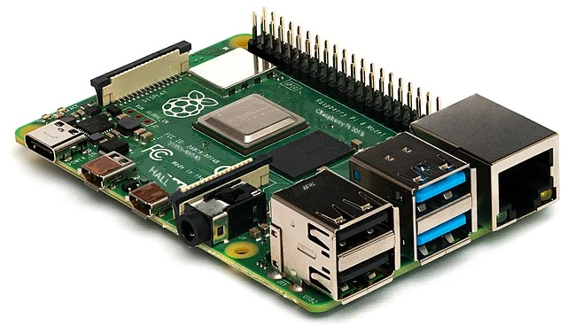
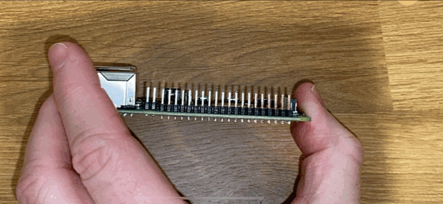
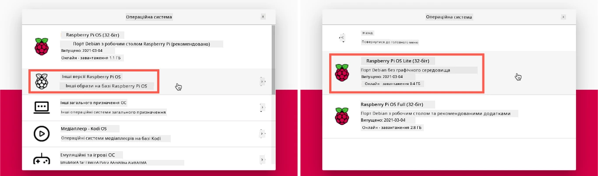
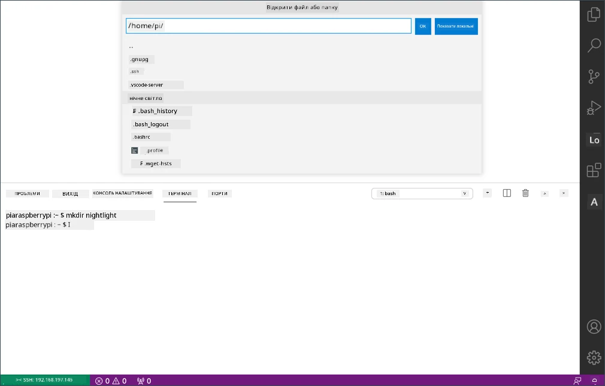

# Raspberry Pi

[Raspberry Pi](https://www.raspberrypi.com) — це одноплатний комп'ютер. Ви можете додавати датчики та виконавчі пристрої, використовуючи широкий спектр пристроїв та екосистем. У цих уроках ми будемо використовувати апаратну екосистему під назвою [Grove](https://www.seeedstudio.com/category/Grove-c-1003.html). Ви будете програмувати ваш Pi та отримувати доступ до датчиків Grove за допомогою Python.



## Налаштування

Якщо ви використовуєте Raspberry Pi як IoT-обладнання, є два варіанти: проходити всі уроки й програмувати безпосередньо на Pi або підключатися до Pi без монітора («headless») віддалено й програмувати з вашого комп'ютера.

Перед початком також потрібно встановити на Pi плату Grove Base Hat.

> 👩‍🏫 **Примітка до цієї версії.** Інструкції оновлено для Raspberry Pi OS Bookworm (2023) і новіших, у яких глобальне встановлення пакетів через `pip` заборонено. Ми ще не перевіряли ці кроки на справжньому Raspberry Pi, тому перед заняттям пройдіть їх самостійно.

### Завдання: налаштування

Встановіть Grove Base Hat на Pi та налаштуйте Pi.

1. Встановіть Grove Base Hat на Pi. Роз'єм плати насувається на всі GPIO-піни Pi до упору, і плата щільно сідає зверху, накриваючи Pi.

    

1. Вирішіть, як ви програмуватимете Pi, і перейдіть до відповідного розділу нижче:

    * [Робота безпосередньо на Pi](#робота-безпосередньо-на-pi)
    * [Віддалене програмування Pi](#віддалене-програмування-pi)

### Робота безпосередньо на Pi

Якщо ви хочете працювати безпосередньо на Pi, використовуйте настільну версію Raspberry Pi OS і встановіть на неї всі потрібні інструменти.

#### Завдання: робота безпосередньо на Pi

Налаштуйте Pi для розробки.

1. Виконайте інструкції з [посібника з налаштування Raspberry Pi](https://www.raspberrypi.com/documentation/computers/getting-started.html): встановіть Raspberry Pi OS (рекомендовано 64-бітну версію), під'єднайте клавіатуру, мишу й монітор, підключіть Pi до Wi-Fi або Ethernet і оновіть програмне забезпечення.

Щоб програмувати Pi з сенсорами й актуаторами Grove, потрібно встановити редактор коду, а також бібліотеки й інструменти для роботи з обладнанням Grove.

1. Після перезавантаження Pi відкрийте термінал: натисніть значок **Terminal** у верхньому меню або виберіть *Menu -> Accessories -> Terminal*.

1. Оновіть ОС і встановлене програмне забезпечення:

    ```sh
    sudo apt update && sudo apt full-upgrade --yes
    ```

1. Увімкніть інтерфейс I<sup>2</sup>C, через який Pi спілкується з платою Grove Base Hat, і встановіть потрібні системні пакети:

    ```sh
    sudo raspi-config nonint do_i2c 0
    sudo apt install git python3-dev python3-venv python3-smbus2 python3-rpi-lgpio --yes
    ```

1. Створіть папку проєкту з віртуальним середовищем Python і встановіть у нього бібліотеку Grove:

    ```sh
    mkdir ~/nightlight
    cd ~/nightlight
    python3 -m venv --system-site-packages .venv
    source .venv/bin/activate

    git clone https://github.com/Seeed-Studio/grove.py ~/grove.py
    pip install ~/grove.py
    ```

    Одна з сильних сторін Python — можливість встановлювати [pip-пакети](https://pypi.org), тобто бібліотеки, які написали й опублікували інші люди. Python-бібліотеку Seeed Grove встановлюють із вихідного коду: ці команди клонують її репозиторій і встановлюють бібліотеку локально.

    > 💁 Пакети встановлюються у [віртуальне середовище Python](https://docs.python.org/uk/3/library/venv.html) в папці `.venv`, а не глобально. У Raspberry Pi OS Bookworm і новіших глобальна команда `pip install` взагалі заборонена й видає помилку `externally-managed-environment`. Прапорець `--system-site-packages` дає середовищу доступ до системних бібліотек, встановлених через `apt` (наприклад, для роботи з GPIO та I<sup>2</sup>C).

    > 💁 Щоразу, відкриваючи новий термінал для роботи з нічником, активуйте середовище командою `source ~/nightlight/.venv/bin/activate`. У запрошенні командного рядка з'явиться префікс `(.venv)`.

1. Перезавантажте Pi через меню або командою:

    ```sh
    sudo reboot
    ```

1. Після перезавантаження знову відкрийте термінал і встановіть [Visual Studio Code (VS Code)](https://code.visualstudio.com), редактор, у якому ви писатимете код пристрою на Python:

    ```sh
    sudo apt install code
    ```

    Після встановлення VS Code з'явиться у верхньому меню.

    > 💁 Ви можете використовувати будь-яке інше середовище розробки чи редактор для Python, але інструкції в уроках написано для VS Code.

1. Встановіть у VS Code розширення [Python](https://marketplace.visualstudio.com/items?itemName=ms-python.python). Разом із ним встановиться Pylance, який забезпечує підказки та перевірку коду.

### Віддалене програмування Pi

Замість того щоб програмувати безпосередньо на Pi, можна запускати його без клавіатури, миші й монітора (headless), а налаштовувати й програмувати з вашого комп'ютера через Visual Studio Code.

#### Встановлення Raspberry Pi OS

Для віддаленого програмування потрібно записати Raspberry Pi OS на SD-карту.

##### Завдання: встановлення Raspberry Pi OS

Підготуйте Raspberry Pi OS для роботи без монітора.

1. Завантажте **Raspberry Pi Imager** зі [сторінки програмного забезпечення Raspberry Pi](https://www.raspberrypi.com/software/) і встановіть його.

1. Вставте SD-карту в комп'ютер (за потреби через адаптер).

1. Запустіть Raspberry Pi Imager.

1. Натисніть **CHOOSE DEVICE** (Вибрати пристрій) і виберіть свою модель Raspberry Pi.

1. Натисніть **CHOOSE OS** (Вибрати ОС), потім *Raspberry Pi OS (other)* і *Raspberry Pi OS Lite (64-bit)*.

    

    > 💁 Raspberry Pi OS Lite — це версія Raspberry Pi OS без графічного інтерфейсу. Для Pi без монітора він не потрібен, тож образ менший і система швидше завантажується. Інтерфейс Imager у нових версіях може виглядати інакше, ніж на зображенні.

1. Натисніть **CHOOSE STORAGE** (Вибрати накопичувач) і виберіть SD-карту.

1. Натисніть **NEXT** (Далі), а коли Imager запропонує застосувати налаштування ОС, виберіть **EDIT SETTINGS** (Змінити налаштування). Тут можна наперед налаштувати Raspberry Pi OS перед записом на карту:

    1. На вкладці **General** задайте ім'я хоста (`raspberrypi`), ім'я користувача й пароль. Запам'ятайте їх: з ними ви входитимете на Pi. Користувача `pi` за замовчуванням у нових версіях Raspberry Pi OS більше немає, тож ім'я потрібно задати самостійно.

    1. Якщо Pi підключатиметься через Wi-Fi, позначте **Configure wireless LAN**, введіть назву (SSID) і пароль мережі та виберіть країну. Для підключення кабелем Ethernet цього робити не потрібно. Переконайтеся, що Pi підключатиметься до тієї самої мережі, що й ваш комп'ютер.

    1. Позначте **Set locale settings** і виберіть часовий пояс та розкладку клавіатури.

    1. На вкладці **Services** позначте **Enable SSH** і виберіть вхід за паролем.

    1. Натисніть **SAVE** (Зберегти), а потім **YES** (Так), щоб застосувати налаштування.

1. Підтвердьте запис ОС на SD-карту. У macOS і Windows система може попросити пароль адміністратора, бо записувати образи дисків можна лише з підвищеними правами.

ОС буде записано на SD-карту, після чого карту буде автоматично вилучено. Вийміть її з комп'ютера, вставте в Pi, увімкніть живлення й зачекайте близько 2 хвилин, поки система повністю завантажиться.

#### Підключення до Pi

Наступний крок — віддалено підключитися до Pi за допомогою `ssh`, який є в macOS, Linux і Windows 10/11.

##### Завдання: підключення до Pi

Віддалено підключіться до Pi.

1. Відкрийте термінал або командний рядок і введіть таку команду, замінивши `<користувач>` на ім'я, задане в Raspberry Pi Imager:

    ```sh
    ssh <користувач>@raspberrypi.local
    ```

1. Має з'явитися запит пароля.

    Пошук комп'ютерів у мережі за адресою `<ім'я-хоста>.local` працює завдяки технології ZeroConf (у Apple вона називається Bonjour). У сучасних macOS і Windows 10/11 вона вже є. Якщо ви бачите помилку, що ім'я хоста не знайдено:

    1. У Linux встановіть Avahi:

        ```sh
        sudo apt-get install avahi-daemon
        ```

    1. У Windows встановіть [Bonjour Print Services for Windows](https://support.apple.com/kb/DL999).

    > 💁 Якщо підключитися через `raspberrypi.local` не вдається, використовуйте IP-адресу Pi. Способи її дізнатися описано в [документації Raspberry Pi](https://www.raspberrypi.com/documentation/computers/remote-access.html#ip-address).

1. Введіть пароль, який ви задали в налаштуваннях Raspberry Pi Imager.

#### Налаштування програмного забезпечення на Pi

Після підключення до Pi оновіть ОС і встановіть бібліотеки та інструменти для роботи з обладнанням Grove.

##### Завдання: налаштування програмного забезпечення на Pi

Оновіть програмне забезпечення Pi та встановіть бібліотеки Grove.

1. У сесії `ssh` оновіть систему й перезавантажте Pi:

    ```sh
    sudo apt update && sudo apt full-upgrade --yes && sudo reboot
    ```

    Під час перезавантаження сесія `ssh` завершиться. Зачекайте близько 30 секунд і підключіться знову.

1. Увімкніть інтерфейс I<sup>2</sup>C, через який Pi спілкується з платою Grove Base Hat, і встановіть потрібні системні пакети:

    ```sh
    sudo raspi-config nonint do_i2c 0
    sudo apt install git python3-dev python3-venv python3-smbus2 python3-rpi-lgpio --yes
    ```

1. Створіть папку проєкту з віртуальним середовищем Python і встановіть у нього бібліотеку Grove:

    ```sh
    mkdir ~/nightlight
    cd ~/nightlight
    python3 -m venv --system-site-packages .venv
    source .venv/bin/activate

    git clone https://github.com/Seeed-Studio/grove.py ~/grove.py
    pip install ~/grove.py
    ```

    Одна з сильних сторін Python — можливість встановлювати [pip-пакети](https://pypi.org), тобто бібліотеки, які написали й опублікували інші люди. Python-бібліотеку Seeed Grove встановлюють із вихідного коду: ці команди клонують її репозиторій і встановлюють бібліотеку локально.

    > 💁 Пакети встановлюються у [віртуальне середовище Python](https://docs.python.org/uk/3/library/venv.html) в папці `.venv`, а не глобально. У Raspberry Pi OS Bookworm і новіших глобальна команда `pip install` взагалі заборонена й видає помилку `externally-managed-environment`. Прапорець `--system-site-packages` дає середовищу доступ до системних бібліотек, встановлених через `apt` (наприклад, для роботи з GPIO та I<sup>2</sup>C).

1. Перезавантажте Pi:

    ```sh
    sudo reboot
    ```

    Під час перезавантаження сесія `ssh` завершиться. Підключатися знову не потрібно.

#### Налаштування VS Code для віддаленої роботи

Після налаштування Pi до нього можна підключитися з вашого комп'ютера через Visual Studio Code (VS Code), безкоштовний редактор коду, у якому ви писатимете код пристрою на Python.

##### Завдання: налаштування VS Code для віддаленої роботи

Встановіть потрібне програмне забезпечення й віддалено підключіться до Pi.

1. Встановіть VS Code на свій комп'ютер за [документацією VS Code](https://code.visualstudio.com/docs/setup/setup-overview).

1. Виконайте інструкції з документації [Remote Development using SSH](https://code.visualstudio.com/docs/remote/ssh), щоб встановити потрібні компоненти.

1. За тими самими інструкціями підключіть VS Code до Pi.

1. Після підключення встановіть розширення [Python](https://marketplace.visualstudio.com/items?itemName=ms-python.python) на Pi, як описано в розділі [Managing extensions](https://code.visualstudio.com/docs/remote/ssh#_managing-extensions).

## Hello World

Коли починають працювати з новою мовою програмування чи технологією, за традицією створюють застосунок «Hello World», тобто невелику програму, яка виводить щось на кшталт тексту `"Hello World"`. Так перевіряють, що всі інструменти налаштовано правильно.

Застосунок Hello World для Pi перевірить, що Python і Visual Studio Code встановлено правильно.

Він буде в папці `nightlight`, яку ви створили під час налаштування. У наступних частинах завдання ви писатимете в ній інший код, щоб створити нічник.

### Завдання: Hello World

Створіть застосунок Hello World.

1. Запустіть VS Code безпосередньо на Pi або на своєму комп'ютері, підключившись до Pi через розширення Remote - SSH.

1. Відкрийте папку `nightlight`: виберіть *File -> Open Folder...*, виберіть папку *nightlight* у домашній папці й натисніть **OK**.

    

1. Відкрийте термінал VS Code через меню *Terminal -> New Terminal* або комбінацією `` CTRL+` ``. Переконайтеся, що віртуальне середовище активоване (у запрошенні є `(.venv)`). Якщо ні, виконайте:

    ```sh
    source .venv/bin/activate
    ```

    > 💁 VS Code може запропонувати вибрати інтерпретатор Python. Виберіть той, що в папці `.venv`. Тоді нові термінали активуватимуть середовище автоматично.

1. Створіть файл `app.py`:

    ```sh
    touch app.py
    ```

1. Відкрийте файл `app.py` у провіднику VS Code і додайте такий код:

    ```python
    print('Hello World!')
    ```

    Функція `print` виводить у консоль усе, що їй передали.

1. У терміналі VS Code запустіть застосунок:

    ```sh
    python app.py
    ```

    У терміналі з'явиться:

    ```output
    (.venv) user@raspberrypi:~/nightlight $ python app.py
    Hello World!
    ```

> 💁 Цей код є в папці [code/pi](code/pi).

😀 Ваша програма «Hello World» працює!
