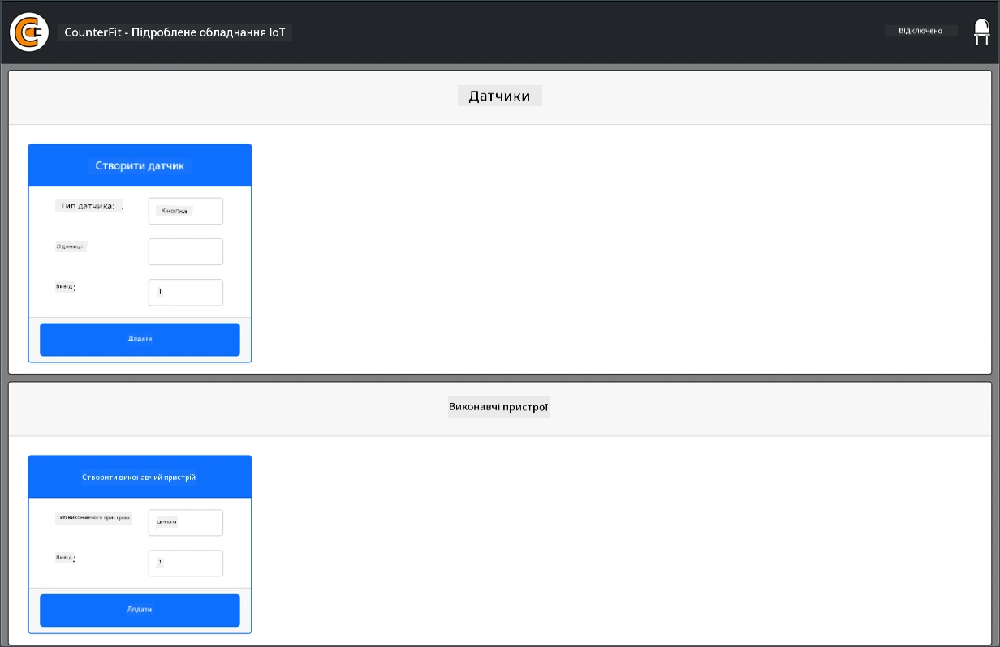
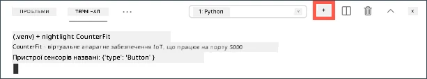

# Віртуальний одноплатний комп'ютер

Замість того щоб купувати IoT-пристрій разом із сенсорами й актуаторами, можна симулювати IoT-обладнання на своєму комп'ютері. Проєкт [CounterFit](https://github.com/CounterFit-IoT/CounterFit) запускає локальний застосунок, що імітує IoT-обладнання, наприклад сенсори й актуатори. До нього можна звертатися з Python-коду, написаного так само, як код для Raspberry Pi зі справжнім обладнанням.

## Налаштування

Щоб користуватися CounterFit, потрібно встановити на комп'ютер безкоштовне програмне забезпечення.

### Завдання

Встановіть потрібне програмне забезпечення.

1. Встановіть Python 3.14 (підійде й 3.10 або новіший). Інструкції є на [сторінці завантажень Python](https://www.python.org/downloads/).

    > 💁 У Windows під час встановлення позначте **Add python.exe to PATH**.

1. Встановіть Visual Studio Code (VS Code), редактор, у якому ви писатимете код віртуального пристрою на Python. Інструкції є в [документації VS Code](https://code.visualstudio.com/docs/setup/setup-overview).

    > 💁 Ви можете використовувати будь-яке інше середовище розробки чи редактор для Python, але інструкції в уроках написано для VS Code.

1. Встановіть розширення [Python для VS Code](https://marketplace.visualstudio.com/items?itemName=ms-python.python). Разом із ним встановиться Pylance, який забезпечує підказки та перевірку коду.

Як встановити й налаштувати сам застосунок CounterFit, описано далі в завданні: його встановлюють окремо для кожного проєкту.

## Hello World

Коли починають працювати з новою мовою програмування чи технологією, за традицією створюють застосунок «Hello World», тобто невелику програму, яка виводить щось на кшталт тексту `"Hello World"`. Так перевіряють, що всі інструменти налаштовано правильно.

Застосунок Hello World для віртуального IoT-обладнання перевірить, що Python і Visual Studio Code встановлено правильно. Він також підключиться до CounterFit, де житимуть віртуальні сенсори й актуатори. Жодного обладнання він не використовуватиме, лише підключиться, щоб довести, що все працює.

Застосунок буде в папці `nightlight`. У наступних частинах завдання ви писатимете в ній інший код, щоб створити нічник.

### Налаштування віртуального середовища Python

Одна з сильних сторін Python — можливість встановлювати [pip-пакети](https://pypi.org), тобто бібліотеки, які написали й опублікували інші люди. Пакет встановлюється однією командою, після чого його можна використовувати у своєму коді. Через pip ви встановите пакети для роботи з CounterFit.

Якщо встановлювати пакети глобально, вони доступні всюди на комп'ютері, і це може спричинити конфлікти версій: один застосунок залежить від однієї версії пакета, а інший потребує нової, яка ламає перший. Щоб уникнути цього, використовують [віртуальне середовище Python](https://docs.python.org/uk/3/library/venv.html) — по суті, окрему копію Python у спеціальній папці. Пакети, встановлені у віртуальне середовище, потрапляють лише в цю папку.

#### Завдання: налаштуйте віртуальне середовище Python

Створіть віртуальне середовище Python і встановіть pip-пакети для CounterFit.

1. У терміналі або командному рядку перейдіть у зручне місце й виконайте такі команди, щоб створити нову папку й перейти в неї:

    ```sh
    mkdir nightlight
    cd nightlight
    ```

1. Створіть віртуальне середовище в папці `.venv`:

    * У Windows:

        ```cmd
        py -m venv .venv
        ```

    * У macOS або Linux:

        ```sh
        python3 -m venv .venv
        ```

1. Активуйте віртуальне середовище:

    * У Windows:
        * якщо ви використовуєте командний рядок (Command Prompt), зокрема через Windows Terminal, виконайте:

            ```cmd
            .venv\Scripts\activate.bat
            ```

        * якщо ви використовуєте PowerShell, виконайте:

            ```powershell
            .\.venv\Scripts\Activate.ps1
            ```

            > 💁 Якщо з'являється помилка, що виконання сценаріїв у системі вимкнено, дозвольте запуск локальних сценаріїв для свого користувача (права адміністратора не потрібні):
            >
            > ```powershell
            > Set-ExecutionPolicy -Scope CurrentUser -ExecutionPolicy RemoteSigned
            > ```
            >
            > Підтвердьте, ввівши `Y`, перезапустіть PowerShell і спробуйте ще раз. Докладніше про це на [сторінці про політики виконання](https://learn.microsoft.com/powershell/module/microsoft.powershell.core/about/about_execution_policies).

    * У macOS або Linux виконайте:

        ```sh
        source ./.venv/bin/activate
        ```

    > 💁 Ці команди треба виконувати з тієї самої папки, де ви створювали віртуальне середовище. Заходити в папку `.venv` ніколи не потрібно: активуйте середовище, встановлюйте пакети й запускайте код з папки, у якій ви були під час його створення.

1. Після активації команда `python` запускатиме ту версію Python, з якої створено віртуальне середовище. Перевірте версію:

    ```sh
    python --version
    ```

    Результат буде приблизно таким:

    ```output
    (.venv) ➜  nightlight python --version
    Python 3.14.8
    ```

    > 💁 Ваша версія може відрізнятися. Якщо це 3.10 або новіша, усе гаразд. Якщо старіша, видаліть цю папку, встановіть новішу версію Python і повторіть кроки.

1. Встановіть pip-пакети CounterFit. Серед них сам застосунок CounterFit і шими (shims) для обладнання Grove. Шими дають змогу писати код так, ніби ви працюєте з фізичними сенсорами й актуаторами з екосистеми Grove, хоча насправді вони підключені до віртуального IoT-пристрою.

    ```sh
    pip install CounterFit counterfit-connection counterfit-shims-grove
    pip install "flask==3.1.3" "flask-socketio==5.6.1" "eventlet==0.41.2" "werkzeug==3.1.9"
    ```

    Ці pip-пакети встановлюються лише у віртуальне середовище й поза ним недоступні.

    > ⚠️ Друга команда обов'язкова. CounterFit давно не оновлювався й вимагає старих версій Flask та eventlet. Без оновлення він не запуститься з помилкою `ImportError: cannot import name 'url_quote'`, а на Python 3.12+ ще й з помилкою `No module named 'distutils'`. Друга команда виведе попередження на кшталт `counterfit 0.1.4.dev9 requires Flask==2.1.2, but you have flask 3.x`. Це очікувано, на роботу CounterFit воно не впливає. Ці кроки перевірено на Python 3.11, 3.12, 3.13 і 3.14.

### Напишіть код

Коли віртуальне середовище Python готове, можна написати код застосунку «Hello World».

#### Завдання: напишіть код

Створіть Python-застосунок, який виводить у консоль `"Hello World"`.

1. У терміналі (з активованим віртуальним середовищем) створіть файл `app.py`:

    * У Windows виконайте:

        ```cmd
        type nul > app.py
        ```

    * У macOS або Linux виконайте:

        ```sh
        touch app.py
        ```

1. Відкрийте поточну папку у VS Code:

    ```sh
    code .
    ```

    > 💁 Якщо в macOS термінал повідомляє `command not found`, VS Code не додано до змінної PATH. Додайте його за інструкцією з [розділу про запуск із командного рядка](https://code.visualstudio.com/docs/setup/mac#_launching-from-the-command-line) і повторіть команду. У Windows і Linux VS Code додається до PATH автоматично.

1. Під час запуску VS Code знайде віртуальне середовище Python і покаже його в рядку стану внизу вікна:

    

    > 💁 Якщо VS Code не вибрав середовище сам, натисніть `Ctrl+Shift+P` (`Cmd+Shift+P` на macOS), виберіть **Python: Select Interpreter** і вкажіть інтерпретатор із папки `.venv`.

1. Якщо термінал VS Code уже був відкритий до запуску, віртуальне середовище в ньому не активоване. Найпростіше закрити такий термінал кнопкою **Kill the active terminal instance**:

    

    Чи активоване середовище, видно з префікса з назвою середовища в запрошенні командного рядка, наприклад:

    ```sh
    (.venv) ➜  nightlight
    ```

    Якщо префікса `.venv` немає, віртуальне середовище в цьому терміналі не активоване.

1. Відкрийте новий термінал через меню *Terminal -> New Terminal* або комбінацією `` CTRL+` ``. Новий термінал сам активує віртуальне середовище, і назва `.venv` з'явиться в запрошенні:

    ```output
    ➜  nightlight source .venv/bin/activate
    (.venv) ➜  nightlight
    ```

1. Відкрийте файл `app.py` у провіднику VS Code і додайте такий код:

    ```python
    print('Hello World!')
    ```

    Функція `print` виводить у консоль усе, що їй передали.

1. У терміналі VS Code запустіть застосунок:

    ```sh
    python app.py
    ```

    У терміналі з'явиться:

    ```output
    (.venv) ➜  nightlight python app.py
    Hello World!
    ```

😀 Ваша програма «Hello World» працює!

### Підключіть «обладнання»

Другий крок «Hello World» — запустити застосунок CounterFit і підключити до нього свій код. Це віртуальний аналог підключення IoT-обладнання до набору для розробки.

#### Завдання: підключіть «обладнання»

1. У терміналі VS Code запустіть CounterFit:

    ```sh
    counterfit
    ```

    Застосунок запуститься й відкриється у браузері:

    

    Він матиме статус *Disconnected*, а світлодіод у правому верхньому куті не світитиметься.

    > 💁 У терміналі може з'явитися попередження `Eventlet is deprecated`. Його можна ігнорувати. Якщо браузер не відкрився сам, відкрийте [http://127.0.0.1:5000](http://127.0.0.1:5000).

1. Додайте такий код на початок `app.py`:

    ```python
    from counterfit_connection import CounterFitConnection
    CounterFitConnection.init('127.0.0.1', 5000)
    ```

    Цей код імпортує клас `CounterFitConnection` з модуля `counterfit_connection`, що входить до встановленого раніше пакета `counterfit-connection`. Потім він ініціалізує підключення до застосунку CounterFit, який працює на адресі `127.0.0.1` (ця IP-адреса завжди вказує на ваш власний комп'ютер, її ще називають *localhost*) і порту 5000.

    > 💁 Якщо порт 5000 зайнятий іншим застосунком (у macOS його часто займає AirPlay Receiver), змініть порт у коді й запустіть CounterFit командою `counterfit --port <номер_порту>`, замінивши `<номер_порту>` на потрібний порт.

1. Відкрийте новий термінал VS Code кнопкою **Create a new integrated terminal**, бо в поточному терміналі працює CounterFit.

    

1. У новому терміналі запустіть `app.py`, як і раніше. Статус CounterFit зміниться на **Connected**, і світлодіод засвітиться.

    

> 💁 Цей код є в папці [code/virtual-device](code/virtual-device).

😀 Ви успішно підключилися до «обладнання»!
