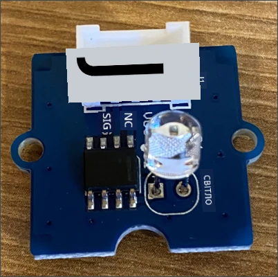
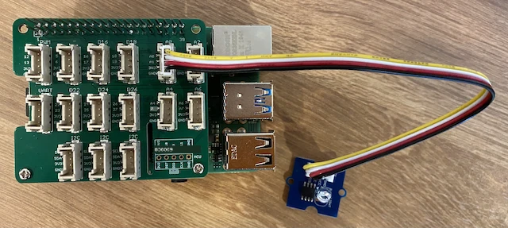

# Створення нічника - Raspberry Pi

У цій частині уроку ви додасте датчик світла до вашого Raspberry Pi.

## Апаратне забезпечення

Датчик для цього уроку — це **датчик світла**, який використовує [фотодіод](https://wikipedia.org/wiki/Photodiode) для перетворення світла в електричний сигнал. Це аналоговий датчик, який передає ціле значення від 0 до 1,000, що вказує на відносну кількість світла, але не відповідає жодній стандартній одиниці вимірювання, такій як [люкс](https://wikipedia.org/wiki/Lux).

Датчик світла є зовнішнім датчиком Grove і потребує підключення до Grove Base hat на Raspberry Pi.

### Підключення датчика світла

Датчик світла Grove, який використовується для визначення рівня освітлення, потрібно підключити до Raspberry Pi.

#### Завдання - підключення датчика світла

Підключіть датчик світла.



1. Вставте один кінець кабелю Grove у роз'єм на модулі датчика світла. Він вставляється лише в одному напрямку.

1. З вимкненим Raspberry Pi підключіть інший кінець кабелю Grove до аналогового роз'єму, позначеного **A0**, на Grove Base hat, прикріпленому до Pi. Цей роз'єм є другим справа в ряду роз'ємів поруч із GPIO-пінами.



## Програмування датчика світла

Тепер пристрій можна запрограмувати за допомогою датчика світла Grove.

### Завдання - програмування датчика світла

Програмуйте пристрій.

1. Увімкніть Pi і зачекайте, поки він завантажиться.

1. Відкрийте проєкт нічника у VS Code, який ви створили в попередній частині цього завдання, або безпосередньо на Pi, або через розширення Remote SSH.

1. Переконайтеся, що в терміналі VS Code активоване віртуальне середовище (у запрошенні є `(.venv)`). Якщо ні, виконайте `source ~/nightlight/.venv/bin/activate`.

1. Відкрийте файл `app.py` і видаліть з нього весь код.

1. Додайте наступний код у файл `app.py`, щоб імпортувати необхідні бібліотеки:

    ```python
    import time
    from grove.grove_light_sensor_v1_2 import GroveLightSensor
    ```

    Оператор `import time` імпортує модуль `time`, який буде використаний пізніше в цьому завданні.

    Оператор `from grove.grove_light_sensor_v1_2 import GroveLightSensor` імпортує `GroveLightSensor` з бібліотек Grove для Python. Ця бібліотека містить код для взаємодії з датчиком світла Grove і була встановлена глобально під час налаштування Pi.

1. Додайте наступний код після попереднього, щоб створити екземпляр класу, який керує датчиком світла:

    ```python
    light_sensor = GroveLightSensor(0)
    ```

    Рядок `light_sensor = GroveLightSensor(0)` створює екземпляр класу `GroveLightSensor`, підключеного до піна **A0** — аналогового роз'єму Grove, до якого підключений датчик світла.

1. Додайте нескінченний цикл після попереднього коду, щоб опитувати значення датчика світла і виводити його на консоль:

    ```python
    while True:
        light = light_sensor.light
        print('Рівень освітлення:', light)
    ```

    Це дозволить зчитувати поточний рівень освітлення в масштабі від 0 до 1,023 за допомогою властивості `light` класу `GroveLightSensor`. Ця властивість зчитує аналогове значення з піна. Це значення потім виводиться на консоль.

1. Додайте невелику паузу тривалістю одну секунду в кінці `loop`, оскільки рівні освітлення не потрібно перевіряти безперервно. Паузи зменшують споживання енергії пристроєм.

    ```python
    time.sleep(1)
    ```

1. У терміналі VS Code виконайте наступну команду, щоб запустити ваш Python-додаток:

    ```sh
    python app.py
    ```

    Значення освітлення будуть виводитися на консоль. Закрийте і відкрийте датчик світла, і значення зміняться:

    ```output
    (.venv) user@raspberrypi:~/nightlight $ python app.py
    Рівень освітлення: 634
    Рівень освітлення: 634
    Рівень освітлення: 634
    Рівень освітлення: 230
    Рівень освітлення: 104
    Рівень освітлення: 290
    ```

> 💁 Ви можете знайти цей код у папці [code-sensor/pi](code-sensor/pi).

😀 Додавання датчика до вашої програми нічника було успішним!

