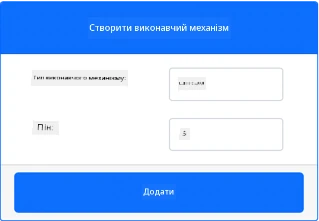
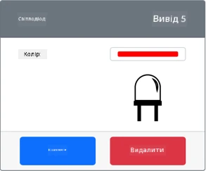
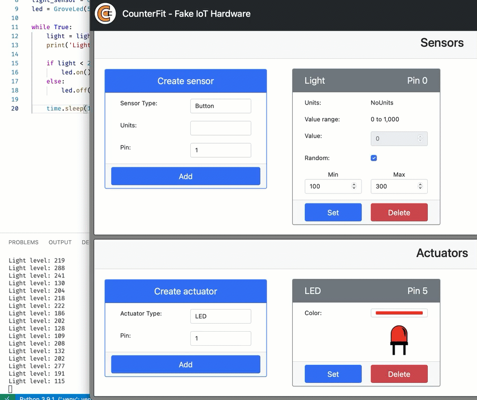

# Створення нічника - Віртуальне IoT обладнання

У цій частині уроку ви додасте світлодіод (LED) до вашого віртуального IoT пристрою та використаєте його для створення нічника.

## Віртуальне обладнання

Для нічника потрібен один виконавчий пристрій, створений у додатку CounterFit.

Цей виконавчий пристрій — це **LED**. У фізичному IoT пристрої це був би [світлодіод](https://wikipedia.org/wiki/Light-emitting_diode), який випромінює світло, коли через нього проходить струм. Це цифровий виконавчий пристрій, який має два стани: увімкнено та вимкнено. Надсилання значення 1 вмикає світлодіод, а 0 — вимикає.

Логіка нічника у псевдокоді виглядає так:

```output
Check the light level.
If the light is less than 300
    Turn the LED on
Otherwise
    Turn the LED off
```

### Додайте виконавчий пристрій до CounterFit

Щоб використовувати віртуальний світлодіод, потрібно додати його до додатку CounterFit.

#### Завдання - додати виконавчий пристрій до CounterFit

Додайте світлодіод до додатку CounterFit.

1. Переконайтеся, що веб-додаток CounterFit працює з попередньої частини завдання. Якщо ні, запустіть його та повторно додайте датчик світла.

1. Створіть світлодіод:

    1. У полі *Create actuator* на панелі *Actuator* розкрийте список *Actuator type* і виберіть *LED*.

    1. Встановіть *Pin* на *5*.

    1. Натисніть кнопку **Add**, щоб створити світлодіод на контакті 5.

    

    Світлодіод буде створено і з’явиться у списку виконавчих пристроїв.

    

    Після створення світлодіода ви можете змінити його колір за допомогою вибору кольору (*Color picker*). Натисніть кнопку **Set**, щоб змінити колір після вибору.

### Програмування нічника

Тепер нічник можна запрограмувати, використовуючи датчик світла та світлодіод у CounterFit.

#### Завдання - запрограмувати нічник

Запрограмуйте нічник.

1. Відкрийте проєкт нічника у VS Code, який ви створили в попередній частині завдання. Якщо потрібно, закрийте та знову створіть термінал, щоб переконатися, що він працює у віртуальному середовищі.

1. Відкрийте файл `app.py`.

1. Додайте наступний код до файлу `app.py`, щоб імпортувати необхідну бібліотеку. Цей код слід додати у верхній частині, під іншими рядками `import`.

    ```python
    from counterfit_shims_grove.grove_led import GroveLed
    ```

    Рядок `from counterfit_shims_grove.grove_led import GroveLed` імпортує `GroveLed` з бібліотек Python CounterFit Grove shim. Ця бібліотека містить код для взаємодії зі світлодіодом, створеним у додатку CounterFit.

1. Додайте наступний код після оголошення `light_sensor`, щоб створити екземпляр класу, який керує світлодіодом:

    ```python
    led = GroveLed(5)
    ```

    Рядок `led = GroveLed(5)` створює екземпляр класу `GroveLed`, підключеного до контакту **5** — контакту CounterFit Grove, до якого підключений світлодіод.

1. Додайте перевірку всередині циклу `while`, перед `time.sleep`, щоб перевірити рівні освітлення та вмикати або вимикати світлодіод:

    ```python
    if light < 300:
        led.on()
    else:
        led.off()
    ```

    Цей код перевіряє значення `light`. Якщо воно менше 300, викликається метод `on` класу `GroveLed`, який надсилає цифрове значення 1 до світлодіода, вмикаючи його. Якщо значення світла більше або дорівнює 300, викликається метод `off`, який надсилає цифрове значення 0 до світлодіода, вимикаючи його.

    > 💁 Цей код має бути відступлений на той самий рівень, що й рядок `print('Рівень освітлення:', light)`, щоб бути всередині циклу `while`!

1. У терміналі VS Code виконайте наступну команду, щоб запустити ваш Python-додаток:

    ```sh
    python app.py
    ```

    Значення освітлення будуть виводитися в консоль.

    ```output
    (.venv) ➜  nightlight python app.py
    Рівень освітлення: 143
    Рівень освітлення: 244
    Рівень освітлення: 246
    Рівень освітлення: 253
    ```

1. Змініть *Value* або налаштування *Random*, щоб варіювати рівень освітлення вище та нижче 300. Світлодіод буде вмикатися та вимикатися.



> 💁 Ви можете знайти цей код у папці [code-actuator/virtual-device](code-actuator/virtual-device).

😀 Ваш нічник успішно працює!

