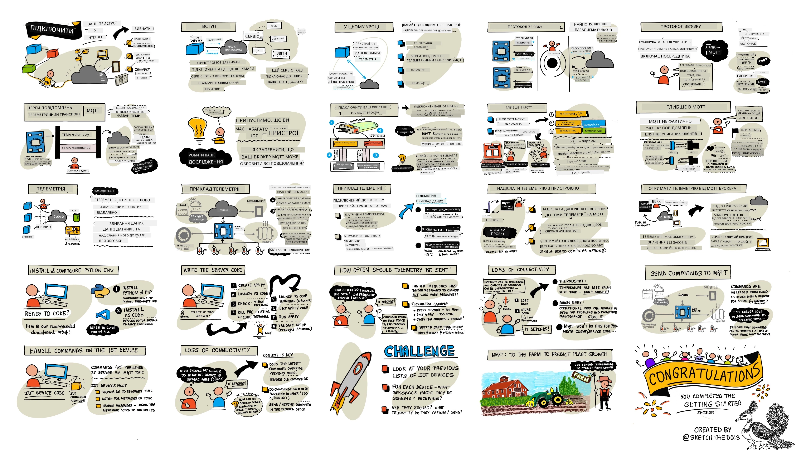
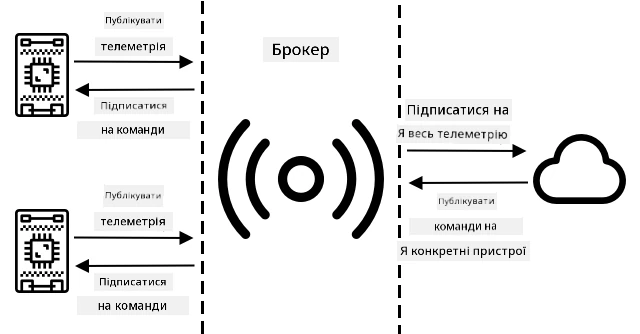
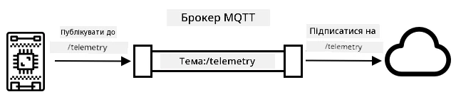
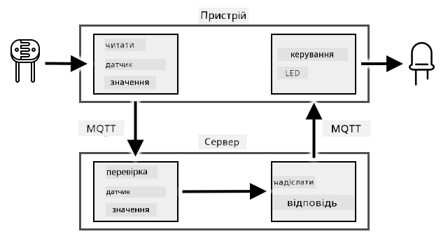
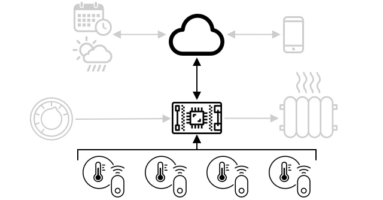
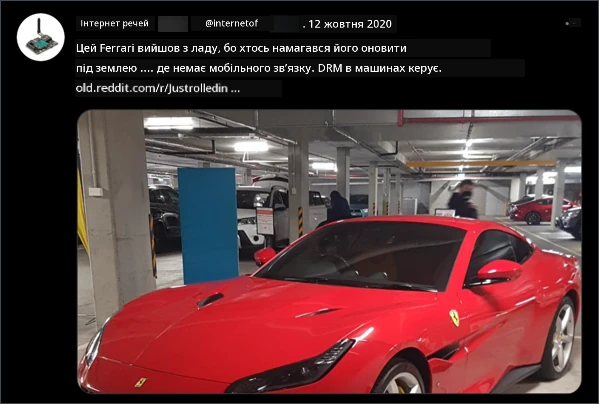
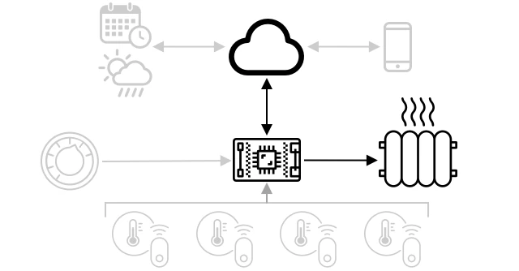

# Підключіть свій пристрій до Інтернету



> Скетчнот від [Nitya Narasimhan](https://github.com/nitya). Натисніть на зображення, щоб побачити його у більшому розмірі.

Цей урок викладався в межах серії [Hello IoT](https://youtube.com/playlist?list=PLmsFUfdnGr3xRts0TIwyaHyQuHaNQcb6-) від [Microsoft Reactor](https://developer.microsoft.com/reactor/). Він складався з двох відео (англійською): годинного заняття та години консультацій, де детальніше розбирали окремі частини уроку й відповідали на запитання.

[](https://youtu.be/O4dd172mZhs)

[](https://youtu.be/j-cVCzRDE2Q)

> 🎥 Натисніть на зображення вище, щоб переглянути відео. У відео використовується стара версія бібліотеки `paho-mqtt`, тому код у ньому трохи відрізняється від коду в цьому уроці. Користуйтеся кодом з уроку.

## Тест перед лекцією

[Тест перед лекцією](https://black-meadow-040d15503.1.azurestaticapps.net/quiz/7)

## Вступ

Літера **I** в IoT означає **Internet**, тобто хмарне підключення та сервіси, на яких тримається більшість можливостей IoT-пристроїв: від збору даних із сенсорів, підключених до пристрою, до надсилання повідомлень, що керують актуаторами. Зазвичай IoT-пристрої підключаються до одного хмарного IoT-сервісу за стандартним протоколом зв'язку, а вже цей сервіс поєднаний з рештою IoT-застосунку: від AI-сервісів, що ухвалюють розумні рішення на основі даних, до вебзастосунків для керування чи звітів.

> 🎓 Дані, які сенсори збирають і надсилають у хмару, називаються телеметрією.

IoT-пристрої також можуть отримувати повідомлення з хмари. Часто це команди: інструкції виконати дію або всередині пристрою (наприклад, перезавантажитися чи оновити прошивку), або за допомогою актуатора (наприклад, увімкнути світло).

У цьому уроці ви познайомитеся з протоколами зв'язку, якими IoT-пристрої підключаються до хмари, і з тим, які дані вони надсилають та отримують. Ви також попрацюєте з ними на практиці: додасте до свого нічника керування через Інтернет і перенесете логіку керування світлодіодом у «серверний» код, що працюватиме на вашому комп'ютері.

У цьому уроці ми розглянемо:

* [Протоколи зв'язку](#протоколи-звязку)
* [Протокол MQTT](#протокол-mqtt)
* [Телеметрію](#телеметрія)
* [Команди](#команди)

## Протоколи зв'язку

Існує кілька популярних протоколів, якими IoT-пристрої обмінюються даними з Інтернетом. Найпоширеніші з них побудовані на принципі «публікація/підписка» (publish/subscribe) через брокера. IoT-пристрої підключаються до брокера, публікують телеметрію та підписуються на команди. Хмарні сервіси також підключаються до брокера, підписуються на всю телеметрію та публікують команди для окремих пристроїв або груп пристроїв.



MQTT є найпопулярнішим протоколом зв'язку для IoT-пристроїв, і саме його ми розглянемо в цьому уроці. Серед інших протоколів: AMQP та HTTP/HTTPS.

## Протокол MQTT

[MQTT](https://mqtt.org) — легкий відкритий стандартний протокол обміну повідомленнями між пристроями. Його розробили 1999 року для моніторингу нафтопроводів, а через 15 років IBM випустила його як відкритий стандарт. Сьогодні актуальні дві версії: MQTT 3.1.1 і MQTT 5.

У MQTT є один брокер і багато клієнтів. Усі клієнти підключаються до брокера, а брокер доставляє повідомлення потрібним клієнтам. Повідомлення адресуються не конкретному клієнту, а іменованим **темам** (topics). Клієнт публікує повідомлення в тему, і його отримують усі клієнти, підписані на цю тему.



✅ Дослідіть самостійно. Якщо у вас дуже багато IoT-пристроїв, як переконатися, що ваш MQTT-брокер упорається з усіма повідомленнями?

### Підключіть IoT-пристрій до MQTT

Перший крок до керування нічником через Інтернет — підключити його до MQTT-брокера.

#### Завдання

Підключіть пристрій до MQTT-брокера.

У цій частині уроку ви підключите свій IoT-нічник до Інтернету, щоб ним можна було керувати віддалено. Далі в уроці пристрій надсилатиме через MQTT на публічний брокер телеметрію з рівнем освітлення, її отримуватиме серверний код, який ви напишете. Цей код перевірятиме рівень освітлення й надсилатиме пристрою команду ввімкнути чи вимкнути світлодіод.

У реальному житті таку схему можна застосувати, щоб збирати дані з кількох сенсорів освітлення, перш ніж вмикати світло там, де ламп багато, наприклад на стадіоні. Так світло не ввімкнеться лише тому, що один сенсор затулила хмара чи птах, якщо інші сенсори бачать достатньо світла.

✅ У яких ще ситуаціях варто оцінити дані з кількох сенсорів, перш ніж надсилати команди?

Щоб не налаштовувати власний MQTT-брокер у межах цього завдання, можна скористатися публічним тестовим сервером на базі [Eclipse Mosquitto](https://www.mosquitto.org), відкритого MQTT-брокера. Він доступний за адресою [test.mosquitto.org](https://test.mosquitto.org) і не потребує облікового запису, тож чудово підходить для перевірки MQTT-клієнтів і серверів.

> 💁 Цей тестовий брокер публічний і незахищений. Будь-хто може прочитати те, що ви публікуєте, тому не використовуйте його для даних, які мають залишатися приватними.

> 👩‍🏫 **Порада для викладача.** У шкільних і корпоративних мережах порт 1883, який використовує MQTT, часто заблоковано. Якщо пристрої не можуть підключитися до `test.mosquitto.org`, запустіть власний брокер Mosquitto на комп'ютері в аудиторії (див. розділ [Огляд і самостійне навчання](#огляд-і-самостійне-навчання)) і замініть адресу брокера в коді на IP-адресу цього комп'ютера.



Виконайте відповідний крок нижче, щоб підключити пристрій до MQTT-брокера:

* [Arduino: Wio Terminal](https://github.com/microsoft/IoT-For-Beginners/blob/main/1-getting-started/lessons/4-connect-internet/wio-terminal-mqtt.md) (ще не адаптовано, оригінал англійською)
* [Одноплатний комп'ютер: Raspberry Pi або віртуальний IoT-пристрій](single-board-computer-mqtt.md)

### Глибше про MQTT

Теми можуть утворювати ієрархію, а клієнти можуть підписуватися на різні її рівні за допомогою символів підстановки. Наприклад, повідомлення про температуру можна надсилати в тему `telemetry/temperature`, а про вологість — у тему `telemetry/humidity`. Тоді хмарний застосунок, підписавшись на тему `telemetry/+`, отримуватиме обидва види повідомлень.

> 💁 У MQTT є два символи підстановки. `+` замінює рівно один рівень теми: `telemetry/+` збігається з `telemetry/temperature`, але не з `telemetry/room1/temperature`. `#` замінює будь-яку кількість рівнів і ставиться лише в кінці: `telemetry/#` збігається з обома темами. Символ `*`, як у шляхах до файлів, у MQTT не працює.

Повідомлення можна надсилати з різною якістю обслуговування (Quality of Service, QoS), яка визначає гарантії доставки:

* **Не більше одного разу (QoS 0)**: повідомлення надсилається один раз, і ні клієнт, ні брокер нічого не роблять, щоб підтвердити доставку («надіслав і забув»).
* **Щонайменше один раз (QoS 1)**: відправник повторює надсилання, доки не отримає підтвердження (підтверджена доставка). Отримувач може отримати дублікати.
* **Рівно один раз (QoS 2)**: відправник і отримувач виконують двоетапне рукостискання, яке гарантує, що буде отримано лише одну копію повідомлення (гарантована доставка).

✅ У яких ситуаціях потрібна гарантована доставка, а не «надіслав і забув»?

Хоча в назві MQTT колись розшифровували як Message Queuing Telemetry Transport, черг повідомлень у звичному розумінні він не має. Якщо клієнт від'єднався, а потім підключився знову, він не отримає повідомлень, надісланих за час його відсутності (крім тих, що вже були в процесі доставки за QoS, або якщо клієнт використовує постійну сесію). Повідомлення можна позначати прапорцем **retained** («збережене»). Тоді брокер зберігає останнє таке повідомлення в темі й надсилає його кожному клієнту, який підпишеться на цю тему пізніше. Так нові клієнти одразу отримують останнє значення.

MQTT також має механізм **keep alive**, який перевіряє, чи з'єднання ще живе під час довгих пауз між повідомленнями.

> 🦟 [Mosquitto від Eclipse Foundation](https://mosquitto.org) — це безкоштовний MQTT-брокер, який можна запустити самостійно для експериментів, а також публічний тестовий брокер [test.mosquitto.org](https://test.mosquitto.org) для перевірки вашого коду.

З'єднання MQTT можуть бути відкритими або зашифрованими (TLS) і захищеними іменем користувача та паролем чи сертифікатами.

> 💁 MQTT працює поверх TCP/IP, того самого мережевого протоколу, що й HTTP, але на іншому порту (1883, або 8883 для TLS). MQTT також можна передавати через вебсокети, щоб працювати з вебзастосунками в браузері або обійти брандмауери, які блокують звичайні MQTT-з'єднання.

## Телеметрія

Слово «телеметрія» походить від грецьких коренів і означає «вимірювання на відстані». Телеметрія — це збір даних із сенсорів і надсилання їх у хмару.

> 💁 Один із перших пристроїв телеметрії створили у Франції 1874 року. Він у реальному часі передавав дані про погоду й товщину снігового покриву з Монблану до Парижа. Бездротових технологій тоді ще не було, тож використовували дроти.

Повернімося до прикладу розумного термостата з уроку 1.



Термостат має сенсори температури, які збирають телеметрію. Найімовірніше, в нього є один вбудований сенсор, і він може під'єднуватися до кількох зовнішніх сенсорів через бездротовий протокол, наприклад [Bluetooth Low Energy](https://wikipedia.org/wiki/Bluetooth_Low_Energy) (BLE).

Приклад телеметрії, яку він може надсилати:

| Назва | Значення | Опис |
| ---- | ----- | ----------- |
| `thermostat_temperature` | 18°C | Температура, виміряна вбудованим сенсором термостата |
| `livingroom_temperature` | 19°C | Температура з віддаленого сенсора з назвою `livingroom`, що вказує на кімнату |
| `bedroom_temperature` | 21°C | Температура з віддаленого сенсора з назвою `bedroom`, що вказує на кімнату |

На основі цієї телеметрії хмарний сервіс вирішує, які команди надіслати, щоб керувати опаленням.

### Надсилання телеметрії з IoT-пристрою

Наступний крок — надсилати телеметрію з рівнем освітлення в тему телеметрії на MQTT-брокері.

#### Завдання: надішліть телеметрію з IoT-пристрою

Надсилайте рівень освітлення на MQTT-брокер.

Дані надсилаються у форматі JSON (JavaScript Object Notation), стандартному текстовому форматі для запису пар «ключ/значення».

✅ Якщо ви раніше не працювали з JSON, прочитайте про нього на [JSON.org](https://www.json.org/json-uk.html).

Виконайте відповідний крок нижче, щоб надсилати телеметрію з пристрою на MQTT-брокер:

* [Arduino: Wio Terminal](https://github.com/microsoft/IoT-For-Beginners/blob/main/1-getting-started/lessons/4-connect-internet/wio-terminal-telemetry.md) (ще не адаптовано, оригінал англійською)
* [Одноплатний комп'ютер: Raspberry Pi або віртуальний IoT-пристрій](single-board-computer-telemetry.md)

### Отримання телеметрії з MQTT-брокера

Немає сенсу надсилати телеметрію, якщо на іншому боці її ніхто не слухає. Телеметрію з рівнем освітлення має хтось обробляти. Такий «серверний» код у більшому IoT-застосунку зазвичай розгортають у хмарному сервісі, але тут ви запустите його локально на своєму комп'ютері (або на Raspberry Pi, якщо пишете код прямо на ньому). Серверний код — це Python-застосунок, який слухає MQTT-повідомлення з рівнем освітлення. Пізніше в цьому уроці він відповідатиме командами ввімкнути чи вимкнути світлодіод.

✅ Дослідіть самостійно: що відбувається з MQTT-повідомленнями, якщо їх ніхто не слухає?

#### Встановіть Python і VS Code

Якщо на вашому комп'ютері ще немає Python і VS Code, встановіть їх, щоб написати серверний код. Якщо ви використовуєте віртуальний IoT-пристрій або працюєте на Raspberry Pi, цей крок можна пропустити: усе вже має бути встановлено.

##### Завдання: встановіть Python і VS Code

1. Встановіть Python 3.14 (підійде й 3.10 або новіший). Інструкції є на [сторінці завантажень Python](https://www.python.org/downloads/).

    > 💁 Код цього уроку перевірено на Python 3.11, 3.12, 3.13 і 3.14.

1. Встановіть Visual Studio Code (VS Code), редактор, у якому ви писатимете код. Інструкції є в [документації VS Code](https://code.visualstudio.com/docs/setup/setup-overview).

    > 💁 Ви можете використовувати будь-яке інше середовище розробки чи редактор для Python, але інструкції в уроках написано для VS Code.

1. Встановіть розширення [Python для VS Code](https://marketplace.visualstudio.com/items?itemName=ms-python.python). Разом із ним автоматично встановиться Pylance, який забезпечує підказки та перевірку коду.

#### Налаштуйте віртуальне середовище Python

Одна з сильних сторін Python — можливість встановлювати [pip-пакети](https://pypi.org), тобто бібліотеки, які написали й опублікували інші люди. Пакет встановлюється однією командою, після чого його можна використовувати у своєму коді. Ви встановите через pip пакет для роботи з MQTT.

Якщо встановлювати пакети глобально, вони доступні всюди на комп'ютері, і це може спричинити конфлікти версій: один застосунок залежить від однієї версії пакета, а інший потребує нової, яка ламає перший. Щоб уникнути цього, використовують [віртуальне середовище Python](https://docs.python.org/uk/3/library/venv.html) — по суті, окрему копію Python у спеціальній папці. Пакети, встановлені у віртуальне середовище, потрапляють лише в цю папку.

> 💁 У нових версіях Linux (зокрема в Raspberry Pi OS Bookworm і Ubuntu 23.04+) глобальна команда `pip install` взагалі заборонена й видає помилку `externally-managed-environment`. Тому віртуальне середовище — не просто зручність, а обов'язковий крок.

##### Завдання: налаштуйте віртуальне середовище Python

Створіть віртуальне середовище й встановіть у нього MQTT-пакет.

1. У терміналі або командному рядку перейдіть у зручне місце й виконайте такі команди, щоб створити нову папку та перейти в неї:

    ```sh
    mkdir nightlight-server
    cd nightlight-server
    ```

1. Створіть віртуальне середовище в папці `.venv`:

    * У Windows:

        ```cmd
        py -m venv .venv
        ```

    * У macOS або Linux:

        ```sh
        python3 -m venv .venv
        ```

1. Активуйте віртуальне середовище:

    * У Windows:
        * якщо ви використовуєте командний рядок (Command Prompt), зокрема через Windows Terminal, виконайте:

            ```cmd
            .venv\Scripts\activate.bat
            ```

        * якщо ви використовуєте PowerShell, виконайте:

            ```powershell
            .\.venv\Scripts\Activate.ps1
            ```

            > 💁 Якщо PowerShell повідомляє, що виконання сценаріїв вимкнено, виконайте один раз `Set-ExecutionPolicy -Scope CurrentUser RemoteSigned` і спробуйте ще раз.

    * У macOS або Linux виконайте:

        ```sh
        source ./.venv/bin/activate
        ```

    > 💁 Ці команди треба виконувати з тієї самої папки, де ви створювали віртуальне середовище. Заходити в папку `.venv` ніколи не потрібно: активуйте середовище, встановлюйте пакети й запускайте код з папки, у якій ви були під час його створення.

1. Після активації команда `python` запускатиме ту версію Python, з якої створено віртуальне середовище. Перевірте версію:

    ```sh
    python --version
    ```

    Результат буде приблизно таким:

    ```output
    (.venv) ➜  nightlight-server python --version
    Python 3.14.8
    ```

    > 💁 Ваша версія може відрізнятися. Якщо це 3.10 або новіша, усе гаразд. Якщо старіша, видаліть цю папку, встановіть новішу версію Python і повторіть кроки.

1. Встановіть pip-пакет [Paho-MQTT](https://pypi.org/project/paho-mqtt/), популярну бібліотеку для MQTT:

    ```sh
    pip install "paho-mqtt>=2.1"
    ```

    Пакет буде встановлено лише у віртуальне середовище, і поза ним він недоступний.

    > ⚠️ Код у цьому уроці написано для `paho-mqtt` версії 2. Якщо ви бачите приклади в Інтернеті, де клієнт створюється як `mqtt.Client("назва")`, це код для старої версії 1.x. У версії 2 він видає помилку `ValueError: Unsupported callback API version`.

#### Напишіть серверний код

Тепер можна написати серверний код на Python.

##### Завдання: напишіть серверний код

1. У терміналі (з активованим віртуальним середовищем) створіть файл `app.py`:

    * У Windows виконайте:

        ```cmd
        type nul > app.py
        ```

    * У macOS або Linux виконайте:

        ```sh
        touch app.py
        ```

1. Відкрийте поточну папку у VS Code:

    ```sh
    code .
    ```

1. Під час запуску VS Code знайде віртуальне середовище Python і покаже його в рядку стану внизу вікна:

    

    > 💁 Якщо VS Code не вибрав середовище сам, натисніть `Ctrl+Shift+P` (`Cmd+Shift+P` на macOS), виберіть **Python: Select Interpreter** і вкажіть інтерпретатор із папки `.venv`.

1. Якщо термінал VS Code уже був відкритий до запуску, віртуальне середовище в ньому не активоване. Найпростіше закрити такий термінал кнопкою **Kill the active terminal instance**:

    

1. Відкрийте новий термінал через меню *Terminal -> New Terminal* або комбінацією `` CTRL+` ``. Новий термінал сам активує віртуальне середовище, і назва `.venv` з'явиться в запрошенні командного рядка:

    ```output
    ➜  nightlight-server source .venv/bin/activate
    (.venv) ➜  nightlight-server
    ```

1. Відкрийте файл `app.py` у провіднику VS Code і додайте такий код:

    ```python
    import json
    import time

    import paho.mqtt.client as mqtt

    id = '<ID>'

    client_name = id + 'nightlight_server'
    client_telemetry_topic = id + '/telemetry'


    def handle_connect(client, userdata, flags, reason_code, properties):
        if reason_code.is_failure:
            print('Не вдалося підключитися до MQTT:', reason_code)
            return

        print('Підключено до MQTT!')
        client.subscribe(client_telemetry_topic)


    def handle_telemetry(client, userdata, message):
        payload = json.loads(message.payload.decode())
        print('Отримано повідомлення:', payload)


    mqtt_client = mqtt.Client(mqtt.CallbackAPIVersion.VERSION2, client_id=client_name)
    mqtt_client.on_connect = handle_connect
    mqtt_client.on_message = handle_telemetry
    mqtt_client.connect('test.mosquitto.org')
    mqtt_client.loop_start()

    while True:
        time.sleep(2)
    ```

    Замініть `<ID>` у рядку 6 на той самий унікальний ID, який ви використали в коді пристрою.

    ⚠️ ID **обов'язково** має збігатися з тим, що на пристрої, інакше серверний код підпишеться не на ту тему й нічого не отримає.

    Що робить цей код:

    * `mqtt.Client(mqtt.CallbackAPIVersion.VERSION2, client_id=client_name)` створює MQTT-клієнта з унікальною назвою. Перший аргумент повідомляє бібліотеці, що ми використовуємо функції зворотного виклику (callbacks) у форматі версії 2.
    * `handle_connect` викликається щоразу, коли клієнт підключився до брокера. Саме тут клієнт підписується на тему телеметрії. Якщо з'єднання обірветься, а потім відновиться, бібліотека знову викличе `handle_connect`, і підписка відновиться автоматично.
    * `handle_telemetry` викликається, коли надходить повідомлення. Вона розбирає JSON і виводить його в консоль.
    * `connect` підключається до брокера *test.mosquitto.org*, а `loop_start` запускає цикл обробки у фоновому потоці, який слухає повідомлення в усіх темах, на які підписано клієнта.
    * Нескінченний цикл наприкінці не дає програмі завершитися: MQTT-клієнт працює у фоновому потоці, доки працює основна програма.

1. У терміналі VS Code запустіть застосунок:

    ```sh
    python app.py
    ```

    Застосунок почне слухати повідомлення від IoT-пристрою.

1. Переконайтеся, що пристрій працює й надсилає телеметрію. Змінюйте рівень освітлення для фізичного чи віртуального пристрою. Отримані повідомлення з'являтимуться в терміналі:

    ```output
    (.venv) ➜  nightlight-server python app.py
    Підключено до MQTT!
    Отримано повідомлення: {'light': 0}
    Отримано повідомлення: {'light': 400}
    ```

    Щоб серверний `app.py` з папки `nightlight-server` отримував повідомлення, `app.py` з папки `nightlight` (код пристрою) має бути запущений.

> 💁 Цей код є в папці [code-server/server](code-server/server).

### Як часто надсилати телеметрію?

Важливе питання для телеметрії: як часто вимірювати й надсилати дані? Відповідь: залежить від завдання. Якщо вимірювати часто, можна швидше реагувати на зміни, але це більше енергії, більше трафіку, більше даних і більше хмарних ресурсів для їх обробки. Вимірювати треба достатньо часто, але не надто.

Для термостата, імовірно, вистачить вимірювань раз на кілька хвилин, бо температура змінюється не так швидко. Якщо вимірювати раз на добу, можна опинитися в ситуації, коли посеред сонячного дня будинок опалюється за нічною температурою. А якщо вимірювати щосекунди, ви отримаєте тисячі зайвих однакових значень, які забиратимуть інтернет-трафік (проблема для людей з обмеженим тарифом), витрачатимуть енергію (проблема для пристроїв на батарейках, як-от віддалених сенсорів) і збільшать витрати постачальника на хмарну обробку та зберігання.

Якщо ж ви стежите за верстатом на заводі, поломка якого може спричинити катастрофічні збитки й мільйонні втрати, вимірювати кілька разів на секунду може бути необхідно. Краще витратити трафік, ніж пропустити телеметрію, яка вказує, що верстат треба зупинити й полагодити, доки він не зламався.

> 💁 У такій ситуації варто подумати про edge-пристрій, який спершу обробляє телеметрію на місці, щоб менше залежати від Інтернету.

### Втрата з'єднання

Інтернет-з'єднання ненадійні, і збої трапляються часто. Що має робити IoT-пристрій у такому разі: втратити дані чи зберегти їх, доки зв'язок не відновиться? Знову ж таки, залежить від завдання.

Для термостата дані, ймовірно, можна відкинути, щойно з'явилося нове вимірювання. Системі опалення байдуже, що 20 хвилин тому було 20,5°C, якщо зараз 19°C: вмикати чи вимикати опалення, вирішує поточна температура.

Для обладнання дані може бути варто зберігати, особливо якщо за ними аналізують тенденції. Існують моделі машинного навчання, які виявляють аномалії в потоці даних за певний період (наприклад, за останню годину). Їх часто використовують для прогнозованого обслуговування: шукають ознаки того, що щось скоро зламається, щоб полагодити чи замінити деталь заздалегідь. У такому разі потрібна кожна одиниця телеметрії, тож після відновлення з'єднання пристрій має надіслати всі дані, накопичені за час збою.

Розробникам IoT-пристроїв також слід подумати, чи працюватиме пристрій без Інтернету або там, де немає сигналу. Розумний термостат має вміти ухвалювати хоча б прості рішення щодо опалення, якщо не може надіслати телеметрію в хмару.

[](https://twitter.com/internetofshit/status/1315736960082808832)

Щоб MQTT впорався з утратою з'єднання, код пристрою й сервера мають самі подбати про доставку, якщо вона важлива. Наприклад, можна вимагати, щоб на кожне надіслане повідомлення приходила відповідь в окрему тему, а повідомлення без відповіді вручну ставити в чергу й надсилати повторно пізніше.

## Команди

Команди — це повідомлення, які хмара надсилає пристрою, щоб той щось зробив. Найчастіше це певна дія через актуатор, але це може бути й інструкція для самого пристрою: перезавантажитися або зібрати додаткову телеметрію та повернути її у відповідь на команду.



Термостат може отримати з хмари команду ввімкнути опалення. Хмарний сервіс на основі телеметрії з усіх сенсорів вирішив, що опалення треба ввімкнути, і надіслав відповідну команду.

### Надсилання команд через MQTT-брокер

Наступний крок для нашого нічника: серверний код надсилатиме пристрою команду, щоб керувати світлом залежно від виміряного рівня освітлення.

1. Відкрийте серверний код у VS Code.

1. Після оголошення `client_telemetry_topic` додайте рядок, який задає тему для команд:

    ```python
    server_command_topic = id + '/commands'
    ```

1. Додайте такий код у кінець функції `handle_telemetry`:

    ```python
        command = {'led_on': payload['light'] < 300}
        print('Надсилаю команду:', command)

        client.publish(server_command_topic, json.dumps(command))
    ```

    Цей код надсилає в тему команд JSON-повідомлення, де `led_on` дорівнює `True` або `False` залежно від того, чи рівень освітлення менший за 300. Якщо менший, надсилається `True`, і пристрій має ввімкнути світлодіод.

1. Запустіть код так само, як раніше.

1. Змінюйте рівень освітлення для фізичного чи віртуального пристрою. Отримані повідомлення й надіслані команди виводитимуться в терміналі:

    ```output
    (.venv) ➜  nightlight-server python app.py
    Підключено до MQTT!
    Отримано повідомлення: {'light': 0}
    Надсилаю команду: {'led_on': True}
    Отримано повідомлення: {'light': 400}
    Надсилаю команду: {'led_on': False}
    ```

> 💁 Телеметрія й команди передаються кожна у своїй єдиній темі. Отже, телеметрія від кількох пристроїв потраплятиме в одну тему, а команди для кількох пристроїв — в іншу спільну тему. Щоб надіслати команду конкретному пристрою, можна використовувати окремі теми з унікальним ID пристрою, наприклад `commands/device1`, `commands/device2`. Тоді кожен пристрій слухатиме лише свої повідомлення.

> 💁 Цей код є в папці [code-commands/server](code-commands/server).

### Обробка команд на IoT-пристрої

Тепер, коли сервер надсилає команди, додайте на IoT-пристрій код, який їх обробляє й керує світлодіодом.

Виконайте відповідний крок нижче, щоб отримувати команди з MQTT-брокера:

* [Arduino: Wio Terminal](https://github.com/microsoft/IoT-For-Beginners/blob/main/1-getting-started/lessons/4-connect-internet/wio-terminal-commands.md) (ще не адаптовано, оригінал англійською)
* [Одноплатний комп'ютер: Raspberry Pi або віртуальний IoT-пристрій](single-board-computer-commands.md)

Коли код написано й запущено, поекспериментуйте зі зміною рівня освітлення. Стежте за виводом сервера й пристрою та за світлодіодом.

### Втрата з'єднання

Що робити хмарному сервісу, якщо треба надіслати команду пристрою, який зараз не в мережі? І знову: залежить від завдання.

Якщо остання команда скасовує попередні, попередні можна ігнорувати. Якщо сервіс надіслав команду ввімкнути опалення, а потім вимкнути, команду ввімкнення можна не надсилати повторно.

Якщо команди треба виконати в певній послідовності, наприклад підняти маніпулятор робота, а потім стиснути захоплювач, їх слід надіслати по черзі після відновлення зв'язку.

✅ Як код пристрою чи сервера може гарантувати, що команди через MQTT завжди надсилатимуться й оброблятимуться в правильному порядку?

---

## 🚀 Виклик

Виклик у попередніх трьох уроках полягав у тому, щоб скласти список якомога більшої кількості IoT-пристроїв удома, у школі чи на роботі, визначити, чи побудовані вони на мікроконтролерах, одноплатних комп'ютерах або їх поєднанні, і подумати, які сенсори й актуатори вони використовують.

Тепер подумайте, якими повідомленнями ці пристрої можуть обмінюватися. Яку телеметрію вони надсилають? Які повідомлення чи команди можуть отримувати? Як ви вважаєте, чи захищені вони?

## Тест після лекції

[Тест після лекції](https://black-meadow-040d15503.1.azurestaticapps.net/quiz/8)

## Огляд і самостійне навчання

Прочитайте більше про MQTT на [сторінці Вікіпедії](https://uk.wikipedia.org/wiki/MQTT).

Спробуйте запустити власний MQTT-брокер [Mosquitto](https://www.mosquitto.org) і підключити до нього пристрій і серверний код.

> 💁 Порада: за замовчуванням Mosquitto 2.x не дозволяє анонімних підключень (без імені користувача й пароля) і приймає підключення лише з того самого комп'ютера, на якому працює.
> Це можна змінити [конфігураційним файлом `mosquitto.conf`](https://www.mosquitto.org/man/mosquitto-conf-5.html) з таким вмістом:
>
> ```sh
> listener 1883 0.0.0.0
> allow_anonymous true
> ```
>
> Запустіть брокер з цим файлом командою `mosquitto -c mosquitto.conf`. Так налаштовують лише навчальний брокер у локальній мережі, а не брокер, доступний з Інтернету.

## Завдання

[Порівняйте MQTT з іншими протоколами зв'язку](assignment.md)

---

> **Про цю версію.** Урок адаптовано українською на основі курсу [IoT for Beginners](https://github.com/microsoft/IoT-For-Beginners) від Microsoft (ліцензія MIT). Порівняно з оригіналом код переписано під `paho-mqtt` 2.x, віртуальний пристрій CounterFit налаштовано для Python 3.12+, виправлено опис символів підстановки MQTT і додано поради для занять в аудиторії.
