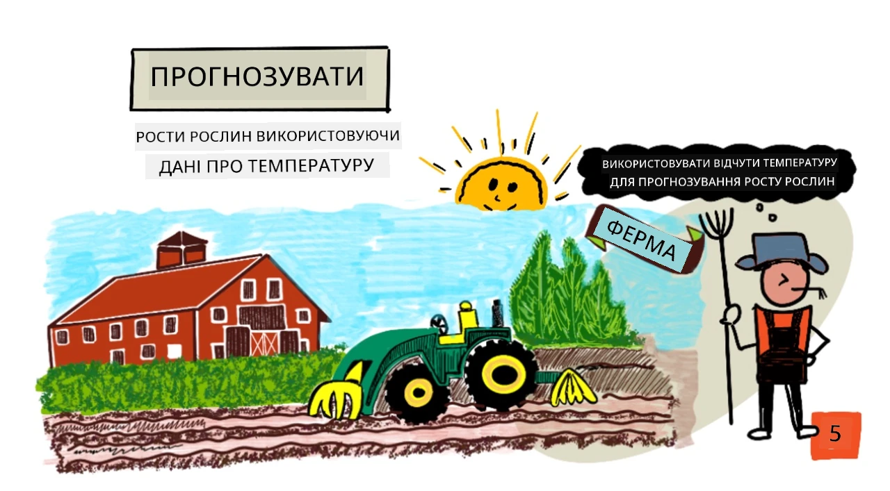
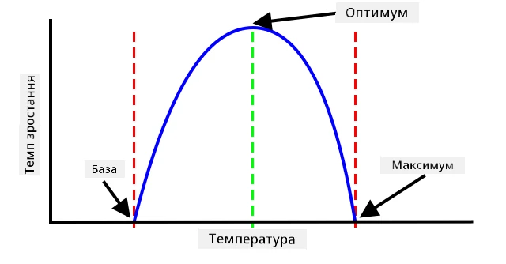
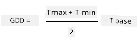
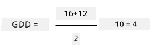
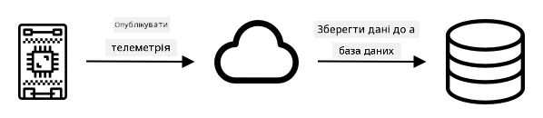
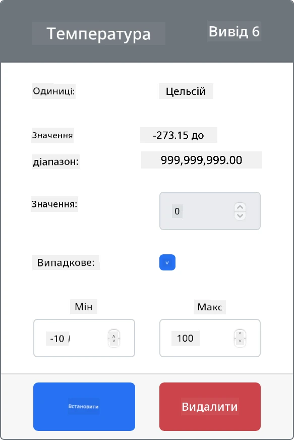
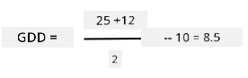

# Прогнозування росту рослин за допомогою IoT



> Скетчнот від [Nitya Narasimhan](https://github.com/nitya). Натисніть на зображення, щоб побачити його у більшому розмірі.

## Тест перед лекцією

[Тест перед лекцією](https://black-meadow-040d15503.1.azurestaticapps.net/quiz/9)

## Вступ

Для росту рослинам потрібні певні речі: вода, вуглекислий газ, поживні речовини, світло й тепло. У цьому уроці ви дізнаєтеся, як за температурою повітря обчислити швидкість росту й дозрівання рослин.

У цьому уроці ми розглянемо:

* [Цифрове сільське господарство](#цифрове-сільське-господарство)
* [Чому температура важлива у фермерстві?](#чому-температура-важлива-у-фермерстві)
* [Вимірювання температури навколишнього середовища](#вимірювання-температури-навколишнього-середовища)
* [Градусо-дні росту (GDD)](#градусо-дні-росту)
* [Обчислення GDD за даними сенсора температури](#обчислення-gdd-за-даними-сенсора-температури)

## Цифрове сільське господарство

Цифрове сільське господарство змінює те, як ми ведемо фермерство: воно використовує інструменти для збору, зберігання й аналізу сільськогосподарських даних. Зараз ми живемо в період, який Всесвітній економічний форум назвав «Четвертою промисловою революцією», а розвиток цифрового сільського господарства називають «Четвертою аграрною революцією», або «Сільським господарством 4.0» (Agriculture 4.0).

> 🎓 Термін «цифрове сільське господарство» охоплює також увесь «ланцюжок створення вартості в сільському господарстві», тобто весь шлях від поля до столу. Сюди входять відстеження якості продукції під час перевезення й переробки, складські системи та електронна комерція, і навіть застосунки для оренди тракторів!

Ці зміни дають фермерам змогу збирати більший урожай, використовувати менше добрив і пестицидів та ефективніше поливати. Хоча такі технології поширені переважно в багатших країнах, сенсори та інші пристрої поступово дешевшають і стають доступнішими й у країнах, що розвиваються.

Ось кілька методів, які стали можливими завдяки цифровому сільському господарству:

* Вимірювання температури: знаючи температуру, фермери можуть прогнозувати ріст і дозрівання рослин.
* Автоматичний полив: вологість ґрунту вимірюють і вмикають зрошення, коли ґрунт надто сухий, а не за розкладом. Полив за розкладом може призвести до того, що в спекотну суху погоду рослини отримають замало води, а під час дощу забагато. Поливаючи лише тоді, коли це потрібно ґрунту, фермери оптимізують витрату води.
* Боротьба зі шкідниками: фермери можуть шукати шкідників за допомогою камер на автоматизованих роботах чи дронах, а потім обробляти пестицидами лише ті ділянки, де це потрібно. Так зменшується кількість пестицидів і їх потрапляння в місцеві водойми.

✅ Проведіть дослідження. Які ще методи використовують для підвищення врожайності?

> 🎓 Термін «точне землеробство» (Precision Agriculture) означає спостереження, вимірювання й реагування на стан посівів у межах окремого поля або навіть окремих його ділянок. Сюди належать вимірювання рівня води, поживних речовин і шкідників та точне реагування на них, наприклад полив лише невеликої частини поля.

## Чому температура важлива у фермерстві?

Вивчаючи рослини, більшість учнів дізнається, що їм потрібні вода, світло, вуглекислий газ (CO<sub>2</sub>) і поживні речовини. Але для росту рослинам потрібне ще й тепло. Саме тому рослини розквітають навесні, коли теплішає, підсніжники чи нарциси можуть прорости раніше після короткого потепління, а теплиці й оранжереї так добре допомагають рослинам рости.

> 🎓 Оранжереї (hothouses) і теплиці (greenhouses) виконують схожу роботу, але з важливою відмінністю. Оранжереї опалюються штучно, тож фермери можуть точніше керувати температурою. Теплиці ж нагріваються сонцем, і зазвичай температуру в них регулюють лише вікнами чи іншими отворами, через які випускають тепло.

Кожна рослина має базову (мінімальну), оптимальну й максимальну температуру. Усі вони визначаються за середньодобовою температурою.

* Базова температура — мінімальна середньодобова температура, потрібна рослині для росту.
* Оптимальна температура — найкраща середньодобова температура, за якої рослина росте найшвидше.
* Максимальна температура — найвища температура, яку рослина може витримати. Вище за неї рослина припиняє ріст, щоб зберегти воду й вижити.

> 💁 Це середні температури, усереднені за денними й нічними температурами. Рослинам також потрібні різні температури вдень і вночі: це допомагає їм ефективніше фотосинтезувати й економити енергію вночі.

Кожен вид рослин має свої значення базової, оптимальної та максимальної температури. Ось чому одні рослини процвітають у жарких країнах, а інші — у холодніших.

✅ Проведіть дослідження. Спробуйте знайти базову температуру для будь-яких рослин, що ростуть у вашому саду, школі чи місцевому парку.



На графіку вище наведено приклад залежності швидкості росту від температури. До базової температури рослина не росте. Далі швидкість росту збільшується аж до оптимальної температури, а після цього піку знижується. За максимальної температури ріст припиняється.

Форма цього графіка відрізняється для різних видів рослин. В одних після оптимуму ріст падає різкіше, в інших він повільніше зростає від базової температури до оптимальної.

> 💁 Щоб отримати найкращий ріст, фермер має знати ці три значення температури й розуміти форму графіків для рослин, які він вирощує.

Якщо фермер може керувати температурою, наприклад у комерційній оранжереї, він може підлаштувати її під свої рослини. Так, у комерційній оранжереї, де вирощують помідори, вдень підтримують близько 25°C, а вночі 20°C, щоб рослини росли якнайшвидше.

> 🍅 Поєднуючи такі температури зі штучним освітленням, добривами й контрольованим рівнем CO<sub>2</sub>, комерційні виробники можуть вирощувати й збирати врожай цілий рік.

## Вимірювання температури навколишнього середовища

Щоб виміряти температуру навколишнього середовища, до IoT-пристроїв можна підключити сенсори температури.

### Завдання: виміряйте температуру

Пройдіть відповідний посібник, щоб вимірювати температуру за допомогою свого IoT-пристрою:

* [Arduino: Wio Terminal](https://github.com/microsoft/IoT-For-Beginners/blob/main/2-farm/lessons/1-predict-plant-growth/wio-terminal-temp.md) (ще не адаптовано, оригінал англійською)
* [Одноплатний комп'ютер: Raspberry Pi](https://github.com/microsoft/IoT-For-Beginners/blob/main/2-farm/lessons/1-predict-plant-growth/pi-temp.md) (ще не адаптовано, оригінал англійською)
* [Одноплатний комп'ютер: віртуальний пристрій](virtual-device-temp.md)

## Градусо-дні росту

Градусо-дні росту (growing degree days, також growing degree units) — це спосіб вимірювати ріст рослин за температурою. Якщо рослина має достатньо води, поживних речовин і CO<sub>2</sub>, швидкість її росту визначає температура.

Градусо-дні росту, або GDD, обчислюють для кожного дня як різницю між середньою температурою дня в градусах Цельсія та базовою температурою рослини. Кожній рослині потрібна певна кількість GDD, щоб вирости, зацвісти або дати й виростити врожай. Що більше GDD щодня, то швидше росте рослина.

> 💁 В українській агрономії схожий показник називають *сумою ефективних температур*: це сума за багато днів тієї частини середньодобової температури, що перевищує базову (біологічний мінімум) для рослини.

> 🇺🇸 В США градусо-дні росту можна обчислювати й у градусах Фаренгейта. 5 GDD<sup>C</sup> (градусо-днів росту за Цельсієм) дорівнюють 9 GDD<sup>F</sup> (градусо-днів росту за Фаренгейтом).

Повна формула GDD дещо складна, але є спрощене рівняння, яке часто використовують як гарне наближення:



* **GDD** — кількість градусо-днів росту
* **T<sub>max</sub>** — максимальна температура за день у градусах Цельсія
* **T<sub>min</sub>** — мінімальна температура за день у градусах Цельсія
* **T<sub>base</sub>** — базова температура рослини в градусах Цельсія

> 💁 Існують варіанти формули, що враховують T<sub>max</sub> вище за 30°C або T<sub>min</sub> нижче за T<sub>base</sub>, але поки що ми їх не розглядатимемо.

### Приклад: кукурудза 🌽

Залежно від сорту кукурудзі потрібно від 800 до 2 700 GDD, щоб дозріти. Її базова температура 10°C.

У перший день, коли температура перевищила базову, було виміряно такі значення:

| Вимірювання | Темп. °C |
| :---------- | :------: |
| Максимум    | 16       |
| Мінімум     | 12       |

Підставимо ці числа у формулу:

* T<sub>max</sub> = 16
* T<sub>min</sub> = 12
* T<sub>base</sub> = 10

Отримаємо:



Того дня кукурудза отримала 4 GDD. Якщо сорту кукурудзи для дозрівання потрібно 800 GDD, їй знадобиться ще 796 GDD.

✅ Проведіть дослідження. Спробуйте знайти, скільки GDD потрібно рослинам у вашому саду, школі чи місцевому парку, щоб дозріти або дати врожай.

## Обчислення GDD за даними сенсора температури

Рослини не ростуть за точним календарем: наприклад, не можна посадити насінину й знати, що рослина дасть плоди рівно через 100 днів. Натомість фермер приблизно знає, скільки часу рослина росте, а потім щодня перевіряє, чи врожай готовий.

На великій фермі це забирає дуже багато праці, і є ризик пропустити врожай, що дозрів несподівано рано. Вимірюючи температуру, фермер може обчислити, скільки GDD отримала рослина, і перевіряти посіви лише тоді, коли наближається очікуваний час дозрівання.

Збираючи дані про температуру за допомогою IoT-пристрою, фермер може автоматично отримувати сповіщення, коли рослини майже дозріли. Типова архітектура для цього така: IoT-пристрої вимірюють температуру й публікують цю телеметрію через Інтернет, наприклад за допомогою MQTT. Серверний код отримує ці дані й десь їх зберігає, наприклад у базі даних. Згодом дані можна проаналізувати: скажімо, щоночі запускати завдання, яке обчислює GDD за день, підсумовує GDD для кожної культури від початку сезону й надсилає сповіщення, якщо рослина майже дозріла.



Серверний код також може доповнювати дані. Наприклад, IoT-пристрій може публікувати свій ідентифікатор, а серверний код за ним визначатиме, де розташований пристрій і які посіви він відстежує. Сервер також може додавати базові дані, як-от поточний час, бо деякі IoT-пристрої не мають апаратного забезпечення для точного відліку часу або потребують додаткового коду, щоб отримати поточний час з Інтернету.

✅ Як ви думаєте, чому на різних полях може бути різна температура?

### Завдання: опублікуйте дані про температуру

Пройдіть відповідний посібник, щоб публікувати дані про температуру через MQTT зі свого IoT-пристрою для подальшого аналізу:

* [Arduino: Wio Terminal](https://github.com/microsoft/IoT-For-Beginners/blob/main/2-farm/lessons/1-predict-plant-growth/wio-terminal-temp-publish.md) (ще не адаптовано, оригінал англійською)
* [Одноплатний комп'ютер: Raspberry Pi або віртуальний IoT-пристрій](single-board-computer-temp-publish.md)

### Завдання: отримайте й збережіть дані про температуру

Коли IoT-пристрій публікує телеметрію, можна написати серверний код, який підпишеться на ці дані й збереже їх. Замість бази даних серверний код зберігатиме дані у файл CSV (Comma Separated Values, значення, розділені комами). CSV-файли зберігають дані як текстові рядки значень: значення в рядку розділені комами, а кожен запис починається з нового рядка. Це зручний, зрозумілий людині й широко підтримуваний спосіб зберегти дані у файл.

CSV-файл матиме два стовпці: *date* і *temperature*. У стовпець *date* записуються поточні дата й час, коли сервер отримав повідомлення, а *temperature* береться з повідомлення телеметрії.

1. Повторіть кроки з уроку 4, щоб створити серверний код, який підписується на телеметрію. Код для надсилання команд додавати не потрібно.

    Для цього потрібно:

    * Налаштувати й активувати віртуальне середовище Python

    * Встановити pip-пакет `paho-mqtt`

    * Написати код, який отримує MQTT-повідомлення, опубліковані в темі телеметрії

      > ⚠️ За потреби скористайтеся [інструкціями з уроку 4 про створення Python-застосунку, що отримує телеметрію](../../../1-getting-started/lessons/4-connect-internet/README.md#отримання-телеметрії-з-mqtt-брокера).

    Назвіть папку цього проєкту `temperature-sensor-server`.

1. Переконайтеся, що `client_name` відповідає цьому проєкту:

    ```python
    client_name = id + 'temperature_sensor_server'
    ```

1. Додайте такі імпорти на початок файлу, під наявними імпортами:

    ```python
    from os import path
    import csv
    from datetime import datetime
    ```

    Ці рядки імпортують бібліотеку для роботи з файлами, бібліотеку для роботи з CSV-файлами та бібліотеку для роботи з датами й часом.

1. Додайте такий код перед функцією `handle_telemetry`:

    ```python
    temperature_file_name = 'temperature.csv'
    fieldnames = ['date', 'temperature']

    if not path.exists(temperature_file_name):
        with open(temperature_file_name, mode='w', newline='') as csv_file:
            writer = csv.DictWriter(csv_file, fieldnames=fieldnames)
            writer.writeheader()
    ```

    Цей код оголошує константи: назву файлу, у який записуватимуться дані, і назви стовпців CSV-файлу. Зазвичай перший рядок CSV-файлу містить назви стовпців, розділені комами.

    Потім код перевіряє, чи CSV-файл уже існує. Якщо ні, файл створюється з назвами стовпців у першому рядку.

    > 💁 Параметр `newline=''` радить [документація модуля `csv`](https://docs.python.org/uk/3/library/csv.html): без нього у Windows між рядками файлу з'являються порожні рядки.

1. Додайте такий код у кінець функції `handle_telemetry`:

    ```python
    with open(temperature_file_name, mode='a', newline='') as temperature_file:
        temperature_writer = csv.DictWriter(temperature_file, fieldnames=fieldnames)
        temperature_writer.writerow({'date' : datetime.now().astimezone().replace(microsecond=0).isoformat(), 'temperature' : payload['temperature']})
    ```

    Цей код відкриває CSV-файл і додає в кінець новий рядок. У рядку записано поточні дату й час у зручному для читання форматі, а за ними температуру, отриману від IoT-пристрою. Дата зберігається у [форматі ISO 8601](https://wikipedia.org/wiki/ISO_8601) з часовим поясом, але без мікросекунд.

1. Запустіть цей код так само, як раніше, і переконайтеся, що ваш IoT-пристрій надсилає дані. У тій самій папці з'явиться CSV-файл `temperature.csv`. Відкривши його, ви побачите дату й час та виміряну температуру:

    ```output
    date,temperature
    2021-04-19T17:21:36-07:00,25
    2021-04-19T17:31:36-07:00,24
    2021-04-19T17:41:36-07:00,25
    ```

1. Залиште код працювати якийсь час, щоб зібрати дані. В ідеалі його варто запустити на цілий день, щоб зібрати достатньо даних для обчислення GDD.

    > 💁 Якщо ви використовуєте віртуальний IoT-пристрій, позначте для сенсора температури прапорець *Random* і задайте діапазон, щоб температура не була щоразу однаковою.

    

    > 💁 Якщо ви хочете, щоб код працював цілий день, переконайтеся, що комп'ютер із серверним кодом не засне: змініть налаштування живлення або запустіть щось на кшталт [цього Python-скрипту, що не дає системі заснути](https://github.com/jaqsparow/keep-system-active).

> 💁 Цей код є в папці [code-server/temperature-sensor-server](code-server/temperature-sensor-server).

### Завдання: обчисліть GDD за збереженими даними

Коли сервер зібрав дані про температуру, можна обчислити GDD для рослини.

Вручну це робиться так:

1. Знайдіть базову температуру рослини. Наприклад, для полуниці базова температура 10°C.

1. У файлі `temperature.csv` знайдіть найвищу й найнижчу температуру за день.

1. Обчисліть GDD за наведеною раніше формулою.

Наприклад, якщо найвища температура за день 25°C, а найнижча 12°C:



* 25 + 12 = 37
* 37 / 2 = 18,5
* 18,5 - 10 = 8,5

Отже, полуниця отримала **8,5** GDD. Щоб дати плоди, полуниці потрібно близько 250 GDD, тож чекати ще довго.

---

## 🚀 Виклик

Для росту рослинам потрібне не лише тепло. Що ще їм потрібно?

Дізнайтеся, чи є сенсори, які можуть це вимірювати. А як щодо актуаторів, щоб керувати цими показниками? Як би ви поєднали один або кілька IoT-пристроїв, щоб оптимізувати ріст рослин?

## Тест після лекції

[Тест після лекції](https://black-meadow-040d15503.1.azurestaticapps.net/quiz/10)

## Огляд і самостійне навчання

* Прочитайте більше про цифрове сільське господарство на [сторінці Вікіпедії про цифрове сільське господарство](https://wikipedia.org/wiki/Digital_agriculture) (англійською). Також прочитайте про точне землеробство на [сторінці Вікіпедії про точне землеробство](https://wikipedia.org/wiki/Precision_agriculture) (англійською).
* Повна формула градусо-днів росту складніша за спрощену, наведену тут. Прочитайте про складнішу формулу та про те, як враховувати температури нижче базової, на [сторінці Вікіпедії про градусо-дні росту](https://wikipedia.org/wiki/Growing_degree-day) (англійською).
* У майбутньому може бракувати їжі, якщо ми й надалі вестимемо фермерство тими самими методами. Дізнайтеся більше про високотехнологічні методи фермерства з [відео Hi-Tech Farms of Future на YouTube](https://www.youtube.com/watch?v=KIEOuKD9KX8) (англійською).

## Завдання

[Візуалізуйте дані GDD у Jupyter Notebook](assignment.md)

---

> **Про цю версію.** Урок адаптовано українською на основі курсу [IoT for Beginners](https://github.com/microsoft/IoT-For-Beginners) від Microsoft (ліцензія MIT). Порівняно з оригіналом код переписано під `paho-mqtt` 2.x, віртуальний пристрій CounterFit налаштовано для Python 3.10+ (рекомендовано 3.14), а під час запису CSV-файлу додано `newline=''`, щоб у Windows не з'являлися порожні рядки.
