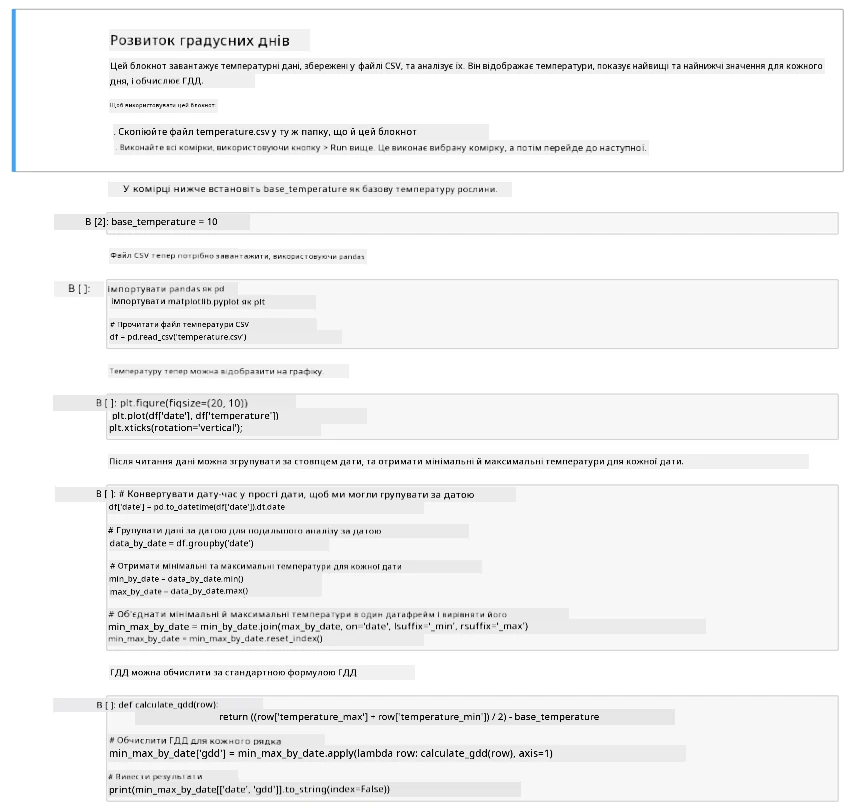

# Візуалізуйте дані GDD у Jupyter Notebook

## Інструкції

У цьому уроці ви збирали дані для GDD за допомогою IoT-сенсора. Щоб отримати якісні дані для GDD, їх потрібно збирати кілька днів. Для візуалізації даних про температуру й обчислення GDD можна скористатися такими інструментами, як [Jupyter Notebooks](https://jupyter.org).

Почніть зі збору даних протягом кількох днів. Потрібно, щоб серверний код працював увесь час, поки працює ваш IoT-пристрій: змініть налаштування керування живленням або запустіть щось на кшталт [цього Python-скрипту, що не дає системі заснути](https://github.com/jaqsparow/keep-system-active).

Коли дані про температуру зібрано, можна скористатися Jupyter-блокнотом із цього репозиторію, щоб візуалізувати їх і обчислити GDD. Jupyter-блокноти поєднують код та інструкції в блоках, які називають *комірками* (cells); код у них часто написаний на Python. Ви можете прочитати інструкції, а потім запускати код блок за блоком. Код також можна редагувати. Наприклад, у цьому блокноті можна змінити базову температуру, за якою обчислюється GDD для вашої рослини.

1. Створіть папку `gdd-calculation`.

1. Завантажте файл [gdd.ipynb](./code-notebook/gdd.ipynb) і скопіюйте його в папку `gdd-calculation`.

1. Скопіюйте туди файл `temperature.csv`, створений MQTT-сервером.

1. Створіть у папці `gdd-calculation` нове віртуальне середовище Python.

1. Встановіть pip-пакети для Jupyter-блокнотів, а також бібліотеки для роботи з даними й побудови графіків:

    ```sh
    pip install --upgrade pip
    pip install pandas
    pip install matplotlib
    pip install jupyter
    ```

1. Запустіть блокнот у Jupyter:

    ```sh
    jupyter notebook gdd.ipynb
    ```

    Jupyter запуститься й відкриє блокнот у браузері. Виконайте інструкції в блокноті, щоб візуалізувати виміряні температури й обчислити градусо-дні росту.

    

    > 💁 Блокнот можна відкрити й прямо у VS Code: встановіть розширення [Jupyter](https://marketplace.visualstudio.com/items?itemName=ms-toolsai.jupyter), відкрийте `gdd.ipynb` і виберіть ядро (kernel) з папки `.venv`.

## Критерії оцінювання

| Критерій | Відмінно | Задовільно | Потребує покращення |
| -------- | -------- | ---------- | ------------------- |
| Збір даних | Зібрано дані щонайменше за 2 повні дні | Зібрано дані щонайменше за 1 повний день | Зібрано лише частину даних |
| Обчислення GDD | Блокнот успішно запущено й обчислено GDD | Блокнот успішно запущено | Не вдалося запустити блокнот |
