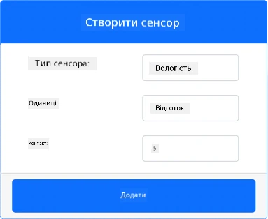
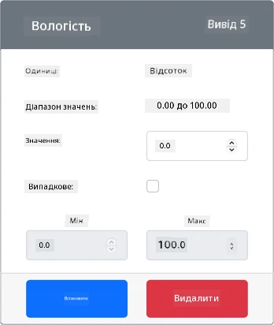
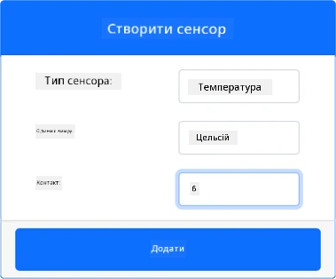
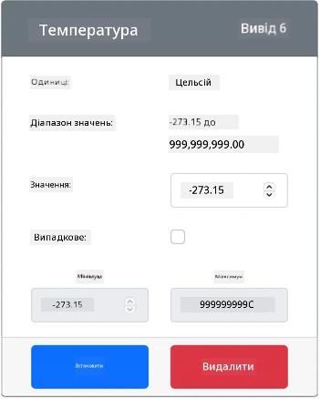

# Вимірювання температури: віртуальний IoT-пристрій

У цій частині уроку ви додасте до свого віртуального IoT-пристрою сенсор температури.

## Віртуальне обладнання

Віртуальний IoT-пристрій використовуватиме симульований цифровий сенсор вологості й температури Grove (Grove Digital Humidity and Temperature). Так це завдання виконується так само, як на Raspberry Pi з фізичним сенсором Grove DHT11.

Цей сенсор поєднує **сенсор температури** і **сенсор вологості**, але в цьому завданні вас цікавить лише сенсор температури. У фізичному IoT-пристрої сенсором температури був би [терморезистор](https://uk.wikipedia.org/wiki/Терморезистор), який вимірює температуру за зміною свого опору. Сенсори температури зазвичай цифрові: вони самі перетворюють виміряний опір на температуру в градусах Цельсія (або Кельвіна чи Фаренгейта).

### Додайте сенсори до CounterFit

Щоб використовувати віртуальний сенсор вологості й температури, потрібно додати два сенсори до застосунку CounterFit.

#### Завдання: додайте сенсори до CounterFit

Додайте сенсори вологості й температури до застосунку CounterFit.

1. Створіть на комп'ютері новий Python-застосунок у папці `temperature-sensor` з одним файлом `app.py` і віртуальним середовищем Python та встановіть pip-пакети CounterFit.

    > ⚠️ За потреби скористайтеся [інструкціями зі створення й налаштування Python-проєкту для CounterFit з уроку 1](../../../1-getting-started/lessons/1-introduction-to-iot/virtual-device.md). Не забудьте обидві команди встановлення:
    >
    > ```sh
    > pip install CounterFit counterfit-connection counterfit-shims-grove
    > pip install "flask==3.1.3" "flask-socketio==5.6.1" "eventlet==0.41.2" "werkzeug==3.1.9"
    > ```

1. Встановіть ще один pip-пакет — шим (shim) CounterFit для сенсора DHT11. Встановлюйте його з терміналу, у якому активовано віртуальне середовище.

    ```sh
    pip install counterfit-shims-seeed-python-dht
    ```

1. Переконайтеся, що вебзастосунок CounterFit запущено.

1. Створіть сенсор вологості:

    1. У полі *Create sensor* на панелі *Sensors* розкрийте список *Sensor type* і виберіть *Humidity*.

    1. Залиште для *Units* значення *Percent*.

    1. Переконайтеся, що для *Pin* вибрано *5*.

    1. Натисніть кнопку **Add**, щоб створити сенсор вологості на піні 5.

    

    Сенсор вологості буде створено, і він з'явиться у списку сенсорів.

    

1. Створіть сенсор температури:

    1. У полі *Create sensor* на панелі *Sensors* розкрийте список *Sensor type* і виберіть *Temperature*.

    1. Залиште для *Units* значення *Celsius*.

    1. Переконайтеся, що для *Pin* вибрано *6*.

    1. Натисніть кнопку **Add**, щоб створити сенсор температури на піні 6.

    

    Сенсор температури буде створено, і він з'явиться у списку сенсорів.

    

## Запрограмуйте застосунок сенсора температури

Тепер можна запрограмувати застосунок сенсора температури, використовуючи сенсори CounterFit.

### Завдання: запрограмуйте застосунок сенсора температури

Запрограмуйте застосунок сенсора температури.

1. Переконайтеся, що застосунок `temperature-sensor` відкрито у VS Code.

1. Відкрийте файл `app.py`.

1. Додайте на початок `app.py` такі імпорти:

    ```python
    import time
    from counterfit_connection import CounterFitConnection
    from counterfit_shims_seeed_python_dht import DHT
    ```

    Рядок `from counterfit_connection import CounterFitConnection` потрібен, щоб підключити застосунок до CounterFit.

    Рядок `from counterfit_shims_seeed_python_dht import DHT` імпортує клас сенсора `DHT` для роботи з віртуальним сенсором температури Grove через шим з модуля `counterfit_shims_seeed_python_dht`.

1. Під імпортами додайте код, що підключає застосунок до CounterFit:

    ```python
    CounterFitConnection.init('127.0.0.1', 5000)
    ```

1. Нижче додайте код, що створює екземпляр класу, який керує віртуальним сенсором вологості й температури:

    ```python
    sensor = DHT('11', 5)
    ```

    Цей рядок оголошує екземпляр класу `DHT`, який керує віртуальним цифровим сенсором вологості й температури (**D**igital **H**umidity and **T**emperature). Перший параметр вказує, що використовується віртуальний сенсор *DHT11*. Другий параметр вказує, що сенсор підключено до порту `5`.

    > 💁 CounterFit симулює цей комбінований сенсор вологості й температури за допомогою двох сенсорів: сенсора вологості на піні, указаному під час створення класу `DHT`, і сенсора температури на наступному піні. Якщо сенсор вологості на піні 5, шим очікує сенсор температури на піні 6.

1. Після цього коду додайте нескінченний цикл, який опитує сенсор температури й виводить значення в консоль:

    ```python
    while True:
        _, temp = sensor.read()
        print(f'Температура {temp}°C')
    ```

    Виклик `sensor.read()` повертає кортеж (tuple) із вологості й температури. Вам потрібна лише температура, тому вологість ігнорується. Потім значення температури виводиться в консоль.

1. Додайте в кінці циклу `while` невелику паузу на десять секунд, бо рівень температури не потрібно перевіряти безперервно. Паузи зменшують енергоспоживання пристрою.

    ```python
        time.sleep(10)
    ```

1. У терміналі VS Code з активованим віртуальним середовищем запустіть свій Python-застосунок:

    ```sh
    python app.py
    ```

1. У застосунку CounterFit змініть значення сенсора температури, яке зчитуватиме застосунок. Це можна зробити двома способами:

    * Введіть число в поле *Value* сенсора температури й натисніть кнопку **Set**. Сенсор повертатиме саме це число.

    * Позначте прапорець *Random*, введіть значення *Min* і *Max* і натисніть кнопку **Set**. Щоразу, коли сенсор зчитує значення, він повертатиме випадкове число між *Min* і *Max*.

    У консолі з'являтимуться задані вами значення. Змінюйте *Value* або налаштування *Random*, щоб побачити, як змінюється значення.

    ```output
    (.venv) ➜  temperature-sensor python app.py
    Температура 28.25°C
    Температура 30.71°C
    Температура 25.17°C
    ```

> 💁 Цей код є в папці [code-temperature/virtual-device](code-temperature/virtual-device).

😀 Ваша програма для сенсора температури працює!
