# Вимірювання вологості ґрунту

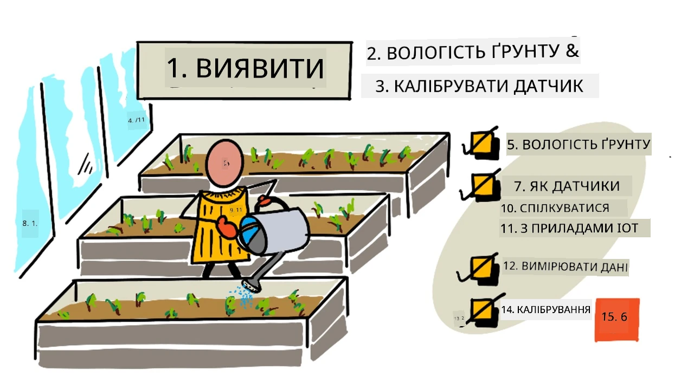

> Скетчнот від [Nitya Narasimhan](https://github.com/nitya). Натисніть на зображення, щоб побачити його у більшому розмірі.

Цей урок викладався в межах серії [IoT for Beginners Project 2 - Digital Agriculture](https://youtube.com/playlist?list=PLmsFUfdnGr3yCutmcVg6eAUEfsGiFXgcx) від [Microsoft Reactor](https://developer.microsoft.com/reactor/?WT.mc_id=academic-17441-jabenn) (відео англійською).

## Тест перед лекцією

[Тест перед лекцією](https://black-meadow-040d15503.1.azurestaticapps.net/quiz/11)

## Вступ

У попередньому уроці ми вимірювали властивість навколишнього середовища й використовували її, щоб прогнозувати ріст рослин. Температурою можна керувати, але це дорого, бо потребує контрольованого середовища. Найпростіше для рослин керувати водою: її регулюють щодня, від великих систем зрошення до малечі, що поливає город з лійки.

У цьому уроці ви навчитеся вимірювати вологість ґрунту, а в наступному — керувати системою автоматичного поливу. У цьому уроці з'являється третій сенсор: ви вже працювали з сенсором освітлення й сенсором температури. Тож тут ви також дізнаєтеся більше про те, як сенсори й актуатори обмінюються даними з IoT-пристроями, щоб краще зрозуміти, як сенсор вологості ґрунту передає дані на IoT-пристрій.

У цьому уроці ми розглянемо:

* [Вологість ґрунту](#вологість-ґрунту)
* [Як сенсори обмінюються даними з IoT-пристроями](#як-сенсори-обмінюються-даними-з-iot-пристроями)
* [Вимірювання рівня вологості ґрунту](#вимірювання-рівня-вологості-ґрунту)
* [Калібрування сенсора](#калібрування-сенсора)

## Вологість ґрунту

Для росту рослинам потрібна вода. Вони вбирають воду всією рослиною, але найбільше її поглинає коренева система. Рослина використовує воду для трьох речей:

* [Фотосинтез](https://uk.wikipedia.org/wiki/Фотосинтез): рослина проводить хімічну реакцію з водою, вуглекислим газом і світлом, у результаті якої утворюються вуглеводи й кисень.
* [Транспірація](https://uk.wikipedia.org/wiki/Транспірація): рослини використовують воду для дифузії вуглекислого газу з повітря в рослину через пори в листі. Цей процес також розносить поживні речовини по рослині й охолоджує її, подібно до того, як потіють люди.
* Структура: вода потрібна рослинам і для підтримання форми. Рослини на 90% складаються з води (а люди лише на 60%), і ця вода тримає клітини пружними. Якщо рослині бракує води, вона в'яне й зрештою гине.

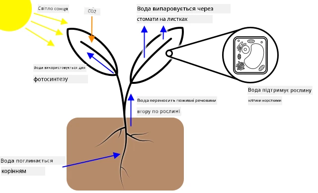

✅ Проведіть дослідження: скільки води втрачається через транспірацію?

Коренева система бере воду з вологи в ґрунті, де росте рослина. Якщо води в ґрунті замало, рослина не може вбирати її достатньо для росту. Якщо забагато, коріння не може отримати достатньо кисню для роботи. Через це коріння гине, а рослина не може отримати достатньо поживних речовин, щоб вижити.

Щоб рослини росли якнайкраще, ґрунт не має бути ні надто мокрим, ні надто сухим. IoT-пристрої можуть допомогти з цим: вони вимірюють вологість ґрунту, тож фермер поливає лише тоді, коли це потрібно.

### Способи вимірювання вологості ґрунту

Для вимірювання вологості ґрунту можна використовувати сенсори різних типів:

* Резистивні: резистивний сенсор має 2 щупи, які занурюють у ґрунт. На один щуп подається електричний струм, а другий його приймає. Сенсор вимірює опір ґрунту, тобто наскільки падає струм на другому щупі. Вода добре проводить електрику, тож що більше води в ґрунті, то нижчий опір.

    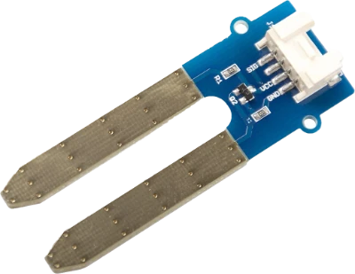

    > 💁 Резистивний сенсор вологості ґрунту можна зробити самому з двох шматків металу, наприклад цвяхів, розташованих за кілька сантиметрів один від одного: опір між ними вимірюють мультиметром.

* Ємнісні: ємнісний сенсор вологості вимірює кількість електричного заряду, яку можна накопичити між позитивною та негативною пластинами, тобто [електричну ємність](https://uk.wikipedia.org/wiki/Електрична_ємність). Ємність ґрунту змінюється разом із його вологістю, і її можна перетворити на напругу, яку вимірює IoT-пристрій. Що вологіший ґрунт, то нижча напруга на виході.

    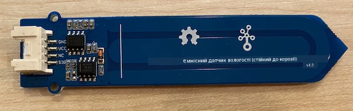

Обидва ці сенсори аналогові: вони повертають напругу, що вказує на вологість ґрунту. Як же ця напруга потрапляє у ваш код? Перш ніж говорити про ці сенсори далі, подивімося, як сенсори й актуатори обмінюються даними з IoT-пристроями.

## Як сенсори обмінюються даними з IoT-пристроями

У цих уроках ви вже познайомилися з кількома сенсорами й актуаторами, і якщо ви виконували завдання з фізичним обладнанням, вони обмінювалися даними з вашим IoT-набором для розробки. Але як працює цей обмін? Як вимірювання опору сенсором вологості ґрунту перетворюється на число, яке можна використати в коді?

Щоб обмінюватися даними з більшістю сенсорів і актуаторів, потрібне певне обладнання і протокол зв'язку, тобто чітко визначений спосіб надсилання й отримання даних. Візьмімо, наприклад, ємнісний сенсор вологості ґрунту:

* Як цей сенсор підключено до IoT-пристрою?
* Якщо він вимірює напругу, тобто аналоговий сигнал, йому потрібен АЦП, щоб отримати цифрове представлення значення. Це значення надсилається змінною напругою як послідовність 0 і 1, але скільки часу триває передавання кожного біта?
* Якщо сенсор повертає цифрове значення, це буде потік 0 і 1. І знову ж таки, скільки часу триває кожен біт?
* Якщо напруга висока протягом 0,1 с, це один біт 1, два біти 1 поспіль чи десять?
* Де починається число? `00001101` — це 25, чи перші 5 бітів — кінець попереднього значення?

Обладнання забезпечує фізичне з'єднання, яким передаються дані, а різні протоколи зв'язку гарантують, що дані надсилаються й отримуються правильно і їх можна розтлумачити.

### Піни загального призначення (GPIO)

GPIO (General Purpose Input Output, вхід-вихід загального призначення) — це набір пінів, через які можна підключати обладнання до IoT-пристрою. Вони часто є на IoT-наборах для розробки, таких як Raspberry Pi чи Wio Terminal. Через піни GPIO можна використовувати різні протоколи зв'язку, описані в цьому розділі. Одні піни GPIO подають напругу, зазвичай 3,3 В або 5 В, інші є землею, а ще інші можна програмно налаштувати або подавати напругу (вихід), або приймати її (вхід).

> 💁 Електричне коло має з'єднувати напругу із землею через схему, яку ви використовуєте. Можна уявити, що напруга — це позитивний (+) полюс батарейки, а земля — негативний (−).

Піни GPIO можна використовувати безпосередньо з деякими цифровими сенсорами й актуаторами, якщо вас цікавлять лише значення «увімкнено» чи «вимкнено». Увімкнений стан називають високим рівнем (high), вимкнений — низьким (low). Наприклад:

* Кнопка. Кнопку можна підключити між піном 5 В і піном, налаштованим як вхід. Коли ви натискаєте кнопку, вона замикає коло від піна 5 В через кнопку до вхідного піна. У коді можна прочитати напругу на вхідному піні: якщо рівень високий (5 В), кнопку натиснуто, якщо низький (0 В) — ні. Пам'ятайте, що сама напруга не зчитується: ви отримуєте цифровий сигнал 1 або 0 залежно від того, чи перевищує напруга певний поріг.

    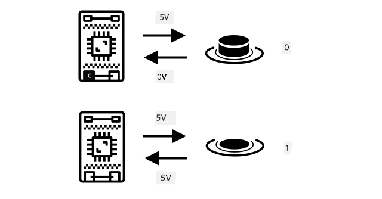

* Світлодіод. Світлодіод можна підключити між вихідним піном і піном землі (через резистор, інакше світлодіод перегорить). У коді можна встановити високий рівень на вихідному піні, і він подасть 3,3 В: коло замкнеться від піна 3,3 В через світлодіод до піна землі, і світлодіод засвітиться.

    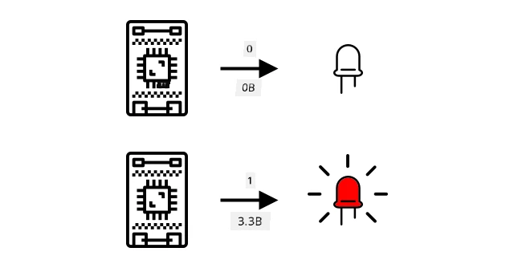

Для складніших сенсорів піни GPIO можна використовувати, щоб надсилати й отримувати цифрові дані безпосередньо від цифрових сенсорів і актуаторів, або через плати-контролери з АЦП і ЦАП для роботи з аналоговими сенсорами й актуаторами.

> 💁 Якщо в цих завданнях ви використовуєте Raspberry Pi, плата Grove Base Hat має обладнання, яке перетворює аналогові сигнали сенсорів на цифрові й передає їх через GPIO.

✅ Якщо у вас є IoT-пристрій з пінами GPIO, знайдіть ці піни й схему, яка показує, які з них подають напругу, які є землею, а які програмовані.

### Аналогові піни

Деякі пристрої, наприклад Arduino, мають аналогові піни. Вони такі самі, як піни GPIO, але підтримують не лише цифровий сигнал: у них є АЦП (аналогово-цифровий перетворювач), який перетворює діапазон напруг на числові значення. Зазвичай АЦП має роздільність 10 біт, тобто перетворює напругу на значення від 0 до 1 023.

Наприклад, на платі з живленням 3,3 В, якщо сенсор повертає 3,3 В, буде отримано значення 1 023. Якщо повернуто 1,65 В, буде отримано значення 511.

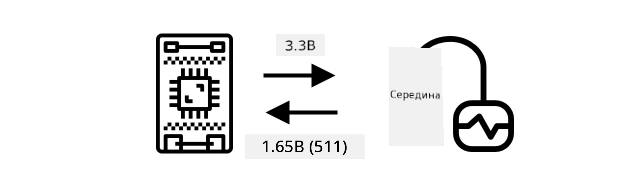

> 💁 У проєкті нічника (урок 3) сенсор освітлення повертав значення від 0 до 1 023. Якщо ви використовуєте Wio Terminal, сенсор був підключений до аналогового піна. Якщо Raspberry Pi — то до аналогового піна на платі Base Hat, яка має вбудований АЦП і передає дані через піни GPIO. Віртуальний пристрій був налаштований надсилати значення від 0 до 1 023, щоб симулювати аналоговий пін.

Сенсори вологості ґрунту працюють із напругою, тож вони використовують аналогові піни й повертають значення від 0 до 1 023.

### Inter-Integrated Circuit (I2C)

I2C (вимовляється *ай-ту-сі* або *ай-сквер-сі*) — це протокол з кількома контролерами та кількома периферійними пристроями: будь-який підключений пристрій може працювати як контролер або периферійний пристрій, що обмінюється даними через шину I2C (шина — це назва системи зв'язку, що передає дані). Дані надсилаються адресованими пакетами, і кожен пакет містить адресу підключеного пристрою, якому він призначений.

> 💁 Раніше цю модель називали master/slave (ведучий/ведений), але від цієї термінології відмовляються через її зв'язок із рабством. [Open Source Hardware Association запропонувала терміни controller/peripheral](https://www.oshwa.org/a-resolution-to-redefine-spi-signal-names/), але ви все ще можете натрапити на стару термінологію.

Пристрої мають адресу, яку використовують під час підключення до шини I2C. Зазвичай вона жорстко задана в пристрої. Наприклад, усі сенсори Grove від Seeed одного типу мають однакову адресу: усі сенсори освітлення мають одну адресу, а всі кнопки — іншу, відмінну від адреси сенсора освітлення. У деяких пристроях адресу можна змінити перемичками або спаявши піни.

Шина I2C складається з 2 основних дротів і 2 дротів живлення:

| Дріт | Назва | Опис |
| ---- | --------- | ----------- |
| SDA | Serial Data | Цей дріт передає дані між пристроями. |
| SCL | Serial Clock | Цей дріт передає тактовий сигнал із частотою, яку задає контролер. |
| VCC | Voltage common collector | Живлення для пристроїв. Він з'єднаний із дротами SDA і SCL через підтягувальний резистор, який вимикає сигнал, коли жоден пристрій не є контролером. |
| GND | Ground | Спільна земля для електричного кола. |

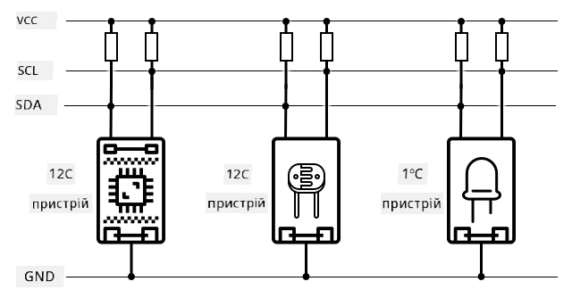

Щоб надіслати дані, пристрій подає умову старту (start condition), показуючи, що готовий надсилати дані. Тоді він стає контролером. Контролер надсилає адресу пристрою, з яким хоче обмінятися даними, і вказує, чи хоче він читати, чи записувати дані. Після передавання даних контролер подає умову зупинки (stop condition), показуючи, що закінчив. Після цього інший пристрій може стати контролером і надсилати чи отримувати дані.

Швидкість I2C обмежена: є 3 режими з фіксованою швидкістю. Найшвидший — High Speed з максимальною швидкістю 3,4 Мбіт/с (мегабітів на секунду), хоча цю швидкість підтримує дуже мало пристроїв. Raspberry Pi, наприклад, обмежений режимом Fast зі швидкістю 400 Кбіт/с (кілобітів на секунду). Стандартний режим (Standard) працює на швидкості 100 Кбіт/с.

> 💁 Якщо ваше IoT-обладнання — Raspberry Pi з платою Grove Base Hat, на платі є кілька роз'ємів I2C, через які можна працювати із сенсорами I2C. Аналогові сенсори Grove теж використовують I2C з АЦП, щоб передавати аналогові значення як цифрові дані. Тож сенсор освітлення, який ви використовували, симулював аналоговий пін, а значення передавалося через I2C, бо Raspberry Pi підтримує лише цифрові піни.

### Універсальний асинхронний приймач-передавач (UART)

UART (Universal Asynchronous Receiver-Transmitter) — це фізична схема, яка дає змогу двом пристроям обмінюватися даними. Кожен пристрій має 2 піни зв'язку: передавання (Tx) і приймання (Rx). Пін Tx першого пристрою з'єднують із піном Rx другого, а пін Tx другого — з піном Rx першого. Так дані можна передавати в обидва боки.

* Пристрій 1 передає дані зі свого піна Tx, і пристрій 2 приймає їх на свій пін Rx
* Пристрій 1 приймає на свій пін Rx дані, які пристрій 2 передає зі свого піна Tx

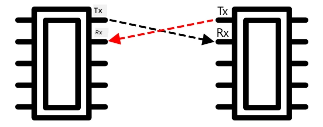

> 🎓 Дані надсилаються по одному біту за раз, і це називається *послідовним* (serial) зв'язком. Більшість операційних систем і мікроконтролерів мають *послідовні порти*, тобто з'єднання, які можуть надсилати й отримувати послідовні дані та доступні з вашого коду.

UART-пристрої мають [швидкість передавання в бодах](https://uk.wikipedia.org/wiki/Бод) (baud rate, також її називають символьною швидкістю) — це швидкість надсилання й отримання даних у бітах на секунду. Поширена швидкість — 9 600 бод, тобто щосекунди надсилається 9 600 бітів (0 і 1) даних.

UART використовує стартові й стопові біти: перед байтом (8 бітів) даних він надсилає стартовий біт, а після 8 бітів — стоповий.

Швидкість UART залежить від обладнання, але навіть найшвидші реалізації не перевищують 6,5 Мбіт/с (мегабітів на секунду, тобто мільйонів бітів, 0 чи 1, за секунду).

UART можна використовувати через піни GPIO: один пін налаштовують як Tx, а інший — як Rx, а потім під'єднують їх до іншого пристрою.

> 💁 Якщо ваше IoT-обладнання — Raspberry Pi з платою Grove Base Hat, на платі є роз'єм UART, через який можна працювати із сенсорами, що використовують протокол UART.

### Послідовний периферійний інтерфейс (SPI)

SPI (Serial Peripheral Interface) призначений для зв'язку на коротких відстанях, наприклад щоб мікроконтролер обмінювався даними з пристроєм зберігання, як-от флешпам'яттю. Він побудований на моделі контролер/периферійний пристрій: один контролер (зазвичай процесор IoT-пристрою) взаємодіє з кількома периферійними пристроями. Контролер керує всім: вибирає периферійний пристрій і надсилає або запитує дані.

> 💁 Як і для I2C, терміни «контролер» і «периферійний пристрій» з'явилися нещодавно, тож ви можете побачити й старі терміни.

Контролери SPI використовують 3 дроти та ще по 1 дроту на кожен периферійний пристрій. Периферійні пристрої використовують 4 дроти. Ось ці дроти:

| Дріт | Назва | Опис |
| ---- | --------- | ----------- |
| COPI | Controller Output, Peripheral Input | Цей дріт передає дані від контролера до периферійного пристрою. |
| CIPO | Controller Input, Peripheral Output | Цей дріт передає дані від периферійного пристрою до контролера. |
| SCLK | Serial Clock | Цей дріт передає тактовий сигнал із частотою, яку задає контролер. |
| CS   | Chip Select | Контролер має кілька таких дротів, по одному на кожен периферійний пристрій, і кожен з'єднано з дротом CS відповідного пристрою. |

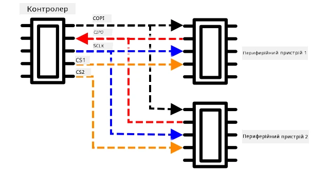

Дріт CS активує один периферійний пристрій за раз, і обмін даними з ним іде дротами COPI і CIPO. Коли контролеру потрібно перейти на інший пристрій, він деактивує дріт CS поточного активного пристрою, а потім активує дріт того пристрою, з яким хоче працювати далі.

SPI є *повнодуплексним*: контролер може одночасно надсилати й отримувати дані від того самого периферійного пристрою дротами COPI і CIPO. SPI синхронізує пристрої тактовим сигналом на дроті SCLK, тож, на відміну від прямого передавання через UART, йому не потрібні стартові й стопові біти.

Для SPI немає визначених обмежень швидкості: реалізації часто можуть передавати кілька мегабайтів даних за секунду.

IoT-набори для розробки часто підтримують SPI на деяких пінах GPIO. Наприклад, на Raspberry Pi для SPI можна використовувати піни GPIO 19, 21, 23, 24 і 26.

### Бездротовий зв'язок

Деякі сенсори можуть обмінюватися даними через стандартні бездротові протоколи, такі як Bluetooth (переважно Bluetooth Low Energy, або BLE), LoRaWAN (**Lo**ng **Ra**nge, енергоощадний мережевий протокол великого радіуса дії) чи Wi-Fi. Це дає змогу використовувати віддалені сенсори, фізично не під'єднані до IoT-пристрою.

Приклад — комерційні сенсори вологості ґрунту. Вони вимірюють вологість ґрунту в полі, а потім надсилають дані через LoRaWAN на пристрій-хаб, який обробляє дані або передає їх через Інтернет. Так сенсор може бути розташований далеко від IoT-пристрою, який обробляє дані, а це зменшує енергоспоживання і прибирає потребу у великих мережах Wi-Fi чи довгих кабелях.

BLE популярний для складних сенсорів, наприклад фітнес-трекерів, які носять на зап'ясті. Вони поєднують кілька сенсорів і надсилають дані через BLE на IoT-пристрій, яким у цьому випадку є ваш телефон.

✅ Чи є у вас при собі, удома чи в школі якісь Bluetooth-сенсори? Це можуть бути сенсори температури, сенсори присутності, трекери пристроїв і фітнес-пристрої.

Один з популярних способів підключення комерційних пристроїв — Zigbee. Zigbee використовує бездротовий зв'язок (стандарт IEEE 802.15.4, здебільшого в тому самому діапазоні 2,4 ГГц, що й Wi-Fi), щоб утворювати сітчасті (mesh) мережі між пристроями: кожен пристрій з'єднується з якомога більшою кількістю сусідніх пристроїв, утворюючи безліч з'єднань, як павутиння. Коли пристрій хоче надіслати повідомлення в Інтернет, він надсилає його найближчим пристроям, ті передають далі іншим сусідам і так далі, доки повідомлення не дійде до координатора, який може надіслати його в Інтернет.

> 🐝 Назва Zigbee походить від виляючого танцю медоносних бджіл, який вони виконують, повернувшись у вулик.

## Вимірювання рівня вологості ґрунту

Виміряти рівень вологості ґрунту можна за допомогою сенсора вологості ґрунту, IoT-пристрою та кімнатної рослини або ділянки ґрунту поблизу.

### Завдання: виміряйте вологість ґрунту

Пройдіть відповідний посібник, щоб виміряти вологість ґрунту за допомогою свого IoT-пристрою:

* [Arduino: Wio Terminal](https://github.com/microsoft/IoT-For-Beginners/blob/main/2-farm/lessons/2-detect-soil-moisture/wio-terminal-soil-moisture.md) (ще не адаптовано, оригінал англійською)
* [Одноплатний комп'ютер: Raspberry Pi](https://github.com/microsoft/IoT-For-Beginners/blob/main/2-farm/lessons/2-detect-soil-moisture/pi-soil-moisture.md) (ще не адаптовано, оригінал англійською)
* [Одноплатний комп'ютер: віртуальний пристрій](virtual-device-soil-moisture.md)

## Калібрування сенсора

Сенсори вимірюють електричні властивості, такі як опір або ємність.

> 🎓 Опір вимірюється в омах (Ω) і показує, наскільки щось перешкоджає проходженню електричного струму. Коли до матеріалу прикладають напругу, сила струму, що через нього проходить, залежить від опору матеріалу. Докладніше читайте на [сторінці Вікіпедії про електричний опір](https://uk.wikipedia.org/wiki/Електричний_опір).

> 🎓 Ємність вимірюється у фарадах (Ф) і показує здатність компонента чи схеми накопичувати й зберігати електричну енергію. Докладніше читайте на [сторінці Вікіпедії про електричну ємність](https://uk.wikipedia.org/wiki/Електрична_ємність).

Самі ці вимірювання не завжди корисні: уявіть сенсор температури, який показує 22,5 кΩ! Тому виміряне значення потрібно перетворити на корисну одиницю за допомогою калібрування, тобто зіставити виміряні значення з фізичною величиною, щоб нові вимірювання можна було перевести в потрібні одиниці.

Деякі сенсори продаються вже відкаліброваними. Наприклад, сенсор температури з минулого уроку вже відкалібровано, тож він повертає температуру в °C. На заводі перший виготовлений сенсор поміщають у середовище з різними відомими температурами й вимірюють опір. За цими даними будують формулу, яка перетворює виміряне значення в Ω (одиницях опору) на °C.

> 💁 Формула, що пов'язує опір і температуру, називається [рівнянням Стейнгарта — Гарта](https://wikipedia.org/wiki/Steinhart–Hart_equation) (англійською).

### Калібрування сенсора вологості ґрунту

Вологість ґрунту вимірюють як вагову (гравіметричну) або об'ємну вологість.

* Вагова вологість — це маса води в одиниці маси ґрунту, тобто кількість кілограмів води на кілограм сухого ґрунту
* Об'ємна вологість — це об'єм води в одиниці об'єму ґрунту, тобто кількість кубічних метрів води на кубічний метр сухого ґрунту

> 🇺🇸 В США, оскільки одиниці однорідні, замість кілограмів можна використовувати фунти, а замість кубічних метрів — кубічні фути.

Сенсори вологості ґрунту вимірюють електричний опір або ємність, а ці величини залежать не лише від вологості ґрунту, а й від його типу, бо складники ґрунту можуть змінювати його електричні характеристики. В ідеалі сенсори слід калібрувати, тобто брати покази сенсора й порівнювати їх з вимірюваннями, отриманими науковішим методом. Наприклад, лабораторія може кілька разів на рік обчислювати вагову вологість ґрунту за зразками з певного поля, а ці числа використовують для калібрування сенсора, зіставляючи його покази з ваговою вологістю ґрунту.

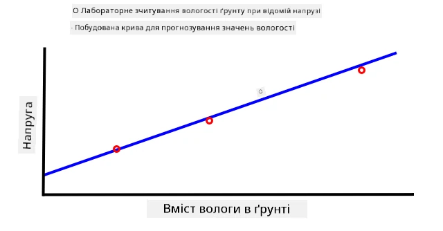

Графік вище показує, як калібрувати сенсор. Для зразка ґрунту фіксують напругу, а потім у лабораторії вимірюють його вологість, порівнюючи вагу вологого й сухого зразка (зважують вологий зразок, висушують у печі й зважують сухий). Коли зібрано кілька вимірювань, їх наносять на графік і проводять через точки лінію. За цією лінією покази сенсора вологості ґрунту, отримані IoT-пристроєм, можна перетворити на реальну вологість ґрунту.

💁 У резистивних сенсорах вологості ґрунту напруга зростає разом із вологістю. У ємнісних напруга з ростом вологості зменшується, тож їхні графіки йдуть донизу, а не вгору.

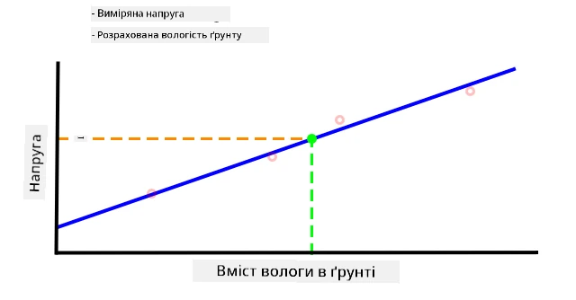

На графіку вище показано показ напруги із сенсора вологості ґрунту: якщо від нього дійти до лінії на графіку, можна визначити реальну вологість ґрунту.

За такого підходу фермеру потрібно лише кілька лабораторних вимірювань для поля, а далі вологість ґрунту вимірюють IoT-пристрої, і це значно пришвидшує вимірювання.

---

## 🚀 Виклик

Резистивні та ємнісні сенсори вологості ґрунту мають низку відмінностей. Які це відмінності і який тип (якщо такий є) найкраще підходить фермеру? Чи змінюється відповідь для країн, що розвиваються, і розвинених країн?

## Тест після лекції

[Тест після лекції](https://black-meadow-040d15503.1.azurestaticapps.net/quiz/12)

## Огляд і самостійне навчання

Почитайте про обладнання та протоколи, які використовують сенсори й актуатори:

* [Сторінка Вікіпедії про GPIO](https://wikipedia.org/wiki/General-purpose_input/output) (англійською)
* [Сторінка Вікіпедії про UART](https://wikipedia.org/wiki/Universal_asynchronous_receiver-transmitter) (англійською)
* [Сторінка Вікіпедії про SPI](https://wikipedia.org/wiki/Serial_Peripheral_Interface) (англійською)
* [Сторінка Вікіпедії про I2C](https://wikipedia.org/wiki/I²C) (англійською)
* [Сторінка Вікіпедії про Zigbee](https://wikipedia.org/wiki/Zigbee) (англійською)

## Завдання

[Відкалібруйте свій сенсор](assignment.md)

---

> **Про цю версію.** Урок адаптовано українською на основі курсу [IoT for Beginners](https://github.com/microsoft/IoT-For-Beginners) від Microsoft (ліцензія MIT). Віртуальний пристрій CounterFit налаштовано для Python 3.10+ (рекомендовано 3.14).
