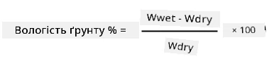
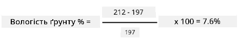

# Відкалібруйте свій сенсор

## Інструкції

У цьому уроці ви отримували покази сенсора вологості ґрунту у вигляді значень від 0 до 1023. Щоб перетворити їх на реальну вологість ґрунту, сенсор потрібно відкалібрувати. Для цього беруть покази на зразках ґрунту, а потім обчислюють вагову (гравіметричну) вологість цих зразків.

Щоб отримати потрібні покази, ці кроки треба повторити кілька разів, щоразу з ґрунтом різної вологості.

1. Виміряйте вологість ґрунту сенсором вологості ґрунту. Запишіть цей показ.

1. Візьміть зразок ґрунту й зважте його. Запишіть вагу.

1. Висушіть ґрунт. Найкраще це зробити в духовці, нагрітій до 110°C (230°F), протягом кількох годин. Можна також сушити ґрунт на сонці або в теплому сухому місці, доки він не висохне повністю. Ґрунт має стати сипким і схожим на порошок.

    > 💁 У лабораторії для найточніших результатів зразки сушать у сушильній шафі 48–72 години. Якщо у вашому навчальному закладі є сушильні шафи, спробуйте скористатися ними й сушити довше. Що довше сушити, то сухіший зразок і точніші результати.

1. Зважте ґрунт ще раз.

    > 🔥 Якщо ви сушили ґрунт у духовці, спершу дайте йому охолонути!

Вагову вологість ґрунту обчислюють так:

* Wwet — вага вологого ґрунту
* Wdry — вага сухого ґрунту

Наприклад, зразок ґрунту важить 212 г вологим і 197 г сухим.

* Wwet = 212 г
* Wdry = 197 г
* 212 - 197 = 15
* 15 / 197 = 0,076
* 0,076 * 100 = 7,6%

У цьому прикладі вагова вологість ґрунту становить 7,6%.

Коли у вас будуть покази щонайменше для 3 зразків, побудуйте графік залежності вологості ґрунту у % від показів сенсора вологості ґрунту й проведіть лінію, яка найкраще проходить через точки. За цією лінією можна визначити вагову вологість ґрунту для будь-якого показу сенсора.

## Критерії оцінювання

| Критерій | Відмінно | Задовільно | Потребує покращення |
| -------- | -------- | ---------- | ------------------- |
| Збір даних для калібрування | Зібрано щонайменше 3 зразки для калібрування | Зібрано щонайменше 2 зразки для калібрування | Зібрано щонайменше 1 зразок для калібрування |
| Відкалібрований показ | Успішно побудовано калібрувальний графік, знято показ сенсора й перетворено його на вагову вологість ґрунту | Успішно побудовано калібрувальний графік | Не вдалося побудувати графік |
