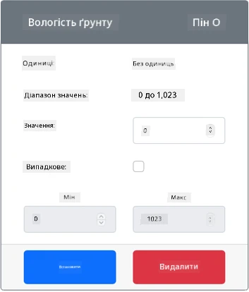

# Вимірювання вологості ґрунту: віртуальний IoT-пристрій

У цій частині уроку ви додасте до свого віртуального IoT-пристрою ємнісний сенсор вологості ґрунту й зчитуватимете з нього значення.

## Віртуальне обладнання

Віртуальний IoT-пристрій використовуватиме симульований ємнісний сенсор вологості ґрунту Grove. Так це завдання виконується так само, як на Raspberry Pi з фізичним ємнісним сенсором вологості ґрунту Grove.

У фізичному IoT-пристрої сенсором вологості ґрунту був би ємнісний сенсор, який вимірює вологість ґрунту за його електричною ємністю — властивістю, що змінюється разом із вологістю ґрунту. Що вища вологість ґрунту, то нижча напруга.

Це аналоговий сенсор, тож він використовує симульований 10-бітний АЦП і повертає значення від 1 до 1 023.

### Додайте сенсор вологості ґрунту до CounterFit

Щоб використовувати віртуальний сенсор вологості ґрунту, його потрібно додати до застосунку CounterFit.

#### Завдання: додайте сенсор вологості ґрунту до CounterFit

Додайте сенсор вологості ґрунту до застосунку CounterFit.

1. Створіть на комп'ютері новий Python-застосунок у папці `soil-moisture-sensor` з одним файлом `app.py` і віртуальним середовищем Python та встановіть pip-пакети CounterFit.

    > ⚠️ За потреби скористайтеся [інструкціями зі створення й налаштування Python-проєкту для CounterFit з уроку 1](../../../1-getting-started/lessons/1-introduction-to-iot/virtual-device.md). Не забудьте обидві команди встановлення:
    >
    > ```sh
    > pip install CounterFit counterfit-connection counterfit-shims-grove
    > pip install "flask==3.1.3" "flask-socketio==5.6.1" "eventlet==0.41.2" "werkzeug==3.1.9"
    > ```

1. Переконайтеся, що вебзастосунок CounterFit запущено.

1. Створіть сенсор вологості ґрунту:

    1. У полі *Create sensor* на панелі *Sensors* розкрийте список *Sensor type* і виберіть *Soil Moisture*.

    1. Залиште для *Units* значення *NoUnits*.

    1. Переконайтеся, що для *Pin* вибрано *0*.

    1. Натисніть кнопку **Add**, щоб створити сенсор *Soil Moisture* на піні 0.

    

    Сенсор вологості ґрунту буде створено, і він з'явиться у списку сенсорів.

    

## Запрограмуйте застосунок сенсора вологості ґрунту

Тепер можна запрограмувати застосунок сенсора вологості ґрунту, використовуючи сенсори CounterFit.

### Завдання: запрограмуйте застосунок сенсора вологості ґрунту

Запрограмуйте застосунок сенсора вологості ґрунту.

1. Переконайтеся, що застосунок `soil-moisture-sensor` відкрито у VS Code.

1. Відкрийте файл `app.py`.

1. Додайте на початок `app.py` такі імпорти:

    ```python
    import time
    from counterfit_connection import CounterFitConnection
    from counterfit_shims_grove.adc import ADC
    ```

    Рядок `import time` імпортує модуль `time`, який знадобиться далі в цьому завданні.

    Рядок `from counterfit_connection import CounterFitConnection` потрібен, щоб підключити застосунок до CounterFit.

    Рядок `from counterfit_shims_grove.adc import ADC` імпортує клас `ADC` для роботи з віртуальним аналогово-цифровим перетворювачем (АЦП), до якого можна підключити сенсор CounterFit.

1. Під імпортами додайте код, що підключає застосунок до CounterFit:

    ```python
    CounterFitConnection.init('127.0.0.1', 5000)
    ```

1. Нижче додайте код, що створює екземпляр класу `ADC`:

    ```python
    adc = ADC()
    ```

1. Додайте нескінченний цикл, який зчитує значення з цього АЦП на піні 0 і виводить результат у консоль. Між зчитуваннями цикл засинає на 10 секунд.

    ```python
    while True:
        soil_moisture = adc.read(0)
        print('Вологість ґрунту:', soil_moisture)

        time.sleep(10)
    ```

1. У застосунку CounterFit змініть значення сенсора вологості ґрунту, яке зчитуватиме застосунок. Це можна зробити двома способами:

    * Введіть число в поле *Value* сенсора вологості ґрунту й натисніть кнопку **Set**. Сенсор повертатиме саме це число.

    * Позначте прапорець *Random*, введіть значення *Min* і *Max* і натисніть кнопку **Set**. Щоразу, коли сенсор зчитує значення, він повертатиме випадкове число між *Min* і *Max*.

1. Запустіть Python-застосунок. У консолі з'являтимуться виміряні значення вологості ґрунту. Змінюйте *Value* або налаштування *Random*, щоб побачити, як змінюється значення.

    ```output
    (.venv) ➜  soil-moisture-sensor python app.py
    Вологість ґрунту: 615
    Вологість ґрунту: 612
    Вологість ґрунту: 498
    Вологість ґрунту: 493
    Вологість ґрунту: 490
    Вологість ґрунту: 388
    ```

> 💁 Цей код є в папці [code/virtual-device](code/virtual-device).

😀 Ваша програма для сенсора вологості ґрунту працює!
