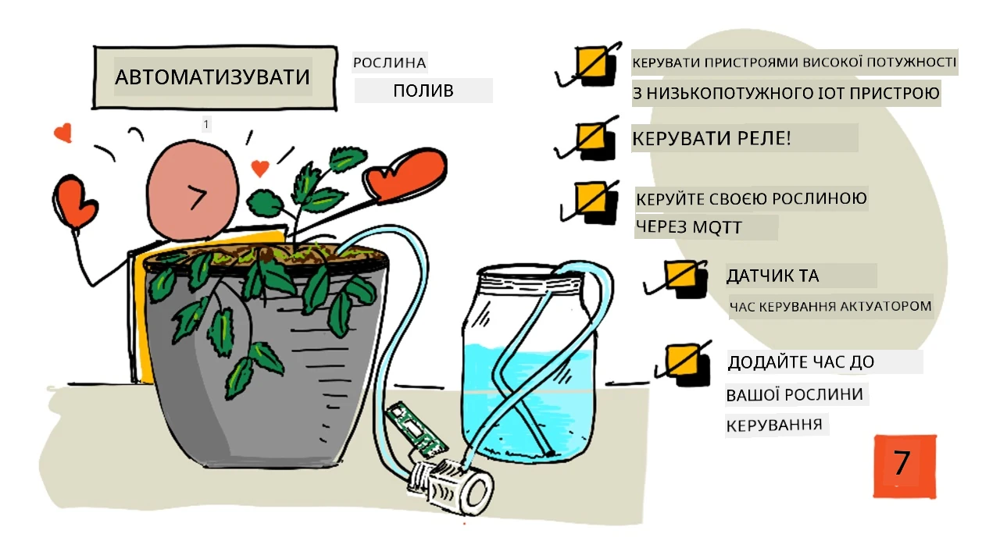
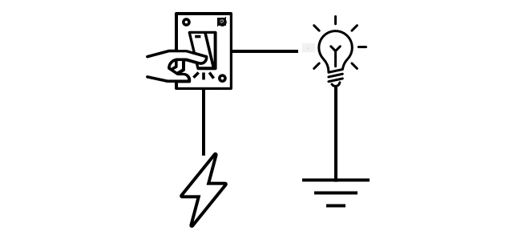
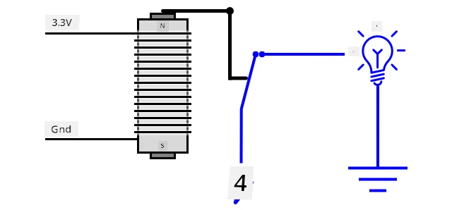
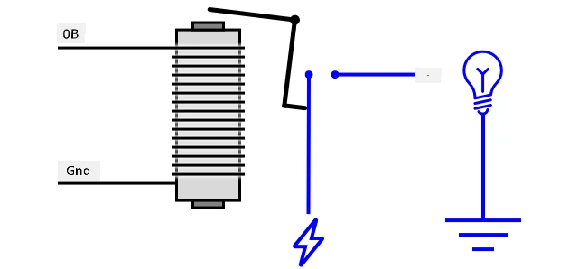
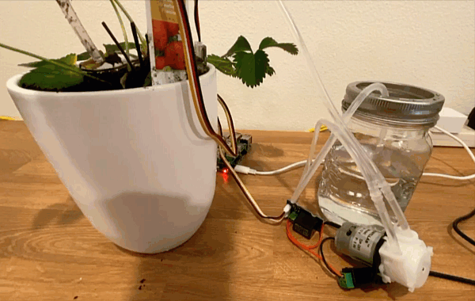
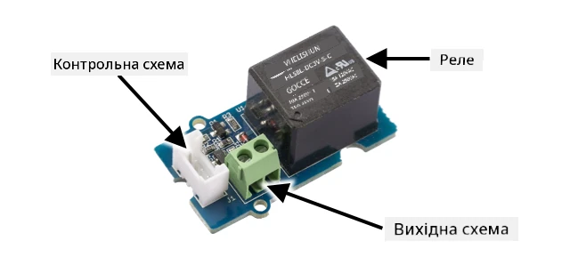
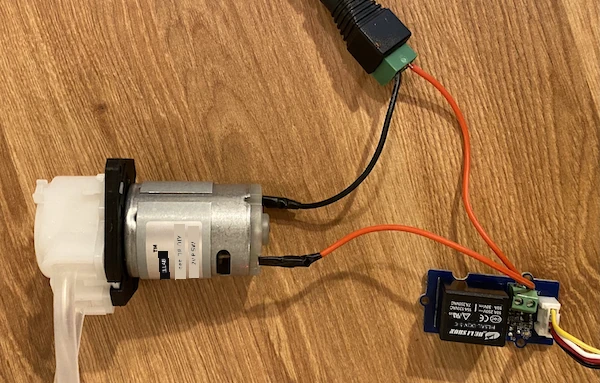
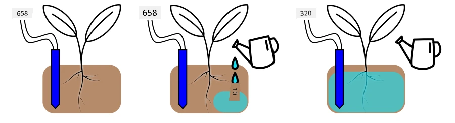
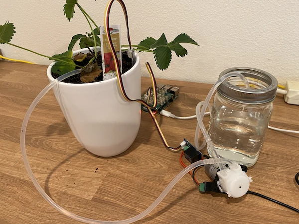
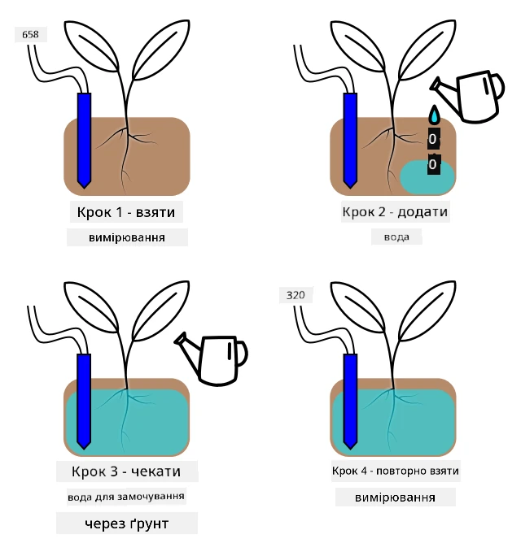

# Автоматичний полив рослин



> Скетчнот від [Nitya Narasimhan](https://github.com/nitya). Натисніть на зображення, щоб побачити його у більшому розмірі.

Цей урок викладався в межах серії [IoT for Beginners Project 2 - Digital Agriculture](https://youtube.com/playlist?list=PLmsFUfdnGr3yCutmcVg6eAUEfsGiFXgcx) від [Microsoft Reactor](https://developer.microsoft.com/reactor/?WT.mc_id=academic-17441-jabenn) (відео англійською).

[](https://youtu.be/g9FfZwv9R58)

> 🎥 Натисніть на зображення вище, щоб переглянути відео. У відео використовується стара версія бібліотеки `paho-mqtt`, тому код у ньому трохи відрізняється від коду в цьому уроці. Користуйтеся кодом з уроку.

## Тест перед лекцією

[Тест перед лекцією](https://black-meadow-040d15503.1.azurestaticapps.net/quiz/13)

## Вступ

У попередньому уроці ви навчилися відстежувати вологість ґрунту. У цьому уроці ви навчитеся будувати основні компоненти системи автоматичного поливу, яка реагує на вологість ґрунту. Ви також дізнаєтеся про час реакції (timing): сенсорам може знадобитися час, щоб відреагувати на зміни, а актуаторам — щоб змінити властивості, які вимірюють сенсори.

У цьому уроці ми розглянемо:

* [Керування потужними пристроями з енергоощадного IoT-пристрою](#керування-потужними-пристроями-з-енергоощадного-iot-пристрою)
* [Керування реле](#керування-реле)
* [Керування рослиною через MQTT](#керування-рослиною-через-mqtt)
* [Час реакції сенсорів і актуаторів](#час-реакції-сенсорів-і-актуаторів)
* [Додайте таймінг до сервера керування рослиною](#додайте-таймінг-до-сервера-керування-рослиною)

## Керування потужними пристроями з енергоощадного IoT-пристрою

IoT-пристрої працюють від низької напруги. Її достатньо для сенсорів і маломіцних актуаторів, як-от світлодіодів, але замало, щоб керувати більшим обладнанням, наприклад водяним насосом для зрошення. Навіть маленькі насоси, якими можна поливати кімнатні рослини, споживають забагато струму для IoT-набору для розробки й спалили б плату.

> 🎓 Сила струму вимірюється в амперах (А) і показує, скільки електрики проходить через коло. Напруга штовхає, а сила струму — це скільки проштовхується. Докладніше про струм читайте на [сторінці Вікіпедії про електричний струм](https://uk.wikipedia.org/wiki/Електричний_струм).

Рішення — підключити насос до зовнішнього джерела живлення й вмикати його актуатором, так само як ви вмикаєте світло. Щоб пальцем клацнути вимикачем, потрібна крихітна кількість енергії (з вашого тіла), а вимикач з'єднує лампу з електромережею напругою 110 В/240 В.



> 🎓 [Електромережа](https://wikipedia.org/wiki/Mains_electricity) (mains electricity, англійською) — це електрика, яку в багатьох частинах світу постачають у будинки й на підприємства через національну інфраструктуру.

✅ IoT-пристрої зазвичай можуть подавати 3,3 В або 5 В при струмі менше 1 ампера (1 А). Порівняйте це з електромережею, яка найчастіше має напругу 230 В (120 В у Північній Америці та 100 В в Японії) і може живити пристрої, що споживають 30 А.

Є кілька актуаторів, які можуть це робити, зокрема механічні пристрої, які кріплять на наявні вимикачі й вони імітують палець, що їх вмикає. Найпопулярніший з них — реле.

### Реле

Реле — це електромеханічний перемикач, який перетворює електричний сигнал на механічний рух, що вмикає перемикач. Основа реле — електромагніт.

> 🎓 [Електромагніти](https://uk.wikipedia.org/wiki/Електромагніт) — це магніти, які утворюються, коли через котушку дроту пропускають електричний струм. Коли струм увімкнено, котушка намагнічується. Коли струм вимкнено, котушка втрачає магнітні властивості.



У реле електромагніт живиться від кола керування. Коли електромагніт увімкнено, він притягує важіль, який рухає перемикач: пара контактів замикається, і вихідне коло замикається.



Коли коло керування вимикається, електромагніт вимикається, відпускає важіль, контакти розмикаються, і вихідне коло вимикається. Реле — цифрові актуатори: високий рівень сигналу вмикає реле, низький — вимикає.

Вихідне коло можна використати, щоб живити додаткове обладнання, наприклад систему зрошення. IoT-пристрій вмикає реле, вихідне коло замикається, система зрошення отримує живлення, і рослини поливаються. Потім IoT-пристрій вимикає реле, живлення системи зрошення зникає, і вода перестає текти.



На відео вище реле вмикається. На реле світиться світлодіод, який показує, що його увімкнено (деякі плати реле мають світлодіоди, що показують, увімкнено реле чи вимкнено), і на насос подається живлення: він вмикається й качає воду до рослини.

> 💁 Реле також можна використовувати, щоб перемикатися між двома вихідними колами, а не просто вмикати й вимикати одне. Коли важіль рухається, він перемикає контакт з одного вихідного кола на інше; зазвичай ці кола мають спільний провід живлення або спільну землю.

✅ Проведіть дослідження: є кілька типів реле. Вони відрізняються, наприклад, тим, вмикає чи вимикає реле подача живлення на коло керування, або кількістю вихідних кіл. Дізнайтеся про ці різні типи.

Коли важіль рухається, зазвичай чути, як він торкається електромагніта: реле чітко клацає.

> 💁 Реле можна під'єднати так, що замикання контакту розриває живлення самого реле, і воно вимикається; тоді живлення знову подається на реле, і воно вмикається, і так далі. Через це реле клацає неймовірно швидко й видає дзижчання. Саме так працювали деякі перші дзвоники в електричних дверних дзвінках.

### Живлення реле

Щоб увімкнутися й притягнути важіль, електромагніту не потрібно багато енергії: ним можна керувати виходом 3,3 В або 5 В IoT-набору для розробки. Вихідне коло може пропускати набагато більшу потужність, залежно від реле: аж до напруги електромережі або ще вищих рівнів для промислових потреб. Так IoT-набір для розробки може керувати системою зрошення — від маленького насоса для однієї рослини до величезної промислової системи для цілої комерційної ферми.



На зображенні вище показано реле Grove. Коло керування під'єднується до IoT-пристрою й вмикає чи вимикає реле напругою 3,3 В або 5 В. Вихідне коло має дві клеми, будь-яка з них може бути живленням чи землею. Вихідне коло витримує до 250 В при 10 А, цього достатньо для багатьох пристроїв, що живляться від мережі. Є реле, які витримують ще більшу потужність.



На зображенні вище насос живиться через реле. Червоний дріт з'єднує клему +5V USB-блока живлення з однією клемою вихідного кола реле, а інший червоний дріт з'єднує другу клему вихідного кола з насосом. Чорний дріт з'єднує насос із землею USB-блока живлення. Коли реле вмикається, коло замикається, на насос подається 5 В, і насос вмикається.

## Керування реле

Реле можна керувати з IoT-набору для розробки.

### Завдання: керуйте реле

Пройдіть відповідний посібник, щоб керувати реле за допомогою свого IoT-пристрою:

* [Arduino: Wio Terminal](https://github.com/microsoft/IoT-For-Beginners/blob/main/2-farm/lessons/3-automated-plant-watering/wio-terminal-relay.md) (ще не адаптовано, оригінал англійською)
* [Одноплатний комп'ютер: Raspberry Pi](https://github.com/microsoft/IoT-For-Beginners/blob/main/2-farm/lessons/3-automated-plant-watering/pi-relay.md) (ще не адаптовано, оригінал англійською)
* [Одноплатний комп'ютер: віртуальний пристрій](virtual-device-relay.md)

## Керування рослиною через MQTT

Поки що реле керує безпосередньо IoT-пристрій на основі одного показу вологості ґрунту. У комерційній системі зрошення логіка керування централізована: так рішення про полив можна ухвалювати на основі даних з багатьох сенсорів, а будь-які налаштування змінювати в одному місці. Щоб змоделювати це, можна керувати реле через MQTT.

### Завдання: керуйте реле через MQTT

1. Встановіть у проєкт `soil-moisture-sensor` потрібні бібліотеки/pip-пакети MQTT (`pip install "paho-mqtt>=2.1"`) і додайте код для підключення до MQTT. Назвіть ID клієнта `soilmoisturesensor_client` з вашим ID на початку.

    > ⚠️ За потреби скористайтеся [інструкціями з підключення до MQTT з проєкту 1, урок 4](../../../1-getting-started/lessons/4-connect-internet/README.md#підключіть-iot-пристрій-до-mqtt).

1. Додайте код пристрою, який надсилає телеметрію з показами вологості ґрунту. У повідомленні телеметрії назвіть властивість `soil_moisture`.

    > ⚠️ За потреби скористайтеся [інструкціями з надсилання телеметрії через MQTT з проєкту 1, урок 4](../../../1-getting-started/lessons/4-connect-internet/README.md#надсилання-телеметрії-з-iot-пристрою).

1. Створіть у папці `soil-moisture-sensor-server` локальний серверний код, який підписується на телеметрію й надсилає команду для керування реле. Назвіть властивість у повідомленні команди `relay_on`, а ID клієнта задайте як `soilmoisturesensor_server` з вашим ID на початку. Збережіть таку саму структуру, як у серверному коді з проєкту 1, урок 4, бо далі в цьому уроці ви доповнюватимете цей код.

    > ⚠️ За потреби скористайтеся інструкціями з [написання серверного коду, що отримує телеметрію](../../../1-getting-started/lessons/4-connect-internet/README.md#напишіть-серверний-код) і з [надсилання команд через MQTT](../../../1-getting-started/lessons/4-connect-internet/README.md#надсилання-команд-через-mqtt-брокер) з проєкту 1, урок 4.

1. Додайте код пристрою, який керує реле за отриманими командами, використовуючи властивість `relay_on` з повідомлення. Надсилайте для `relay_on` значення true, якщо `soil_moisture` більше за 450, інакше false — така сама логіка, яку ви раніше додали на IoT-пристрій.

    > ⚠️ За потреби скористайтеся [інструкціями з обробки команд MQTT з проєкту 1, урок 4](../../../1-getting-started/lessons/4-connect-internet/README.md#обробка-команд-на-iot-пристрої).

> 💁 Цей код є в папці [code-mqtt](./code-mqtt).

Переконайтеся, що код працює на пристрої та на локальному сервері, і перевірте його, змінюючи вологість ґрунту: або змінюючи значення, які надсилає віртуальний сенсор, або змінюючи вологість ґрунту (доливаючи воду чи виймаючи сенсор із ґрунту).

## Час реакції сенсорів і актуаторів

Ще в уроці 3 ви зробили нічник: світлодіод, який вмикається одразу, щойно сенсор освітлення фіксує низький рівень світла. Сенсор освітлення миттєво помічав зміну освітленості, і пристрій міг швидко реагувати; обмеженням була лише тривалість паузи у функції `loop` чи циклі `while True:`. Як IoT-розробник ви не завжди можете покладатися на такий швидкий зворотний зв'язок.

### Час реакції для вологості ґрунту

Якщо ви виконували минулий урок про вологість ґрунту з фізичним сенсором, ви помітили, що після поливу рослини показ вологості ґрунту знижується лише через кілька секунд. Це не тому, що сенсор повільний, а тому, що вода просочується крізь ґрунт не одразу.

> 💁 Якщо ви поливали надто близько до сенсора, ви могли побачити, що показ швидко впав, а потім знову піднявся. Так стається, бо вода біля сенсора розтікається по решті ґрунту, і вологість біля сенсора зменшується.



На діаграмі вище показ вологості ґрунту становить 658. Рослину поливають, але показ не змінюється одразу, бо вода ще не дійшла до сенсора. Полив може навіть закінчитися до того, як вода дійде до сенсора і значення впаде, показавши новий рівень вологості.

Якби ви писали код для керування системою зрошення через реле на основі рівня вологості ґрунту, вам довелося б врахувати цю затримку й закласти в IoT-пристрій розумніший таймінг.

✅ Подумайте хвилинку, як би ви це зробили.

### Керування таймінгом сенсорів і актуаторів

Уявіть, що вам доручили побудувати систему зрошення для ферми. З'ясувалося, що для цього типу ґрунту ідеальна вологість для вирощуваних рослин відповідає аналоговому показу напруги 400–450.

Можна запрограмувати пристрій так само, як нічник: поки сенсор показує більше за 450, вмикати реле, щоб працював насос. Проблема в тому, що вода не одразу доходить від насоса крізь ґрунт до сенсора. Сенсор зупинить воду, коли зафіксує рівень 450, але показ продовжить падати, бо накачана вода далі просочуватиметься крізь ґрунт. У результаті вода витрачається даремно, і є ризик пошкодити коріння.

✅ Пам'ятайте: забагато води для рослин може бути так само погано, як і замало, до того ж це марнування цінного ресурсу.

Краще рішення — зрозуміти, що між увімкненням актуатора і зміною властивості, яку зчитує сенсор, є затримка. Отже, не лише сенсор має зачекати якийсь час, перш ніж знову виміряти значення, а й актуатор має бути вимкнений деякий час перед наступним вимірюванням.

На скільки вмикати реле щоразу? Краще перестрахуватися й вмикати реле ненадовго, потім зачекати, поки вода просочиться, і знову перевірити вологість. Зрештою, ви завжди можете ввімкнути насос ще раз і додати води, а от прибрати воду з ґрунту не вийде.

> 💁 Такий контроль таймінгу дуже залежить від конкретного IoT-пристрою, який ви будуєте, властивості, яку ви вимірюєте, а також від сенсорів і актуаторів, які використовуються.



Наприклад, у мене є полуниця із сенсором вологості ґрунту та насосом, яким керує реле. Я помітив, що після поливу показ вологості ґрунту стабілізується приблизно через 20 секунд. Отже, мені треба вимкнути реле й зачекати 20 секунд, перш ніж перевіряти вологість. Краще трохи недолити, ніж перелити: насос завжди можна ввімкнути знову, а забрати воду з рослини не можна.



Отже, найкращим буде цикл поливу приблизно такий:

* Увімкнути насос на 5 секунд
* Зачекати 20 секунд
* Перевірити вологість ґрунту
* Якщо рівень досі вищий за потрібний, повторити ці кроки

5 секунд може бути задовго для насоса, особливо якщо вологість лише трохи вища за потрібний рівень. Найкращий спосіб дізнатися, який таймінг використовувати, — спробувати, а потім коригувати його за даними сенсора, з постійним зворотним зв'язком. Це може привести навіть до точнішого таймінгу, наприклад вмикати насос на 1 с на кожні 100 одиниць понад потрібний рівень вологості, а не на фіксовані 5 секунд.

✅ Проведіть дослідження: чи є інші міркування щодо таймінгу? Чи можна поливати рослину будь-коли, коли вологість ґрунту надто низька, чи є час доби, коли поливати добре, а коли погано?

> 💁 Керуючи автоматичним поливом рослин просто неба, можна також враховувати прогноз погоди. Якщо очікується дощ, полив можна відкласти, доки дощ не закінчиться. Тоді ґрунт може бути достатньо вологим, і поливати не доведеться, — це набагато ефективніше, ніж марнувати воду на полив перед самим дощем.

## Додайте таймінг до сервера керування рослиною

Серверний код можна змінити, щоб керувати таймінгом циклу поливу й чекати, поки зміниться рівень вологості ґрунту. Логіка сервера для керування таймінгом реле така:

1. Отримано повідомлення телеметрії
1. Перевірити рівень вологості ґрунту
1. Якщо він у нормі, нічого не робити. Якщо показ надто високий (тобто вологість ґрунту надто низька), то:
    1. Надіслати команду ввімкнути реле
    1. Зачекати 5 секунд
    1. Надіслати команду вимкнути реле
    1. Зачекати 20 секунд, поки рівень вологості ґрунту стабілізується

Цикл поливу, тобто процес від отримання повідомлення телеметрії до готовності знову обробляти рівень вологості ґрунту, триває близько 25 секунд. Ми надсилаємо рівень вологості ґрунту кожні 10 секунд, тож виходить накладання: повідомлення надходить, поки сервер чекає на стабілізацію вологості ґрунту, і воно може запустити ще один цикл поливу.

Обійти це можна двома способами:

* Змінити код IoT-пристрою, щоб він надсилав телеметрію лише раз на хвилину: тоді цикл поливу завершиться до надсилання наступного повідомлення
* Відписатися від телеметрії на час циклу поливу

Перший варіант не завжди добрий для великих ферм. Фермер може захотіти фіксувати рівень вологості ґрунту під час поливу для подальшого аналізу, наприклад щоб знати, як вода розтікається в різних частинах ферми, і поливати точніше. Другий варіант кращий: код просто ігнорує телеметрію, коли не може її використати, але телеметрія нікуди не зникає, і її можуть отримувати інші сервіси, підписані на неї.

> 💁 Дані IoT надсилаються не від одного пристрою лише одному сервісу: багато пристроїв можуть надсилати дані на брокер, і багато сервісів можуть отримувати ці дані з брокера. Наприклад, один сервіс може отримувати дані про вологість ґрунту й зберігати їх у базі даних для подальшого аналізу. Інший сервіс може слухати ту саму телеметрію, щоб керувати системою зрошення.

### Завдання: додайте таймінг до сервера керування рослиною

Оновіть серверний код, щоб він вмикав реле на 5 секунд, а потім чекав 20 секунд.

1. Відкрийте папку `soil-moisture-sensor-server` у VS Code, якщо вона ще не відкрита. Переконайтеся, що віртуальне середовище активовано.

1. Відкрийте файл `app.py`.

1. Додайте у файл `app.py` під наявними імпортами такий код:

    ```python
    import threading
    ```

    Цей рядок імпортує модуль `threading` зі стандартної бібліотеки Python. Потоки (threads) дають змогу Python виконувати інший код, поки щось очікує.

1. Додайте такий код перед функцією `handle_telemetry`, яка обробляє отримані сервером повідомлення телеметрії:

    ```python
    water_time = 5
    wait_time = 20
    ```

    Тут задано, на скільки вмикати реле (`water_time`) і скільки потім чекати, перш ніж перевірити вологість ґрунту (`wait_time`).

1. Нижче додайте:

    ```python
    def send_relay_command(client, state):
        command = {'relay_on': state}
        print('Надсилаю команду:', command)
        client.publish(server_command_topic, json.dumps(command))
    ```

    Цей код оголошує функцію `send_relay_command`, яка надсилає через MQTT команду для керування реле. Команду створюють як словник, а потім перетворюють на JSON-рядок. Значення, передане в `state`, визначає, увімкнути чи вимкнути реле.

1. Після функції `send_relay_command` додайте такий код:

    ```python
    def control_relay(client):
        print('Відписуюся від телеметрії')
        client.unsubscribe(client_telemetry_topic)

        send_relay_command(client, True)
        time.sleep(water_time)
        send_relay_command(client, False)

        time.sleep(wait_time)

        print('Знову підписуюся на телеметрію')
        client.subscribe(client_telemetry_topic)
    ```

    Ця функція керує реле з потрібним таймінгом. Спочатку вона відписується від телеметрії, щоб повідомлення про вологість ґрунту не оброблялися під час поливу. Потім надсилає команду ввімкнути реле. Далі чекає `water_time` і надсилає команду вимкнути реле. Насамкінець чекає `wait_time` секунд, поки рівень вологості ґрунту стабілізується, і знову підписується на телеметрію.

1. Змініть функцію `handle_telemetry` на таку:

    ```python
    def handle_telemetry(client, userdata, message):
        payload = json.loads(message.payload.decode())
        print('Отримано повідомлення:', payload)

        if payload['soil_moisture'] > 450:
            threading.Thread(target=control_relay, args=(client,)).start()
    ```

    Цей код перевіряє рівень вологості ґрунту. Якщо він більший за 450, ґрунт треба полити, тож викликається функція `control_relay`. Вона виконується в окремому потоці, у фоновому режимі.

1. Переконайтеся, що IoT-пристрій працює, і запустіть цей код. Змінюйте рівень вологості ґрунту й спостерігайте, що відбувається з реле: воно має вмикатися на 5 секунд, а потім лишатися вимкненим щонайменше 20 секунд і вмикатися знову, лише якщо вологості ґрунту недостатньо.

    ```output
    (.venv) ➜  soil-moisture-sensor-server python app.py
    Підключено до MQTT!
    Отримано повідомлення: {'soil_moisture': 457}
    Відписуюся від телеметрії
    Надсилаю команду: {'relay_on': True}
    Надсилаю команду: {'relay_on': False}
    Знову підписуюся на телеметрію
    Отримано повідомлення: {'soil_moisture': 302}
    ```

    Добрий спосіб перевірити це на змодельованій системі зрошення — взяти сухий ґрунт і доливати воду вручну, поки реле увімкнено, а коли реле вимкнеться, перестати лити.

> 💁 Цей код є в папці [code-timing](./code-timing).

> 💁 Якщо ви хочете зробити справжню систему зрошення з насосом, можна використати [водяний насос на 6 В](https://www.seeedstudio.com/6V-Mini-Water-Pump-p-1945.html) з [USB-блоком живлення з клемами](https://www.adafruit.com/product/3628). Переконайтеся, що живлення до насоса чи від нього проходить через реле.

---

## 🚀 Виклик

Чи можете ви згадати інші IoT- чи електричні пристрої з подібною проблемою, коли результат дії актуатора доходить до сенсора не одразу? Мабуть, кілька таких є у вас удома чи в навчальному закладі.

* Які властивості вони вимірюють?
* Скільки часу потрібно, щоб властивість змінилася після дії актуатора?
* Чи нормально, якщо властивість змінюється далі за потрібне значення?
* Як за потреби повернути її до потрібного значення?

## Тест після лекції

[Тест після лекції](https://black-meadow-040d15503.1.azurestaticapps.net/quiz/14)

## Огляд і самостійне навчання

* Прочитайте більше про реле, зокрема про їх історичне використання в телефонних станціях, на [сторінці Вікіпедії про реле](https://wikipedia.org/wiki/Relay) (англійською).

## Завдання

[Побудуйте ефективніший цикл поливу](assignment.md)

---

> **Про цю версію.** Урок адаптовано українською на основі курсу [IoT for Beginners](https://github.com/microsoft/IoT-For-Beginners) від Microsoft (ліцензія MIT). Порівняно з оригіналом код переписано під `paho-mqtt` 2.x (підписка на теми в обробнику `on_connect`), віртуальний пристрій CounterFit налаштовано для Python 3.10+ (рекомендовано 3.14), виправлено посилання у змісті уроку.
