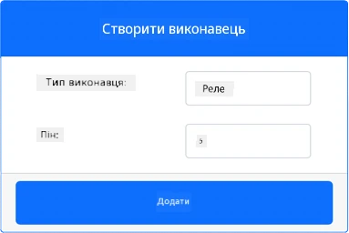
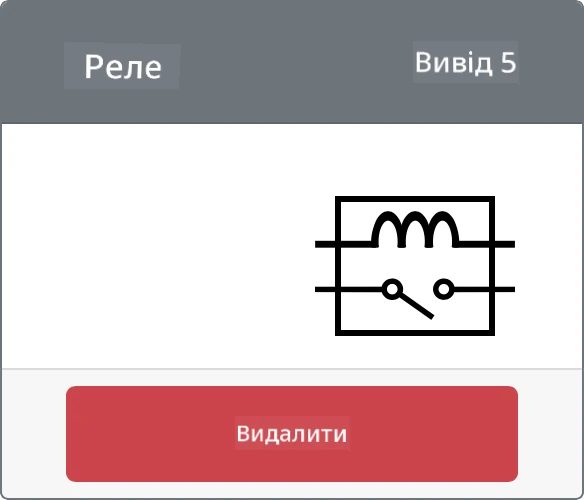
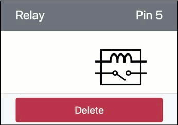

# Керування реле: віртуальний IoT-пристрій

У цій частині уроку ви додасте до свого віртуального IoT-пристрою, крім сенсора вологості ґрунту, ще й реле і керуватимете ним залежно від рівня вологості ґрунту.

## Віртуальне обладнання

Віртуальний IoT-пристрій використовуватиме симульоване реле Grove. Так це завдання виконується так само, як на Raspberry Pi з фізичним реле Grove.

У фізичному IoT-пристрої це було б нормально розімкнене реле (тобто вихідне коло розімкнене, або від'єднане, коли на реле не подається сигнал). Таке реле витримує вихідні кола до 250 В і 10 А.

### Додайте реле до CounterFit

Щоб використовувати віртуальне реле, його потрібно додати до застосунку CounterFit.

#### Завдання

Додайте реле до застосунку CounterFit.

1. Відкрийте у VS Code проєкт `soil-moisture-sensor` з минулого уроку, якщо він ще не відкритий. Ви доповнюватимете цей проєкт.

1. Переконайтеся, що вебзастосунок CounterFit запущено.

1. Створіть реле:

    1. У полі *Create actuator* на панелі *Actuators* розкрийте список *Actuator type* і виберіть *Relay*.

    1. Встановіть для *Pin* значення *5*.

    1. Натисніть кнопку **Add**, щоб створити реле на піні 5.

    

    Реле буде створено, і воно з'явиться у списку актуаторів.

    

## Запрограмуйте реле

Тепер застосунок сенсора вологості ґрунту можна запрограмувати на роботу з віртуальним реле.

### Завдання

Запрограмуйте віртуальний пристрій.

1. Відкрийте у VS Code проєкт `soil-moisture-sensor` з минулого уроку, якщо він ще не відкритий. Ви доповнюватимете цей проєкт.

1. Додайте у файл `app.py` під наявними імпортами такий рядок:

    ```python
    from counterfit_shims_grove.grove_relay import GroveRelay
    ```

    Цей рядок імпортує `GroveRelay` з бібліотек-шимів Grove для Python, щоб працювати з віртуальним реле Grove.

1. Під оголошенням класу `ADC` додайте такий код, щоб створити екземпляр `GroveRelay`:

    ```python
    relay = GroveRelay(5)
    ```

    Цей рядок створює реле на піні **5** — піні, до якого ви під'єднали реле.

1. Щоб перевірити, що реле працює, додайте в цикл `while True:` такий код:

    ```python
    relay.on()
    time.sleep(.5)
    relay.off()
    ```

    Цей код вмикає реле, чекає 0,5 секунди, а потім вимикає реле.

1. Запустіть Python-застосунок. Кожні 10 секунд реле вмикатиметься й вимикатиметься з півсекундною затримкою між увімкненням і вимкненням. У застосунку CounterFit ви побачите, як віртуальне реле замикається й розмикається.

    

## Керування реле за вологістю ґрунту

Тепер, коли реле працює, ним можна керувати залежно від показів вологості ґрунту.

### Завдання

Керуйте реле.

1. Видаліть 3 рядки коду, які ви додали для перевірки реле. Замініть їх таким кодом:

    ```python
    if soil_moisture > 450:
        print('Вологість ґрунту замала, вмикаю реле.')
        relay.on()
    else:
        print('Вологість ґрунту в нормі, вимикаю реле.')
        relay.off()
    ```

    Цей код перевіряє рівень вологості ґрунту із сенсора вологості ґрунту. Якщо показ більший за 450, код вмикає реле, а коли показ падає нижче за 450, вимикає його.

    > 💁 Пам'ятайте: у ємнісного сенсора вологості ґрунту що нижчий показ, то більше вологи в ґрунті, і навпаки.

1. Запустіть Python-застосунок. Ви побачите, як реле вмикається чи вимикається залежно від рівня вологості ґрунту. Змінюйте *Value* або налаштування *Random* сенсора вологості ґрунту, щоб побачити, як змінюється значення.

    ```output
    Вологість ґрунту: 638
    Вологість ґрунту замала, вмикаю реле.
    Вологість ґрунту: 452
    Вологість ґрунту замала, вмикаю реле.
    Вологість ґрунту: 347
    Вологість ґрунту в нормі, вимикаю реле.
    ```

> 💁 Цей код є в папці [code-relay/virtual-device](code-relay/virtual-device).

😀 Ваша програма, у якій віртуальний сенсор вологості ґрунту керує реле, працює!
