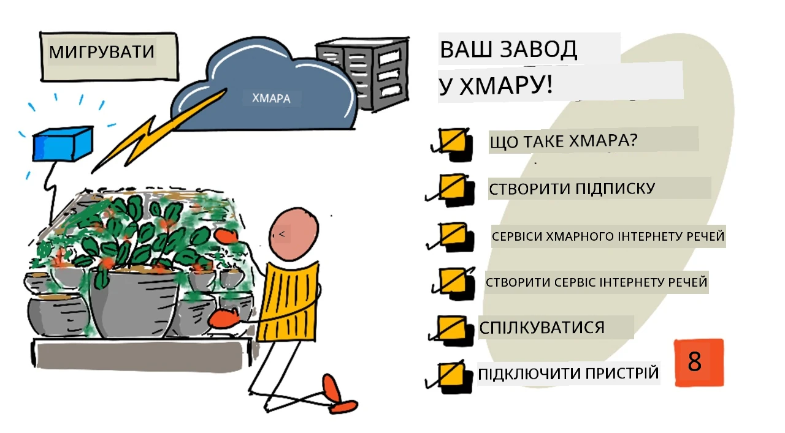
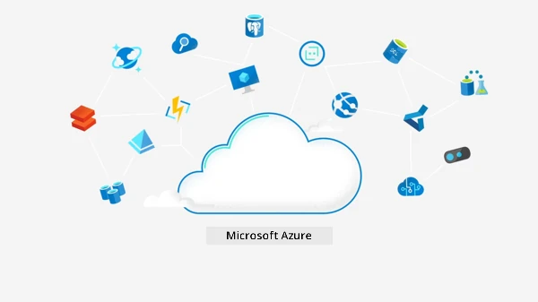
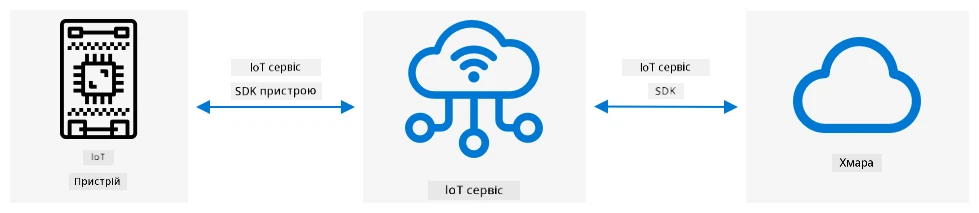
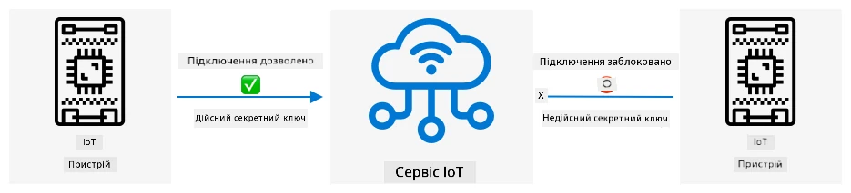
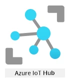

# Перенесіть свою рослину в хмару



> Скетчнот від [Nitya Narasimhan](https://github.com/nitya). Натисніть на зображення, щоб побачити його у більшому розмірі.

Цей урок викладався в межах серії [IoT for Beginners Project 2 - Digital Agriculture](https://youtube.com/playlist?list=PLmsFUfdnGr3yCutmcVg6eAUEfsGiFXgcx) від [Microsoft Reactor](https://developer.microsoft.com/reactor/) (відео англійською).

[](https://youtu.be/bNxjopXkhvk)

## Тест перед лекцією

[Тест перед лекцією](https://black-meadow-040d15503.1.azurestaticapps.net/quiz/15)

## Вступ

У попередньому уроці ви дізналися, як підключити рослину до MQTT-брокера, і керували реле з серверного коду, що працював локально. Саме так влаштовані автоматизовані системи поливу з підключенням до Інтернету: від окремих рослин удома до комерційних ферм.

IoT-пристрій обмінювався даними з публічним MQTT-брокером, щоб продемонструвати принципи роботи, але це не найнадійніший і не найбезпечніший спосіб. У цьому уроці ви дізнаєтеся, що таке хмара і які IoT-можливості надають публічні хмарні сервіси. Ви також дізнаєтеся, як перенести рослину з публічного MQTT-брокера в один із таких хмарних сервісів.

> 👩‍🏫 Усі завдання з Azure в цьому уроці показує викладач (демо). Студенти читають теорію й виконують [локальний варіант](local-mqtt.md) на своєму комп'ютері, без облікового запису Azure.

У цьому уроці ми розглянемо:

* [Що таке хмара?](#що-таке-хмара)
* [Створіть хмарну підписку](#створіть-хмарну-підписку)
* [Хмарні IoT-сервіси](#хмарні-iot-сервіси)
* [Створіть IoT-сервіс у хмарі](#створіть-iot-сервіс-у-хмарі)
* [Обмін даними з IoT Hub](#обмін-даними-з-iot-hub)
* [Підключіть пристрій до IoT-сервісу](#підключіть-пристрій-до-iot-сервісу)

## Що таке хмара?

До появи хмари компанія, яка хотіла надавати сервіси своїм працівникам (наприклад, бази даних чи сховище файлів) або широкому загалу (наприклад, вебсайти), будувала й утримувала власний дата-центр. Це могла бути як кімната з кількома комп'ютерами, так і ціла будівля, заповнена ними. Компанія відповідала за все, зокрема:

* купівлю комп'ютерів;
* обслуговування обладнання;
* електроживлення й охолодження;
* мережу;
* безпеку: і захист будівлі, і захист програмного забезпечення на комп'ютерах;
* встановлення й оновлення програмного забезпечення.

Це могло коштувати дуже дорого, вимагало багатьох кваліфікованих працівників, а зміни за потреби відбувалися дуже повільно. Наприклад, якщо інтернет-магазин готувався до напруженого святкового сезону, йому доводилося за кілька місяців планувати купівлю додаткового обладнання, налаштовувати й встановлювати його, а потім встановлювати програмне забезпечення для продажів. Після сезону, коли продажі падали, компанія залишалася з оплаченими комп'ютерами, які простоювали до наступного напруженого сезону.

✅ Як ви думаєте, чи дозволяло це компаніям діяти швидко? Якби інтернет-магазин одягу раптом став популярним, бо знаменитість з'явилася на людях у його речах, чи встиг би він достатньо швидко наростити обчислювальні потужності, щоб упоратися з напливом замовлень?

### Чужий комп'ютер

Хмару часто жартома називають «чужим комп'ютером». Початкова ідея була простою: замість купувати комп'ютери, ви орендуєте чужі. Хтось інший, постачальник хмарних обчислень, утримує величезні дата-центри. Саме він відповідає за купівлю й встановлення обладнання, живлення й охолодження, мережу, охорону будівель, оновлення обладнання й програм, тобто за все. Ви як клієнт орендуєте потрібні комп'ютери: більше, коли попит зростає, і менше, коли він падає. Такі хмарні дата-центри розташовані по всьому світу.


Ці дата-центри можуть займати кілька квадратних кілометрів. Знімки вище зроблено кілька років тому в одному з хмарних дата-центрів Microsoft. На них видно початковий розмір і заплановане розширення. Ділянка, розчищена під розширення, має площу понад 5 квадратних кілометрів.

> 💁 Ці дата-центри споживають стільки електроенергії, що деякі мають власні електростанції. Завдяки їхньому розміру й обсягу інвестицій хмарних постачальників вони зазвичай дуже екологічні. Вони ефективніші за величезну кількість малих дата-центрів, працюють переважно на відновлюваній енергії, а хмарні постачальники докладають багато зусиль, щоб зменшити кількість відходів і витрати води та відновлювати ліси замість тих, що вирубали під будівництво дата-центрів. Більше про те, як один із хмарних постачальників працює над сталим розвитком, можна прочитати на [сайті Azure про сталий розвиток](https://azure.microsoft.com/global-infrastructure/sustainability/).

✅ Проведіть невелике дослідження: почитайте про найбільші хмари, наприклад [Azure від Microsoft](https://azure.microsoft.com/) чи [GCP від Google](https://cloud.google.com). Скільки в них дата-центрів і де у світі вони розташовані?

Хмара допомагає компаніям знизити витрати й зосередитися на тому, що вони вміють найкраще, залишивши експертизу з хмарних обчислень постачальнику. Компаніям більше не потрібно орендувати чи купувати приміщення під дата-центр, платити різним постачальникам за зв'язок і електроенергію чи наймати експертів. Натомість вони сплачують хмарному постачальнику один щомісячний рахунок, і про все подбано.

Хмарний постачальник, своєю чергою, може знижувати витрати завдяки масштабу: купувати комп'ютери оптом дешевше, вкладати гроші в інструменти, що зменшують обсяг роботи з обслуговування, і навіть проєктувати й виготовляти власне обладнання, щоб покращити свої хмарні послуги.

### Microsoft Azure

Azure — це хмара Microsoft для розробників, і саме її ви використовуватимете в цих уроках. У відео нижче коротко розповідається про Azure:

[](https://www.microsoft.com/videoplayer/embed/RE4Ibng)

## Створіть хмарну підписку

> 👩‍🏫 Цю частину показує викладач (демо). Студенти виконують [локальний варіант](local-mqtt.md).

Щоб користуватися хмарними сервісами, потрібно оформити підписку в хмарного постачальника. У цьому уроці ви оформите підписку Microsoft Azure. Якщо у вас уже є підписка Azure, це завдання можна пропустити. Описані тут умови підписок були актуальними на момент написання, але можуть змінитися.

> 💁 Якщо ви проходите ці уроки в навчальному закладі, можливо, у вас уже є доступна підписка Azure. Запитайте викладача.

Є два типи безкоштовних підписок Azure:

* **Azure for Students** — підписка для студентів віком від 18 років. Для реєстрації не потрібна банківська картка: статус студента підтверджується адресою електронної пошти навчального закладу. Після реєстрації ви отримуєте 100 доларів США на хмарні ресурси, а також безкоштовні сервіси, зокрема безкоштовну версію IoT-сервісу. Підписка діє 12 місяців, і її можна поновлювати щороку, поки ви залишаєтеся студентом.

* **Безкоштовна підписка Azure** — підписка для всіх, хто не є студентом. Для реєстрації потрібна банківська картка, але кошти з неї не списуються: вона потрібна лише для того, щоб переконатися, що ви людина, а не бот. Ви отримуєте 200 доларів кредиту на будь-які сервіси на перші 30 днів, а також безкоштовні рівні сервісів Azure. Коли кредит закінчиться, кошти з картки не списуватимуться, якщо ви не перейдете на підписку з оплатою за використання (pay as you go).

> 💁 Microsoft також пропонує підписку Azure for Students Starter для студентів, молодших за 18 років, але на момент написання вона не підтримувала жодних IoT-сервісів.

### Завдання: оформіть безкоштовну хмарну підписку

Якщо вам уже виповнилося 18 і ви студент, можете оформити підписку Azure for Students. Статус потрібно підтвердити адресою електронної пошти навчального закладу. Зробити це можна одним із двох способів:

* Зареєструйтеся в GitHub Student Developer Pack на сайті [education.github.com/pack](https://education.github.com/pack). Він дає доступ до низки інструментів і пропозицій, зокрема GitHub і Microsoft Azure. Після реєстрації в Developer Pack ви зможете активувати пропозицію Azure for Students.

* Зареєструйтеся в Azure for Students напряму на сайті [azure.microsoft.com/free/students](https://azure.microsoft.com/free/students/).

> ⚠️ Якщо адресу електронної пошти вашого навчального закладу не розпізнано, створіть [issue у репозиторії оригінального курсу](https://github.com/Microsoft/IoT-For-Beginners/issues), і автори подивляться, чи можна додати її до списку дозволених для Azure for Students.

Якщо ви не студент або не маєте дійсної адреси навчального закладу, оформіть безкоштовну підписку Azure.

* Зареєструйтеся в безкоштовній підписці Azure на сайті [azure.microsoft.com/free](https://azure.microsoft.com/free/)

## Хмарні IoT-сервіси

Публічний тестовий MQTT-брокер, яким ви користувалися, чудово підходить для навчання, але для комерційного використання має низку недоліків:

* Надійність: це безкоштовний сервіс без жодних гарантій, і його можуть вимкнути будь-коли.
* Безпека: він публічний, тож будь-хто може прослуховувати вашу телеметрію або надсилати команди, що керують вашим обладнанням.
* Продуктивність: він розрахований лише на кілька тестових повідомлень, тож не впорається з великою кількістю повідомлень.
* Виявлення: немає способу дізнатися, які пристрої підключено.

Хмарні IoT-сервіси розв'язують ці проблеми. Їх підтримують великі хмарні постачальники, які багато вкладають у надійність і завжди готові виправити проблеми, якщо такі виникнуть. У них вбудовано захист, що не дає хакерам читати ваші дані чи надсилати підроблені команди. Вони також високопродуктивні: можуть обробляти мільйони повідомлень щодня, масштабуючись у хмарі за потреби.

> 💁 Хоча за ці переваги доводиться платити щомісяця, більшість хмарних постачальників мають безкоштовну версію IoT-сервісу з обмеженою кількістю повідомлень на день або пристроїв, які можна підключити. Зазвичай цієї безкоштовної версії розробнику з головою вистачає, щоб вивчити сервіс. У цьому уроці ви використовуватимете безкоштовну версію.

IoT-пристрої підключаються до хмарного сервісу або через SDK пристрою (бібліотеку з кодом для роботи з можливостями сервісу), або напряму за протоколом зв'язку, наприклад MQTT чи HTTP. SDK пристрою зазвичай найпростіший шлях, бо бере все на себе: знає, у які теми публікувати й на які підписуватися, і як забезпечити безпеку.



Через цей сервіс пристрій обмінюється даними з іншими частинами застосунку, так само як ви надсилали телеметрію й отримували команди через MQTT. Для цього зазвичай використовують SDK сервісу або подібну бібліотеку. Повідомлення надходять від пристрою до сервісу, звідки їх можуть читати інші компоненти застосунку, а у відповідь пристрою можна надсилати повідомлення.



Ці сервіси забезпечують безпеку тим, що знають про всі пристрої, які можуть підключатися й надсилати дані: пристрої або реєструють у сервісі заздалегідь, або видають їм секретні ключі чи сертифікати, за допомогою яких вони реєструються в сервісі під час першого підключення. Невідомі пристрої підключитися не можуть: якщо вони спробують, сервіс відхилить підключення й ігноруватиме їхні повідомлення.

✅ Проведіть невелике дослідження: у чому недолік відкритого IoT-сервісу, до якого може підключитися будь-який пристрій чи код? Чи можете ви знайти конкретні приклади, коли хакери цим скористалися?

Інші компоненти застосунку можуть підключатися до IoT-сервісу, дізнаватися про всі підключені чи зареєстровані пристрої та обмінюватися з ними даними напряму: з усіма разом або з кожним окремо.

> 💁 IoT-сервіси мають і додаткові можливості, а хмарні постачальники пропонують інші сервіси й застосунки, які можна до них під'єднати. Наприклад, якщо ви хочете зберігати в базі даних усі повідомлення телеметрії від усіх пристроїв, зазвичай достатньо кількох кліків в інструменті налаштування хмарного постачальника, щоб під'єднати сервіс до бази даних і передавати в неї дані потоком.

## Створіть IoT-сервіс у хмарі

> 👩‍🏫 Цю частину показує викладач (демо). Студенти виконують [локальний варіант](local-mqtt.md).

Тепер, коли у вас є підписка Azure, можна створити IoT-сервіс. IoT-сервіс від Microsoft називається Azure IoT Hub.



У відео нижче коротко розповідається про Azure IoT Hub:

[](https://www.youtube.com/watch?v=smuZaZZXKsU)

> 🎥 Натисніть на зображення вище, щоб переглянути відео

✅ Приділіть трохи часу дослідженню й прочитайте огляд IoT Hub у [документації Microsoft про IoT Hub](https://learn.microsoft.com/azure/iot-hub/about-iot-hub).

Хмарні сервіси Azure можна налаштовувати через вебпортал або через інтерфейс командного рядка (CLI). У цьому завданні ви використовуватимете CLI.

### Завдання: встановіть Azure CLI

Щоб користуватися Azure CLI, спершу встановіть його на свій ПК чи Mac.

1. Встановіть CLI за інструкціями з [документації Azure CLI](https://learn.microsoft.com/cli/azure/install-azure-cli).

1. Azure CLI підтримує розширення, які додають можливості для керування різними сервісами Azure. Встановіть розширення для IoT, виконавши в командному рядку чи терміналі таку команду:

    ```sh
    az extension add --name azure-iot
    ```

1. Виконайте в командному рядку чи терміналі таку команду, щоб увійти до своєї підписки Azure з Azure CLI:

    ```sh
    az login
    ```

    У браузері за замовчуванням відкриється вебсторінка. Увійдіть за допомогою облікового запису, з яким ви оформлювали підписку Azure. Після входу вкладку браузера можна закрити.

    > 💁 Новіші версії Azure CLI після входу показують список підписок і пропонують вибрати одну з них. Якщо це ваш випадок, виберіть потрібну підписку, і наступний крок можна пропустити.

1. Якщо у вас кілька підписок Azure, наприклад одна від навчального закладу і ваша власна Azure for Students, потрібно вибрати ту, якою ви користуватиметеся. Виконайте таку команду, щоб побачити список усіх доступних вам підписок:

    ```sh
    az account list --output table
    ```

    У виводі ви побачите назву кожної підписки та її `SubscriptionId`.

    ```output
    ➜  ~ az account list --output table
    Name                    CloudName    SubscriptionId                        State    IsDefault
    ----------------------  -----------  ------------------------------------  -------  -----------
    School-subscription     AzureCloud   cb30cde9-814a-42f0-a111-754cb788e4e1  Enabled  True
    Azure for Students      AzureCloud   fa51c31b-162c-4599-add6-781def2e1fbf  Enabled  False
    ```

    Щоб вибрати потрібну підписку, виконайте таку команду:

    ```sh
    az account set --subscription <SubscriptionId>
    ```

    Замініть `<SubscriptionId>` на ідентифікатор потрібної підписки. Після цього знову виведіть список підписок. Ви побачите, що в колонці `IsDefault` для щойно вибраної підписки стоїть `True`.

### Завдання: створіть групу ресурсів

Сервіси Azure, як-от екземпляри IoT Hub, віртуальні машини, бази даних чи AI-сервіси, називаються **ресурсами**. Кожен ресурс має перебувати в **групі ресурсів** (Resource Group), тобто логічному об'єднанні одного чи кількох ресурсів.

> 💁 Групи ресурсів дозволяють керувати кількома сервісами одночасно. Наприклад, коли ви завершите всі уроки цього проєкту, можна видалити групу ресурсів, і всі ресурси в ній видаляться автоматично.

1. Дата-центри Azure розташовані по всьому світу й поділені на регіони. Під час створення ресурсу чи групи ресурсів Azure потрібно вказати, де саме їх створити. Виконайте таку команду, щоб отримати список розташувань:

    ```sh
    az account list-locations --output table
    ```

    Ви побачите список розташувань. Він буде довгим.

    > 💁 На момент написання оригіналу було доступно 65 розташувань.

    ```output
        ➜  ~ az account list-locations --output table
    DisplayName               Name                 RegionalDisplayName
    ------------------------  -------------------  -------------------------------------
    East US                   eastus               (US) East US
    East US 2                 eastus2              (US) East US 2
    South Central US          southcentralus       (US) South Central US
    ...
    ```

    Запишіть значення з колонки `Name` для найближчого до вас регіону. Регіони на карті можна знайти на [сторінці географій Azure](https://azure.microsoft.com/global-infrastructure/geographies/).

    > 💁 Підписка Azure for Students може дозволяти створювати ресурси лише в деяких регіонах. Якщо під час створення ресурсу з'явиться помилка `RequestDisallowedByAzure`, у тексті помилки буде список дозволених регіонів: виберіть один із них.

1. Виконайте таку команду, щоб створити групу ресурсів `soil-moisture-sensor`. Назви груп ресурсів мають бути унікальними в межах вашої підписки.

    ```sh
    az group create --name soil-moisture-sensor \
                    --location <location>
    ```

    Замініть `<location>` на розташування, яке ви вибрали на попередньому кроці.

### Завдання: створіть IoT Hub

Тепер у групі ресурсів можна створити ресурс IoT Hub.

1. Створіть ресурс IoT Hub такою командою:

    ```sh
    az iot hub create --resource-group soil-moisture-sensor \
                      --sku F1 \
                      --partition-count 2 \
                      --name <hub_name>
    ```

    Замініть `<hub_name>` на назву свого хаба. Ця назва має бути глобально унікальною, тобто жоден інший IoT Hub, створений будь-ким, не може мати таку саму назву. Вона використовується в URL-адресі хаба, тому й має бути унікальною. Використайте щось на кшталт `soil-moisture-sensor-` і додайте в кінці унікальний ідентифікатор, наприклад кілька випадкових слів чи своє ім'я.

    Параметр `--sku F1` означає використання безкоштовного рівня. Безкоштовний рівень дозволяє 8 000 повідомлень на день і підтримує більшість можливостей платних рівнів.

    > 🎓 Різні цінові рівні сервісів Azure називаються рівнями (tiers). Кожен рівень має свою вартість і надає різні можливості чи обсяги даних.

    > 💁 Більше про ціни можна дізнатися з [довідника з цін Azure IoT Hub](https://azure.microsoft.com/pricing/details/iot-hub/).

    Параметр `--partition-count 2` задає, скільки потоків даних підтримує IoT Hub: що більше розділів (partitions), то менше блокувань даних, коли кілька компонентів одночасно читають і записують в IoT Hub. Розділи виходять за межі цих уроків, але це значення потрібно вказати, щоб створити IoT Hub безкоштовного рівня.

    > 💁 У межах однієї підписки можна мати лише один IoT Hub безкоштовного рівня.

IoT Hub буде створено. Це може тривати близько хвилини.

## Обмін даними з IoT Hub

У попередньому уроці ви використовували MQTT і надсилали повідомлення туди й назад через різні теми, кожна з яких мала своє призначення. Замість надсилати повідомлення в різні теми, IoT Hub має кілька визначених способів, якими пристрій може обмінюватися даними з хабом, а хаб із пристроєм.

> 💁 «Під капотом» цей обмін даними між IoT Hub і пристроєм може відбуватися через MQTT, HTTPS або AMQP.

* Повідомлення «пристрій — хмара» (device to cloud, D2C) — повідомлення, які пристрій надсилає в IoT Hub, наприклад телеметрія. Потім їх може прочитати з IoT Hub код вашого застосунку.

    > 🎓 «Під капотом» IoT Hub використовує сервіс Azure під назвою [Event Hubs](https://learn.microsoft.com/azure/event-hubs/). Коли ви пишете код для читання повідомлень, надісланих у хаб, ці повідомлення часто називають подіями (events).

* Повідомлення «хмара — пристрій» (cloud to device, C2D) — повідомлення, які код застосунку надсилає через IoT Hub на IoT-пристрій.

* Запити прямих методів (direct method requests) — повідомлення, які код застосунку надсилає через IoT Hub на IoT-пристрій із проханням щось зробити, наприклад керувати актуатором. На такі повідомлення потрібна відповідь, щоб код застосунку знав, чи запит успішно оброблено.

* Двійники пристроїв (device twins) — JSON-документи, які синхронізуються між пристроєм та IoT Hub. У них зберігають налаштування чи інші властивості: або ті, про які повідомляє пристрій (reported), або ті, які IoT Hub хоче встановити на пристрої (desired).

IoT Hub може зберігати повідомлення й запити прямих методів протягом налаштовуваного часу (за замовчуванням один день), тож якщо пристрій чи код застосунку втратить з'єднання, то після повторного підключення все одно зможе отримати повідомлення, надіслані, поки він був офлайн. Двійники пристроїв зберігаються в IoT Hub постійно, тож пристрій може будь-коли перепідключитися й отримати найновішу версію свого двійника.

✅ Проведіть невелике дослідження: прочитайте більше про ці типи повідомлень у [рекомендаціях щодо обміну даними «пристрій — хмара»](https://learn.microsoft.com/azure/iot-hub/iot-hub-devguide-d2c-guidance) і [рекомендаціях щодо обміну даними «хмара — пристрій»](https://learn.microsoft.com/azure/iot-hub/iot-hub-devguide-c2d-guidance) у документації IoT Hub.

## Підключіть пристрій до IoT-сервісу

> 👩‍🏫 Цю частину показує викладач (демо). Студенти виконують [локальний варіант](local-mqtt.md).

Щойно хаб створено, IoT-пристрій може до нього підключитися. Підключатися до сервісу можуть лише зареєстровані пристрої, тож спершу потрібно зареєструвати пристрій. Під час реєстрації можна отримати рядок підключення (connection string), за допомогою якого пристрій підключатиметься. Цей рядок підключення свій для кожного пристрою й містить відомості про IoT Hub, пристрій і секретний ключ, що дозволяє цьому пристрою підключитися.

> 🎓 Рядок підключення — це загальна назва фрагмента тексту з даними для підключення. Їх використовують для підключення до IoT Hub, баз даних і багатьох інших сервісів. Зазвичай вони складаються з ідентифікатора сервісу, наприклад URL-адреси, і даних для безпеки, наприклад секретного ключа. Рядки підключення передають у SDK, щоб підключитися до сервісу.

> ⚠️ Рядки підключення потрібно зберігати в безпеці! Детальніше про безпеку йтиметься в одному з наступних уроків.

### Завдання: зареєструйте IoT-пристрій

IoT-пристрій можна зареєструвати у своєму IoT Hub за допомогою Azure CLI.

1. Виконайте таку команду, щоб зареєструвати пристрій:

    ```sh
    az iot hub device-identity create --device-id soil-moisture-sensor \
                                      --hub-name <hub_name>
    ```

    Замініть `<hub_name>` на назву свого IoT Hub.

    Буде створено пристрій з ідентифікатором `soil-moisture-sensor`.

1. Коли IoT-пристрій підключається до IoT Hub через SDK, йому потрібен рядок підключення з URL-адресою хаба та секретним ключем. Виконайте таку команду, щоб отримати рядок підключення:

    ```sh
    az iot hub device-identity connection-string show --device-id soil-moisture-sensor \
                                                      --output table \
                                                      --hub-name <hub_name>
    ```

    Замініть `<hub_name>` на назву свого IoT Hub.

1. Збережіть рядок підключення, показаний у виводі, бо він знадобиться пізніше.

### Завдання: підключіть IoT-пристрій до хмари

Виконайте відповідну інструкцію, щоб підключити IoT-пристрій до хмари:

* [Arduino: Wio Terminal](https://github.com/microsoft/IoT-For-Beginners/blob/main/2-farm/lessons/4-migrate-your-plant-to-the-cloud/wio-terminal-connect-hub.md) (ще не адаптовано, оригінал англійською)
* [Одноплатний комп'ютер: Raspberry Pi або віртуальний IoT-пристрій](single-board-computer-connect-hub.md)

### Завдання: відстежуйте події

Поки що ви не оновлюватимете серверний код. Натомість події від IoT-пристрою можна відстежувати за допомогою Azure CLI.

1. Переконайтеся, що IoT-пристрій працює й надсилає телеметрію з вологістю ґрунту.

1. Виконайте в командному рядку чи терміналі таку команду, щоб відстежувати повідомлення, надіслані у ваш IoT Hub:

    ```sh
    az iot hub monitor-events --hub-name <hub_name>
    ```

    Замініть `<hub_name>` на назву свого IoT Hub.

    У консолі з'являтимуться повідомлення в міру того, як їх надсилатиме IoT-пристрій.

    ```output
    Starting event monitor, use ctrl-c to stop...
    {
        "event": {
            "origin": "soil-moisture-sensor",
            "module": "",
            "interface": "",
            "component": "",
            "payload": "{\"soil_moisture\": 376}"
        }
    },
    {
        "event": {
            "origin": "soil-moisture-sensor",
            "module": "",
            "interface": "",
            "component": "",
            "payload": "{\"soil_moisture\": 381}"
        }
    }
    ```

    Вміст `payload` збігатиметься з повідомленням, яке надіслав IoT-пристрій.

    > На момент написання оригіналу розширення `az iot` не повністю працювало на Apple Silicon. Якщо у вас пристрій з Apple Silicon і команда не працює, відстежуйте повідомлення іншим способом, наприклад за допомогою [Azure IoT Tools для Visual Studio Code](https://learn.microsoft.com/azure/iot-hub/iot-hub-vscode-iot-toolkit-cloud-device-messaging).

1. До цих повідомлень автоматично додається низка властивостей, наприклад час надсилання. Вони називаються *анотаціями* (annotations). Щоб побачити всі анотації повідомлень, виконайте таку команду:

    ```sh
    az iot hub monitor-events --properties anno --hub-name <hub_name>
    ```

    Замініть `<hub_name>` на назву свого IoT Hub.

    У консолі з'являтимуться повідомлення в міру того, як їх надсилатиме IoT-пристрій.

    ```output
    Starting event monitor, use ctrl-c to stop...
    {
        "event": {
            "origin": "soil-moisture-sensor",
            "module": "",
            "interface": "",
            "component": "",
            "properties": {},
            "annotations": {
                "iothub-connection-device-id": "soil-moisture-sensor",
                "iothub-connection-auth-method": "{\"scope\":\"device\",\"type\":\"sas\",\"issuer\":\"iothub\",\"acceptingIpFilterRule\":null}",
                "iothub-connection-auth-generation-id": "637553997165220462",
                "iothub-enqueuedtime": 1619976150288,
                "iothub-message-source": "Telemetry",
                "x-opt-sequence-number": 1379,
                "x-opt-offset": "550576",
                "x-opt-enqueued-time": 1619976150277
            },
            "payload": "{\"soil_moisture\": 381}"
        }
    }
    ```

    Значення часу в анотаціях записано в [UNIX-часі](https://wikipedia.org/wiki/Unix_time), тобто як кількість мілісекунд від опівночі 1 січня 1970 року.

    Коли закінчите, зупиніть монітор подій.

### Завдання: керуйте IoT-пристроєм

За допомогою Azure CLI можна також викликати прямі методи на IoT-пристрої.

1. Виконайте в командному рядку чи терміналі таку команду, щоб викликати на IoT-пристрої метод `relay_on`:

    ```sh
    az iot hub invoke-device-method --device-id soil-moisture-sensor \
                                    --method-name relay_on \
                                    --method-payload '{}' \
                                    --hub-name <hub_name>
    ```

    Замініть `<hub_name>` на назву свого IoT Hub.

    Ця команда надсилає запит прямого методу, вказаного в `method-name`. Прямі методи можуть приймати корисне навантаження (payload) з даними для методу, і його можна вказати в параметрі `method-payload` у форматі JSON.

    > 💁 У PowerShell лапки в `'{}'` можуть оброблятися інакше. Якщо команда видає помилку щодо `method-payload`, запустіть її в Bash або в командному рядку Windows (`cmd`).

    Ви побачите, що реле ввімкнулося, а IoT-пристрій вивів відповідне повідомлення:

    ```output
    Отримано прямий метод: relay_on
    ```

1. Повторіть попередній крок, але вкажіть у `--method-name` значення `relay_off`. Ви побачите, що реле вимкнулося, а IoT-пристрій вивів відповідне повідомлення.

### Локальний варіант для студентів

Виконайте [локальний варіант уроку](local-mqtt.md): він показує, що саме IoT Hub замінює в системі поливу з попереднього уроку, і запускає ту саму систему на вашому комп'ютері через MQTT.

---

## 🚀 Виклик

Безкоштовний рівень IoT Hub дозволяє 8 000 повідомлень на день. Код, який ви написали, надсилає телеметрію кожні 10 секунд. Скільки повідомлень на день виходить, якщо надсилати одне повідомлення кожні 10 секунд?

Подумайте, як часто варто надсилати вимірювання вологості ґрунту. Як змінити код, щоб не виходити за межі безкоштовного рівня й перевіряти вологість так часто, як потрібно, але не частіше? А якщо ви захочете додати другий пристрій?

## Тест після лекції

[Тест після лекції](https://black-meadow-040d15503.1.azurestaticapps.net/quiz/16)

## Огляд і самостійне навчання

SDK для IoT Hub має відкритий код і для Arduino, і для Python. У репозиторіях цих SDK на GitHub є багато прикладів роботи з різними можливостями IoT Hub.

* Якщо ви використовуєте Wio Terminal, перегляньте [приклади для Arduino на GitHub](https://github.com/Azure/azure-iot-pal-arduino/tree/master/pal/samples).
* Якщо ви використовуєте Raspberry Pi або віртуальний пристрій, перегляньте [приклади для Python на GitHub](https://github.com/Azure/azure-iot-sdk-python/tree/main/samples).

## Завдання

[Дізнайтеся про хмарні сервіси](assignment.md)

---

> **Про цю версію.** Урок адаптовано українською на основі курсу [IoT for Beginners](https://github.com/microsoft/IoT-For-Beginners) від Microsoft (ліцензія MIT). Порівняно з оригіналом завдання з Azure стали демонстрацією викладача, для студентів додано [локальний варіант](local-mqtt.md) без облікового запису Azure, код пристрою перевірено з `azure-iot-device` 2.14 на Python 3.14, а посилання на приклади Python SDK оновлено.
