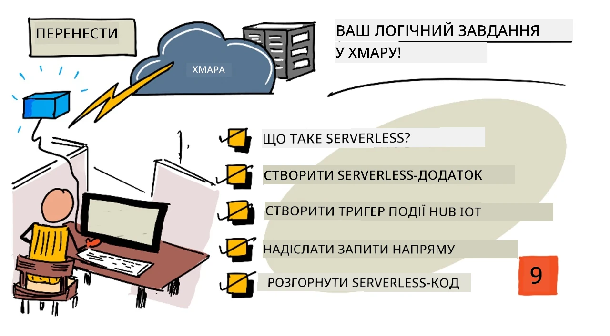
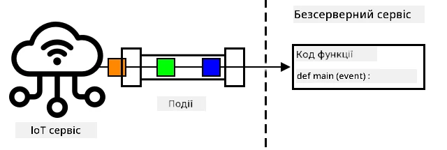
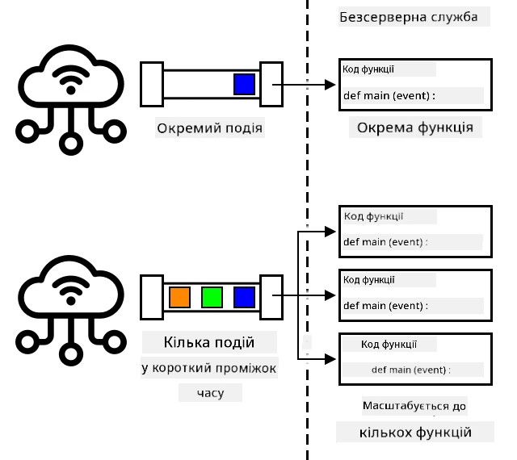
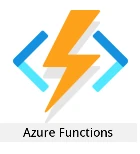
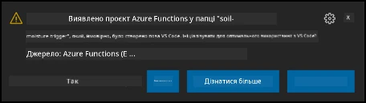

# Перенесіть логіку застосунку в хмару



> Скетчнот від [Nitya Narasimhan](https://github.com/nitya). Натисніть на зображення, щоб побачити його у більшому розмірі.

Цей урок викладався в межах серії [IoT for Beginners Project 2 - Digital Agriculture](https://youtube.com/playlist?list=PLmsFUfdnGr3yCutmcVg6eAUEfsGiFXgcx) від [Microsoft Reactor](https://developer.microsoft.com/reactor/) (відео англійською).

[](https://youtu.be/VVZDcs5u1_I)

> 🎥 У відео використовується стара модель програмування Azure Functions (файли `function.json`). Користуйтеся кодом з уроку: він написаний для нової моделі з декораторами.

## Тест перед лекцією

[Тест перед лекцією](https://black-meadow-040d15503.1.azurestaticapps.net/quiz/17)

## Вступ

У попередньому уроці ви дізналися, як підключити моніторинг вологості ґрунту й керування реле до хмарного IoT-сервісу. Наступний крок — перенести в хмару серверний код, який керує реле. У цьому уроці ви дізнаєтеся, як зробити це за допомогою безсерверних функцій.

> 👩‍🏫 Усі завдання з Azure в цьому уроці показує викладач (демо). Студенти читають теорію й виконують [локальний варіант](local-serverless.md) на своєму комп'ютері, без облікового запису Azure.

У цьому уроці ми розглянемо:

* [Що таке безсерверні обчислення?](#що-таке-безсерверні-обчислення)
* [Створіть безсерверний застосунок](#створіть-безсерверний-застосунок)
* [Створіть тригер на події IoT Hub](#створіть-тригер-на-події-iot-hub)
* [Надсилайте запити прямих методів із безсерверного коду](#надсилайте-запити-прямих-методів-із-безсерверного-коду)
* [Розгорніть безсерверний код у хмарі](#розгорніть-безсерверний-код-у-хмарі)

## Що таке безсерверні обчислення?

Безсерверні обчислення (serverless, serverless computing) — це створення невеликих блоків коду, які запускаються в хмарі у відповідь на різні події. Коли подія стається, запускається ваш код, і йому передаються дані про подію. Події можуть бути найрізноманітнішими: вебзапити, повідомлення в черзі, зміни даних у базі даних або повідомлення, які IoT-пристрої надсилають в IoT-сервіс.



> 💁 Якщо ви колись користувалися тригерами бази даних, це щось подібне: код запускається подією, наприклад вставленням рядка.



Ваш код запускається лише тоді, коли стається подія, а в інший час ніщо не тримає його в пам'яті. Стається подія, код завантажується й виконується. Завдяки цьому безсерверні обчислення дуже добре масштабуються: якщо одночасно стається багато подій, хмарний постачальник може запустити вашу функцію стільки разів, скільки потрібно, одночасно на будь-яких доступних серверах. Зворотний бік — якщо між подіями потрібно передавати інформацію, її доводиться зберігати десь окремо, наприклад у базі даних, а не в пам'яті.

Код пишуть у вигляді функції, яка отримує відомості про подію як параметр. Писати такі безсерверні функції можна багатьма мовами програмування.

> 🎓 Безсерверні обчислення також називають «функції як послуга» (Functions as a service, FaaS), бо кожен тригер події реалізовано як функцію в коді.

Попри назву, безсерверні обчислення все ж використовують сервери. Назва пояснюється тим, що вам як розробнику не треба думати про сервери, на яких працює код: вам важливо лише те, що код запускається у відповідь на подію. Хмарний постачальник має безсерверне *середовище виконання* (runtime), яке виділяє сервери, мережу, сховище, процесор, пам'ять і все інше, що потрібно для роботи коду. За такої моделі неможливо платити за сервер, бо сервера як такого немає. Натомість ви платите за час, протягом якого виконується ваш код, і за обсяг використаної пам'яті.

> 💰 Безсерверні обчислення — один із найдешевших способів запускати код у хмарі. Наприклад, на момент написання оригіналу один хмарний постачальник дозволяв усім вашим безсерверним функціям сумарно виконатися 1 000 000 разів на місяць, перш ніж почати брати плату, а далі брав 0,20 долара США за кожен мільйон виконань. Поки код не виконується, ви не платите.

Для розробника IoT безсерверна модель ідеальна. Можна написати функцію, яка викликається у відповідь на повідомлення від будь-якого IoT-пристрою, підключеного до вашого хмарного IoT-сервісу. Код оброблятиме всі надіслані повідомлення, але працюватиме лише тоді, коли це потрібно.

✅ Згадайте код, який ви писали як серверний код, що слухає повідомлення через MQTT. Як він міг би працювати в хмарі за безсерверною моделлю? Як, на вашу думку, його довелося б змінити?

> 💁 Безсерверна модель поширюється й на інші хмарні сервіси, а не лише на запуск коду. Наприклад, у хмарі є безсерверні бази даних з оплатою за кожен запит до бази, як-от вибірка чи вставлення. Ціна зазвичай залежить від того, скільки роботи потрібно для обробки запиту. Наприклад, вибірка одного рядка за первинним ключем коштуватиме менше, ніж складна операція, яка об'єднує багато таблиць і повертає тисячі рядків.

## Створіть безсерверний застосунок

> 👩‍🏫 Цю частину показує викладач (демо). Студенти виконують [локальний варіант](local-serverless.md).

Сервіс безсерверних обчислень від Microsoft називається Azure Functions.



У короткому відео нижче коротко розповідається про Azure Functions:

[](https://www.youtube.com/watch?v=8-jz5f_JyEQ)

> 🎥 Натисніть на зображення вище, щоб переглянути відео

✅ Приділіть трохи часу дослідженню й прочитайте огляд Azure Functions у [документації Microsoft Azure Functions](https://learn.microsoft.com/azure/azure-functions/functions-overview).

Щоб писати Azure Functions, ви починаєте із застосунку Azure Functions (Functions app) обраною мовою. Azure Functions «з коробки» підтримує Python, JavaScript, TypeScript, C#, F#, Java і PowerShell. У цьому уроці ви дізнаєтеся, як написати застосунок Azure Functions на Python.

> 💁 Azure Functions також підтримує власні обробники (custom handlers), тож функції можна писати будь-якою мовою, що підтримує HTTP-запити, зокрема й старими мовами на кшталт COBOL.

Застосунки Functions складаються з одного чи кількох *тригерів* (triggers) — функцій, що реагують на події. В одному застосунку може бути кілька тригерів зі спільною конфігурацією. Наприклад, у файлі конфігурації застосунку Functions можна вказати дані для підключення до IoT Hub, і всі функції застосунку зможуть використовувати їх, щоб підключатися й слухати події.

### Завдання: встановіть інструменти Azure Functions

> Ранні версії інструментів Azure Functions не працювали з проєктами на Python на Apple Silicon. Якщо у вас Mac з Apple Silicon, встановлюйте найновішу версію Azure Functions Core Tools 4.x.

Одна з чудових можливостей Azure Functions — їх можна запускати локально. Те саме середовище виконання, що працює в хмарі, можна запустити на своєму комп'ютері, тож ви можете писати код, який реагує на IoT-повідомлення, і запускати його локально. Можна навіть налагоджувати код під час обробки подій. Коли код вас влаштовує, його можна розгорнути в хмарі.

Інструменти Azure Functions доступні як CLI під назвою Azure Functions Core Tools.

1. Встановіть Azure Functions Core Tools (версії 4.x) за інструкціями з [документації Azure Functions Core Tools](https://learn.microsoft.com/azure/azure-functions/functions-run-local).

1. Встановіть розширення Azure Functions для VS Code. Воно додає підтримку створення, налагодження й розгортання функцій Azure. Інструкції зі встановлення розширення див. у [документації розширення Azure Functions](https://marketplace.visualstudio.com/items?itemName=ms-azuretools.vscode-azurefunctions).

Коли застосунок Azure Functions розгорнуто в хмарі, йому потрібен невеликий обсяг хмарного сховища для файлів застосунку, журналів тощо. Під час локального запуску застосунку Functions підключення до хмарного сховища теж потрібне, але замість справжнього хмарного сховища можна використовувати емулятор сховища [Azurite](https://github.com/Azure/Azurite). Він працює локально, але поводиться як хмарне сховище.

> 🎓 В Azure сховищем для Azure Functions є обліковий запис сховища Azure (Azure Storage Account). У ньому можна зберігати файли, великі двійкові об'єкти (blobs), дані в таблицях або в чергах. Один обліковий запис сховища можна використовувати для кількох застосунків, наприклад для застосунку Functions і вебзастосунку.

1. Azurite — це застосунок на Node.js, тому потрібно встановити Node.js. Інструкції зі завантаження й встановлення є на [сайті Node.js](https://nodejs.org/). Якщо у вас Mac, Node.js можна також встановити через [Homebrew](https://formulae.brew.sh/formula/node).

1. Встановіть Azurite такою командою (`npm` — інструмент, який встановлюється разом із Node.js):

    ```sh
    npm install -g azurite
    ```

1. Створіть папку `azurite`, у якій Azurite зберігатиме дані:

    ```sh
    mkdir azurite
    ```

1. Запустіть Azurite, передавши йому цю нову папку:

    ```sh
    azurite --location azurite
    ```

    Емулятор сховища Azurite запуститься й буде готовий до підключення локального середовища виконання Functions.

    ```output
    ➜  ~ azurite --location azurite  
    Azurite Blob service is starting at http://127.0.0.1:10000
    Azurite Blob service is successfully listening at http://127.0.0.1:10000
    Azurite Queue service is starting at http://127.0.0.1:10001
    Azurite Queue service is successfully listening at http://127.0.0.1:10001
    Azurite Table service is starting at http://127.0.0.1:10002
    Azurite Table service is successfully listening at http://127.0.0.1:10002
    ```

### Завдання: створіть проєкт Azure Functions

Новий застосунок Functions можна створити за допомогою CLI Azure Functions.

1. Створіть папку для застосунку Functions з назвою `soil-moisture-trigger` і перейдіть у неї:

    ```sh
    mkdir soil-moisture-trigger
    cd soil-moisture-trigger
    ```

1. Створіть у цій папці віртуальне середовище Python. Для застосунку Functions потрібен **Python 3.12**: цю версію Azure Functions підтримує і в хмарі, а бібліотека `azure-iot-hub`, яка знадобиться далі, на Python 3.14 не встановлюється.

    * У Windows:

        ```cmd
        py -3.12 -m venv .venv
        ```

    * У macOS або Linux:

        ```sh
        python3.12 -m venv .venv
        ```

1. Активуйте віртуальне середовище:

    * У Windows:
        * Якщо ви використовуєте командний рядок (Command Prompt), зокрема через Windows Terminal, виконайте:

            ```cmd
            .venv\Scripts\activate.bat
            ```

        * Якщо ви використовуєте PowerShell, виконайте:

            ```powershell
            .\.venv\Scripts\Activate.ps1
            ```

    * У macOS або Linux виконайте:

        ```cmd
        source ./.venv/bin/activate
        ```

    > 💁 Ці команди треба виконувати з тієї самої папки, де ви створювали віртуальне середовище. Заходити в папку `.venv` ніколи не потрібно: активуйте середовище, встановлюйте пакети й запускайте код з папки, у якій ви були під час його створення.

1. Виконайте таку команду, щоб створити в цій папці застосунок Functions:

    ```sh
    func init --worker-runtime python --model V2
    ```

    `--model V2` вибирає модель програмування Python v2, у якій функції описують декораторами прямо в коді Python. У новіших версіях Core Tools це модель за замовчуванням.

    У поточній папці буде створено кілька файлів, зокрема:

    * `function_app.py` — файл Python, у якому міститимуться всі функції застосунку. Поки що в ньому лише створюється об'єкт застосунку `app`.
    * `host.json` — JSON-документ з налаштуваннями застосунку Functions. Змінювати ці налаштування не потрібно.
    * `local.settings.json` — JSON-документ з налаштуваннями, які застосунок використовує під час локального запуску, наприклад рядками підключення до IoT Hub. Ці налаштування лише локальні, і їх не слід додавати в систему керування версіями. Під час розгортання застосунку в хмарі ці налаштування не розгортаються: натомість налаштування завантажуються з параметрів застосунку (application settings). Про це йтиметься далі в цьому уроці.
    * `requirements.txt` — [файл залежностей pip](https://pip.pypa.io/en/stable/user_guide/#requirements-files) з пакетами pip, потрібними для роботи застосунку Functions.

1. У файлі `local.settings.json` є налаштування облікового запису сховища, який використовуватиме застосунок Functions. За замовчуванням воно порожнє, тому його потрібно заповнити. Щоб підключитися до локального емулятора сховища Azurite, вкажіть таке значення:

    ```json
    "AzureWebJobsStorage": "UseDevelopmentStorage=true",
    ```

1. Встановіть потрібні пакети pip з файлу залежностей:

    ```sh
    pip install -r requirements.txt
    ```

    > 💁 Потрібні пакети pip мають бути в цьому файлі, щоб під час розгортання застосунку Functions у хмарі середовище виконання встановило правильні пакети.

1. Щоб перевірити, що все працює правильно, можна запустити середовище виконання Functions. Виконайте для цього таку команду:

    ```sh
    func start
    ```

    Середовище виконання запуститься й повідомить, що не знайшло жодної функції (тригера).

    ```output
    (.venv) ➜  soil-moisture-trigger func start
    Found Python version 3.12.x (python3).

    Azure Functions Core Tools
    Core Tools Version:       4.x
    Function Runtime Version: 4.x

    [2021-05-05T01:24:46.795Z] No job functions found.
    ```

    > ⚠️ Якщо з'явиться сповіщення брандмауера, надайте доступ, бо застосунку `func` потрібно читати й записувати дані в мережі.

    > ⚠️ У macOS у виводі можуть з'явитися попередження:
    >
    > ```output
    > (.venv) ➜  soil-moisture-trigger func start
    > Found Python version 3.12.x (python3).
    >
    > Azure Functions Core Tools
    > Core Tools Version:       4.x
    > Function Runtime Version: 4.x
    >
    > [2021-06-16T08:18:28.315Z] Cannot create directory for shared memory usage: /dev/shm/AzureFunctions
    > [2021-06-16T08:18:28.316Z] System.IO.FileSystem: Access to the path '/dev/shm/AzureFunctions' is denied. Operation not permitted.
    > [2021-06-16T08:18:30.361Z] No job functions found.
    > ```
    >
    > Їх можна ігнорувати, якщо застосунок Functions запускається правильно й показує список запущених функцій. Як зазначено в [цьому питанні на Microsoft Q&A](https://learn.microsoft.com/answers/questions/396617/azure-functions-core-tools-error-osx-devshmazurefu.html), ці попередження можна ігнорувати.

1. Зупиніть застосунок Functions, натиснувши `ctrl+c`.

1. Відкрийте поточну папку у VS Code: або відкрийте VS Code, а потім цю папку, або виконайте таку команду:

    ```sh
    code .
    ```

    VS Code виявить проєкт Functions і покаже сповіщення:

    ```output
    Detected an Azure Functions Project in folder "soil-moisture-trigger" that may have been created outside of
    VS Code. Initialize for optimal use with VS Code?
    ```

    

    Виберіть у цьому сповіщенні **Yes**.

1. Переконайтеся, що в терміналі VS Code активовано віртуальне середовище Python. За потреби закрийте термінал і відкрийте його знову.

## Створіть тригер на події IoT Hub

> 👩‍🏫 Цю частину показує викладач (демо). Студенти виконують [локальний варіант](local-serverless.md).

Застосунок Functions — це оболонка для вашого безсерверного коду. Щоб реагувати на події IoT Hub, до цього застосунку можна додати тригер IoT Hub. Цей тригер має підключитися до потоку повідомлень, що надсилаються в IoT Hub, і реагувати на них. Щоб отримати цей потік повідомлень, тригер має підключитися до *кінцевої точки IoT Hub, сумісної з Event Hubs* (event hub compatible endpoint).

IoT Hub побудовано на іншому сервісі Azure — Azure Event Hubs. Event Hubs — сервіс, який дозволяє надсилати й отримувати повідомлення, а IoT Hub розширює його можливостями для IoT-пристроїв. Читати повідомлення з IoT Hub потрібно так само, як і з Event Hubs.

✅ Проведіть невелике дослідження: прочитайте огляд Event Hubs у [документації Azure Event Hubs](https://learn.microsoft.com/azure/event-hubs/event-hubs-about). Як основні можливості Event Hubs порівнюються з IoT Hub?

Щоб IoT-пристрій міг підключитися до IoT Hub, він має використовувати секретний ключ, який гарантує, що підключатися можуть лише дозволені пристрої. Те саме стосується й читання повідомлень: вашому коду потрібен рядок підключення із секретним ключем і відомостями про IoT Hub.

> 💁 Рядок підключення, який ви отримуєте за замовчуванням, має дозволи **iothubowner**, тобто будь-який код, що його використовує, отримує повні права на IoT Hub. В ідеалі варто підключатися з мінімальним рівнем дозволів, який потрібен. Про це йтиметься в наступному уроці.

Щойно тригер підключиться, код усередині функції викликатиметься для кожного повідомлення, надісланого в IoT Hub, незалежно від того, який пристрій його надіслав. Тригер отримуватиме повідомлення як параметр.

### Завдання: отримайте рядок підключення до кінцевої точки, сумісної з Event Hubs

1. Виконайте в терміналі VS Code таку команду, щоб отримати рядок підключення до кінцевої точки IoT Hub, сумісної з Event Hubs:

    ```sh
    az iot hub connection-string show --default-eventhub \
                                      --output table \
                                      --hub-name <hub_name>
    ```

    Замініть `<hub_name>` на назву свого IoT Hub.

1. Відкрийте у VS Code файл `local.settings.json`. Додайте в розділ `Values` таке значення:

    ```json
    "IOT_HUB_CONNECTION_STRING": "<connection string>"
    ```

    Замініть `<connection string>` на значення з попереднього кроку. Щоб JSON залишився правильним, після попереднього рядка потрібно поставити кому.

### Завдання: створіть тригер подій

Тепер можна створити тригер подій.

1. Відкрийте у VS Code файл `function_app.py`. Переконайтеся, що на початку файлу є такі імпорти й рядок, який створює застосунок, і додайте їх, якщо чогось бракує:

    ```python
    import logging

    import azure.functions as func

    app = func.FunctionApp()
    ```

1. Додайте в кінець файлу таку функцію:

    ```python
    @app.function_name(name='iot-hub-trigger')
    @app.event_hub_message_trigger(arg_name='event',
                                   event_hub_name='',
                                   connection='IOT_HUB_CONNECTION_STRING',
                                   cardinality=func.Cardinality.ONE)
    def iot_hub_trigger(event: func.EventHubEvent):
        logging.info('Python EventHub trigger processed an event: %s',
                     event.get_body().decode('utf-8'))
    ```

    Це створює нову функцію з назвою `iot-hub-trigger`. Тригер підключатиметься до кінцевої точки IoT Hub, сумісної з Event Hubs, тому можна використати тригер Event Hub. Окремого тригера саме для IoT Hub немає.

    Серце тригера — функція `iot_hub_trigger`. Саме її викликають із подіями з IoT Hub. Вона має параметр `event` типу `EventHubEvent`. Щоразу, коли в IoT Hub надходить повідомлення, ця функція викликається, і їй передається це повідомлення як `event` разом із властивостями, що збігаються з анотаціями, які ви бачили в попередньому уроці.

    Поки що функція лише записує подію в журнал.

    Декоратори над функцією описують її налаштування. У старій моделі програмування ці налаштування зберігалися в окремому файлі `function.json`, а тепер вони записуються прямо в коді. Основні налаштування — це *прив'язки* (bindings). Прив'язка — термін для з'єднання між Azure Functions та іншими сервісами Azure. Ця функція має вхідну прив'язку (input binding) до Event Hub: вона підключається до Event Hub і отримує з нього дані.

    > 💁 Бувають і вихідні прив'язки (output bindings), коли результат функції надсилається в інший сервіс. Наприклад, можна додати вихідну прив'язку до бази даних і повертати з функції подію IoT Hub, і її буде автоматично вставлено в базу даних.

    ✅ Проведіть невелике дослідження: прочитайте про прив'язки в [документації про тригери й прив'язки Azure Functions](https://learn.microsoft.com/azure/azure-functions/functions-triggers-bindings?tabs=python).

    Ось що означають параметри декораторів:

    * `@app.function_name(name='iot-hub-trigger')` — назва функції, під якою її показуватимуть середовище виконання й Azure.
    * `@app.event_hub_message_trigger` — функція слухає події з Event Hub.
    * `arg_name='event'` — назва параметра для подій Event Hub. Вона збігається з назвою параметра функції `iot_hub_trigger` у коді Python.
    * `connection='IOT_HUB_CONNECTION_STRING'` — назва налаштування, з якого читається рядок підключення. Під час локального запуску це налаштування читається з файлу `local.settings.json`.

        > 💁 Пам'ятайте: тут вказано назву налаштування, а не сам рядок підключення. Рядок підключення не можна записувати в код, його треба читати з налаштувань. Так ви випадково не розкриєте свій рядок підключення.

    * `event_hub_name=''` — порожня назва Event Hub. Рядок підключення вже містить назву Event Hub (`EntityPath`), тому тут її потрібно залишити порожньою.
    * `cardinality=func.Cardinality.ONE` — функція отримує події по одній, а не списком.

### Завдання: запустіть тригер подій

1. Переконайтеся, що монітор подій IoT Hub не запущено. Якщо він працюватиме одночасно із застосунком Functions, застосунок Functions не зможе підключитися й отримувати події.

    > 💁 Кілька застосунків можуть підключатися до кінцевих точок IoT Hub через різні *групи споживачів* (consumer groups). Про них ідеться в одному з наступних уроків.

1. Щоб запустити застосунок Functions, виконайте в терміналі VS Code таку команду:

    ```sh
    func start
    ```

    Застосунок Functions запуститься й виявить функцію `iot-hub-trigger`. Потім він обробить усі події, надіслані в IoT Hub за минулу добу.

    ```output
    (.venv) ➜  soil-moisture-trigger func start
    Found Python version 3.12.x (python3).

    Azure Functions Core Tools
    Core Tools Version:       4.x
    Function Runtime Version: 4.x

    Functions:

            iot-hub-trigger: eventHubTrigger

    For detailed output, run func with --verbose flag.
    [2021-05-05T02:44:07.517Z] Worker process started and initialized.
    [2021-05-05T02:44:09.202Z] Executing 'Functions.iot-hub-trigger' (Reason='(null)', Id=802803a5-eae9-4401-a1f4-176631456ce4)
    [2021-05-05T02:44:09.205Z] Trigger Details: PartitionId: 0, Offset: 1011240-1011632, EnqueueTimeUtc: 2021-05-04T19:04:04.2030000Z-2021-05-04T19:04:04.3900000Z, SequenceNumber: 2546-2547, Count: 2
    [2021-05-05T02:44:09.352Z] Python EventHub trigger processed an event: {"soil_moisture":628}
    [2021-05-05T02:44:09.354Z] Python EventHub trigger processed an event: {"soil_moisture":624}
    [2021-05-05T02:44:09.395Z] Executed 'Functions.iot-hub-trigger' (Succeeded, Id=802803a5-eae9-4401-a1f4-176631456ce4, Duration=245ms)
    ```

    Кожен виклик функції обрамлено блоком `Executing 'Functions.iot-hub-trigger'`/`Executed 'Functions.iot-hub-trigger'`, тож видно, скільки повідомлень оброблено за кожен виклик.

1. Переконайтеся, що IoT-пристрій працює. У застосунку Functions з'являтимуться нові повідомлення про вологість ґрунту.

1. Зупиніть і знову запустіть застосунок Functions. Ви побачите, що попередні повідомлення повторно не обробляються: обробляються лише нові.

> 💁 VS Code також підтримує налагодження функцій. Точки зупину можна ставити, клацнувши на полі біля початку рядка коду, або поставивши курсор на рядок і вибравши *Run -> Toggle breakpoint*, або натиснувши `F9`. Запустити налагоджувач можна через *Run -> Start debugging*, клавішею `F5` або кнопкою **Start debugging** на панелі *Run and debug*. Так можна побачити подробиці подій, що обробляються.

#### Усунення несправностей

* Якщо ви отримали таку помилку:

    ```output
    The listener for function 'Functions.iot-hub-trigger' was unable to start. Microsoft.WindowsAzure.Storage: Connection refused. System.Net.Http: Connection refused. System.Private.CoreLib: Connection refused.
    ```

    Перевірте, що Azurite запущено і що у файлі `local.settings.json` для `AzureWebJobsStorage` вказано `UseDevelopmentStorage=true`.

* Якщо ви отримали таку помилку:

    ```output
    System.Private.CoreLib: Exception while executing function: Functions.iot-hub-trigger. System.Private.CoreLib: Result: Failure Exception: AttributeError: 'list' object has no attribute 'get_body'
    ```

    Перевірте, що в декораторі `event_hub_message_trigger` вказано `cardinality=func.Cardinality.ONE`.

* Якщо ви отримали таку помилку:

    ```output
    Azure.Messaging.EventHubs: The path to an Event Hub may be specified as part of the connection string or as a separate value, but not both.  Please verify that your connection string does not have the `EntityPath` token if you are passing an explicit Event Hub name. (Parameter 'connectionString').
    ```

    Перевірте, що в декораторі `event_hub_message_trigger` вказано порожню назву: `event_hub_name=''`.

* Якщо застосунок пише `No job functions found`, хоча функцію додано, перевірте, що у файлі `function_app.py` немає помилок (наприклад, запустіть `python function_app.py` і подивіться, чи немає помилок імпорту). Для старіших версій Core Tools також додайте в розділ `Values` файлу `local.settings.json` рядок `"AzureWebJobsFeatureFlags": "EnableWorkerIndexing"`.

## Надсилайте запити прямих методів із безсерверного коду

> 👩‍🏫 Цю частину показує викладач (демо). Студенти виконують [локальний варіант](local-serverless.md).

Поки що застосунок Functions слухає повідомлення з IoT Hub через кінцеву точку, сумісну з Event Hubs. Тепер потрібно надсилати команди на IoT-пристрій. Для цього використовують інше підключення до IoT Hub — через *диспетчер реєстру* (Registry Manager). Диспетчер реєстру — інструмент, за допомогою якого можна побачити, які пристрої зареєстровано в IoT Hub, і обмінюватися з ними даними: надсилати повідомлення «хмара — пристрій», запити прямих методів або оновлювати двійник пристрою. За його допомогою також можна реєструвати, оновлювати чи видаляти IoT-пристрої в IoT Hub.

Щоб підключитися до диспетчера реєстру, потрібен рядок підключення.

### Завдання: отримайте рядок підключення до диспетчера реєстру

1. Щоб отримати рядок підключення, виконайте таку команду:

    ```sh
    az iot hub connection-string show --policy-name service \
                                      --output table \
                                      --hub-name <hub_name>
    ```

    Замініть `<hub_name>` на назву свого IoT Hub.

    Параметр `--policy-name service` запитує рядок підключення для політики *ServiceConnect*. Запитуючи рядок підключення, можна вказати, які дозволи він надаватиме. Політика ServiceConnect дозволяє вашому коду підключатися й надсилати повідомлення на IoT-пристрої.

    ✅ Проведіть невелике дослідження: прочитайте про різні політики в [документації про дозволи IoT Hub](https://learn.microsoft.com/azure/iot-hub/iot-hub-devguide-security#iot-hub-permissions).

1. Відкрийте у VS Code файл `local.settings.json`. Додайте в розділ `Values` таке значення:

    ```json
    "REGISTRY_MANAGER_CONNECTION_STRING": "<connection string>"
    ```

    Замініть `<connection string>` на значення з попереднього кроку. Щоб JSON залишився правильним, після попереднього рядка потрібно поставити кому.

### Завдання: надішліть запит прямого методу на пристрій

1. SDK для диспетчера реєстру доступний як пакет pip. Додайте у файл `requirements.txt` такі рядки, щоб додати залежність від цього пакета:

    ```sh
    azure-iot-hub
    six
    ```

    > 💁 Пакет `azure-iot-hub` використовує бібліотеку `six`, але сам її не встановлює, тому її потрібно вказати окремо. Без неї імпорт `azure.iot.hub` завершиться помилкою `No module named 'six'`.

1. Переконайтеся, що в терміналі VS Code активовано віртуальне середовище, і виконайте таку команду, щоб встановити пакети pip:

    ```sh
    pip install -r requirements.txt
    ```

1. Додайте у файл `function_app.py`, до наявних імпортів, такі імпорти:

    ```python
    import json
    import os

    from azure.iot.hub import IoTHubRegistryManager
    from azure.iot.hub.models import CloudToDeviceMethod
    ```

    Цей код імпортує кілька системних бібліотек, а також бібліотеки для роботи з диспетчером реєстру й надсилання запитів прямих методів.

1. Видаліть код усередині функції `iot_hub_trigger`, але залиште саму функцію та її декоратори.

1. Додайте у функцію `iot_hub_trigger` такий код:

    ```python
    body = json.loads(event.get_body().decode('utf-8'))
    device_id = event.iothub_metadata['connection-device-id']

    logging.info(f'Отримано повідомлення: {body} від {device_id}')
    ```

    Цей код отримує тіло події, яке містить JSON-повідомлення, надіслане IoT-пристроєм.

    Потім він отримує ідентифікатор пристрою з анотацій, переданих разом із повідомленням. Тіло події містить повідомлення, надіслане як телеметрія, а словник `iothub_metadata` містить властивості, встановлені IoT Hub, як-от ідентифікатор пристрою-відправника й час надсилання повідомлення.

    Ця інформація записується в журнал. Під час локального запуску застосунку Functions ви бачитимете ці записи в терміналі.

1. Під цим кодом додайте такий код:

    ```python
    soil_moisture = body['soil_moisture']

    if soil_moisture > 450:
        direct_method = CloudToDeviceMethod(method_name='relay_on', payload='{}')
    else:
        direct_method = CloudToDeviceMethod(method_name='relay_off', payload='{}')
    ```

    Цей код отримує з повідомлення значення вологості ґрунту. Потім він перевіряє це значення й залежно від нього створює допоміжний об'єкт для запиту прямого методу `relay_on` або `relay_off`. Запиту методу корисне навантаження не потрібне, тому надсилається порожній JSON-документ.

1. Під цим кодом додайте такий код:

    ```python
    logging.info(f'Надсилаю запит прямого методу {direct_method.method_name} на пристрій {device_id}')

    registry_manager_connection_string = os.environ['REGISTRY_MANAGER_CONNECTION_STRING']
    registry_manager = IoTHubRegistryManager.from_connection_string(registry_manager_connection_string)
    ```

    Цей код завантажує `REGISTRY_MANAGER_CONNECTION_STRING` з файлу `local.settings.json`. Значення з цього файлу доступні як змінні середовища, і їх можна прочитати через `os.environ` — словник з усіма змінними середовища.

    > 💁 Коли цей код розгорнуто в хмарі, значення з файлу `local.settings.json` задаються як *параметри застосунку* (Application Settings), і їх теж можна читати зі змінних середовища.

    Потім код створює екземпляр допоміжного класу диспетчера реєстру за допомогою рядка підключення.

1. Під цим кодом додайте такий код:

    ```python
    registry_manager.invoke_device_method(device_id, direct_method)

    logging.info('Запит прямого методу надіслано!')
    ```

    Цей код просить диспетчер реєстру надіслати запит прямого методу на пристрій, який надіслав телеметрію.

    > 💁 У версіях застосунку з попередніх уроків, що працювали через MQTT, команди керування реле надсилалися всім пристроям. Код припускав, що пристрій лише один. Ця версія коду надсилає запит методу конкретному пристрою, тож працюватиме й тоді, коли у вас кілька комплектів сенсорів вологості й реле: кожен пристрій отримуватиме правильний запит прямого методу.

1. Запустіть застосунок Functions і переконайтеся, що IoT-пристрій надсилає дані. Ви побачите, як обробляються повідомлення й надсилаються запити прямих методів. Змінюйте вологість ґрунту (на віртуальному пристрої — у CounterFit, на справжньому — виймаючи сенсор із ґрунту й встромляючи назад) і дивіться, як змінюються значення, а реле вмикається й вимикається.

> 💁 Цей код є в папці [code/functions](code/functions).

## Розгорніть безсерверний код у хмарі

> 👩‍🏫 Цю частину показує викладач (демо). Студенти виконують [локальний варіант](local-serverless.md).

Ваш код працює локально, тож наступний крок — розгорнути застосунок Functions у хмарі.

### Завдання: створіть хмарні ресурси

Застосунок Functions потрібно розгорнути в ресурсі Functions App в Azure, у тій самій групі ресурсів, де ви створили IoT Hub. Також потрібен обліковий запис сховища Azure замість емульованого, який працює у вас локально.

1. Виконайте таку команду, щоб створити обліковий запис сховища:

    ```sh
    az storage account create --resource-group soil-moisture-sensor \
                              --sku Standard_LRS \
                              --name <storage_name> 
    ```

    Замініть `<storage_name>` на назву свого облікового запису сховища. Вона має бути глобально унікальною, бо стає частиною URL-адреси для доступу до облікового запису сховища. У назві можна використовувати лише малі латинські літери й цифри, без інших символів, і вона має бути не довшою за 24 символи. Використайте щось на кшталт `sms` і додайте в кінці унікальний ідентифікатор, наприклад кілька випадкових слів чи своє ім'я.

    `--sku Standard_LRS` вибирає ціновий рівень — найдешевший обліковий запис загального призначення. Безкоштовного рівня сховища немає: ви платите за те, що використовуєте. Витрати відносно невеликі: найдорожче сховище коштує менше ніж 0,05 долара США на місяць за гігабайт.

    ✅ Прочитайте про ціни на [сторінці цін на облікові записи сховища Azure](https://azure.microsoft.com/pricing/details/storage/).

1. Виконайте таку команду, щоб створити застосунок Functions:

    ```sh
    az functionapp create --resource-group soil-moisture-sensor \
                          --runtime python \
                          --runtime-version 3.12 \
                          --functions-version 4 \
                          --os-type Linux \
                          --consumption-plan-location <location> \
                          --storage-account <storage_name> \
                          --name <functions_app_name>
    ```

    Замініть `<location>` на розташування, яке ви використали під час створення групи ресурсів у попередньому уроці.

    Замініть `<storage_name>` на назву облікового запису сховища, який ви створили на попередньому кроці.

    Замініть `<functions_app_name>` на унікальну назву свого застосунку Functions. Вона має бути глобально унікальною, бо стає частиною URL-адреси, за якою можна звертатися до застосунку Functions. Використайте щось на кшталт `soil-moisture-sensor-` і додайте в кінці унікальний ідентифікатор, наприклад кілька випадкових слів чи своє ім'я.

    Параметр `--runtime-version 3.12` задає версію Python, ту саму, що й у вашому локальному віртуальному середовищі.

    Параметр `--functions-version 4` задає версію Azure Functions. Версія 4 — поточна; старіші версії більше не підтримуються.

    Параметр `--os-type Linux` вказує середовищу виконання Functions використовувати Linux як ОС для цих функцій. Функції можна розміщувати на Linux або Windows залежно від мови програмування. Застосунки на Python підтримуються лише на Linux.

    > 👩‍🏫 Для нових застосунків Microsoft радить план Flex Consumption замість Linux Consumption. Якщо команда вище поверне помилку щодо плану або регіону, створіть застосунок у плані Flex Consumption: замість `--consumption-plan-location <location>` вкажіть `--flexconsumption-location <location>` (докладніше в [документації про план Flex Consumption](https://learn.microsoft.com/azure/azure-functions/flex-consumption-plan)).

### Завдання: завантажте параметри застосунку

Під час розробки застосунку Functions ви зберігали деякі налаштування (рядки підключення до IoT Hub) у файлі `local.settings.json`. Їх потрібно записати в параметри застосунку (Application Settings) вашого Functions App в Azure, щоб їх міг використовувати ваш код.

> 🎓 Файл `local.settings.json` призначений лише для налаштувань локальної розробки, і його не слід додавати в систему керування версіями, як-от GitHub. Після розгортання в хмарі використовуються параметри застосунку. Параметри застосунку — це пари «ключ — значення», що зберігаються в хмарі й читаються зі змінних середовища або у вашому коді, або середовищем виконання, коли воно підключає ваш код до IoT Hub.

1. Виконайте таку команду, щоб задати параметр `IOT_HUB_CONNECTION_STRING` у параметрах застосунку Functions App:

    ```sh
    az functionapp config appsettings set --resource-group soil-moisture-sensor \
                                          --name <functions_app_name> \
                                          --settings "IOT_HUB_CONNECTION_STRING=<connection string>"
    ```

    Замініть `<functions_app_name>` на назву свого застосунку Functions.

    Замініть `<connection string>` на значення `IOT_HUB_CONNECTION_STRING` з файлу `local.settings.json`.

1. Повторіть попередній крок, але задайте значення `REGISTRY_MANAGER_CONNECTION_STRING` з відповідного значення у файлі `local.settings.json`.

Ці команди також виводять список усіх параметрів застосунку Functions. За ним можна перевірити, що значення задано правильно.

> 💁 Ви побачите, що вже задано значення для `AzureWebJobsStorage`. У файлі `local.settings.json` воно вказувало на локальний емулятор сховища. Під час створення Functions App ви передали обліковий запис сховища як параметр, і це налаштування задалося автоматично.

### Завдання: розгорніть застосунок Functions у хмарі

Тепер, коли Functions App готовий, можна розгорнути код.

1. Виконайте в терміналі VS Code таку команду, щоб опублікувати застосунок Functions:

    ```sh
    func azure functionapp publish <functions_app_name>
    ```

    Замініть `<functions_app_name>` на назву свого застосунку Functions.

Код буде запаковано й надіслано в Functions App, де його буде розгорнуто й запущено. У консолі з'явиться багато повідомлень, а наприкінці — підтвердження розгортання й список розгорнутих функцій. У цьому випадку в списку буде лише тригер.

```output
Deployment successful.
Remote build succeeded!
Syncing triggers...
Functions in soil-moisture-sensor:
    iot-hub-trigger - [eventHubTrigger]
```

Переконайтеся, що IoT-пристрій працює. Змінюйте рівень вологості, змінюючи значення в CounterFit або виймаючи сенсор із ґрунту й встромляючи назад. Ви побачите, що реле вмикається й вимикається залежно від вологості ґрунту.

## Локальний варіант для студентів

Виконайте [локальний варіант уроку](local-serverless.md): ви запустите ту саму «безсерверну» логіку як звичайну функцію Python, яку викликає підписник MQTT на вашому комп'ютері.

---

## 🚀 Виклик

У попередньому уроці ви керували часом роботи реле, відписуючись від повідомлень MQTT, поки реле було ввімкнене, і ще деякий час після його вимкнення. Тут так не вийде: від тригера IoT Hub відписатися неможливо.

Подумайте, як інакше можна розв'язати цю задачу в застосунку Functions.

## Тест після лекції

[Тест після лекції](https://black-meadow-040d15503.1.azurestaticapps.net/quiz/18)

## Огляд і самостійне навчання

* Прочитайте про безсерверні обчислення на [сторінці Serverless Computing у Вікіпедії](https://wikipedia.org/wiki/Serverless_computing).
* Прочитайте про використання безсерверних обчислень в Azure, зокрема інші приклади, у дописі [Go serverless for your IoT needs](https://azure.microsoft.com/blog/go-serverless-for-your-iot-needs/) в блозі Azure.
* Дізнайтеся більше про Azure Functions на [YouTube-каналі Azure Functions](https://www.youtube.com/c/AzureFunctions).
* Модель програмування Python v2 детально описано в [посібнику розробника Azure Functions для Python](https://learn.microsoft.com/azure/azure-functions/functions-reference-python).

## Завдання

[Додайте ручне керування реле](assignment.md)

---

> **Про цю версію.** Урок адаптовано українською на основі курсу [IoT for Beginners](https://github.com/microsoft/IoT-For-Beginners) від Microsoft (ліцензія MIT). Порівняно з оригіналом код Azure Functions переписано на модель програмування Python v2 (`function_app.py` з декораторами замість `function.json`), Python 3.12 і Functions 4.x, у залежності додано `six`, завдання з Azure стали демонстрацією викладача, а для студентів додано [локальний варіант](local-serverless.md) без облікового запису Azure.
