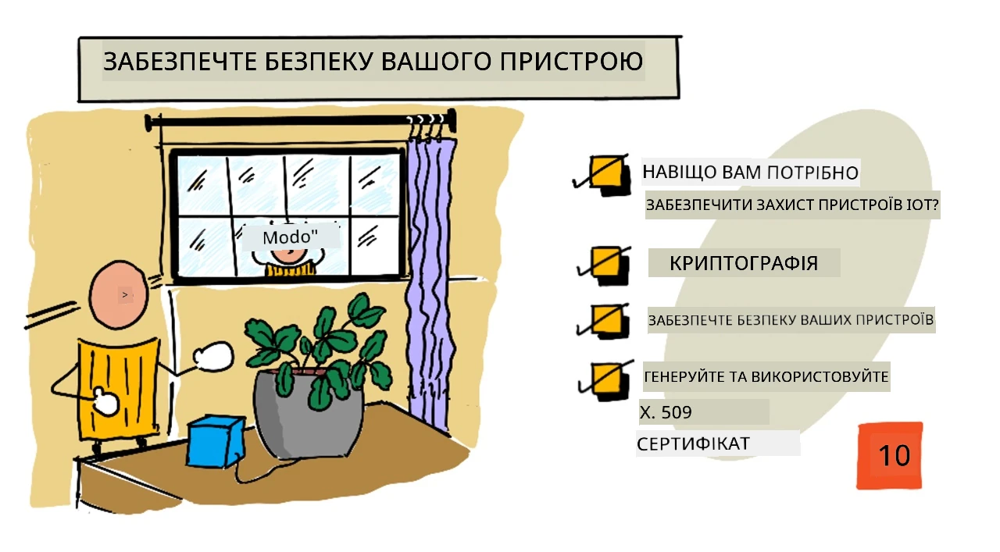
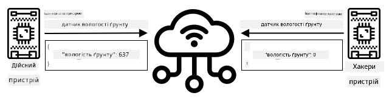
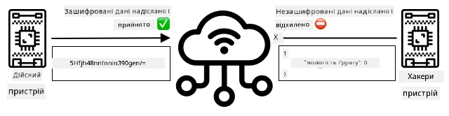
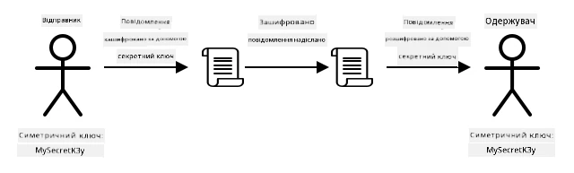
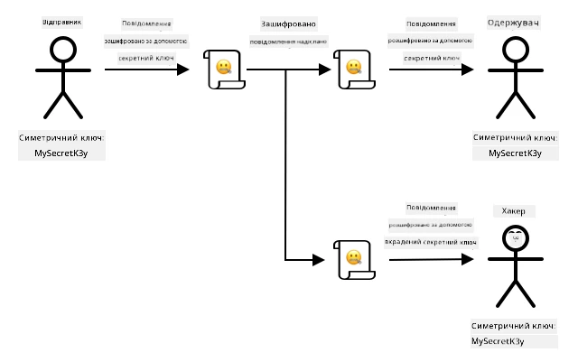
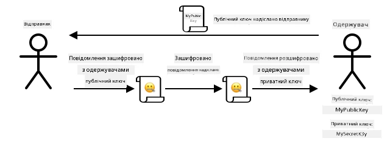
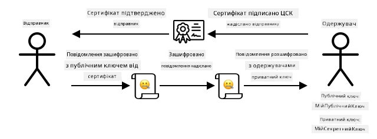

# Захистіть свою рослину



> Скетчнот від [Nitya Narasimhan](https://github.com/nitya). Натисніть на зображення, щоб побачити його у більшому розмірі.

## Тест перед лекцією

[Тест перед лекцією](https://black-meadow-040d15503.1.azurestaticapps.net/quiz/19)

## Вступ

У кількох попередніх уроках ви створили IoT-пристрій для моніторингу ґрунту й підключили його до хмари. Але що, як хакери, які працюють на фермера-конкурента, захоплять контроль над вашими IoT-пристроями? Що, як вони надсилатимуть високі показники вологості ґрунту, щоб ваші рослини ніколи не поливалися, або ввімкнуть систему поливу назавжди, і рослини загинуть від перезволоження, а вам доведеться заплатити чималі гроші за воду?

У цьому уроці ви дізнаєтеся, як захищати IoT-пристрої. Оскільки це останній урок цього проєкту, ви також дізнаєтеся, як прибрати за собою хмарні ресурси, щоб уникнути можливих витрат.

> 👩‍🏫 Підключення до IoT Hub за сертифікатом X.509 показує викладач (демо). Студенти читають теорію й виконують [локальний варіант](local-x509.md): створюють ключі й сертифікат X.509 на своєму комп'ютері за допомогою OpenSSL.

У цьому уроці ми розглянемо:

* [Навіщо захищати IoT-пристрої?](#навіщо-захищати-iot-пристрої)
* [Криптографія](#криптографія)
* [Захистіть свої IoT-пристрої](#захистіть-свої-iot-пристрої)
* [Створіть і використайте сертифікат X.509](#створіть-і-використайте-сертифікат-x509)

> 🗑 Це останній урок у цьому проєкті, тож після завершення уроку й завдання не забудьте прибрати за собою хмарні сервіси. Вони знадобляться для виконання завдання, тому спершу виконайте його.
>
> За потреби інструкції з прибирання дивіться в [посібнику з прибирання проєкту](https://github.com/microsoft/IoT-For-Beginners/blob/main/clean-up.md) (ще не адаптовано, оригінал англійською).

## Навіщо захищати IoT-пристрої?

Безпека IoT полягає в тому, щоб лише очікувані пристрої могли підключатися до вашого хмарного IoT-сервісу й надсилати йому телеметрію, і лише ваш хмарний сервіс міг надсилати команди вашим пристроям. Дані IoT також можуть бути особистими, зокрема медичними чи інтимними, тож безпеку треба враховувати в усьому застосунку, щоб ці дані не витекли.

Якщо IoT-застосунок не захищено, є низка ризиків:

* Підроблений пристрій може надсилати неправильні дані, і застосунок реагуватиме на них неправильно. Наприклад, він може постійно надсилати високі показники вологості ґрунту, тож система зрошення ніколи не ввімкнеться, і рослини загинуть від нестачі води.
* Сторонні користувачі можуть читати дані з IoT-пристроїв, зокрема особисті чи критично важливі для бізнесу.
* Хакери можуть надсилати команди, що керують пристроєм так, що це може пошкодити сам пристрій або під'єднане обладнання.
* Підключившись до IoT-пристрою, хакери можуть отримати доступ до інших мереж, а через них і до приватних систем.
* Зловмисники можуть отримати доступ до особистих даних і використати їх для шантажу.

Це реальні сценарії, і таке стається постійно. Кілька прикладів наводилося в попередніх уроках, а ось ще кілька:

* У 2018 році хакери через відкриту точку доступу WiFi на термостаті акваріума отримали доступ до мережі казино й викрали дані. [The Hacker News - Casino Gets Hacked Through Its Internet-Connected Fish Tank Thermometer](https://thehackernews.com/2018/04/iot-hacking-thermometer.html)
* У 2016 році ботнет Mirai здійснив DoS-атаку на інтернет-провайдера Dyn, і значна частина Інтернету стала недоступною. Цей ботнет за допомогою шкідливого ПЗ підключався до IoT-пристроїв, як-от відеореєстраторів і камер, що використовували стандартні імена користувачів і паролі, і вже з них запускав атаку. [The Guardian - DDoS attack that disrupted internet was largest of its kind in history, experts say](https://www.theguardian.com/technology/2016/oct/26/ddos-attack-dyn-mirai-botnet)
* У Spiral Toys база даних користувачів підключених іграшок CloudPets була у відкритому доступі в Інтернеті. [Troy Hunt - Data from connected CloudPets teddy bears leaked and ransomed, exposing kids' voice messages](https://www.troyhunt.com/data-from-connected-cloudpets-teddy-bears-leaked-and-ransomed-exposing-kids-voice-messages/).
* Strava позначала бігунів, повз яких ви пробігали, і показувала їхні маршрути, тож незнайомці фактично могли бачити, де ви живете. [Kim Komando - Fitness app could lead a stranger right to your home — change this setting](https://www.komando.com/security-privacy/strava-fitness-app-privacy/755349/).

✅ Проведіть невелике дослідження: пошукайте інші приклади зломів IoT і витоків даних IoT, особливо з особистими речами, як-от підключеними до Інтернету зубними щітками чи вагами. Подумайте, як ці зломи могли вплинути на постраждалих або клієнтів.

> 💁 Безпека — величезна тема, і цей урок торкнеться лише деяких основ підключення пристрою до хмари. Інші теми, як-от відстеження змін даних під час передавання, безпосередній злам пристроїв чи зміни конфігурації пристроїв, тут не розглядаються. Злам IoT — настільки серйозна загроза, що для захисту від неї розроблено спеціальні інструменти, як-от [Microsoft Defender for IoT](https://azure.microsoft.com/services/azure-defender-for-iot/) (раніше Azure Defender for IoT). Вони подібні до антивірусів і засобів захисту на вашому комп'ютері, лише розраховані на маленькі IoT-пристрої з низьким енергоспоживанням.

## Криптографія

Підключаючись до IoT-сервісу, пристрій використовує ідентифікатор, щоб назватися. Проблема в тому, що цей ідентифікатор можна скопіювати: хакер може налаштувати шкідливий пристрій з тим самим ідентифікатором, що й у справжнього, але який надсилатиме фальшиві дані.



Вихід — перетворювати дані, що надсилаються, на зашифрований формат за допомогою певного значення, відомого лише пристрою й хмарі. Цей процес називається *шифруванням* (encryption), а значення, яким шифрують дані, — *ключем шифрування* (encryption key).



Хмарний сервіс може перетворити дані назад у читабельний формат за допомогою процесу, що називається *розшифруванням* (decryption), використовуючи той самий ключ шифрування або *ключ розшифрування* (decryption key). Якщо зашифроване повідомлення не вдається розшифрувати ключем, значить пристрій зламано, і повідомлення відхиляється.

Техніку шифрування й розшифрування називають *криптографією*.

### Рання криптографія

Найдавнішим типом криптографії були шифри підстановки, яким близько 3 500 років. У шифрах підстановки одну літеру замінюють іншою. Наприклад, [шифр Цезаря](https://uk.wikipedia.org/wiki/Шифр_Цезаря) зсуває алфавіт на певну кількість позицій, і лише відправник зашифрованого повідомлення та його адресат знають, на скільки літер зсувати.

[Шифр Віженера](https://uk.wikipedia.org/wiki/Шифр_Віженера) пішов далі: він шифрує текст за допомогою слів, тож кожна літера вихідного тексту зсувається на різну кількість позицій, а не завжди на ту саму.

Криптографію використовували для найрізноманітніших цілей, наприклад щоб зберегти в таємниці рецепт гончарної глазурі в стародавній Месопотамії, писати таємні любовні записки в Індії чи приховувати магічні заклинання в Стародавньому Єгипті.

### Сучасна криптографія

Сучасна криптографія значно досконаліша, тож її набагато важче зламати, ніж ранні методи. Вона використовує складну математику, щоб шифрувати дані з такою величезною кількістю можливих ключів, що атаки перебором стають неможливими.

Криптографію використовують для захищеного зв'язку багатьма різними способами. Якщо ви читаєте цю сторінку на GitHub, то, можливо, помітили, що адреса сайту починається з *HTTPS*: це означає, що зв'язок між вашим браузером і вебсерверами GitHub зашифровано. Навіть якби хтось зміг перехопити інтернет-трафік між вашим браузером і GitHub, він не зміг би прочитати дані, бо вони зашифровані. Ваш комп'ютер може навіть шифрувати всі дані на жорсткому диску, щоб у разі крадіжки ніхто не зміг прочитати їх без вашого пароля.

> 🎓 HTTPS розшифровується як HyperText Transfer Protocol **Secure**, тобто захищений протокол передавання гіпертексту.

На жаль, захищено не все. Деякі пристрої взагалі не мають захисту, інші захищені ключами, які легко зламати, а іноді всі пристрої одного типу навіть використовують той самий ключ. Відомі випадки, коли дуже особисті IoT-пристрої мали однаковий пароль для підключення через WiFi чи Bluetooth. Якщо ви можете підключитися до власного пристрою, то можете підключитися й до чужого. А підключившись, можна отримати доступ до дуже приватних даних або керувати чужим пристроєм.

> 💁 Попри складність сучасної криптографії й твердження, що на злам шифрування можуть знадобитися мільярди років, розвиток квантових обчислень відкрив можливість зламати все відоме шифрування за дуже короткий час!

### Симетричні й асиметричні ключі

Шифрування буває двох типів — симетричне й асиметричне.

**Симетричне** шифрування використовує той самий ключ для шифрування й розшифрування даних. І відправник, і отримувач мають знати один і той самий ключ. Це найменш захищений тип, бо ключем потрібно якось поділитися. Щоб надіслати адресату зашифроване повідомлення, відправнику спершу, можливо, доведеться надіслати йому ключ.



Якщо ключ викрадуть під час передавання або зламають відправника чи отримувача й знайдуть ключ, шифрування можна зламати.



**Асиметричне** шифрування використовує 2 ключі — ключ шифрування й ключ розшифрування, які називають парою відкритого й закритого ключів (public/private key pair). Відкритим ключем повідомлення шифрують, але розшифрувати ним не можна, а закритим ключем повідомлення розшифровують, але зашифрувати ним не можна.



Отримувач ділиться своїм відкритим ключем, і відправник шифрує ним повідомлення. Коли повідомлення надіслано, отримувач розшифровує його своїм закритим ключем. Асиметричне шифрування безпечніше, бо закритий ключ отримувач тримає в таємниці й нікому не передає. Відкритий ключ може мати будь-хто, бо ним можна лише шифрувати повідомлення.

Симетричне шифрування швидше за асиметричне, а асиметричне безпечніше. Деякі системи використовують обидва: асиметричним шифруванням шифрують і передають симетричний ключ, а потім уже симетричним ключем шифрують усі дані. Так обмінюватися симетричним ключем між відправником і отримувачем безпечніше, а шифрувати й розшифровувати дані — швидше.

## Захистіть свої IoT-пристрої

IoT-пристрої можна захищати симетричним або асиметричним шифруванням. Симетричне простіше, але менш захищене.

### Симетричні ключі

Налаштовуючи IoT-пристрій для роботи з IoT Hub, ви використовували рядок підключення. Ось приклад рядка підключення:

```output
HostName=soil-moisture-sensor.azure-devices.net;DeviceId=soil-moisture-sensor;SharedAccessKey=Bhry+ind7kKEIDxubK61RiEHHRTrPl7HUow8cEm/mU0=
```

Цей рядок підключення складається з трьох частин, розділених крапкою з комою. Кожна частина — це ключ і значення:

| Ключ | Значення | Опис |
| --- | ----- | ----------- |
| HostName | `soil-moisture-sensor.azure-devices.net` | URL-адреса IoT Hub |
| DeviceId | `soil-moisture-sensor` | Унікальний ідентифікатор пристрою |
| SharedAccessKey | `Bhry+ind7kKEIDxubK61RiEHHRTrPl7HUow8cEm/mU0=` | Симетричний ключ, відомий пристрою й IoT Hub |

Остання частина рядка підключення, `SharedAccessKey`, — це симетричний ключ, відомий і пристрою, і IoT Hub. Цей ключ ніколи не надсилається ні з пристрою в хмару, ні з хмари на пристрій. Натомість ним шифрують дані, які надсилаються чи отримуються.

✅ Проведіть експеримент. Як ви думаєте, що станеться, якщо змінити частину `SharedAccessKey` рядка підключення під час підключення IoT-пристрою? Спробуйте (або попросіть викладача показати це на демо).

Під час першої спроби підключення пристрій надсилає маркер спільного доступу (shared access signature, SAS token), який складається з URL-адреси IoT Hub, часу, коли спливає термін дії підпису доступу (зазвичай через 1 день від поточного часу), і підпису. Підпис — це URL-адреса й час закінчення терміну дії, зашифровані спільним ключем доступу з рядка підключення.

IoT Hub розшифровує цей підпис спільним ключем доступу, і якщо розшифроване значення збігається з URL-адресою й часом закінчення терміну дії, пристрою дозволяється підключитися. Хаб також перевіряє, що поточний час ще не перевищив час закінчення терміну дії, щоб шкідливий пристрій не зміг перехопити SAS-маркер справжнього пристрою й використати його.

Це елегантний спосіб переконатися, що відправник — саме той пристрій. Надсилаючи деякі відомі дані й у незашифрованому, і в зашифрованому вигляді, сервер може перевірити пристрій: якщо після розшифрування зашифрованих даних результат збігається з надісланою незашифрованою версією, значить у відправника й отримувача однаковий симетричний ключ шифрування.

> 💁 Через час закінчення терміну дії IoT-пристрій має знати точний час, який зазвичай отримують із сервера [NTP](https://uk.wikipedia.org/wiki/NTP). Якщо час неточний, підключення не вдасться.

Після підключення всі дані, які пристрій надсилає в IoT Hub або IoT Hub надсилає на пристрій, шифруватимуться спільним ключем доступу.

✅ Як ви думаєте, що станеться, якщо кілька пристроїв використовуватимуть той самий рядок підключення?

> 💁 Зберігати цей ключ у коді — погана практика з погляду безпеки. Якщо хакер отримає ваш вихідний код, він отримає й ключ. До того ж так складніше випускати код, бо для кожного пристрою його доведеться перекомпільовувати з оновленим ключем. Краще завантажувати ключ з апаратного модуля безпеки (hardware security module) — мікросхеми на IoT-пристрої, яка зберігає зашифровані значення, доступні для читання вашому коду.
>
> Під час вивчення IoT часто простіше вставити ключ у код, як ви робили в одному з попередніх уроків, але обов'язково стежте, щоб цей ключ не потрапив у публічну систему керування версіями.

Пристрої мають 2 ключі й 2 відповідні рядки підключення. Це дозволяє ротацію ключів, тобто перемикання з одного ключа на інший, якщо перший скомпрометовано, і повторне генерування першого ключа.

### Сертифікати X.509

Коли ви використовуєте асиметричне шифрування з парою відкритого й закритого ключів, свій відкритий ключ потрібно надати кожному, хто хоче надсилати вам дані. Проблема в тому, як отримувач вашого ключа може переконатися, що це справді ваш відкритий ключ, а не ключ когось, хто видає себе за вас? Замість надавати ключ, ви можете надати свій відкритий ключ усередині сертифіката, перевіреного довіреною третьою стороною. Такий сертифікат називається сертифікатом X.509.

Сертифікати X.509 — це цифрові документи, які містять відкриту частину пари відкритого й закритого ключів. Зазвичай їх видає одна з довірених організацій, які називаються [центрами сертифікації](https://wikipedia.org/wiki/Certificate_authority) (Certification authorities, CA), і CA підписує їх цифровим підписом, засвідчуючи, що ключ дійсний і походить від вас. Ви довіряєте сертифікату й тому, що відкритий ключ належить тому, кого вказано в сертифікаті, бо довіряєте CA, так само як довіряєте паспорту чи посвідченню водія, бо довіряєте державі, яка їх видала. Сертифікати коштують грошей, тому для тестування можна також створити «самопідписаний» сертифікат, тобто сертифікат, підписаний вами самими.

> 💁 Ніколи не використовуйте самопідписаний сертифікат у робочому (production) випуску.

Сертифікати мають низку полів, зокрема від кого відкритий ключ, дані CA, який його видав, термін дії й сам відкритий ключ. Перед використанням сертифіката варто перевірити його, переконавшись, що його підписав саме той CA.

✅ Повний список полів сертифіката можна прочитати в [посібнику Microsoft про сертифікати відкритих ключів X.509](https://learn.microsoft.com/azure/iot-hub/tutorial-x509-certificates#certificate-fields)

Під час використання сертифікатів X.509 і відправник, і отримувач мають власні відкриті й закриті ключі, а також сертифікати X.509 з відкритими ключами. Вони якимось чином обмінюються сертифікатами X.509 і шифрують дані, які надсилають, відкритими ключами одне одного, а дані, які отримують, розшифровують власним закритим ключем.



Одна з великих переваг сертифікатів X.509 — їх можна використовувати на кількох пристроях. Можна створити один сертифікат, завантажити його в IoT Hub і використовувати для всіх своїх пристроїв. Тоді кожному пристрою достатньо знати закритий ключ, щоб розшифровувати повідомлення, які він отримує з IoT Hub.

Сертифікат, яким ваш пристрій шифрує повідомлення, що надсилає в IoT Hub, публікує Microsoft. Це той самий сертифікат, який використовують багато сервісів Azure, і іноді він вбудований у SDK.

> 💁 Пам'ятайте, відкритий ключ на те й відкритий. Відкритим ключем Azure можна лише шифрувати дані, що надсилаються в Azure, але не розшифровувати їх, тож ним можна ділитися де завгодно, навіть у вихідному коді. Наприклад, його можна побачити у [вихідному коді Azure IoT C SDK](https://github.com/Azure/azure-iot-sdk-c/blob/master/certs/certs.c).

✅ У сфері сертифікатів X.509 багато жаргону. Визначення деяких термінів, які можуть вам трапитися, можна прочитати в статті [The layman's guide to X.509 certificate jargon](https://techcommunity.microsoft.com/t5/internet-of-things/the-layman-s-guide-to-x-509-certificate-jargon/ba-p/2203540).

## Створіть і використайте сертифікат X.509

Щоб створити сертифікат X.509, потрібно:

1. Створити пару відкритого й закритого ключів. Один з найпоширеніших алгоритмів створення пари відкритого й закритого ключів називається [Rivest–Shamir–Adleman](https://uk.wikipedia.org/wiki/RSA) (RSA).

1. Надіслати відкритий ключ із пов'язаними даними на підпис або в CA, або підписати самостійно.

Azure CLI має команди, які створюють в IoT Hub нову ідентичність пристрою й автоматично генерують пару відкритого й закритого ключів та самопідписаний сертифікат.

> 💁 Якщо ви хочете побачити ці кроки докладно, а не користуватися Azure CLI, перегляньте [посібник зі створення самопідписаних сертифікатів за допомогою OpenSSL у документації Microsoft IoT Hub](https://learn.microsoft.com/azure/iot-hub/tutorial-x509-self-sign). Саме ці кроки студенти виконують у [локальному варіанті](local-x509.md).

### Завдання: створіть ідентичність пристрою із сертифікатом X.509

> 👩‍🏫 Цю частину показує викладач (демо). Студенти виконують [локальний варіант](local-x509.md).

1. Виконайте таку команду, щоб зареєструвати нову ідентичність пристрою й автоматично згенерувати ключі та сертифікати:

    ```sh
    az iot hub device-identity create --device-id soil-moisture-sensor-x509 \
                                      --am x509_thumbprint \
                                      --output-dir . \
                                      --hub-name <hub_name>
    ```

    Замініть `<hub_name>` на назву свого IoT Hub.

    Буде створено пристрій з ідентифікатором `soil-moisture-sensor-x509`, щоб відрізняти його від ідентичності пристрою, створеної в попередньому уроці. Ця команда також створить у поточній папці 2 файли:

    * `soil-moisture-sensor-x509-key.pem` — цей файл містить закритий ключ пристрою.
    * `soil-moisture-sensor-x509-cert.pem` — це файл сертифіката X.509 пристрою.

    Зберігайте ці файли в безпеці! Файл із закритим ключем не можна додавати в публічну систему керування версіями.

### Завдання: використайте сертифікат X.509 у коді пристрою

> 👩‍🏫 Цю частину показує викладач (демо). Студенти виконують [локальний варіант](local-x509.md).

Виконайте відповідну інструкцію, щоб підключити IoT-пристрій до хмари за допомогою сертифіката X.509:

* [Arduino: Wio Terminal](https://github.com/microsoft/IoT-For-Beginners/blob/main/2-farm/lessons/6-keep-your-plant-secure/wio-terminal-x509.md) (ще не адаптовано, оригінал англійською)
* [Одноплатний комп'ютер: Raspberry Pi або віртуальний IoT-пристрій](single-board-computer-x509.md)

### Локальний варіант для студентів

Виконайте [локальний варіант уроку](local-x509.md): ви створите пару ключів і самопідписаний сертифікат X.509 за допомогою OpenSSL і подивитеся, що в ньому записано.

---

## 🚀 Виклик

Створювати, налаштовувати й видаляти сервіси Azure, як-от групи ресурсів та IoT Hub, можна різними способами. Один із них — [портал Azure](https://portal.azure.com), вебінтерфейс із графічним інтерфейсом для керування сервісами Azure.

Відкрийте [portal.azure.com](https://portal.azure.com) і дослідіть портал. Спробуйте створити IoT Hub через портал, а потім видалити його.

**Підказка**: створюючи сервіси через портал, не потрібно заздалегідь створювати групу ресурсів: її можна створити разом із сервісом. Не забудьте видалити її, коли закінчите!

Багато документації, посібників і інструкцій щодо порталу Azure є в [документації порталу Azure](https://learn.microsoft.com/azure/azure-portal/).

## Тест після лекції

[Тест після лекції](https://black-meadow-040d15503.1.azurestaticapps.net/quiz/20)

## Огляд і самостійне навчання

* Прочитайте про історію криптографії на [сторінці History of cryptography у Вікіпедії](https://wikipedia.org/wiki/History_of_cryptography).
* Прочитайте про сертифікати X.509 на [сторінці X.509 у Вікіпедії](https://uk.wikipedia.org/wiki/X.509).

## Завдання

[Створіть новий IoT-пристрій](assignment.md)

---

> **Про цю версію.** Урок адаптовано українською на основі курсу [IoT for Beginners](https://github.com/microsoft/IoT-For-Beginners) від Microsoft (ліцензія MIT). Порівняно з оригіналом підключення до IoT Hub за сертифікатом X.509 стало демонстрацією викладача, для студентів додано [локальний варіант](local-x509.md) зі створенням ключів і сертифіката в OpenSSL, оновлено назву Microsoft Defender for IoT і посилання на документацію Microsoft Learn.
