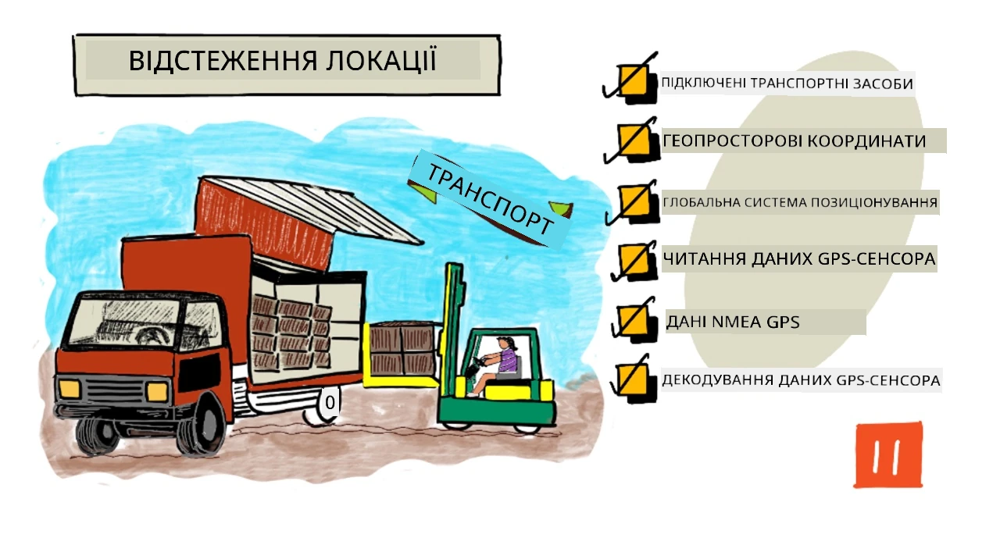
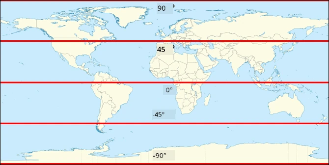
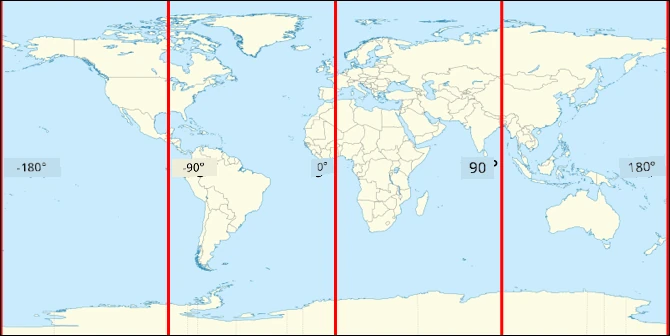
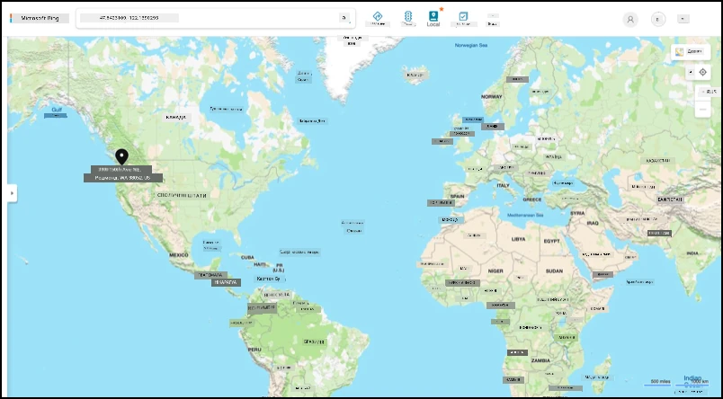
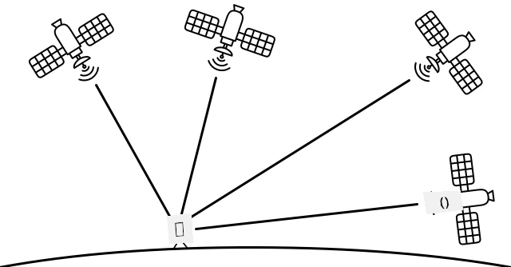

# Відстеження місцеположення

> Скетчнот від [Nitya Narasimhan](https://github.com/nitya). Натисніть на зображення, щоб побачити його у більшому розмірі.

## Тест перед лекцією

[Тест перед лекцією](https://black-meadow-040d15503.1.azurestaticapps.net/quiz/21)

## Вступ

Основний шлях їжі від фермера до споживача такий: ящики з продукцією завантажують у вантажівки, кораблі, літаки чи інший комерційний транспорт і доставляють або безпосередньо клієнту, або до центрального хабу чи складу для обробки. Увесь цей наскрізний процес від ферми до споживача є частиною так званого *ланцюга постачання*. У відео нижче від Школи бізнесу В. П. Кері Університету штату Аризона (англійською) докладніше розповідають, що таке ланцюг постачання і як ним керують.

> 🎥 Натисніть на зображення вище, щоб переглянути відео.

IoT-пристрої можуть суттєво покращити ланцюг постачання: ви знаєте, де перебувають товари, краще плануєте перевезення й обробку вантажів і швидше реагуєте на проблеми.

Коли ви керуєте парком транспортних засобів, наприклад вантажівок, корисно знати, де кожен із них перебуває в певний момент. На транспорт можна встановити GPS-сенсори, які надсилають місцеположення в IoT-систему. Так власники бачать, де зараз машина, яким маршрутом вона їхала і коли прибуде до місця призначення. Більшість транспорту працює поза зоною покриття WiFi, тому такі дані надсилають через мобільні мережі. Іноді GPS-сенсор вбудовано в складніші IoT-пристрої, наприклад в електронні бортові журнали (тахографи). Вони відстежують, скільки часу вантажівка перебуває в дорозі, щоб водії дотримувалися місцевих законів про робочий час.

У цьому уроці ви навчитеся відстежувати місцеположення транспортного засобу за допомогою сенсора глобальної системи позиціювання (GPS).

У цьому уроці ми розглянемо:

* [Підключені транспортні засоби](#підключені-транспортні-засоби)
* [Геопросторові координати](#геопросторові-координати)
* [Глобальні системи позиціювання (GPS)](#глобальні-системи-позиціювання-gps)
* [Зчитування даних GPS-сенсора](#зчитування-даних-gps-сенсора)
* [GPS-дані у форматі NMEA](#gps-дані-у-форматі-nmea)
* [Декодування даних GPS-сенсора](#декодування-даних-gps-сенсора)

## Підключені транспортні засоби

IoT змінює спосіб перевезення товарів, створюючи парки *підключених транспортних засобів* (connected vehicles). Ці машини підключені до центральних IT-систем і передають дані про своє місцеположення та показники інших сенсорів. Парк підключених транспортних засобів дає багато переваг:

* Відстеження місцеположення: ви будь-коли точно знаєте, де машина, і можете:

  * Отримувати сповіщення, коли машина наближається до пункту призначення, щоб підготувати бригаду до розвантаження
  * Знаходити викрадені машини
  * Поєднувати дані про місцеположення й маршрут з інформацією про затори, щоб змінювати маршрут уже в дорозі
  * Правильно сплачувати податки. У деяких країнах за транспорт платять залежно від кілометрів, пройдених дорогами загального користування (наприклад, [RUC у Новій Зеландії](https://www.nzta.govt.nz/vehicles/licensing-rego/road-user-charges/)), тож коли відомо, де машина їхала громадськими, а де приватними дорогами, податок рахувати легше.
  * Знати, куди відправити ремонтну бригаду в разі поломки

* Телеметрія водія: можна перевіряти, чи водії дотримуються обмежень швидкості, проходять повороти з безпечною швидкістю, вчасно й плавно гальмують і загалом їздять безпечно. Підключені машини також можуть мати камери для запису інцидентів. Це можна пов'язати зі страхуванням і давати знижки сумлінним водіям.

* Дотримання режиму праці й відпочинку водіїв: водії керують машиною лише дозволену законом кількість годин, яку рахують за часом увімкнення та вимкнення двигуна.

Ці переваги можна поєднувати. Наприклад, якщо об'єднати контроль робочого часу з відстеженням місцеположення, можна змінити маршрут водія, який не встигає доїхати до місця призначення за дозволений час. Їх також можна поєднати з іншою телеметрією конкретної машини, наприклад з температурою в рефрижераторі, і змінити маршрут, якщо на поточному товари не вдасться втримати в потрібному температурному режимі.

> 🎓 Логістика — це процес перевезення товарів з одного місця в інше, наприклад з ферми до супермаркету через один або кілька складів. Фермер пакує ящики з помідорами, їх завантажують у вантажівку й доставляють на центральний склад, а там перевантажують у другу вантажівку, де можуть бути різні види продукції, і везуть до супермаркету.

Основа відстеження транспорту — GPS, тобто сенсори, які можуть визначити своє місцеположення будь-де на Землі. У цьому уроці ви навчитеся користуватися GPS-сенсором, а почнемо з того, як взагалі задати місцеположення на Землі.

## Геопросторові координати

Геопросторові координати задають точки на поверхні Землі, так само як координати задають піксель на екрані комп'ютера чи місце стібка у вишивці хрестиком. Одна точка описується парою координат. Наприклад, кампус Microsoft у Редмонді (штат Вашингтон, США) розташований за координатами 47.6423109, -122.1390293.

### Широта і довгота

Земля — це куля, тобто тривимірне коло. Тому точки на ній задають, поділивши її на 360 градусів, як у геометрії кола. Широта вимірює кількість градусів з півночі на південь, довгота — зі сходу на захід.

> 💁 Ніхто достеменно не знає, чому коло ділять саме на 360 градусів. Можливі причини описано на [сторінці про градус у Вікіпедії](https://wikipedia.org/wiki/Degree_(angle)).

Широту вимірюють лініями, які оперізують Землю паралельно екватору. Вони ділять Північну і Південну півкулі на 90° кожну. Екватор має широту 0°, Північний полюс — 90°, або 90° північної широти, а Південний полюс — -90°, або 90° південної широти.

Довготу вимірюють у градусах на схід і на захід. Початок відліку довготи, 0°, називають *нульовим меридіаном*. 1884 року його визначили як лінію від Північного до Південного полюса, що проходить через [Королівську обсерваторію в Гринвічі (Англія)](https://wikipedia.org/wiki/Royal_Observatory,_Greenwich).

> 🎓 Меридіан — це уявна лінія від Північного полюса до Південного, що утворює півколо.

Щоб виміряти довготу точки, рахують кількість градусів уздовж екватора від нульового меридіана до меридіана, який проходить через цю точку. Довгота змінюється від -180°, або 180° західної довготи, через 0° на нульовому меридіані до 180°, або 180° східної довготи. 180° і -180° — це той самий меридіан, антимеридіан, або 180-й меридіан. Він лежить на протилежному від нульового меридіана боці Землі.

> 💁 Не плутайте антимеридіан з міжнародною лінією зміни дат. Вона проходить приблизно там само, але не є прямою й огинає державні кордони.

✅ Дослідіть самостійно: спробуйте знайти широту й довготу місця, де ви зараз перебуваєте.

### Градуси, мінути й секунди чи десяткові градуси

Традиційно широту й довготу вимірювали в шістдесятковій системі числення. Її використовували ще стародавні вавилоняни, які першими вимірювали й записували час і відстані. Ви, мабуть, щодня користуєтеся шістдесятковою системою, навіть не помічаючи цього: у годині 60 хвилин, а у хвилині 60 секунд.

Довготу й широту вимірюють у градусах, мінутах і секундах: одна мінута дорівнює 1/60 градуса, а одна секунда — 1/60 мінути.

Наприклад, на екваторі:

* 1° широти — це **111,3 кілометра**
* 1 мінута широти — це 111,3/60 = **1,855 кілометра**
* 1 секунда широти — це 1,855/60 = **0,031 кілометра**

Мінуту позначають одинарним штрихом, секунду — подвійним. Наприклад, 2 градуси 17 мінут і 43 секунди записують як 2°17'43". Частки секунди записують десятковим дробом, наприклад пів секунди — це 0°0'0.5".

Комп'ютери не працюють у шістдесятковій системі, тому в більшості комп'ютерних систем GPS-координати подають у десяткових градусах. Наприклад, 2°17'43" — це 2.295277. Знак градуса зазвичай не пишуть.

Координати точки завжди записують як `широта, довгота`. Отже, у прикладі з кампусом Microsoft за координатами 47.6423109,-122.1390293:

* широта 47.6423109 (47.6423109 градуса на північ від екватора);
* довгота -122.1390293 (122.1390293 градуса на захід від нульового меридіана).

> 💁 Зверніть увагу: у коді й у GPS-даних десяткову частину відокремлюють крапкою, а не комою, як прийнято в українських текстах.

## Глобальні системи позиціювання (GPS)

Системи GPS визначають ваше місцеположення за допомогою кількох супутників, що обертаються навколо Землі. Ви, мабуть, уже користувалися GPS, навіть не замислюючись про це: коли шукали себе на карті в телефоні, наприклад в Apple Maps чи Google Maps, коли дивилися, де ваше таксі в застосунку на кшталт Uber чи Bolt, або коли користувалися навігатором в автомобілі.

> 🎓 Супутники в «супутниковій навігації» — це і є GPS-супутники!

GPS працює так: кожен супутник надсилає сигнал зі своїм поточним положенням і точною позначкою часу. Сигнали передаються радіохвилями, і їх вловлює антена GPS-сенсора. Сенсор приймає ці сигнали і за поточним часом обчислює, скільки часу сигнал летів від супутника до сенсора. Швидкість радіохвиль стала, тому за надісланою позначкою часу сенсор може визначити, на якій відстані він перебуває від супутника. Поєднавши дані щонайменше від 3 супутників з їхніми положеннями, GPS-сенсор визначає своє місцеположення на Землі.

> 💁 GPS-сенсорам потрібна антена, щоб приймати радіохвилі. У вантажівках і легкових автомобілях із вбудованим GPS антену розміщують там, де сигнал добрий, зазвичай на лобовому склі чи даху. Якщо ви користуєтеся окремим GPS-пристроєм, наприклад смартфоном чи IoT-пристроєм, антена в ньому має «бачити» небо, тож такий пристрій варто, наприклад, закріпити на лобовому склі.

GPS-супутники обертаються навколо Землі, а не висять у фіксованій точці над сенсором, тому дані про місцеположення містять не лише широту й довготу, а й висоту над рівнем моря.

Колись військові США навмисно обмежували точність GPS для цивільних користувачів: похибка сягала близько 100 метрів. 2000 року це обмеження зняли, і тепер точність може досягати 30 сантиметрів. Втім, через перешкоди для сигналу така точність досяжна не завжди.

✅ Якщо у вас є смартфон, відкрийте застосунок з картами й подивіться, наскільки точно він визначає ваше місцеположення. Телефону може знадобитися трохи часу, щоб «побачити» кілька супутників і уточнити позицію.

> 💁 На супутниках стоять надзвичайно точні атомні годинники, але порівняно з атомними годинниками на Землі вони розходяться на 38 мікросекунд (0,000038 секунди) на добу. Причина — ефекти, передбачені спеціальною і загальною теоріями відносності Ейнштейна: супутники рухаються швидше, ніж обертається Земля. Це розходження підтвердило передбачення теорії відносності, і його доводиться враховувати під час проєктування систем GPS. На GPS-супутнику час буквально тече інакше.

Системи супутникової навігації створили й розгорнули кілька країн і союзів, зокрема США (GPS), Росія (ГЛОНАСС), Японія (QZSS), Індія (NavIC), ЄС (Galileo) і Китай (BeiDou). Сучасні GPS-сенсори можуть працювати з більшістю цих систем, щоб швидше й точніше визначати місцеположення.

> 🎓 Групу супутників кожної такої системи називають угрупованням (constellation).

## Зчитування даних GPS-сенсора

Більшість GPS-сенсорів передає GPS-дані через UART.

> ⚠️ UART розглядали в [проєкті 2, уроці 2](../../../2-farm/lessons/2-detect-soil-moisture/README.md). За потреби поверніться до цього уроку.

Ви можете під'єднати GPS-сенсор до свого IoT-пристрою й отримувати з нього GPS-дані.

### Завдання: під'єднайте GPS-сенсор і зчитайте GPS-дані

Виконайте відповідну інструкцію, щоб зчитати GPS-дані за допомогою свого IoT-пристрою:

* [Arduino: Wio Terminal](https://github.com/microsoft/IoT-For-Beginners/blob/main/3-transport/lessons/1-location-tracking/wio-terminal-gps-sensor.md) (ще не адаптовано, оригінал англійською)
* [Одноплатний комп'ютер: Raspberry Pi](https://github.com/microsoft/IoT-For-Beginners/blob/main/3-transport/lessons/1-location-tracking/pi-gps-sensor.md) (ще не адаптовано, оригінал англійською)
* [Одноплатний комп'ютер: віртуальний пристрій](virtual-device-gps-sensor.md)

## GPS-дані у форматі NMEA

Коли ви запустили код, то побачили у виводі щось схоже на набір випадкових символів. Насправді це стандартні GPS-дані, і кожен символ у них має значення.

GPS-сенсори видають дані як повідомлення NMEA за стандартом NMEA 0183. NMEA — це абревіатура від [National Marine Electronics Association](https://www.nmea.org) (Національна асоціація морської електроніки), американської галузевої організації, що встановлює стандарти зв'язку між морськими електронними пристроями.

> 💁 Цей стандарт є власницьким і коштує щонайменше 2000 доларів США, але у відкритому доступі про нього досить інформації: більшу частину стандарту відтворено методом зворотної розробки, і її можна використовувати у відкритому та іншому некомерційному коді.

Ці повідомлення текстові. Кожне повідомлення — це *речення* (sentence), яке починається символом `$`, далі йдуть 2 символи, що позначають джерело повідомлення (наприклад, GP — американська система GPS, GL — ГЛОНАСС, GN — комбіновані дані кількох систем), і 3 символи, що позначають тип повідомлення. Решта повідомлення — це поля, розділені комами, а в кінці стоїть символ нового рядка.

Ось деякі типи повідомлень, які можна отримати:

| Тип | Опис |
| ---- | ----------- |
| GGA | Дані про визначення місцеположення (GPS fix): широта, довгота й висота GPS-сенсора, а також кількість супутників, за якими визначено цю позицію. |
| ZDA | Поточні дата й час, зокрема місцевий часовий пояс |
| GSV | Відомості про видимі супутники, тобто ті, сигнали яких GPS-сенсор може приймати |

> 💁 GPS-дані містять позначки часу, тому ваш IoT-пристрій за потреби може брати час із GPS-сенсора, а не з NTP-сервера чи внутрішнього годинника реального часу.

Повідомлення GGA містить поточне місцеположення у форматі `(dd)dmm.mmmm` і один символ, що позначає напрямок. У цьому форматі `d` — це градуси, `m` — мінути, а секунди подано як десяткові частки мінут. Наприклад, 2°17'43" запишеться як 217.716666667, тобто 2 градуси і 17.716666667 мінути.

Символ напрямку для широти може бути `N` (північ) або `S` (південь), а для довготи — `E` (схід) або `W` (захід). Наприклад, широта 2°17'43" матиме символ напрямку `N`, а -2°17'43" — символ `S`.

Розгляньмо NMEA-речення `$GNGGA,020604.001,4738.538654,N,12208.341758,W,1,3,,164.7,M,-17.1,M,,*66`:

* Широта — це `4738.538654,N`, що в десяткових градусах дорівнює 47.6423109. `4738.538654` — це 47.6423109, а напрямок `N` (північ), тому широта додатна.

* Довгота — це `12208.341758,W`, що в десяткових градусах дорівнює -122.1390293. `12208.341758` — це 122.1390293°, а напрямок `W` (захід), тому довгота від'ємна.

> 💁 Останні символи після `*` — це контрольна сума речення. Якщо хоч один символ речення змінити, контрольна сума не збігатиметься, і бібліотеки для розбору NMEA відкинуть таке речення.

## Декодування даних GPS-сенсора

Замість сирих NMEA-даних краще працювати з декодованими, зручнішими значеннями. Є кілька бібліотек з відкритим кодом, які допомагають витягти корисні дані із сирих NMEA-повідомлень.

### Завдання: декодуйте дані GPS-сенсора

Виконайте відповідну інструкцію, щоб декодувати дані GPS-сенсора на своєму IoT-пристрої:

* [Arduino: Wio Terminal](https://github.com/microsoft/IoT-For-Beginners/blob/main/3-transport/lessons/1-location-tracking/wio-terminal-gps-decode.md) (ще не адаптовано, оригінал англійською)
* [Одноплатний комп'ютер: Raspberry Pi або віртуальний IoT-пристрій](single-board-computer-gps-decode.md)

---

## 🚀 Виклик

Напишіть власний декодер NMEA! Замість того щоб покладатися на сторонні бібліотеки, спробуйте самі написати код, який витягує з NMEA-речень широту й довготу.

## Тест після лекції

[Тест після лекції](https://black-meadow-040d15503.1.azurestaticapps.net/quiz/22)

## Огляд і самостійне навчання

* Дізнайтеся більше про геопросторові координати на [сторінці про географічну систему координат у Вікіпедії](https://uk.wikipedia.org/wiki/Географічна_система_координат).
* Почитайте про нульові меридіани на інших небесних тілах на [сторінці Prime meridian у Вікіпедії](https://wikipedia.org/wiki/Prime_meridian#Prime_meridian_on_other_planetary_bodies) (англійською).
* Дослідіть різні системи супутникової навігації, які створили уряди та союзи різних країн, зокрема ЄС, Японії, Росії, Індії та США.

## Завдання

[Дослідіть інші GPS-дані](assignment.md)

---

> **Про цю версію.** Урок адаптовано українською на основі курсу [IoT for Beginners](https://github.com/microsoft/IoT-For-Beginners) від Microsoft (ліцензія MIT). Порівняно з оригіналом код перевірено з CounterFit на Python 3.14, виправлено контрольну суму в прикладі NMEA-речення, уточнено префікси NMEA (GL — ГЛОНАСС, GN — кілька систем) і точність GPS до 2000 року.
