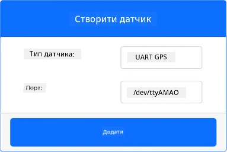
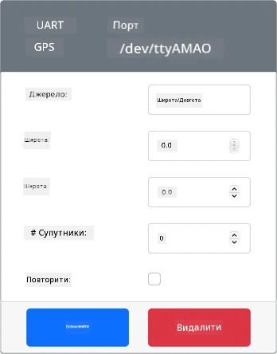
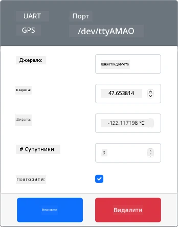
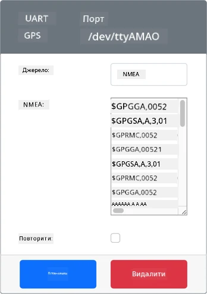
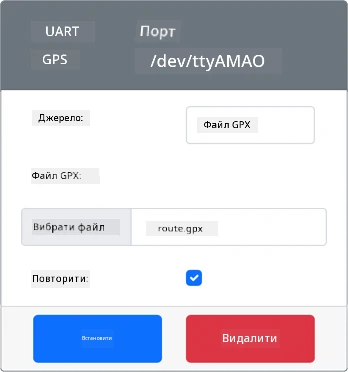

# Зчитування GPS-даних: віртуальний IoT-пристрій

У цій частині уроку ви додасте GPS-сенсор до свого віртуального IoT-пристрою і зчитаєте з нього значення.

## Віртуальне обладнання

Віртуальний IoT-пристрій використовуватиме імітований GPS-сенсор, доступний через UART на послідовному порту.

Фізичний GPS-сенсор має антену, яка приймає радіохвилі від GPS-супутників, і перетворює GPS-сигнали на GPS-дані. Віртуальна версія імітує це: ви можете задати широту й довготу, надіслати сирі NMEA-речення або завантажити GPX-файл із кількома точками, які сенсор повертатиме по черзі.

> 🎓 Про NMEA-речення ви дізнаєтеся далі в цьому уроці.

### Додайте сенсор до CounterFit

Щоб користуватися віртуальним GPS-сенсором, його потрібно додати в застосунок CounterFit.

#### Завдання: додайте сенсор до CounterFit

Додайте GPS-сенсор у застосунок CounterFit.

1. Створіть на комп'ютері новий Python-застосунок у папці `gps-sensor` з одним файлом `app.py` і віртуальним середовищем Python, і встановіть pip-пакети CounterFit.

    > ⚠️ За потреби скористайтеся [інструкціями зі створення й налаштування Python-проєкту для CounterFit з уроку 1](../../../1-getting-started/lessons/1-introduction-to-iot/virtual-device.md). Не забудьте другу команду `pip install` із закріпленими версіями Flask та eventlet.

1. Встановіть додатковий pip-пакет із шимом CounterFit, який вміє працювати з UART-сенсорами через послідовне з'єднання. Встановлюйте його в терміналі з активованим віртуальним середовищем.

    ```sh
    pip install counterfit-shims-serial
    ```

1. Переконайтеся, що вебзастосунок CounterFit запущено.

1. Створіть GPS-сенсор:

    1. У полі *Create sensor* на панелі *Sensors* відкрийте список *Sensor type* і виберіть *UART GPS*.

    1. Залиште для *Port* значення */dev/ttyAMA0*.

    1. Натисніть кнопку **Add**, щоб створити GPS-сенсор на порту `/dev/ttyAMA0`.

    

    GPS-сенсор буде створено, і він з'явиться у списку сенсорів.

    

## Програмування GPS-сенсора

Тепер віртуальний IoT-пристрій можна запрограмувати для роботи з віртуальним GPS-сенсором.

### Завдання: запрограмуйте GPS-сенсор

Запрограмуйте застосунок для GPS-сенсора.

1. Переконайтеся, що застосунок `gps-sensor` відкрито у VS Code.

1. Відкрийте файл `app.py`.

1. Додайте на початок `app.py` такий код, щоб підключити застосунок до CounterFit:

    ```python
    from counterfit_connection import CounterFitConnection
    CounterFitConnection.init('127.0.0.1', 5000)
    ```

1. Нижче додайте код, який імпортує потрібні бібліотеки, зокрема бібліотеку для послідовного порту CounterFit:

    ```python
    import time
    import counterfit_shims_serial

    serial = counterfit_shims_serial.Serial('/dev/ttyAMA0')
    ```

    Цей код імпортує модуль `counterfit_shims_serial` з однойменного pip-пакета. Потім він підключається до послідовного порту `/dev/ttyAMA0`: це адреса послідовного порту, який віртуальний GPS-сенсор використовує як свій UART-порт.

1. Ще нижче додайте код, який читає дані з послідовного порту й виводить їх у консоль:

    ```python
    def print_gps_data(line):
        print(line.rstrip())

    while True:
        line = serial.readline().decode('utf-8')

        while len(line) > 0:
            print_gps_data(line)
            line = serial.readline().decode('utf-8')

        time.sleep(1)
    ```

    Тут оголошено функцію `print_gps_data`, яка виводить у консоль переданий їй рядок.

    Далі код у нескінченному циклі на кожній ітерації читає з послідовного порту стільки рядків тексту, скільки вдається. Для кожного рядка викликається функція `print_gps_data`.

    Коли всі дані прочитано, цикл «засинає» на 1 секунду, а потім пробує знову.

1. Запустіть цей код в іншому терміналі, не в тому, де працює CounterFit, щоб застосунок CounterFit і далі працював.

1. У застосунку CounterFit змініть значення GPS-сенсора одним із таких способів:

    * Виберіть для **Source** значення `Lat/Lon` і задайте конкретні широту, довготу та кількість супутників, за якими визначено позицію. Це значення буде надіслано лише один раз, тож позначте **Repeat**, щоб дані повторювалися щосекунди.

      

    * Виберіть для **Source** значення `NMEA` і вставте кілька NMEA-речень у текстове поле. Буде надіслано всі ці речення, причому перед кожним новим реченням GGA (визначення позиції) буде пауза в 1 секунду.

      

      Такі речення можна згенерувати, малюючи маршрут на карті в інструменті на кшталт [nmeagen.org](https://www.nmeagen.org). Ці значення буде надіслано лише один раз, тож позначте **Repeat**, щоб вони повторювалися через секунду після надсилання всіх даних.

    * Виберіть для **Source** значення GPX file і завантажте GPX-файл із точками треку. GPX-файли можна завантажити з багатьох популярних сайтів з картами й туристичними маршрутами, наприклад з [AllTrails](https://www.alltrails.com/). Такі файли містять багато GPS-точок, що утворюють маршрут, і GPS-сенсор повертатиме нову точку щосекунди.

      

      Ці значення буде надіслано лише один раз, тож позначте **Repeat**, щоб вони повторювалися через секунду після надсилання всіх даних.

    Налаштувавши GPS, натисніть кнопку **Set**, щоб застосувати ці значення до сенсора.

1. Ви побачите сирі дані від GPS-сенсора приблизно такого вигляду:

    ```output
    $GPGGA,221857.00,4738.538654,N,12208.341758,W,1,5,,0,M,0,M,,*5A
    $GPGGA,221858.00,4738.538654,N,12208.341758,W,1,5,,0,M,0,M,,*55
    ```

> 💁 Цей код є в папці [code-gps/virtual-device](code-gps/virtual-device).

😀 Ваша програма для GPS-сенсора працює!
