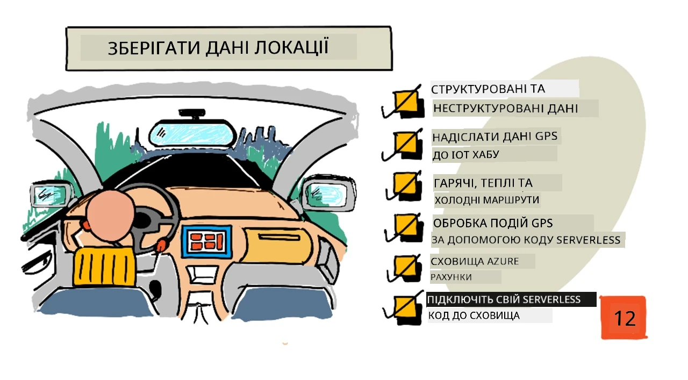
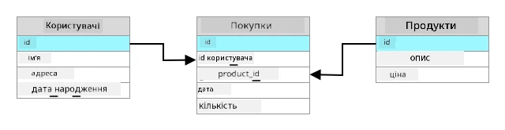
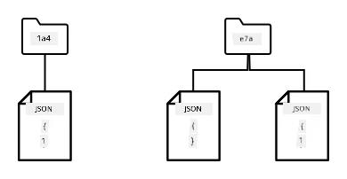
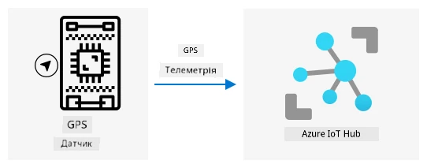
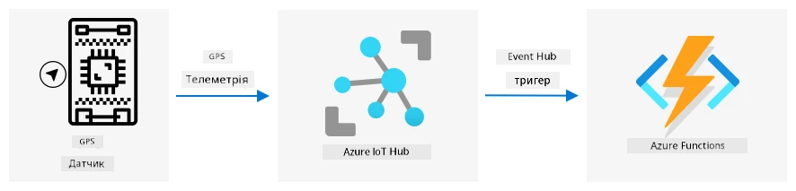
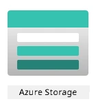
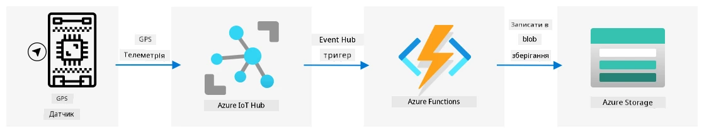

# Зберігання даних про місцеположення



> Скетчнот від [Nitya Narasimhan](https://github.com/nitya). Натисніть на зображення, щоб побачити його у більшому розмірі.

## Тест перед лекцією

[Тест перед лекцією](https://black-meadow-040d15503.1.azurestaticapps.net/quiz/23)

## Вступ

На минулому уроці ви навчилися отримувати дані про місцеположення з GPS-сенсора. Щоб за цими даними показати, де зараз вантажівка з продуктами і яким шляхом вона їхала, їх потрібно надіслати в хмарний IoT-сервіс, а потім десь зберегти.

У цьому уроці ви дізнаєтеся про різні способи зберігання IoT-даних і навчитеся зберігати дані з IoT-сервісу за допомогою безсерверного (serverless) коду.

> 👩‍🏫 **Як проходить цей урок.** Частини з Azure IoT Hub, Azure Functions і Azure Storage показує викладач (демо). Студенти виконують [локальний варіант](local-store-gps-data.md): віртуальний пристрій надсилає GPS-дані через MQTT, а невеликий Python-сервер на вашому комп'ютері дописує їх у CSV-файл. Обліковий запис Azure для цього не потрібен. Теоретичні частини уроку читають усі.

У цьому уроці ми розглянемо:

* [Структуровані й неструктуровані дані](#структуровані-й-неструктуровані-дані)
* [Надсилання GPS-даних в IoT Hub](#надсилання-gps-даних-в-iot-hub)
* [Гарячий, теплий і холодний шляхи](#гарячий-теплий-і-холодний-шляхи)
* [Обробка GPS-подій безсерверним кодом](#обробка-gps-подій-безсерверним-кодом)
* [Облікові записи Azure Storage](#облікові-записи-azure-storage)
* [Підключення безсерверного коду до сховища](#підключення-безсерверного-коду-до-сховища)

## Структуровані й неструктуровані дані

Комп'ютерні системи працюють з даними, а дані бувають найрізноманітніших форм і розмірів: від окремих чисел до великих обсягів тексту, відео, зображень та IoT-даних. Зазвичай дані поділяють на дві категорії: *структуровані* і *неструктуровані*.

* **Структуровані дані** мають чітко визначену жорстку структуру, яка не змінюється, і зазвичай відповідають таблицям, пов'язаним між собою. Приклад — дані про людину: ім'я, дата народження й адреса.

* **Неструктуровані дані** не мають чітко визначеної жорсткої структури, і їхня структура може часто змінюватися. Приклад — документи, як-от текстові документи чи електронні таблиці.

✅ Дослідіть самостійно: які ще приклади структурованих і неструктурованих даних ви можете навести?

> 💁 Є ще напівструктуровані дані: вони мають структуру, але не вкладаються у фіксовані таблиці.

IoT-дані зазвичай вважають неструктурованими.

Уявіть, що ви встановлюєте IoT-пристрої на транспорт великого комерційного фермерського господарства. Для різних типів машин можуть знадобитися різні пристрої. Наприклад:

* для сільськогосподарської техніки, як-от тракторів, потрібні GPS-дані, щоб переконатися, що вона працює на правильних полях;
* для вантажівок, що везуть продукти на склади, потрібні GPS-дані, а також швидкість і прискорення, щоб переконатися, що водій їде безпечно, і ще дані про особу водія та час початку й завершення руху, щоб контролювати дотримання місцевих законів про робочий час;
* для рефрижераторів потрібна ще й температура, щоб продукти в дорозі не перегрілися чи не переохолодилися й не зіпсувалися.

Ці дані можуть постійно змінюватися. Наприклад, якщо IoT-пристрій стоїть у кабіні тягача, то набір даних, які він надсилає, може змінюватися разом із причепом: скажімо, температура надсилається лише тоді, коли причеплено рефрижератор.

✅ Які ще IoT-дані можна збирати? Подумайте про те, які вантажі можуть возити вантажівки, а також про дані для технічного обслуговування.

Ці дані відрізняються від машини до машини, але всі вони надходять на обробку в той самий IoT-сервіс. IoT-сервіс має вміти обробляти такі неструктуровані дані й зберігати їх так, щоб у них можна було шукати й аналізувати їх, але при цьому підтримувати різну структуру даних.

### SQL- і NoSQL-сховища

Бази даних — це сервіси, які дають змогу зберігати дані й робити до них запити. Бази даних бувають двох типів: SQL і NoSQL.

#### SQL-бази даних

Першими базами даних були системи керування реляційними базами даних (СКБД, англ. RDBMS), або просто реляційні бази даних. Їх ще називають SQL-базами за мовою структурованих запитів (Structured Query Language, SQL), якою в них додають, видаляють, оновлюють дані та роблять запити. Такі бази мають схему — чітко визначений набір таблиць, схожих на електронні таблиці. Кожна таблиця має кілька іменованих стовпців. Коли ви вставляєте дані, ви додаєте в таблицю рядок і записуєте значення в кожен стовпець. Так дані зберігаються в дуже жорсткій структурі: стовпці можна залишати порожніми, але щоб додати новий стовпець, його треба створити в базі й заповнити значення для наявних рядків. Ці бази реляційні в тому сенсі, що одна таблиця може мати зв'язок (relation) з іншою.



Наприклад, якщо зберігати особисті дані користувачів у таблиці, у кожного користувача буде внутрішній унікальний ID, який записано в рядку з його ім'ям та адресою. Якщо потім треба зберегти інші відомості про цього користувача, наприклад його покупки, в іншій таблиці, у новій таблиці буде стовпець з ID користувача. Коли ви шукаєте користувача, за його ID можна отримати особисті дані з однієї таблиці, а покупки — з іншої.

SQL-бази даних ідеально підходять для зберігання структурованих даних і для випадків, коли потрібно гарантувати, що дані відповідають схемі.

✅ Якщо ви ще не працювали з SQL, почитайте про неї на [сторінці SQL у Вікіпедії](https://uk.wikipedia.org/wiki/SQL).

Відомі SQL-бази даних: Microsoft SQL Server, MySQL і PostgreSQL.

✅ Дослідіть самостійно: почитайте про ці SQL-бази даних та їхні можливості.

#### NoSQL-бази даних

NoSQL-бази даних так називаються, бо не мають жорсткої структури, як SQL-бази. Їх ще називають документними базами даних, бо вони можуть зберігати неструктуровані дані, наприклад документи.

> 💁 Попри назву, деякі NoSQL-бази даних дозволяють робити запити мовою SQL.



NoSQL-бази даних не мають наперед визначеної схеми, яка обмежує спосіб зберігання даних. Натомість у них можна вставляти будь-які неструктуровані дані, зазвичай JSON-документи. Ці документи можна впорядковувати в папки, подібно до файлів на комп'ютері. Кожен документ може мати інші поля, ніж решта документів. Наприклад, якщо зберігати IoT-дані з фермерського транспорту, в одних документах можуть бути поля з даними акселерометра й швидкістю, а в інших — температура в причепі. Якщо додати новий тип вантажівки, скажімо із вбудованими вагами для обліку ваги продукції, IoT-пристрій може додати нове поле, і його збережуть без жодних змін у базі даних.

Відомі NoSQL-бази даних: Azure Cosmos DB, MongoDB і CouchDB.

✅ Дослідіть самостійно: почитайте про ці NoSQL-бази даних та їхні можливості.

У цьому уроці ви зберігатимете IoT-дані в NoSQL-сховищі.

## Надсилання GPS-даних в IoT Hub

На минулому уроці ви отримували GPS-дані із сенсора, під'єднаного до IoT-пристрою. Щоб зберігати ці IoT-дані в хмарі, їх потрібно надіслати в IoT-сервіс. Ви знову використаєте Azure IoT Hub — той самий хмарний IoT-сервіс, що й у попередньому проєкті.



> 👩‍🏫 Цю частину показує викладач (демо). Студенти виконують локальний варіант: [надсилання GPS-даних через MQTT і збереження в CSV-файл](local-store-gps-data.md).

### Завдання: надішліть GPS-дані в IoT Hub

1. Створіть новий IoT Hub на безкоштовному рівні.

    > ⚠️ За потреби скористайтеся [інструкціями зі створення IoT Hub з проєкту 2, уроку 4](../../../2-farm/lessons/4-migrate-your-plant-to-the-cloud/README.md).

    Не забудьте створити нову групу ресурсів. Назвіть її `gps-sensor`, а новому IoT Hub дайте унікальне ім'я на основі `gps-sensor`, наприклад `gps-sensor-<ваше ім'я>`.

    > 💁 Якщо у вас залишився IoT Hub з попереднього проєкту, можна використати його. Тоді під час створення інших сервісів указуйте ім'я цього IoT Hub і групу ресурсів, у якій він розташований.

1. Додайте в IoT Hub новий пристрій із назвою `gps-sensor`. Скопіюйте рядок підключення (connection string) для цього пристрою.

1. Змініть код пристрою так, щоб він надсилав GPS-дані в новий IoT Hub, використовуючи рядок підключення пристрою з попереднього кроку.

    > ⚠️ За потреби скористайтеся [інструкціями з підключення пристрою до IoT-сервісу з проєкту 2, уроку 4](../../../2-farm/lessons/4-migrate-your-plant-to-the-cloud/README.md).

1. Надсилайте GPS-дані як JSON у такому форматі:

    ```json
    {
        "gps" :
        {
            "lat" : <latitude>,
            "lon" : <longitude>
        }
    }
    ```

1. Надсилайте GPS-дані раз на хвилину, щоб не вичерпати денний ліміт повідомлень.

Якщо ви використовуєте Wio Terminal, не забудьте додати всі потрібні бібліотеки і встановити час через NTP-сервер. Ваш код також має прочитати всі дані з послідовного порту, перш ніж надсилати GPS-координати; для цього використайте наявний код з минулого уроку. Сформуйте JSON-документ за допомогою такого коду:

```cpp
DynamicJsonDocument doc(1024);
doc["gps"]["lat"] = gps.location.lat();
doc["gps"]["lon"] = gps.location.lng();
```

Якщо ви використовуєте віртуальний IoT-пристрій, не забудьте встановити всі потрібні бібліотеки у віртуальне середовище.

> ⚠️ Пакет `azure-iot-device` вимагає `paho-mqtt` версії 1.x і під час встановлення замінить `paho-mqtt` 2.x, потрібний для локальних варіантів уроків. Тому встановлюйте `azure-iot-device` в окреме віртуальне середовище.

І для Raspberry Pi, і для віртуального IoT-пристрою візьміть наявний код з минулого уроку, щоб отримати широту й довготу, а потім надішліть їх у правильному JSON-форматі таким кодом:

```python
message_json = {'gps': {'lat': lat, 'lon': lon}}
print('Надсилаю телеметрію:', message_json)
message = Message(json.dumps(message_json))
```

> 💁 Цей код є в папці [code/virtual-device](code/virtual-device). Версії для [Wio Terminal](https://github.com/microsoft/IoT-For-Beginners/tree/main/3-transport/lessons/2-store-location-data/code/wio-terminal) і [Raspberry Pi](https://github.com/microsoft/IoT-For-Beginners/tree/main/3-transport/lessons/2-store-location-data/code/pi) є в оригінальному репозиторії (ще не адаптовано, оригінал англійською).

Запустіть код пристрою й переконайтеся, що повідомлення надходять в IoT Hub, за допомогою команди CLI `az iot hub monitor-events`.

## Гарячий, теплий і холодний шляхи

Дані, що надходять з IoT-пристрою в хмару, не завжди обробляються в реальному часі. Одні дані потрібно обробляти в реальному часі, інші можна обробити трохи згодом, а ще інші — набагато пізніше. Потоки даних до різних сервісів, які обробляють дані в різний час, називають гарячим, теплим і холодним шляхами (hot, warm і cold paths).

### Гарячий шлях

Гарячий шлях — це дані, які потрібно обробляти в реальному або майже реальному часі. Дані гарячого шляху використовують для сповіщень, наприклад що машина під'їжджає до складу або що температура в рефрижераторі занадто висока.

Щоб використовувати дані гарячого шляху, код має реагувати на події одразу, щойно хмарні сервіси їх отримали.

### Теплий шлях

Теплий шлях — це дані, які можна обробити через деякий час після отримання, наприклад для звітів чи короткострокової аналітики. Дані теплого шляху використовують, скажімо, для щоденних звітів про пробіг машин за даними, зібраними напередодні.

Дані теплого шляху після надходження в хмарний сервіс зберігають у сховищі, до якого можна швидко звернутися.

### Холодний шлях

Холодний шлях — це історичні дані, які зберігаються довго й обробляються за потреби. Наприклад, холодний шлях можна використати для річних звітів про пробіг машин або для аналізу маршрутів, щоб знайти оптимальний і зменшити витрати на пальне.

Дані холодного шляху зберігають у сховищах даних (data warehouses) — базах, призначених для зберігання великих обсягів незмінних даних, до яких можна швидко й легко робити запити. Зазвичай у хмарному застосунку є регулярне завдання, яке щодня, щотижня чи щомісяця переносить дані зі сховища теплого шляху у сховище даних.

✅ Згадайте дані, які ви вже зібрали на цих уроках. Це дані гарячого, теплого чи холодного шляху?

## Обробка GPS-подій безсерверним кодом

Коли дані почали надходити в IoT Hub, можна написати безсерверний код, який слухатиме події, опубліковані в кінцеву точку, сумісну з Event Hub (Event Hub-compatible endpoint). Це теплий шлях: ці дані буде збережено й використано на наступному уроці для звіту про маршрут.



> 👩‍🏫 Цю частину показує викладач (демо). У локальному варіанті роль безсерверного коду виконує [Python-сервер, який підписується на MQTT-тему](local-store-gps-data.md).

### Завдання: обробіть GPS-події безсерверним кодом

1. Створіть застосунок Azure Functions за допомогою Azure Functions CLI (Core Tools). Використайте середовище виконання Python, створіть застосунок у папці `gps-trigger` і дайте таку саму назву проєкту Functions App. Не забудьте створити для нього віртуальне середовище.

    > ⚠️ За потреби скористайтеся [інструкціями зі створення проєкту Azure Functions з проєкту 2, уроку 5](../../../2-farm/lessons/5-migrate-application-to-the-cloud/README.md).

    > 💁 Команда `func init --python` тепер створює проєкт на моделі програмування Python v2: усі функції описано у файлі `function_app.py` за допомогою декораторів, окремих папок із `function.json` і `__init__.py` немає. Для проєкту Functions використовуйте Python 3.12: Azure Functions підтримує не найновіші версії Python, і 3.14 для нього не підійде.

1. Додайте тригер події IoT Hub, який використовує кінцеву точку IoT Hub, сумісну з Event Hub.

    > ⚠️ За потреби скористайтеся [інструкціями зі створення тригера події IoT Hub з проєкту 2, уроку 5](../../../2-farm/lessons/5-migrate-application-to-the-cloud/README.md).

    У моделі v2 тригер — це функція у файлі `function_app.py` з декоратором:

    ```python
    import logging

    import azure.functions as func

    app = func.FunctionApp()


    @app.event_hub_message_trigger(arg_name='events',
                                   event_hub_name='samples-workitems',
                                   connection='IOT_HUB_CONNECTION_STRING',
                                   cardinality=func.Cardinality.MANY,
                                   consumer_group='$Default')
    def iot_hub_trigger(events: list[func.EventHubEvent]):
        for event in events:
            logging.info('Отримано подію з IoT Hub: %s',
                         event.get_body().decode('utf-8'))
    ```

1. Запишіть рядок підключення до кінцевої точки, сумісної з Event Hub, у файл `local.settings.json` під ключем `IOT_HUB_CONNECTION_STRING`. Цей ключ указано в параметрі `connection` декоратора.

1. Використовуйте застосунок Azurite як локальний емулятор сховища.

1. Запустіть застосунок Functions і переконайтеся, що він отримує події від вашого GPS-пристрою. IoT-пристрій теж має бути запущений і надсилати GPS-дані.

    ```output
    Отримано подію з IoT Hub: {"gps": {"lat": 47.73481, "lon": -122.25701}}
    ```

## Облікові записи Azure Storage



Облікові записи Azure Storage (Azure Storage Accounts) — це сховище загального призначення, яке може зберігати дані різними способами. Дані можна зберігати як блоби, у чергах, у таблицях або як файли, і все це одночасно.

### Blob-сховище

Слово *blob* означає binary large objects (великі двійкові об'єкти), але стало назвою для будь-яких неструктурованих даних. У blob-сховищі можна зберігати будь-які дані: від JSON-документів з IoT-даними до зображень і відеофайлів. У blob-сховищі є поняття *контейнерів* — іменованих «кошиків» для даних, схожих на таблиці в реляційній базі даних. У контейнерах можуть бути папки для блобів, а в папках — інші папки, подібно до того, як файли зберігаються на жорсткому диску комп'ютера.

У цьому уроці ви зберігатимете IoT-дані в blob-сховищі.

✅ Дослідіть самостійно: почитайте про [Azure Blob Storage](https://learn.microsoft.com/azure/storage/blobs/storage-blobs-overview).

### Табличне сховище

Табличне сховище (Table storage) дає змогу зберігати напівструктуровані дані. Насправді це NoSQL-база даних, тож воно не потребує наперед визначеного набору таблиць, але розраховане на зберігання даних в одній чи кількох таблицях з унікальними ключами для кожного рядка.

✅ Дослідіть самостійно: почитайте про [Azure Table Storage](https://learn.microsoft.com/azure/storage/tables/table-storage-overview).

### Сховище черг

Сховище черг (Queue storage) дає змогу зберігати в черзі повідомлення розміром до 64 КБ. Повідомлення додають у кінець черги, а читають з її початку. Черги зберігають повідомлення безстроково, доки є місце, тож повідомлення можна довго зберігати й читати, коли знадобиться. Наприклад, якщо ви хочете раз на місяць обробляти GPS-дані, можна щодня впродовж місяця додавати їх у чергу, а наприкінці місяця обробити всі повідомлення з черги.

✅ Дослідіть самостійно: почитайте про [Azure Queue Storage](https://learn.microsoft.com/azure/storage/queues/storage-queues-introduction).

### Файлове сховище

Файлове сховище (File storage) — це зберігання файлів у хмарі, до якого будь-які застосунки чи пристрої можуть підключатися за стандартними протоколами. Можна записувати файли у файлове сховище, а потім підключити його як диск на своєму ПК чи Mac.

✅ Дослідіть самостійно: почитайте про [Azure File Storage](https://learn.microsoft.com/azure/storage/files/storage-files-introduction).

## Підключення безсерверного коду до сховища

Тепер застосунок Functions має підключитися до blob-сховища, щоб зберігати повідомлення з IoT Hub. Це можна зробити двома способами:

* у коді функції підключитися до blob-сховища через Python SDK і записувати дані як блоби;
* використати вихідну прив'язку (output binding) функції, щоб пов'язати значення, яке повертає функція, з blob-сховищем, і тоді блоб зберігатиметься автоматично.

У цьому уроці ви використаєте Python SDK, щоб побачити, як працювати з blob-сховищем.



> 👩‍🏫 Цю частину показує викладач (демо). У локальному варіанті замість blob-сховища дані [дописуються в CSV-файл](local-store-gps-data.md).

Дані зберігатимуться як JSON-блоб у такому форматі:

```json
{
    "device_id": <device_id>,
    "timestamp" : <time>,
    "gps" :
    {
        "lat" : <latitude>,
        "lon" : <longitude>
    }
}
```

### Завдання: підключіть безсерверний код до сховища

1. Створіть обліковий запис Azure Storage. Назвіть його, наприклад, `gps<ваше ім'я>`.

    > ⚠️ За потреби скористайтеся [інструкціями зі створення облікового запису сховища з проєкту 2, уроку 5](../../../2-farm/lessons/5-migrate-application-to-the-cloud/README.md).

    Якщо у вас залишився обліковий запис сховища з попереднього проєкту, можна використати його.

    > 💁 Пізніше в цьому уроці ви зможете використати цей самий обліковий запис сховища для розгортання застосунку Azure Functions.

    > ⚠️ У нових облікових записах сховища анонімний (публічний) доступ до блобів за замовчуванням вимкнено. Код нижче створює контейнер з публічним доступом, щоб на наступному уроці вебсторінка могла читати GPS-дані, тому дозвольте такий доступ для облікового запису:
    >
    > ```sh
    > az storage account update --allow-blob-public-access true \
    >                           --name <storage_name>
    > ```
    >
    > Без цього створення контейнера завершиться помилкою `PublicAccessNotPermitted`. Так роблять лише в навчальному проєкті з неконфіденційними даними.

1. Виконайте таку команду, щоб отримати рядок підключення до облікового запису сховища:

    ```sh
    az storage account show-connection-string --output table \
                                              --name <storage_name>
    ```

    Замініть `<storage_name>` на ім'я облікового запису сховища, створеного на попередньому кроці.

1. Додайте у файл `local.settings.json` новий запис із рядком підключення до облікового запису сховища, отриманим на попередньому кроці. Назвіть його `STORAGE_CONNECTION_STRING`.

1. Додайте у файл `requirements.txt` такий рядок, щоб установити pip-пакети для Azure Storage:

    ```sh
    azure-storage-blob
    ```

    Установіть пакети з цього файлу у своє віртуальне середовище.

    > Якщо виникає помилка, оновіть pip у віртуальному середовищі до останньої версії такою командою і спробуйте ще раз:
    >
    > ```sh
    > pip install --upgrade pip
    > ```

1. У файлі `function_app.py` додайте такі імпорти:

    ```python
    import json
    import os
    import uuid
    from azure.storage.blob import BlobServiceClient, PublicAccess
    ```

    Системний модуль `json` знадобиться для читання й запису JSON, системний модуль `os` — для читання рядка підключення, а системний модуль `uuid` — для генерування унікального ID для GPS-показу.

    Пакет `azure.storage.blob` містить Python SDK для роботи з blob-сховищем.

1. Перед функцією `iot_hub_trigger` додайте таку допоміжну функцію:

    ```python
    def get_or_create_container(name):
        connection_str = os.environ['STORAGE_CONNECTION_STRING']
        blob_service_client = BlobServiceClient.from_connection_string(connection_str)

        for container in blob_service_client.list_containers():
            if container.name == name:
                return blob_service_client.get_container_client(container.name)

        return blob_service_client.create_container(name, public_access=PublicAccess.Container)
    ```

    Python SDK для блобів не має допоміжного методу, який створює контейнер, якщо його ще немає. Цей код завантажує рядок підключення з файлу `local.settings.json` (або з Application Settings після розгортання в хмарі) і створює з нього об'єкт `BlobServiceClient` для роботи з обліковим записом blob-сховища. Потім код перебирає всі контейнери облікового запису й шукає контейнер із заданим ім'ям. Якщо такий є, повертається об'єкт `ContainerClient`, через який можна створювати блоби в контейнері. Якщо немає, контейнер створюється і повертається клієнт для нового контейнера.

    Новому контейнеру надається публічний доступ на читання блобів. Це знадобиться на наступному уроці, щоб показати GPS-дані на карті.

1. На відміну від вологості ґрунту, тут потрібно зберігати кожну подію, тож додайте такий код у цикл `for event in events:` у функції `iot_hub_trigger`, під інструкцією `logging`:

    ```python
    device_id = event.iothub_metadata['connection-device-id']
    blob_name = f'{device_id}/{str(uuid.uuid1())}.json'
    ```

    Цей код отримує ID пристрою з метаданих події та формує з нього ім'я блоба. Блоби можна зберігати в папках, і ID пристрою буде назвою папки, тож усі GPS-події кожного пристрою лежатимуть в одній папці. Ім'я блоба складається з назви цієї папки та назви документа, розділених скісною рискою, як у шляхах Linux і macOS (у Windows так само, але там використовують зворотну скісну риску). Назва документа — унікальний ID, згенерований модулем Python `uuid`, з розширенням `json`.

    Наприклад, для пристрою з ID `gps-sensor` ім'я блоба може бути `gps-sensor/a9487ac2-b9cf-11eb-b5cd-1e00621e3648.json`.

1. Нижче додайте такий код:

    ```python
    container_client = get_or_create_container('gps-data')
    blob = container_client.get_blob_client(blob_name)
    ```

    Цей код отримує клієнт контейнера за допомогою допоміжної функції `get_or_create_container`, а потім отримує об'єкт клієнта блоба за ім'ям блоба. Такі клієнти можуть посилатися на наявні блоби або, як у цьому випадку, на новий блоб.

1. Після цього додайте такий код:

    ```python
    event_body = json.loads(event.get_body().decode('utf-8'))
    blob_body = {
        'device_id': device_id,
        'timestamp': event.iothub_metadata['enqueuedtime'],
        'gps': event_body['gps']
    }
    ```

    Він формує вміст блоба, який буде записано в blob-сховище. Це JSON-документ з ID пристрою, часом, коли телеметрію було надіслано в IoT Hub, і GPS-координатами з телеметрії.

    > 💁 Важливо брати саме час постановки повідомлення в чергу (enqueued time), а не поточний час, щоб знати, коли повідомлення було надіслано. Якщо застосунок Functions не працював, повідомлення могло пролежати в хабі якийсь час, перш ніж його забрали.

1. Під цим кодом додайте:

    ```python
    logging.info(f'Записую blob {blob_name}: {blob_body}')
    blob.upload_blob(json.dumps(blob_body).encode('utf-8'))
    ```

    Цей код записує в журнал, що зараз буде записано блоб, з його даними, а потім завантажує вміст як вміст нового блоба.

1. Запустіть застосунок Functions. У виводі ви побачите, що для всіх GPS-подій записуються блоби:

    ```output
    [2021-05-21T01:31:14.325Z] Отримано подію з IoT Hub: {"gps": {"lat": 47.73092, "lon": -122.26206}}
    ...
    [2021-05-21T01:31:14.351Z] Записую blob gps-sensor/4b6089fe-ba8d-11eb-bc7b-1e00621e3648.json: {'device_id': 'gps-sensor', 'timestamp': '2021-05-21T00:57:53.878Z', 'gps': {'lat': 47.73092, 'lon': -122.26206}}
    ```

    > 💁 Переконайтеся, що монітор подій IoT Hub зараз не запущено.

> 💁 Цей код є в папці [code/functions](code/functions).

### Завдання: перевірте завантажені блоби

1. Переглянути створені блоби можна або в [Azure Storage Explorer](https://azure.microsoft.com/products/storage/storage-explorer/) — безкоштовному інструменті для перегляду й керування обліковими записами сховища, — або через CLI.

    1. Щоб скористатися CLI, спочатку потрібен ключ облікового запису. Отримайте його такою командою:

        ```sh
        az storage account keys list --output table \
                                     --account-name <storage_name>
        ```

        Замініть `<storage_name>` на ім'я облікового запису сховища.

        Скопіюйте значення `key1`.

    1. Виконайте таку команду, щоб отримати список блобів у контейнері:

        ```sh
        az storage blob list --container-name gps-data \
                             --output table \
                             --account-name <storage_name> \
                             --account-key <key1>
        ```

        Замініть `<storage_name>` на ім'я облікового запису сховища, а `<key1>` — на значення `key1`, скопійоване на попередньому кроці.

        Команда виведе всі блоби в контейнері:

        ```output
        Name                                                  Blob Type    Blob Tier    Length    Content Type              Last Modified              Snapshot
        ----------------------------------------------------  -----------  -----------  --------  ------------------------  -------------------------  ----------
        gps-sensor/1810d55e-b9cf-11eb-9f5b-1e00621e3648.json  BlockBlob    Hot          45        application/octet-stream  2021-05-21T00:54:27+00:00
        gps-sensor/18293e46-b9cf-11eb-9f5b-1e00621e3648.json  BlockBlob    Hot          45        application/octet-stream  2021-05-21T00:54:28+00:00
        gps-sensor/1844549c-b9cf-11eb-9f5b-1e00621e3648.json  BlockBlob    Hot          45        application/octet-stream  2021-05-21T00:54:28+00:00
        gps-sensor/1894d714-b9cf-11eb-9f5b-1e00621e3648.json  BlockBlob    Hot          45        application/octet-stream  2021-05-21T00:54:28+00:00
        ```

    1. Завантажте один із блобів такою командою:

        ```sh
        az storage blob download --container-name gps-data \
                                 --account-name <storage_name> \
                                 --account-key <key1> \
                                 --name <blob_name> \
                                 --file <file_name>
        ```

        Замініть `<storage_name>` на ім'я облікового запису сховища, а `<key1>` — на значення `key1`, скопійоване раніше.

        Замініть `<blob_name>` на повне ім'я зі стовпця `Name` у виводі попереднього кроку, разом з назвою папки. Замініть `<file_name>` на ім'я локального файлу, у який буде збережено блоб.

    Відкрийте завантажений JSON-файл у VS Code, і ви побачите блоб з GPS-координатами:

    ```json
    {"device_id": "gps-sensor", "timestamp": "2021-05-21T00:57:53.878Z", "gps": {"lat": 47.73092, "lon": -122.26206}}
    ```

### Завдання: розгорніть застосунок Functions у хмарі

Тепер, коли застосунок Functions працює, його можна розгорнути в хмарі.

1. Створіть новий застосунок Azure Functions, використавши створений раніше обліковий запис сховища. Назвіть його, наприклад, `gps-sensor-` і додайте в кінці унікальний ідентифікатор, скажімо кілька випадкових слів або своє ім'я.

    > ⚠️ За потреби скористайтеся [інструкціями зі створення застосунку Functions з проєкту 2, уроку 5](../../../2-farm/lessons/5-migrate-application-to-the-cloud/README.md).

1. Завантажте значення `IOT_HUB_CONNECTION_STRING` і `STORAGE_CONNECTION_STRING` в Application Settings.

    > ⚠️ За потреби скористайтеся [інструкціями із завантаження Application Settings з проєкту 2, уроку 5](../../../2-farm/lessons/5-migrate-application-to-the-cloud/README.md).

1. Розгорніть локальний застосунок Functions у хмарі.

    > ⚠️ За потреби скористайтеся [інструкціями з розгортання застосунку Functions з проєкту 2, уроку 5](../../../2-farm/lessons/5-migrate-application-to-the-cloud/README.md).

---

## 🚀 Виклик

GPS-дані не ідеально точні: визначене місцеположення може відхилятися на кілька метрів, а то й більше, особливо в тунелях і серед високих будинків.

Подумайте, як супутникова навігація може це компенсувати. Які дані є у вашого навігатора, що допомагають йому точніше визначати ваше місцеположення?

## Тест після лекції

[Тест після лекції](https://black-meadow-040d15503.1.azurestaticapps.net/quiz/24)

## Огляд і самостійне навчання

* Почитайте про структуровані дані на [сторінці Data model у Вікіпедії](https://wikipedia.org/wiki/Data_model) (англійською).
* Почитайте про напівструктуровані дані на [сторінці Semi-structured data у Вікіпедії](https://wikipedia.org/wiki/Semi-structured_data) (англійською).
* Почитайте про неструктуровані дані на [сторінці Unstructured data у Вікіпедії](https://wikipedia.org/wiki/Unstructured_data) (англійською).
* Дізнайтеся більше про Azure Storage і різні типи сховищ у [документації Azure Storage](https://learn.microsoft.com/azure/storage/).

## Завдання

[Дослідіть прив'язки функцій](assignment.md)

---

> **Про цю версію.** Урок адаптовано українською на основі курсу [IoT for Beginners](https://github.com/microsoft/IoT-For-Beginners) від Microsoft (ліцензія MIT). Частини з Azure позначено як демо для викладача, для студентів додано [локальний варіант](local-store-gps-data.md) з MQTT (`paho-mqtt` 2.x) і CSV-файлом. Код Azure Functions переписано на модель програмування Python v2 (`function_app.py`), додано примітку про вимкнений за замовчуванням публічний доступ до блобів.
