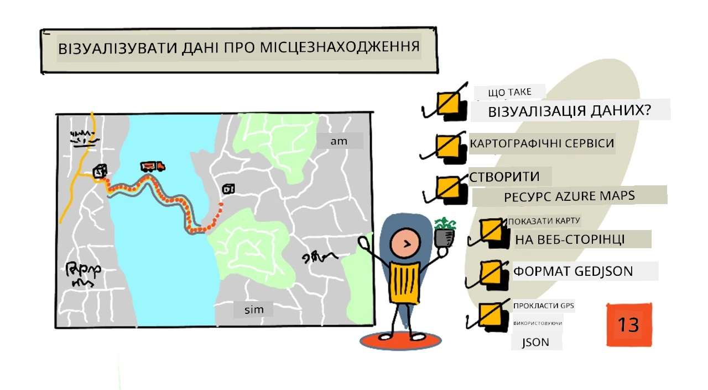
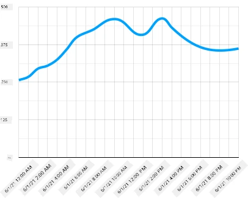
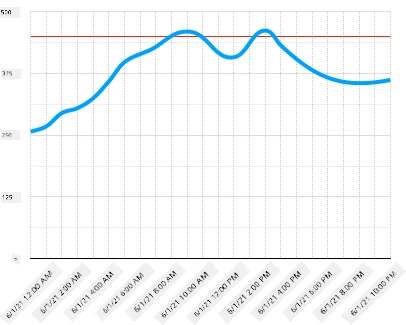
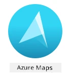
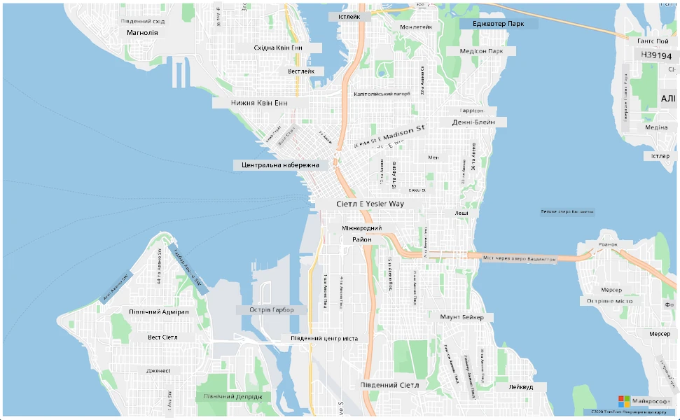
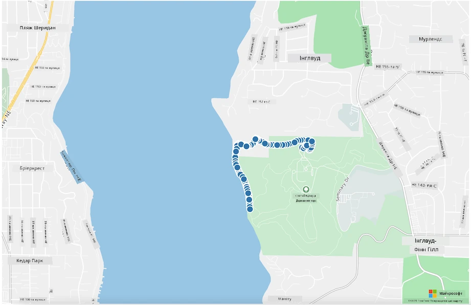

# Візуалізація даних про місцеположення



> Скетчнот від [Nitya Narasimhan](https://github.com/nitya). Натисніть на зображення, щоб побачити його у більшому розмірі.

У цьому відео (англійською) показано огляд Azure Maps для IoT — сервісу, про який ітиметься в цьому уроці.

[](https://www.youtube.com/watch?v=P5i2GFTtb2s)

> 🎥 Натисніть на зображення вище, щоб переглянути відео. У відео показано стару версію Azure Maps. Користуйтеся кодом з уроку.

## Тест перед лекцією

[Тест перед лекцією](https://black-meadow-040d15503.1.azurestaticapps.net/quiz/25)

## Вступ

На минулому уроці ви навчилися за допомогою безсерверного коду зберігати GPS-дані з сенсорів у контейнері хмарного сховища. Тепер ви дізнаєтеся, як показати ці точки на карті Azure. Ви навчитеся створювати карту на вебсторінці, познайомитеся з форматом даних GeoJSON і за його допомогою нанесете на карту всі зібрані GPS-точки.

> 👩‍🏫 **Як проходить цей урок.** Частини з Azure Maps і Azure Storage показує викладач (демо). Студенти виконують [локальний варіант](local-leaflet-map.md): перетворюють CSV-файл з минулого уроку на GeoJSON і показують точки на карті OpenStreetMap у вебсторінці з бібліотекою Leaflet. Обліковий запис Azure і ключі для цього не потрібні. Теоретичні частини уроку, зокрема про формат GeoJSON, читають усі.

У цьому уроці ми розглянемо:

* [Що таке візуалізація даних](#що-таке-візуалізація-даних)
* [Картографічні сервіси](#картографічні-сервіси)
* [Створення ресурсу Azure Maps](#створення-ресурсу-azure-maps)
* [Показ карти на вебсторінці](#показ-карти-на-вебсторінці)
* [Формат GeoJSON](#формат-geojson)
* [Нанесення GPS-даних на карту за допомогою GeoJSON](#нанесення-gps-даних-на-карту-за-допомогою-geojson)

> 💁 У цьому уроці буде трохи HTML і JavaScript. Якщо хочете більше дізнатися про веброзробку на HTML і JavaScript, перегляньте курс [Web development for beginners](https://github.com/microsoft/Web-Dev-For-Beginners).

## Що таке візуалізація даних

Візуалізація даних, як випливає з назви, — це подання даних у вигляді, зрозумілішому для людей. Зазвичай її пов'язують із діаграмами й графіками, але насправді це будь-який спосіб наочно показати дані, щоб люди не лише краще їх розуміли, а й могли ухвалювати рішення.

Простий приклад: у проєкті про ферму ви збирали покази вологості ґрунту. Таблиця з показами вологості ґрунту щогодини за 1 червня 2021 року може виглядати так:

| Дата             | Показ |
| ---------------- | ------: |
| 01/06/2021 00:00 |     257 |
| 01/06/2021 01:00 |     268 |
| 01/06/2021 02:00 |     295 |
| 01/06/2021 03:00 |     305 |
| 01/06/2021 04:00 |     325 |
| 01/06/2021 05:00 |     359 |
| 01/06/2021 06:00 |     398 |
| 01/06/2021 07:00 |     410 |
| 01/06/2021 08:00 |     429 |
| 01/06/2021 09:00 |     451 |
| 01/06/2021 10:00 |     460 |
| 01/06/2021 11:00 |     452 |
| 01/06/2021 12:00 |     420 |
| 01/06/2021 13:00 |     408 |
| 01/06/2021 14:00 |     431 |
| 01/06/2021 15:00 |     462 |
| 01/06/2021 16:00 |     432 |
| 01/06/2021 17:00 |     402 |
| 01/06/2021 18:00 |     387 |
| 01/06/2021 19:00 |     360 |
| 01/06/2021 20:00 |     358 |
| 01/06/2021 21:00 |     354 |
| 01/06/2021 22:00 |     356 |
| 01/06/2021 23:00 |     362 |

Людині важко зрозуміти такі дані. Це просто стіна чисел без очевидного змісту. Першим кроком до візуалізації може бути лінійний графік:



Його можна покращити, додавши лінію, що показує, коли вмикалася автоматична система поливу — при показі вологості ґрунту 450:



З цього графіка одразу видно не лише рівень вологості ґрунту, а й моменти, коли вмикався полив.

Графіки — не єдиний інструмент візуалізації даних. IoT-пристрої для стеження за погодою можуть мати вебзастосунки чи мобільні застосунки, які показують погоду символами: хмаринка для хмарного дня, хмаринка з дощем для дощового тощо. Способів візуалізувати дані безліч: багато серйозних, а деякі й веселі.

✅ Згадайте, які способи візуалізації даних ви бачили. Які з них були найзрозумілішими й найшвидше допомагали ухвалити рішення?

Найкращі візуалізації дають людям змогу швидко ухвалювати рішення. Наприклад, стіна з датчиками, що показують усілякі параметри промислового обладнання, важко сприймається, а от червона лампочка, яка блимає, коли щось пішло не так, одразу підказує, що робити. Іноді найкраща візуалізація — це блимаюча лампочка!

Для GPS-даних найзрозуміліша візуалізація — точки на карті. Наприклад, карта з вантажівками доставки допоможе працівникам переробного заводу бачити, коли прибудуть машини. Якщо карта показує не лише значки вантажівок у їхньому поточному місцеположенні, а й дає уявлення про вантаж, працівники заводу можуть підготуватися: побачивши, що поруч рефрижератор, вони знатимуть, що треба звільнити місце в холодильній камері.

## Картографічні сервіси

Працювати з картами цікаво, і вибір сервісів великий: Bing Maps, Leaflet, OpenStreetMap, Google Maps та інші. У цьому уроці ви познайомитеся з [Azure Maps](https://azure.microsoft.com/products/azure-maps/) і тим, як показати в ньому свої GPS-дані.



Azure Maps — це «набір геопросторових сервісів і SDK, що використовують актуальні картографічні дані, щоб надати географічний контекст вебзастосункам і мобільним застосункам». Розробники отримують інструменти для створення гарних інтерактивних карт, які можуть, наприклад, пропонувати маршрути з урахуванням заторів, показувати інформацію про дорожні події, навігацію всередині будівель, пошук, дані про висоту, погоду тощо.

✅ Поекспериментуйте з [прикладами коду для карт](https://samples.azuremaps.com/).

Карти можна показувати як порожнє полотно, тайли, супутникові знімки, супутникові знімки з накладеними дорогами, різні види карт у відтінках сірого, карти з тіньовим рельєфом, нічні карти та висококонтрастну карту. Карти можна оновлювати в реальному часі, інтегрувавши їх з [Azure Event Grid](https://azure.microsoft.com/products/event-grid/). Поведінку й вигляд карт можна налаштовувати, вмикаючи різні елементи керування, щоб карта реагувала на події, як-от масштабування жестом, перетягування і клацання. Щоб змінити вигляд карти, можна додавати шари: бульбашки, лінії, багатокутники, теплові карти тощо. Який стиль карти ви реалізуєте, залежить від вибраного SDK.

До API Azure Maps можна звертатися через [REST API](https://learn.microsoft.com/rest/api/maps/) або через [Web SDK](https://learn.microsoft.com/azure/azure-maps/how-to-use-map-control). Колись для мобільних застосунків був і Android SDK, але Microsoft його вже не підтримує.

У цьому уроці ви за допомогою Web SDK намалюєте карту й покажете на ній шлях, який пройшов ваш GPS-сенсор.

> ⚠️ **Актуальні версії.** Web SDK версії 2 (посилання з `/mapcontrol/2/`, як у старих прикладах і відео) вимкнено 30 вересня 2026 року, а старий Render API v1 — у вересні 2026 року. Тарифи першого покоління (Gen1, наприклад `S0` і `S1`) також виведено з експлуатації. У цьому уроці використано Web SDK версії 3 і тариф Gen2. Якщо знайдете в Інтернеті приклад з `/mapcontrol/2/`, замініть у посиланнях `2` на `3`.

## Створення ресурсу Azure Maps

Перший крок — створити обліковий запис Azure Maps.

> 👩‍🏫 Цю частину показує викладач (демо). Студенти виконують [локальний варіант з Leaflet і OpenStreetMap](local-leaflet-map.md), якому не потрібні ні обліковий запис, ні ключ.

### Завдання: створіть ресурс Azure Maps

1. Виконайте в терміналі чи командному рядку таку команду, щоб створити ресурс Azure Maps у групі ресурсів `gps-sensor`:

    ```sh
    az maps account create --name gps-sensor \
                           --resource-group gps-sensor \
                           --accept-tos \
                           --kind Gen2 \
                           --sku G2
    ```

    Буде створено ресурс Azure Maps з назвою `gps-sensor`. Використовується тариф `G2` (Gen2) — платний тариф із широким набором можливостей, але з щедрою кількістю безкоштовних викликів щомісяця.

    > 💁 Скільки коштує Azure Maps, дивіться на [сторінці цін Azure Maps](https://azure.microsoft.com/pricing/details/azure-maps/).

1. Для ресурсу карт потрібен ключ API. Отримайте його такою командою:

    ```sh
    az maps account keys list --name gps-sensor \
                              --resource-group gps-sensor \
                              --output table
    ```

    Скопіюйте значення `PrimaryKey`.

## Показ карти на вебсторінці

Тепер можна перейти до наступного кроку — показати карту на вебсторінці. Для цього невеликого вебзастосунку вистачить одного `html`-файлу. Пам'ятайте, що в реальному або командному проєкті вебзастосунок, найімовірніше, складатиметься з більшої кількості частин!

> 👩‍🏫 Цю частину показує викладач (демо). У [локальному варіанті](local-leaflet-map.md) карту показує бібліотека Leaflet.

### Завдання: покажіть карту на вебсторінці

1. Створіть файл index.html у будь-якій папці на своєму комп'ютері. Додайте HTML-розмітку для карти:

    ```html
    <!DOCTYPE html>
    <html>
    <head>
        <meta charset="utf-8">
        <style>
            html, body, #myMap {
                width: 100%;
                height: 100%;
                margin: 0;
            }
        </style>
    </head>

    <body onload="init()">
        <div id="myMap"></div>
    </body>
    </html>
    ```

    Карта завантажиться в `div` з ідентифікатором `myMap`. Кілька стилів розтягують її на всю ширину й висоту сторінки.

    > 🎓 `div` — це розділ вебсторінки, якому можна дати назву й задати стиль.

1. Одразу після відкривального тегу `<head>` додайте зовнішню таблицю стилів, яка керує виглядом карти, і зовнішній скрипт Web SDK, який керує її поведінкою:

    ```html
    <link rel="stylesheet" href="https://atlas.microsoft.com/sdk/javascript/mapcontrol/3/atlas.min.css" type="text/css" />
    <script src="https://atlas.microsoft.com/sdk/javascript/mapcontrol/3/atlas.min.js"></script>
    ```

    Таблиця стилів визначає, як виглядає карта, а файл скрипту містить код для завантаження карти. Підключення цього коду схоже на підключення заголовкових файлів у C++ чи імпорт модулів у Python.

1. Під цим скриптом додайте блок скрипту, який запускає карту:

    ```javascript
    <script type='text/javascript'>
        function init() {
            var map = new atlas.Map('myMap', {
                center: [-122.26473, 47.73444],
                zoom: 12,
                authOptions: {
                    authType: "subscriptionKey",
                    subscriptionKey: "<subscription_key>"
                }
            });
        }
    </script>
    ```

    Замініть `<subscription_key>` на ключ API свого облікового запису Azure Maps.

    Якщо відкрити сторінку `index.html` у браузері, завантажиться карта з центром у районі Сіетла.

    

    ✅ Поекспериментуйте з параметрами zoom і center, щоб змінити вигляд карти. Можна вказати інші координати, що відповідають широті й довготі ваших даних, і перемістити центр карти.

> 💁 Зручніше працювати з вебзастосунками локально через [http-server](https://www.npmjs.com/package/http-server). Для цього інструмента потрібні [node.js](https://nodejs.org/) і [npm](https://www.npmjs.com/). Коли їх установлено, перейдіть у папку з файлом `index.html` і виконайте `http-server`. Вебзастосунок відкриється на локальному вебсервері за адресою [http://127.0.0.1:8080/](http://127.0.0.1:8080/). Якщо у вас є лише Python, той самий результат дасть команда `python -m http.server 8080`.

## Формат GeoJSON

Тепер, коли вебзастосунок показує карту, потрібно витягти GPS-дані з облікового запису сховища й показати їх шаром маркерів поверх карти. Перш ніж це зробити, розгляньмо формат [GeoJSON](https://uk.wikipedia.org/wiki/GeoJSON), якого потребує Azure Maps.

[GeoJSON](https://geojson.org/) — це відкритий стандарт на основі JSON зі спеціальним форматуванням для географічних даних. Познайомитися з ним можна, випробовуючи приклади даних на [geojson.io](https://geojson.io). Цей інструмент також зручний для налагодження GeoJSON-файлів.

Приклад даних GeoJSON:

```json
{
  "type": "FeatureCollection",
  "features": [
    {
      "type": "Feature",
      "geometry": {
        "type": "Point",
        "coordinates": [
          -2.10237979888916,
          57.164918677004714
        ]
      }
    }
  ]
}
```

Зверніть увагу на вкладеність: дані — це об'єкт `Feature` (об'єкт карти) усередині колекції `FeatureCollection`. У цьому об'єкті є `geometry` (геометрія) з координатами `coordinates`, що задають широту й довготу.

✅ Створюючи GeoJSON, стежте за порядком широти й довготи в об'єкті, інакше точки опиняться не там, де мають бути! GeoJSON очікує для точок порядок `lon,lat` (довгота, широта), а не `lat,lon`.

`Geometry` може мати різні типи, наприклад одну точку або багатокутник. У цьому прикладі це точка з двома координатами: довготою і широтою.

✅ Azure Maps підтримує стандартний GeoJSON, а також деякі [розширені можливості](https://learn.microsoft.com/azure/azure-maps/extend-geojson), зокрема можливість малювати кола та інші геометричні фігури.

## Нанесення GPS-даних на карту за допомогою GeoJSON

Тепер усе готово, щоб використати дані зі сховища, яке ви створили на минулому уроці. Нагадаємо: вони зберігаються як набір файлів у blob-сховищі, тож вам потрібно отримати ці файли й розібрати їх, щоб Azure Maps могла використати дані.

> 👩‍🏫 Цю частину показує викладач (демо). У [локальному варіанті](local-leaflet-map.md) GPS-точки беруться з CSV-файлу з минулого уроку.

### Завдання: налаштуйте сховище для доступу з вебсторінки

Якщо звернутися до сховища по дані, можна несподівано побачити помилки в консолі браузера. Річ у тім, що для цього сховища треба налаштувати дозволи [CORS](https://developer.mozilla.org/docs/Web/HTTP/CORS), щоб зовнішні вебзастосунки могли читати його дані.

> 🎓 CORS розшифровується як Cross-Origin Resource Sharing (спільне використання ресурсів між різними джерелами). Зазвичай в Azure його потрібно явно налаштовувати з міркувань безпеки. Він не дає непередбаченим сайтам отримати доступ до ваших даних.

1. Виконайте таку команду, щоб увімкнути CORS:

    ```sh
    az storage cors add --methods GET \
                        --origins "*" \
                        --services b \
                        --account-name <storage_name> \
                        --account-key <key1>
    ```

    Замініть `<storage_name>` на ім'я свого облікового запису сховища, а `<key1>` — на ключ облікового запису сховища.

    Ця команда дозволяє будь-якому вебсайту (символ підстановки `*` означає «будь-який») робити *GET*-запити, тобто отримувати дані з вашого облікового запису сховища. Параметр `--services b` означає, що налаштування застосовується лише до блобів.

### Завдання: завантажте GPS-дані зі сховища

1. Замініть увесь вміст функції `init` на такий код:

    ```javascript
    fetch("https://<storage_name>.blob.core.windows.net/gps-data/?restype=container&comp=list")
        .then(response => response.text())
        .then(str => new window.DOMParser().parseFromString(str, "text/xml"))
        .then(xml => {
            let blobList = Array.from(xml.querySelectorAll("Url"));
            return Promise.all(blobList.map(blobUrl => loadJSON(blobUrl.textContent)));
        })
        .then(features => {
            map = new atlas.Map('myMap', {
                center: [-122.26473, 47.73444],
                zoom: 14,
                authOptions: {
                    authType: "subscriptionKey",
                    subscriptionKey: "<subscription_key>"
                }
            });
            map.events.add('ready', function () {
                var source = new atlas.source.DataSource();
                map.sources.add(source);
                map.layers.add(new atlas.layer.BubbleLayer(source));
                source.add(features);
            });
        });
    ```

    Замініть `<storage_name>` на ім'я свого облікового запису сховища, а `<subscription_key>` — на ключ API облікового запису Azure Maps.

    Тут відбувається кілька речей. Спочатку код отримує GPS-дані з blob-контейнера за URL-адресою, побудованою з імені облікового запису сховища. Ця адреса звертається до контейнера `gps-data`, вказує, що тип ресурсу — контейнер (`restype=container`), і отримує список усіх блобів (`comp=list`). Цей список не містить самих блобів, але для кожного блоба повертає URL-адресу, за якою можна завантажити його дані.

    > 💁 Цю URL-адресу можна відкрити в браузері й побачити відомості про всі блоби в контейнері. Кожен елемент матиме властивість `Url`, яку теж можна відкрити в браузері, щоб побачити вміст блоба.

    Далі код завантажує кожен блоб, викликаючи функцію `loadJSON`, яку ви створите наступною. `Promise.all` чекає, доки завантажаться всі блоби, і лише потім код створює елемент керування картою й додає код для події `ready`. Ця подія спрацьовує, коли карту показано на вебсторінці.

    Обробник події `ready` створює джерело даних Azure Maps — контейнер для GeoJSON-даних — і заповнює його завантаженими точками. Із цього джерела даних створюється бульбашковий шар (bubble layer), тобто набір кіл на карті з центрами в кожній точці GeoJSON.

1. Додайте у свій блок скрипту, під функцією `init`, змінну `map` і функцію `loadJSON`:

    ```javascript
    var map;

    function loadJSON(file) {
        return fetch(file)
            .then(response => response.json())
            .then(gps => new atlas.data.Feature(
                new atlas.data.Point([parseFloat(gps.gps.lon), parseFloat(gps.gps.lat)])
            ));
    }
    ```

    Цю функцію викликає код вище для кожного блоба. Вона завантажує JSON-документ і перетворює його GPS-дані на координати довготи й широти для GeoJSON. Розібрані дані стають GeoJSON-об'єктом `Feature`. Коли карту буде ініціалізовано, уздовж шляху, яким рухався пристрій, з'являться маленькі бульбашки.

1. Відкрийте HTML-сторінку в браузері. Вона завантажить карту, потім усі GPS-дані зі сховища й нанесе їх на карту.

    

> 💁 Цей код є в папці [code](./code).

---

## 🚀 Виклик

Добре вміти показувати статичні дані на карті як маркери. А чи зможете ви покращити цей вебзастосунок, додавши анімацію, щоб показати, як маркери рухалися з часом, використовуючи JSON-файли з позначками часу? Ось [кілька прикладів](https://samples.azuremaps.com/) анімації на картах.

## Тест після лекції

[Тест після лекції](https://black-meadow-040d15503.1.azurestaticapps.net/quiz/26)

## Огляд і самостійне навчання

Azure Maps особливо корисна для роботи з IoT-пристроями.

* Дослідіть деякі варіанти використання в [документації Azure Maps на Microsoft Learn](https://learn.microsoft.com/azure/azure-maps/tutorial-iot-hub-maps).
* Поглибте знання про створення карт і маршрутних точок за допомогою [модуля самостійного навчання на Microsoft Learn про створення першого застосунку для пошуку маршрутів з Azure Maps](https://learn.microsoft.com/training/modules/create-your-first-app-with-azure-maps/).

## Завдання

[Розгорніть свій застосунок](assignment.md)

---

> **Про цю версію.** Урок адаптовано українською на основі курсу [IoT for Beginners](https://github.com/microsoft/IoT-For-Beginners) від Microsoft (ліцензія MIT). Частини з Azure позначено як демо для викладача, для студентів додано [локальний варіант](local-leaflet-map.md) з Leaflet і OpenStreetMap. Демо оновлено до Azure Maps Web SDK v3 і тарифу Gen2, а в коді завантаження точок виправлено помилку: оригінальний код створював карту, не дочекавшись завантаження всіх блобів, і показував лише частину точок.
