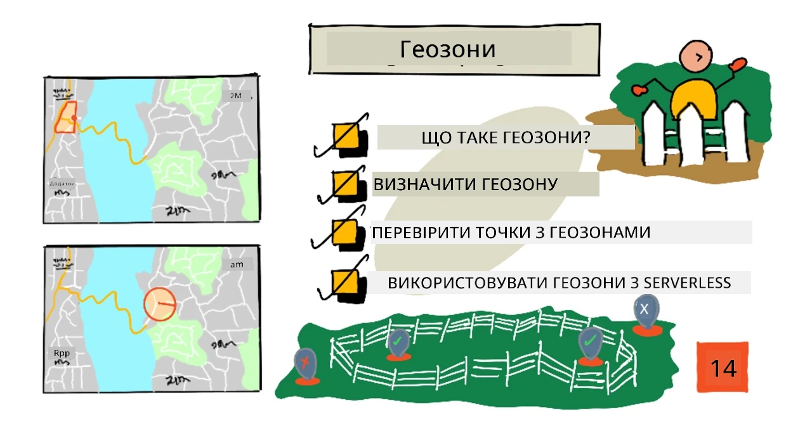
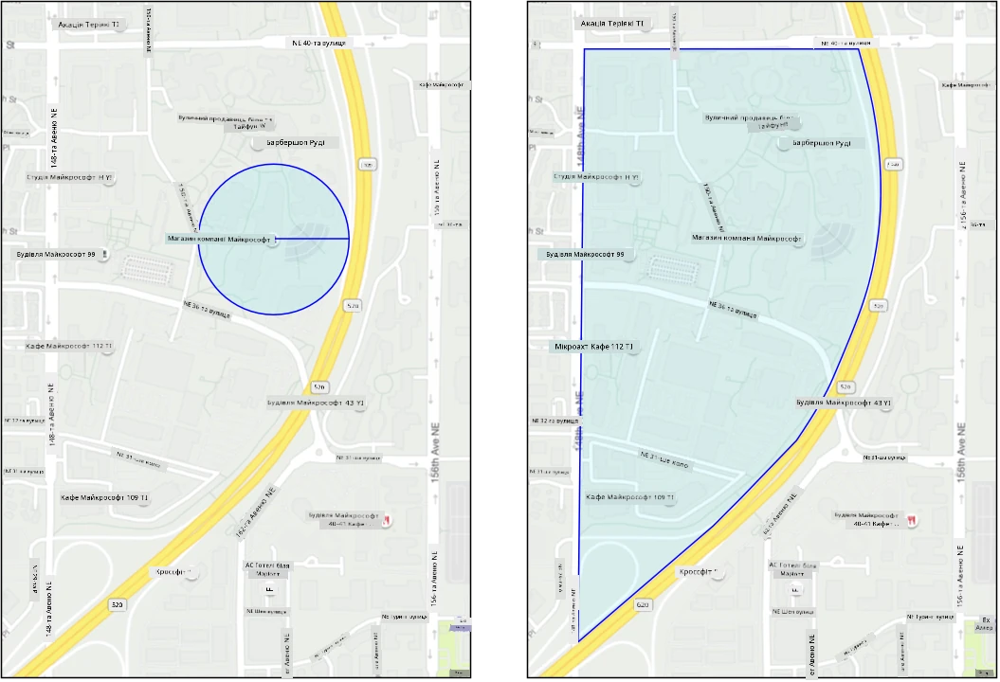
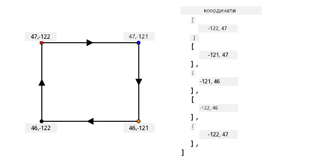
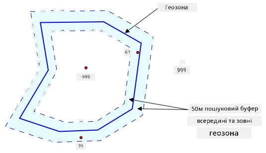
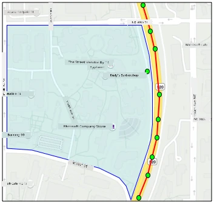
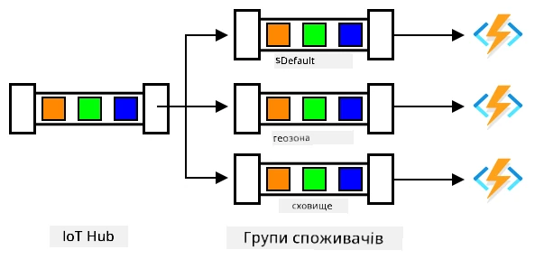

# Геозони



> Скетчнот від [Nitya Narasimhan](https://github.com/nitya). Натисніть на зображення, щоб побачити його у більшому розмірі.

У цьому відео (англійською) показано огляд геозон і того, як працювати з ними в Azure Maps. Ці теми розглядаються в уроці:

[](https://www.youtube.com/watch?v=nsrgYhaYNVY)

> 🎥 Натисніть на зображення вище, щоб переглянути відео. Показані у відео API геозон Azure Maps уже виведено з експлуатації (див. нижче).

## Тест перед лекцією

[Тест перед лекцією](https://black-meadow-040d15503.1.azurestaticapps.net/quiz/27)

## Вступ

На трьох попередніх уроках ви за допомогою IoT визначали місцеположення вантажівок, що везуть вашу продукцію з ферми до переробного хабу. Ви отримували GPS-дані, надсилали їх у хмару на зберігання й показували на карті. Наступний крок до ефективнішого ланцюга постачання — отримувати сповіщення, коли вантажівка ось-ось прибуде до переробного хабу. Тоді бригада розвантаження з навантажувачами та іншим обладнанням буде готова, щойно машина приїде. Так розвантаження пройде швидко, і вам не доведеться платити за простій вантажівки й водія.

У цьому уроці ви дізнаєтеся про геозони — визначені геопросторові області, наприклад зону в межах 2 км їзди від переробного хабу, — і про те, як перевірити, чи перебувають GPS-координати всередині геозони чи поза нею. Так можна дізнатися, чи ваш GPS-сенсор прибув у певну область або залишив її.

> 👩‍🏫 **Як проходить цей урок.** Сервіси Azure Maps для геозон, використані в оригінальному уроці (Data API v1 для завантаження геозон і Spatial API для їх перевірки), Microsoft уже вивела з експлуатації. Ці частини залишено як історичну довідку й демо, позначені нижче. Студенти виконують [локальний варіант](local-geofence-shapely.md): геозона — це GeoJSON-багатокутник у файлі, а точки перевіряє Python-бібліотека [shapely](https://shapely.readthedocs.io) на вашому комп'ютері. Теоретичні частини уроку читають усі.

У цьому уроці ми розглянемо:

* [Що таке геозони](#що-таке-геозони)
* [Як задати геозону](#як-задати-геозону)
* [Перевірка точок щодо геозони](#перевірка-точок-щодо-геозони)
* [Використання геозон у безсерверному коді](#використання-геозон-у-безсерверному-коді)

> 🗑 Це останній урок у цьому проєкті, тож після уроку й завдання не забудьте видалити свої хмарні сервіси. Вони знадобляться для виконання завдання, тому спершу виконайте його.
>
> За потреби скористайтеся [посібником з очищення проєкту](https://github.com/microsoft/IoT-For-Beginners/blob/main/clean-up.md) (ще не адаптовано, оригінал англійською).

## Що таке геозони

Геозона (geofence) — це віртуальний периметр навколо реальної географічної області. Геозона може бути колом, заданим точкою і радіусом (наприклад, коло діаметром 100 м навколо будівлі), або багатокутником, що охоплює певну територію: шкільну зону, межі міста, університетське чи офісне містечко.



> 💁 Можливо, ви вже користувалися геозонами, навіть не знаючи цього. Якщо ви ставили нагадування з прив'язкою до місця в застосунку «Нагадування» на iOS або в Google Keep, ви використовували геозону. Ці застосунки створюють геозону навколо вказаного місця й нагадують вам, коли телефон потрапляє в неї.

Знати, що машина перебуває всередині геозони чи поза нею, корисно з багатьох причин:

* Підготовка до розвантаження: сповіщення, що машина прибула на місце, дає бригаді змогу підготуватися до розвантаження й скоротити простій машини. Так водій може за день зробити більше доставок і менше чекати.
* Податки: у деяких країнах, як-от у Новій Зеландії, дорожній податок для дизельних машин рахують за вагою машини лише під час руху дорогами загального користування. Геозони дають змогу окремо рахувати пробіг громадськими дорогами й приватними, наприклад на території ферм чи лісорозробок.
* Виявлення крадіжок: якщо машина має залишатися в певній області, наприклад на фермі, і виїжджає за межі геозони, її, можливо, викрали.
* Дотримання правил щодо місць: деякі частини робочого майданчика, ферми чи фабрики можуть бути закриті для певних машин. Наприклад, машини, що везуть мінеральні добрива й пестициди, не можна пускати на поля з органічною продукцією. Якщо машина в'їжджає в геозону, вона порушує правила, і водію можна надіслати сповіщення.

✅ Які ще застосування геозон ви можете придумати?

Azure Maps, сервіс, яким ви на минулому уроці показували GPS-дані, дозволяв задавати геозони, а потім перевіряти, чи точка всередині геозони чи поза нею.

## Як задати геозону

Геозони задають у форматі GeoJSON, так само як точки, що ви додавали на карту на минулому уроці. Тільки тут замість колекції `FeatureCollection` зі значеннями `Point` буде колекція `FeatureCollection`, що містить `Polygon` (багатокутник).

```json
{
   "type": "FeatureCollection",
   "features": [
     {
       "type": "Feature",
       "geometry": {
         "type": "Polygon",
         "coordinates": [
           [
             [
               -122.13393688201903,
               47.63829579223815
             ],
             [
               -122.13389128446579,
               47.63782047131512
             ],
             [
               -122.13240802288054,
               47.63783312249837
             ],
             [
               -122.13238388299942,
               47.63829037035086
             ],
             [
               -122.13393688201903,
               47.63829579223815
             ]
           ]
         ]
       },
       "properties": {
         "geometryId": "1"
       }
     }
   ]
}
```

Кожна точка багатокутника задається парою «довгота, широта» в масиві, а ці точки зібрано в масив, який записано в `coordinates`. Для `Point` на минулому уроці `coordinates` був масивом із 2 значень, довготи й широти, а для `Polygon` це масив масивів по 2 значення: довгота, широта.

> 💁 Пам'ятайте: GeoJSON використовує для точок порядок `довгота, широта`, а не `широта, довгота`.

Масив координат багатокутника завжди має на 1 елемент більше, ніж точок у багатокутнику: останній елемент збігається з першим і замикає багатокутник. Наприклад, для прямокутника буде 5 точок.



На зображенні вище — прямокутник. Координати багатокутника починаються з лівого верхнього кута в точці 47,-122, далі йдуть праворуч до 47,-121, потім униз до 46,-121, потім ліворуч до 46,-122 і знову вгору до початкової точки 47,-122. Отже, багатокутник має 5 точок: лівий верхній, правий верхній, правий нижній, лівий нижній кути і знову лівий верхній, що замикає фігуру.

✅ Спробуйте створити GeoJSON-багатокутник навколо свого дому чи університету. Скористайтеся інструментом на кшталт [GeoJSON.io](https://geojson.io/).

### Завдання: задайте геозону

> ⚠️ **Історична довідка (демо).** API завантаження даних Azure Maps (Data API v1, `mapData/upload`), який використано в цьому завданні, вимкнено у вересні 2024 року, а Spatial API для перевірки геозон теж виведено з експлуатації. Команди нижче більше не працюють, їх залишено, щоб показати, як працювала перевірка геозон у хмарі. Студенти задають геозону у файлі `geofence.json` у [локальному варіанті](local-geofence-shapely.md).

Щоб використати геозону в Azure Maps, спершу її треба було завантажити у свій обліковий запис Azure Maps. Після завантаження ви отримували унікальний ID, за яким можна перевіряти точку щодо геозони. Для завантаження геозон в Azure Maps використовували вебAPI карт. Викликати вебAPI Azure Maps можна інструментом [curl](https://curl.se).

> 🎓 Curl — це інструмент командного рядка для надсилання запитів до вебадрес.

1. Якщо у вас Linux, macOS або Windows 10 чи новіша, curl, імовірно, уже встановлено. Щоб перевірити, виконайте в терміналі чи командному рядку:

    ```sh
    curl --version
    ```

    Якщо інформація про версію не з'явилася, встановіть curl зі [сторінки завантажень curl](https://curl.se/download.html).

    > 💁 Якщо ви вмієте працювати з Postman, можете скористатися ним.

1. Створіть GeoJSON-файл із багатокутником. Ви перевірятимете його за допомогою свого GPS-сенсора, тож створіть багатокутник навколо свого поточного місцеположення. Його можна створити вручну, відредагувавши наведений вище приклад GeoJSON, або в інструменті на кшталт [GeoJSON.io](https://geojson.io/).

    GeoJSON має містити колекцію `FeatureCollection` з об'єктом `Feature`, у якого `geometry` має тип `Polygon`.

    Ви **ОБОВ'ЯЗКОВО** маєте також додати елемент `properties` на тому самому рівні, що й `geometry`, і в ньому має бути `geometryId`:

    ```json
    "properties": {
        "geometryId": "1"
    }
    ```

    Якщо ви користуєтеся [GeoJSON.io](https://geojson.io/), цей елемент доведеться вручну додати в порожній елемент `properties` — або після завантаження JSON-файлу, або в JSON-редакторі застосунку.

    `geometryId` має бути унікальним у межах цього файлу. Можна завантажити кілька геозон як кілька об'єктів `Feature` у колекції `FeatureCollection` одного GeoJSON-файлу, якщо в кожного свій `geometryId`. Багатокутники можуть мати однаковий `geometryId`, якщо їх завантажено з різних файлів у різний час.

1. Збережіть цей файл як `geofence.json` і перейдіть у терміналі чи консолі в папку, де його збережено.

1. Виконайте таку команду curl, щоб створити геозону:

    ```sh
    curl --request POST 'https://atlas.microsoft.com/mapData/upload?api-version=1.0&dataFormat=geojson&subscription-key=<subscription_key>' \
         --header 'Content-Type: application/json' \
         --include \
         --data @geofence.json
    ```

    Замініть `<subscription_key>` в URL-адресі на ключ API свого облікового запису Azure Maps.

    URL-адреса використовується для завантаження картографічних даних через API `https://atlas.microsoft.com/mapData/upload`. Виклик містить параметр `api-version`, що вказує, яку версію API Azure Maps використовувати: так API може змінюватися з часом, зберігаючи зворотну сумісність. Формат завантажуваних даних — `geojson`.

    Команда надішле POST-запит до API завантаження й поверне список заголовків відповіді, серед яких буде заголовок `location`

    ```output
    content-type: application/json
    location: https://us.atlas.microsoft.com/mapData/operations/1560ced6-3a80-46f2-84b2-5b1531820eab?api-version=1.0
    x-ms-azuremaps-region: West US 2
    x-content-type-options: nosniff
    strict-transport-security: max-age=31536000; includeSubDomains
    x-cache: CONFIG_NOCACHE
    date: Sat, 22 May 2021 21:34:57 GMT
    content-length: 0
    ```

    > 🎓 Під час виклику вебадреси можна передати параметри, додавши `?`, а за ним пари «ключ=значення» у вигляді `key=value`, розділені символом `&`.

1. Azure Maps обробляє завантаження не одразу, тож треба перевірити, чи завершився запит на завантаження, за URL-адресою із заголовка `location`. Надішліть GET-запит за цією адресою, щоб дізнатися стан. До кінця URL-адреси з `location` потрібно додати ключ, дописавши `&subscription-key=<subscription_key>` і замінивши `<subscription_key>` на ключ API свого облікового запису Azure Maps. Виконайте таку команду:

    ```sh
    curl --request GET '<location>&subscription-key=<subscription_key>'
    ```

    Замініть `<location>` на значення заголовка `location`, а `<subscription_key>` — на ключ API свого облікового запису Azure Maps.

1. Перевірте значення `status` у відповіді. Якщо воно не `Succeeded`, зачекайте хвилину й спробуйте ще раз.

1. Коли стан стане `Succeeded`, подивіться на `resourceLocation` у відповіді. Там міститься унікальний ID (так званий UDID) GeoJSON-об'єкта. UDID — це значення після `metadata/` без `api-version`. Наприклад, якщо `resourceLocation` такий:

    ```json
    {
      "resourceLocation": "https://us.atlas.microsoft.com/mapData/metadata/7c3776eb-da87-4c52-ae83-caadf980323a?api-version=1.0"
    }
    ```

    то UDID буде `7c3776eb-da87-4c52-ae83-caadf980323a`.

    Збережіть цей UDID: він знадобиться для перевірки геозони.

## Перевірка точок щодо геозони

Після завантаження багатокутника в Azure Maps можна перевірити, чи точка всередині геозони чи поза нею. Для цього надсилають запит до вебAPI, передаючи UDID геозони, а також широту й довготу точки, яку треба перевірити.

Разом із цим запитом можна передати значення `searchBuffer` (буфер пошуку). Воно задає, наскільки точним має бути результат. Річ у тім, що GPS не ідеально точний, і місцеположення іноді може відхилятися на метри, а то й більше. За замовчуванням буфер пошуку дорівнює 50 м, але можна задати значення від 0 до 500 м.

Серед іншого API повертає відстань `distance` до найближчої точки на межі геозони: додатну, якщо точка поза геозоною, і від'ємну, якщо всередині. Якщо ця відстань менша за буфер пошуку, повертається фактична відстань у метрах, інакше значення 999 або -999. 999 означає, що точка поза геозоною далі, ніж буфер пошуку, а -999 — що точка всередині геозони глибше, ніж буфер пошуку.



На зображенні вище геозона має буфер пошуку 50 м.

* Точка в центрі геозони, далеко всередині буфера пошуку, має відстань **-999**
* Точка далеко за межами буфера пошуку має відстань **999**
* Точка всередині геозони й у межах буфера пошуку, за 6 м від межі геозони, має відстань **6 м**
* Точка поза геозоною й у межах буфера пошуку, за 39 м від межі геозони, має відстань **39 м**

Важливо знати відстань до межі геозони й поєднувати її з іншою інформацією, як-от іншими GPS-показами, швидкістю й даними про дороги, коли ви ухвалюєте рішення на основі місцеположення машини.

Наприклад, уявіть, що за GPS-показами машина їде дорогою, яка проходить уздовж геозони. Якщо один неточний GPS-показ помістить машину всередину геозони, хоча проїзду туди немає, його можна проігнорувати.



На зображенні вище геозона покриває частину кампусу Microsoft. Червона лінія показує вантажівку, що їде трасою 520, а кола — GPS-покази. Більшість із них точні й лежать уздовж траси 520, а один неточний показ опинився всередині геозони. Цей показ ніяк не може бути правильним: немає доріг, якими вантажівка могла б раптово звернути з траси 520 на територію кампусу, а потім повернутися назад. Код, який перевіряє цю геозону, має враховувати попередні покази, перш ніж діяти на основі результату перевірки.

✅ Які додаткові дані потрібно перевірити, щоб вирішити, чи можна вважати GPS-показ правильним?

> 💁 У [локальному варіанті](local-geofence-shapely.md) ви самі обчислите відстань до межі геозони й використаєте той самий буфер пошуку в 50 м.

### Завдання: перевірте точки щодо геозони

> ⚠️ **Історична довідка (демо).** Spatial API Azure Maps (`spatial/geofence`) виведено з експлуатації, тож запит нижче більше не працює. Студенти перевіряють точки в [локальному варіанті](local-geofence-shapely.md).

1. Спершу складіть URL-адресу запиту до вебAPI. Її формат:

    ```output
    https://atlas.microsoft.com/spatial/geofence/json?api-version=1.0&deviceId=gps-sensor&subscription-key=<subscription-key>&udid=<UDID>&lat=<lat>&lon=<lon>
    ```

    Замініть `<subscription_key>` на ключ API свого облікового запису Azure Maps.

    Замініть `<UDID>` на UDID геозони з попереднього завдання.

    Замініть `<lat>` і `<lon>` на широту й довготу, які хочете перевірити.

    Ця URL-адреса використовує API `https://atlas.microsoft.com/spatial/geofence/json` для запиту до геозони, заданої у GeoJSON. Вона звертається до API версії `1.0`. Параметр `deviceId` обов'язковий і має містити назву пристрою, від якого надійшли широта й довгота.

    Буфер пошуку за замовчуванням — 50 м. Його можна змінити, передавши додатковий параметр `searchBuffer=<distance>`, де `<distance>` — відстань буфера пошуку в метрах від 0 до 500.

1. Надішліть за цією URL-адресою GET-запит за допомогою curl:

    ```sh
    curl --request GET '<URL>'
    ```

    > 💁 Якщо ви отримали код відповіді `BadRequest` з помилкою:
    >
    > ```output
    > Invalid GeoJSON: All feature properties should contain a geometryId, which is used for identifying the geofence.
    > ```
    >
    > значить, у вашому GeoJSON немає розділу `properties` з `geometryId`. Треба виправити GeoJSON, а потім повторити кроки вище, щоб завантажити його знову й отримати новий UDID.

1. Відповідь міститиме список `geometries`, по одному елементу для кожного багатокутника в GeoJSON, з якого створено геозону. У кожного елемента є 3 цікаві поля: `distance`, `nearestLat` і `nearestLon`.

    ```output
    {
        "geometries": [
            {
                "deviceId": "gps-sensor",
                "udId": "7c3776eb-da87-4c52-ae83-caadf980323a",
                "geometryId": "1",
                "distance": 999.0,
                "nearestLat": 47.645875,
                "nearestLon": -122.142713
            }
        ],
        "expiredGeofenceGeometryId": [],
        "invalidPeriodGeofenceGeometryId": []
    }
    ```

    * `nearestLat` і `nearestLon` — широта й довгота точки на межі геозони, найближчої до перевірюваного місця.

    * `distance` — відстань від перевірюваного місця до найближчої точки на межі геозони. Від'ємні числа означають «всередині геозони», додатні — «поза нею». Це значення буде меншим за 50 (буфер пошуку за замовчуванням) або дорівнюватиме 999.

1. Повторіть це кілька разів для місць усередині геозони й поза нею.

## Використання геозон у безсерверному коді

Тепер можна додати в застосунок Functions новий тригер, який перевірятиме GPS-дані з подій IoT Hub щодо геозони.

> 👩‍🏫 Цю частину показує викладач (демо). Оскільки Spatial API виведено з експлуатації, у демо-коді геозона перевіряється бібліотекою shapely прямо у функції, так само як у [локальному варіанті](local-geofence-shapely.md) для студентів.

### Групи споживачів

Як ви пам'ятаєте з попередніх уроків, IoT Hub дає змогу повторно відтворити події, які хаб отримав, але ще ніхто не обробив. А що станеться, якщо підключиться кілька тригерів? Як хаб дізнається, який із них які події обробив?

Ніяк! Натомість можна визначити кілька окремих підключень для читання подій, і кожне з них окремо керує повторним відтворенням непрочитаних повідомлень. Їх називають *групами споживачів* (consumer groups). Підключаючись до кінцевої точки, ви вказуєте, до якої групи споживачів хочете підключитися. Кожен компонент застосунку підключається до своєї групи споживачів.



Теоретично до кожної групи споживачів можуть підключитися до 5 застосунків, і всі вони отримуватимуть повідомлення, щойно ті надійдуть. Найкраща практика — підключати до кожної групи споживачів лише один застосунок, щоб уникнути повторної обробки повідомлень і гарантувати, що після перезапуску всі повідомлення з черги буде правильно оброблено. Наприклад, якщо запустити застосунок Functions локально і водночас у хмарі, обидва оброблятимуть повідомлення, і в обліковому записі сховища з'являться дублікати блобів.

Якщо переглянути тригер IoT Hub, створений на одному з попередніх уроків, ви побачите групу споживачів у параметрах декоратора тригера Event Hub:

```python
consumer_group='$Default'
```

Під час створення IoT Hub автоматично створюється група споживачів `$Default`. Якщо ви хочете додати ще один тригер, для нього можна створити нову групу споживачів.

> 💁 У цьому уроці геозону перевіряє інша функція, ніж та, що зберігає GPS-дані. Так ви побачите, як використовувати групи споживачів, а код буде розділено й легше читати. У робочому застосунку архітектура може бути різною: обидві перевірки в одній функції, тригер на обліковому записі сховища, який запускає функцію перевірки геозони, або кілька функцій. Єдино правильного способу немає, усе залежить від решти застосунку та ваших потреб.

### Завдання: створіть нову групу споживачів

1. Виконайте таку команду, щоб створити для свого IoT Hub нову групу споживачів `geofence`:

    ```sh
    az iot hub consumer-group create --name geofence \
                                     --hub-name <hub_name>
    ```

    Замініть `<hub_name>` на ім'я свого IoT Hub.

1. Щоб побачити всі групи споживачів IoT Hub, виконайте таку команду:

    ```sh
    az iot hub consumer-group list --output table \
                                   --hub-name <hub_name>
    ```

    Замініть `<hub_name>` на ім'я свого IoT Hub. Команда виведе всі групи споживачів.

    ```output
    Name      ResourceGroup
    --------  ---------------
    $Default  gps-sensor
    geofence  gps-sensor
    ```

> 💁 Коли на одному з попередніх уроків ви запускали монітор подій IoT Hub, він підключався до групи споживачів `$Default`. Саме тому не можна було одночасно запускати монітор подій і тригер подій. Якщо хочете запускати обидва, використовуйте для всіх застосунків Functions інші групи споживачів, а `$Default` залиште для монітора подій.

### Завдання: створіть новий тригер IoT Hub

1. Додайте в застосунок Functions `gps-trigger`, створений на одному з попередніх уроків, новий тригер подій IoT Hub. Назвіть функцію `geofence_trigger`.

    > ⚠️ За потреби скористайтеся [інструкціями зі створення тригера подій IoT Hub з проєкту 2, уроку 5](../../../2-farm/lessons/5-migrate-application-to-the-cloud/README.md).

1. Укажіть у декораторі тригера рядок підключення до IoT Hub (`connection='IOT_HUB_CONNECTION_STRING'`). Файл `local.settings.json` спільний для всіх тригерів застосунку Functions.

1. Укажіть у декораторі нову групу споживачів `geofence`:

    ```python
    @app.event_hub_message_trigger(arg_name='events',
                                   event_hub_name='samples-workitems',
                                   connection='IOT_HUB_CONNECTION_STRING',
                                   cardinality=func.Cardinality.MANY,
                                   consumer_group='geofence')
    def geofence_trigger(events: list[func.EventHubEvent]):
        for event in events:
            pass
    ```

1. Запустіть застосунок Functions і переконайтеся, що він підключається й обробляє повідомлення. Тригер `iot_hub_trigger` з попереднього уроку теж працюватиме й завантажуватиме блоби в сховище.

    > Щоб уникнути дублікатів GPS-показів у blob-сховищі, можна зупинити застосунок Functions, що працює в хмарі. Для цього виконайте таку команду:
    >
    > ```sh
    > az functionapp stop --resource-group gps-sensor \
    >                     --name <functions_app_name>
    > ```
    >
    > Замініть `<functions_app_name>` на ім'я свого застосунку Functions.
    >
    > Пізніше його можна знову запустити такою командою:
    >
    > ```sh
    > az functionapp start --resource-group gps-sensor \
    >                     --name <functions_app_name>
    > ```
    >
    > Замініть `<functions_app_name>` на ім'я свого застосунку Functions.

### Завдання: перевірте геозону з тригера

Раніше в цьому уроці ви за допомогою curl запитували в геозони, чи точка всередині неї чи поза нею. В оригінальному уроці тригер робив такий самий вебзапит до Spatial API. Оскільки цей API виведено з експлуатації, тепер функція перевіряє точку сама, за допомогою бібліотеки shapely.

1. Скопіюйте файл `geofence.json` з багатокутником у папку проєкту `gps-trigger`, поруч із `function_app.py`. Розділ `properties` з `geometryId` тепер не обов'язковий.

1. Додайте `shapely` у файл `requirements.txt` і встановіть пакети з цього файлу у своє віртуальне середовище.

1. Додайте на початок файлу `function_app.py` такі імпорти:

    ```python
    import math
    from shapely.affinity import scale
    from shapely.geometry import Point, shape
    ```

    Бібліотека `shapely` працює з геометричними фігурами: точками, лініями й багатокутниками. Вона вміє перевіряти, чи лежить точка всередині багатокутника, і обчислювати відстані між фігурами.

1. Над функцією `geofence_trigger` додайте код, який завантажує геозону з файлу, і допоміжну функцію для переведення градусів у метри:

    ```python
    search_buffer = 50

    with open(os.path.join(os.path.dirname(__file__), 'geofence.json')) as file:
        geofence = shape(json.load(file)['features'][0]['geometry'])


    def to_meters(geometry, lat):
        return scale(geometry, xfact=111_320 * math.cos(math.radians(lat)), yfact=110_540, origin=(0, 0))
    ```

    `shape` перетворює геометрію з GeoJSON на об'єкт shapely. `search_buffer` — буфер пошуку в метрах, як у Spatial API.

    Shapely рахує відстані в тих самих одиницях, що й координати, тобто в градусах. Функція `to_meters` наближено переводить координати в метри: один градус широти — це приблизно 110,5 км, а один градус довготи — приблизно 111,3 км, помножені на косинус широти (що ближче до полюса, то коротші градуси довготи). Для відстаней у межах міста цього наближення цілком досить.

1. Замініть вміст функції `geofence_trigger` на такий код:

    ```python
    for event in events:
        event_body = json.loads(event.get_body().decode('utf-8'))
        lat = event_body['gps']['lat']
        lon = event_body['gps']['lon']

        point = Point(lon, lat)
        distance = to_meters(geofence.exterior, lat).distance(to_meters(point, lat))

        if geofence.contains(point):
            distance = -distance

        if distance > search_buffer:
            logging.info('Точка поза геозоною')
        elif distance > 0:
            logging.info(f'Точка трохи поза геозоною, на відстані {distance:.0f} м')
        elif distance < -search_buffer:
            logging.info('Точка всередині геозони')
        else:
            logging.info(f'Точка трохи всередині геозони, на відстані {-distance:.0f} м від межі')
    ```

    Цей код перетворює JSON з тіла події на словник і бере з поля `gps` значення `lat` і `lon`. Зверніть увагу: shapely, як і GeoJSON, очікує спочатку довготу, потім широту: `Point(lon, lat)`.

    `geofence.exterior` — це зовнішня межа багатокутника. Відстань від точки до неї — це відстань до найближчої точки на межі геозони, як `distance` у Spatial API. Якщо `geofence.contains(point)`, тобто точка всередині геозони, відстань стає від'ємною. Далі код записує в журнал різні повідомлення залежно від відстані, як це робив оригінальний код з відповіддю Spatial API.

1. Запустіть цей код. У журналі ви побачите, чи GPS-координати всередині геозони чи поза нею, а якщо точка ближче ніж за 50 м від межі, то й відстань. Спробуйте цей код з різними геозонами навколо місця, де перебуває ваш GPS-сенсор, і спробуйте «пересунути» сенсор (наприклад, роздаючи WiFi з мобільного телефона або задаючи інші координати у віртуальному IoT-пристрої), щоб побачити, як змінюється результат.

1. Коли будете готові, розгорніть цей код у своєму застосунку Functions у хмарі.

    > ⚠️ За потреби скористайтеся [інструкціями з розгортання застосунку Functions з проєкту 2, уроку 5](../../../2-farm/lessons/5-migrate-application-to-the-cloud/README.md).

> 💁 Цей код є в папці [code/functions](code/functions).

---

## 🚀 Виклик

У цьому уроці ви додали одну геозону з GeoJSON-файлу з одним багатокутником. В Azure Maps можна було завантажити кілька багатокутників одночасно, якщо вони мають різні значення `geometryId` у розділі `properties`.

Спробуйте створити GeoJSON-файл з кількома багатокутниками й змініть код так, щоб він знаходив, до якого багатокутника GPS-координати найближчі або в якому вони лежать.

## Тест після лекції

[Тест після лекції](https://black-meadow-040d15503.1.azurestaticapps.net/quiz/28)

## Огляд і самостійне навчання

* Дізнайтеся більше про геозони та їхнє застосування на [сторінці Geo-fence у Вікіпедії](https://en.wikipedia.org/wiki/Geo-fence) (англійською).
* Почитайте про бібліотеку shapely та її операції з геометрією в [посібнику користувача shapely](https://shapely.readthedocs.io/en/stable/manual.html) (англійською).
* Дізнайтеся більше про групи споживачів у документації [Features and terminology in Azure Event Hubs — Event consumers на Microsoft Learn](https://learn.microsoft.com/azure/event-hubs/event-hubs-features#event-consumers).

## Завдання

[Надсилайте сповіщення через Twilio](assignment.md)

---

> **Про цю версію.** Урок адаптовано українською на основі курсу [IoT for Beginners](https://github.com/microsoft/IoT-For-Beginners) від Microsoft (ліцензія MIT). API геозон Azure Maps (Data API v1 і Spatial API) виведено з експлуатації, тому відповідні завдання позначено як історичну довідку, а перевірку геозони в демо-коді Azure Functions (модель програмування Python v2) і в [локальному варіанті](local-geofence-shapely.md) для студентів виконує бібліотека shapely. Посилання на документацію Spatial API прибрано, бо його виведено з експлуатації.
