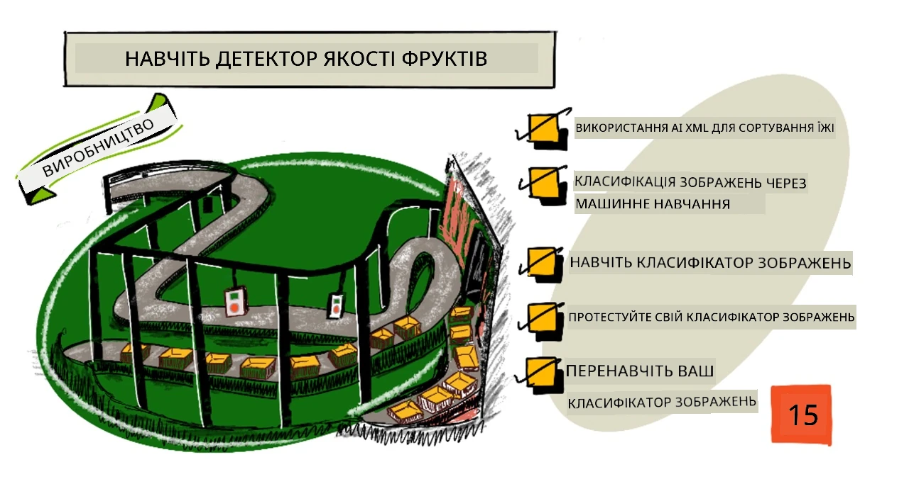
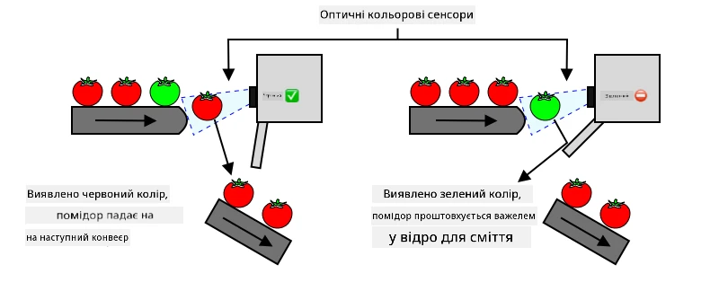
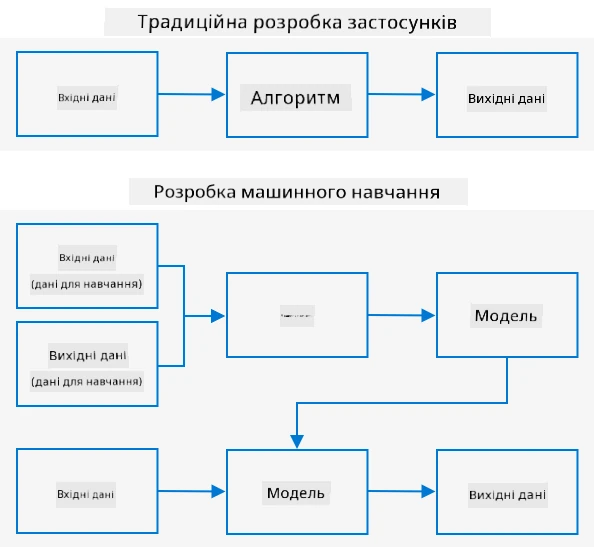
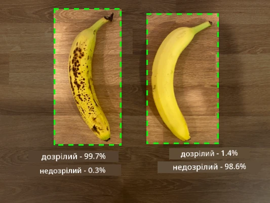
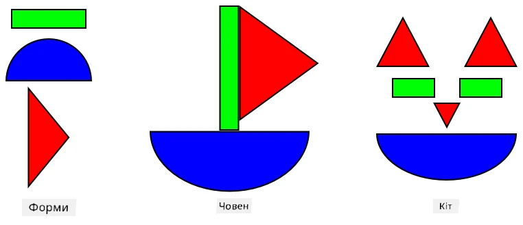
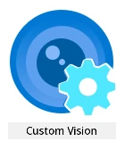
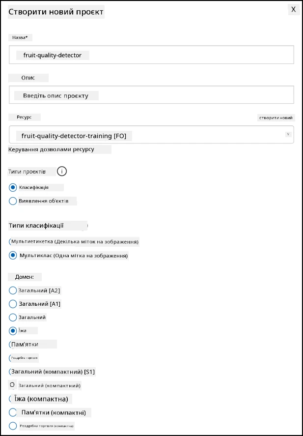
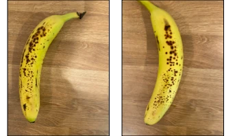
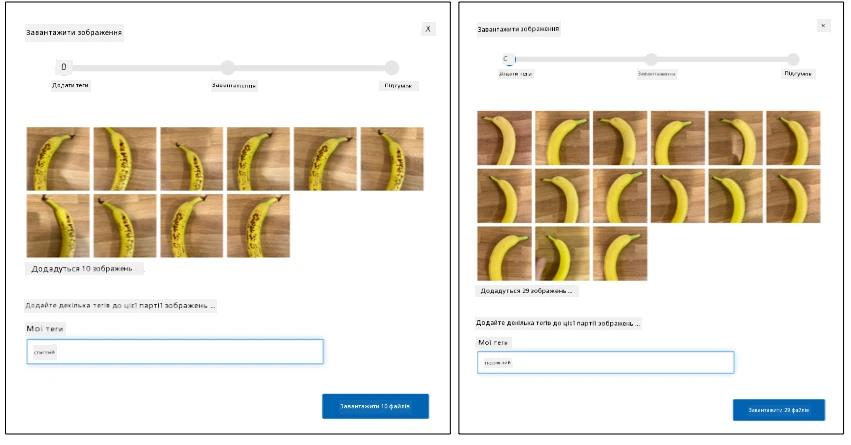
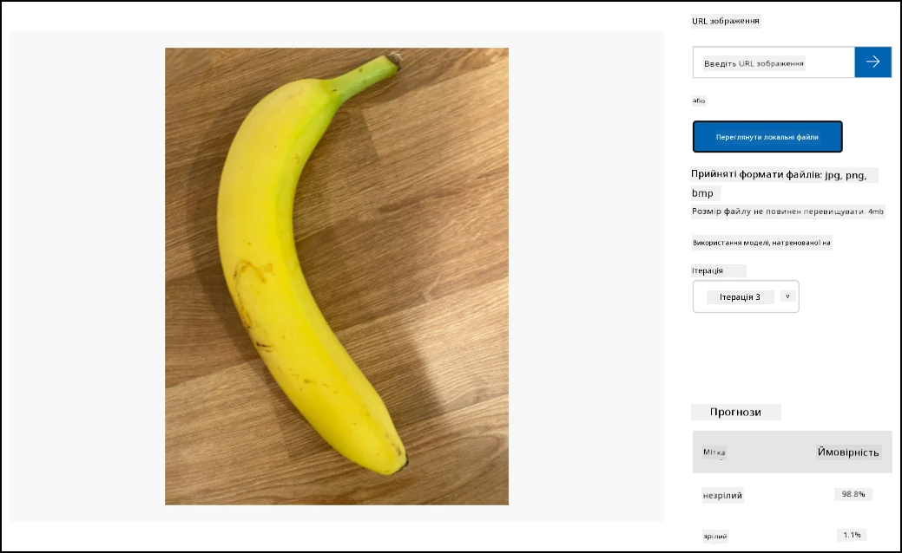

# Навчіть детектор якості фруктів



> Скетчнот від [Nitya Narasimhan](https://github.com/nitya). Натисніть на зображення, щоб побачити його у більшому розмірі.

У цьому відео (англійською) коротко показано сервіс Azure Custom Vision, про який ітиметься в цьому уроці.

[](https://www.youtube.com/watch?v=TETcDLJlWR4)

> 🎥 Натисніть на зображення вище, щоб переглянути відео.

## Тест перед лекцією

[Тест перед лекцією](https://black-meadow-040d15503.1.azurestaticapps.net/quiz/29)

## Вступ

Стрімкий розвиток штучного інтелекту (AI) та машинного навчання (ML) відкриває перед сучасними розробниками широкі можливості. ML-моделі можна навчити розпізнавати на зображеннях різні речі, зокрема недостиглі фрукти, і використати це в IoT-пристроях, які сортують продукцію просто під час збирання врожаю або під час переробки на фабриках і складах.

У цьому уроці ви дізнаєтеся про класифікацію зображень, тобто про використання ML-моделей, щоб розрізняти зображення різних речей. Ви навчитеся тренувати класифікатор зображень, який відрізняє якісні фрукти від неякісних: недостиглих чи перестиглих, побитих або гнилих.

У цьому уроці ми розглянемо:

* [Використання AI та ML для сортування їжі](#використання-ai-та-ml-для-сортування-їжі)
* [Класифікацію зображень за допомогою машинного навчання](#класифікація-зображень-за-допомогою-машинного-навчання)
* [Навчання класифікатора зображень](#навчання-класифікатора-зображень)
* [Тестування класифікатора зображень](#тестування-класифікатора-зображень)
* [Перенавчання класифікатора зображень](#перенавчання-класифікатора-зображень)

## Використання AI та ML для сортування їжі

Прогодувати населення планети складно, особливо за цінами, доступними для всіх. Одна з найбільших статей витрат — праця, тому фермери дедалі частіше вдаються до автоматизації та інструментів на кшталт IoT, щоб скоротити витрати на робочу силу. Ручне збирання врожаю дуже трудомістке (і часто виснажливе для спини), тож його замінюють машинами, особливо в багатших країнах. Але попри економію, машинне збирання має недолік: продукцію вже не можна сортувати просто під час збирання.

Не всі культури дозрівають рівномірно. Наприклад, на кущах томатів ще можуть залишатися зелені плоди, коли більшість уже готова до збирання. Збирати їх зарано марнотратно, але фермеру дешевше й простіше зібрати все машиною, а недостиглу продукцію потім викинути.

✅ Подивіться на різні фрукти чи овочі, що ростуть поблизу вас на фермах або в саду, чи на ті, що продаються в магазинах. Чи однаково вони достиглі, чи ви бачите різницю?

З появою автоматизованого збирання сортування продукції перемістилося з поля на фабрику. Їжа їхала довгими конвеєрними стрічками, а команди людей перебирали її і прибирали все, що не відповідало потрібним стандартам якості. Завдяки машинам збирання стало дешевшим, але ручне сортування все одно коштувало грошей.



Наступним кроком еволюції стало сортування машинами, вбудованими в комбайн або встановленими на переробних заводах. Перше покоління таких машин використовувало оптичні сенсори, що розпізнавали кольори, і керувало актуаторами, які важелями чи струменями повітря відкидали зелені томати в контейнер для відходів, а червоні томати їхали далі мережею конвеєрних стрічок.

У цьому відео томати падають з однієї конвеєрної стрічки на іншу, а зелені томати розпізнаються й відкидаються важелями в контейнер.

✅ Які умови потрібні на фабриці чи в полі, щоб ці оптичні сенсори працювали правильно?

Найновіші сортувальні машини використовують AI та ML: моделі, навчені відрізняти добру продукцію від поганої не лише за очевидною різницею в кольорі, як-от зелені й червоні томати, а й за тоншими відмінностями в зовнішньому вигляді, що можуть свідчити про хворобу чи пошкодження.

## Класифікація зображень за допомогою машинного навчання

У традиційному програмуванні ви берете дані, застосовуєте до них алгоритм і отримуєте результат. Наприклад, в останньому проєкті ви брали GPS-координати та геозону, застосовували алгоритм (в оригінальному курсі його надавав Azure Maps) і отримували відповідь, чи точка всередині геозони, чи поза нею. Більше вхідних даних — більше результатів.



Машинне навчання перевертає цей підхід: ви починаєте з даних і відомих результатів, а алгоритм машинного навчання вчиться на цих даних. Потім цей навчений алгоритм, який називають *моделлю машинного навчання* або просто *моделлю*, можна застосувати до нових даних і отримати нові результати.

> 🎓 Процес, під час якого алгоритм машинного навчання вчиться на даних, називається *тренуванням* (навчанням). Вхідні дані разом із відомими результатами називаються *тренувальними даними*.

Наприклад, можна дати моделі мільйони фотографій недостиглих бананів як вхідні тренувальні дані з результатом `unripe` і мільйони фотографій достиглих бананів з результатом `ripe`. Алгоритм ML створить на основі цих даних модель. Потім ви даєте моделі нову фотографію банана, і вона передбачає, достиглий він чи ні.

> 🎓 Результати роботи ML-моделей називаються *передбаченнями* (predictions).



ML-моделі не дають відповіді «так/ні», натомість вони повертають імовірності. Наприклад, модель може отримати фото банана й передбачити `ripe` з імовірністю 99,7% і `unripe` з імовірністю 0,3%. Ваш код вибере найімовірніше передбачення й вирішить, що банан достиглий.

ML-модель, яка розпізнає такі зображення, називається *класифікатором зображень*: їй дають зображення з мітками, а потім вона класифікує нові зображення за цими мітками.

> 💁 Це дуже спрощений опис. Існує багато інших способів тренувати моделі, які не завжди потребують розмічених результатів, наприклад навчання без учителя (unsupervised learning). Якщо хочете дізнатися про ML більше, перегляньте [ML for beginners — курс машинного навчання з 24 уроків](https://aka.ms/ML-beginners).

## Навчання класифікатора зображень

Щоб успішно натренувати класифікатор зображень, потрібні мільйони зображень. Але виявляється, що коли класифікатор уже натреновано на мільйонах чи мільярдах різноманітних зображень, його можна використати повторно й донавчити на невеликому наборі зображень, отримавши чудові результати. Цей процес називається *трансферним навчанням* (transfer learning).

> 🎓 Трансферне навчання — це перенесення знань наявної ML-моделі в нову модель на основі нових даних.

Коли класифікатор натреновано на дуже різноманітних зображеннях, його внутрішні шари чудово розпізнають форми, кольори й візерунки. Трансферне навчання дає змогу моделі взяти те, чого вона вже навчилася в розпізнаванні частин зображень, і використати це для розпізнавання нових зображень.



Це трохи схоже на дитячі книжки з фігурами: якщо ви вмієте впізнавати півколо, прямокутник і трикутник, то впізнаєте вітрильник чи кота залежно від того, як ці фігури розташовані. Класифікатор зображень уміє розпізнавати фігури, а трансферне навчання вчить його, яке поєднання фігур утворює човен чи кота, або ж достиглий банан.

Є багато інструментів, які допомагають це зробити, зокрема хмарні сервіси, що допомагають натренувати модель, а потім використовувати її через веб-API.

> 💁 Тренування таких моделей потребує великої обчислювальної потужності, зазвичай графічних процесорів (GPU). Те саме спеціалізоване обладнання, завдяки якому ігри на Xbox мають чудовий вигляд, можна використовувати й для тренування моделей машинного навчання. У хмарі можна орендувати час на потужних комп'ютерах із GPU і отримати потрібну обчислювальну потужність саме на той час, який вам потрібен.

## Custom Vision

> 👩‍🏫 Цю частину показує викладач (демо). Студенти виконують локальний варіант: [Навчіть класифікатор у Teachable Machine](local-teachable-machine.md).
>
> ⚠️ Microsoft оголосила, що сервіс Custom Vision буде виведено з експлуатації **25 вересня 2028 року**. До цієї дати він працює, тож для демонстрації підходить.

Custom Vision — хмарний інструмент для тренування класифікаторів зображень. Він дає змогу натренувати класифікатор на невеликій кількості зображень. Зображення можна завантажувати через вебпортал, веб-API або SDK, і кожному зображенню призначається *тег* (tag) з його класом. Потім ви тренуєте модель і тестуєте, наскільки добре вона працює. Коли модель вас влаштовує, можна опублікувати її версії, доступні через веб-API або SDK.



> 💁 Модель Custom Vision можна натренувати лише на 5 зображеннях для кожного класу, але що більше, то краще. Результати стають помітно кращими, якщо зображень хоча б 30.

Custom Vision входить до набору AI-інструментів Microsoft, який раніше називався Cognitive Services, а тепер — Azure AI services. Ці інструменти можна використовувати без тренування або з невеликим тренуванням. Серед них розпізнавання й переклад мовлення, розуміння мови та аналіз зображень. Вони доступні в Azure як сервіси з безкоштовним рівнем.

> 💁 Безкоштовного рівня більш ніж достатньо, щоб створити модель, натренувати її та використовувати під час розробки. Про обмеження безкоштовного рівня можна прочитати на сторінці [Custom Vision limits and quotas у документації Microsoft](https://learn.microsoft.com/azure/ai-services/custom-vision-service/limits-and-quotas).

### Завдання: створіть ресурс Cognitive Services

Щоб використовувати Custom Vision, спочатку потрібно створити в Azure за допомогою Azure CLI два ресурси Cognitive Services: один для тренування Custom Vision і один для передбачень.

1. Створіть для цього проєкту групу ресурсів (Resource Group) з назвою `fruit-quality-detector`.

1. Створіть безкоштовний ресурс для тренування Custom Vision такою командою:

    ```sh
    az cognitiveservices account create --name fruit-quality-detector-training \
                                        --resource-group fruit-quality-detector \
                                        --kind CustomVision.Training \
                                        --sku F0 \
                                        --yes \
                                        --location <location>
    ```

    Замініть `<location>` на регіон, який ви вказали під час створення групи ресурсів.

    Ця команда створить у вашій групі ресурсів ресурс для тренування Custom Vision. Він називатиметься `fruit-quality-detector-training` і використовуватиме SKU `F0`, тобто безкоштовний рівень. Параметр `--yes` означає, що ви погоджуєтеся з умовами використання Cognitive Services.

> 💁 Використайте SKU `S0`, якщо у вас уже є безкоштовний обліковий запис будь-якого з Cognitive Services.

1. Створіть безкоштовний ресурс для передбачень Custom Vision такою командою:

    ```sh
    az cognitiveservices account create --name fruit-quality-detector-prediction \
                                        --resource-group fruit-quality-detector \
                                        --kind CustomVision.Prediction \
                                        --sku F0 \
                                        --yes \
                                        --location <location>
    ```

    Замініть `<location>` на регіон, який ви вказали під час створення групи ресурсів.

    Ця команда створить у вашій групі ресурсів ресурс для передбачень Custom Vision. Він називатиметься `fruit-quality-detector-prediction` і використовуватиме SKU `F0`, тобто безкоштовний рівень. Параметр `--yes` означає, що ви погоджуєтеся з умовами використання Cognitive Services.

### Завдання: створіть проєкт класифікатора зображень

1. Відкрийте портал Custom Vision за адресою [CustomVision.ai](https://customvision.ai) і увійдіть з тим обліковим записом Microsoft, який ви використовуєте для Azure.

1. Створіть новий проєкт Custom Vision за інструкціями з розділу [Create a new project у швидкому старті зі створення класифікатора в документації Microsoft](https://learn.microsoft.com/azure/ai-services/custom-vision-service/getting-started-build-a-classifier#create-a-new-project). Інтерфейс може змінюватися, а ця документація завжди містить найактуальніші інструкції.

    Назвіть проєкт `fruit-quality-detector`.

    Під час створення проєкту виберіть ресурс `fruit-quality-detector-training`, створений раніше. Використайте тип проєкту *Classification*, тип класифікації *Multiclass* і домен *Food*.

    

✅ Приділіть трохи часу, щоб ознайомитися з інтерфейсом Custom Vision для вашого класифікатора зображень.

### Завдання: натренуйте класифікатор зображень

Щоб натренувати класифікатор зображень, вам знадобиться кілька фотографій фруктів, як якісних, так і неякісних, щоб позначити їх відповідними тегами, наприклад достиглий і перестиглий банан.

> 💁 Ці класифікатори можуть класифікувати зображення будь-чого, тож якщо під рукою немає фруктів різної якості, можна взяти два різні види фруктів або котів і собак!

В ідеалі на кожній фотографії має бути лише фрукт, а фон має бути або однаковим, або дуже різноманітним. Переконайтеся, що на фоні немає нічого, що характерне саме для достиглих чи саме для недостиглих фруктів.

> 💁 Важливо, щоб для кожного тегу не було особливого фону чи сторонніх предметів, не пов'язаних із тим, що класифікується, інакше класифікатор може навчитися розрізняти фон. Був випадок із класифікатором раку шкіри, який тренували на фотографіях звичайних і ракових родимок, і поруч з усіма раковими лежала лінійка для вимірювання розміру. Виявилося, що класифікатор майже зі 100% точністю розпізнає на фотографіях лінійки, а не ракові родимки.

Класифікатори зображень працюють з дуже низькою роздільною здатністю. Наприклад, Custom Vision приймає зображення для тренування й передбачення розміром до 10240x10240, але тренує й запускає модель на зображеннях 227x227. Більші зображення зменшуються до цього розміру, тож переконайтеся, що об'єкт класифікації займає значну частину зображення, інакше на зменшеному зображенні він може бути замалим.

1. Зберіть фотографії для класифікатора. Для тренування потрібно щонайменше 5 фотографій для кожної мітки, але що більше, то краще. Також знадобиться кілька додаткових зображень для тестування класифікатора. Усі ці зображення мають бути різними зображеннями того самого. Наприклад:

    * Візьміть 2 достиглі банани й сфотографуйте кожен під кількома різними кутами, щоб вийшло щонайменше 7 фотографій (5 для тренування і 2 для тестування), а краще більше.

        

    * Повторіть те саме з 2 недостиглими бананами.

    У вас має бути щонайменше 10 зображень для тренування (щонайменше 5 достиглих і 5 недостиглих) і 4 для тестування (2 достиглі, 2 недостиглі). Зображення мають бути у форматі png або jpeg і менші за 6 МБ. Якщо ви фотографуєте, наприклад, на iPhone, знімки можуть бути у форматі HEIC з високою роздільною здатністю, тож їх доведеться конвертувати й, можливо, зменшити. Що більше зображень, то краще, і достиглих та недостиглих має бути приблизно порівну.

    Якщо у вас немає і достиглих, і недостиглих фруктів, можна взяти різні фрукти або будь-які два наявні предмети. Також у папці [images](./images) є приклади зображень достиглих і недостиглих бананів, які можна використати.

1. Завантажте тренувальні зображення за інструкціями з розділу [Upload and tag images у швидкому старті зі створення класифікатора в документації Microsoft](https://learn.microsoft.com/azure/ai-services/custom-vision-service/getting-started-build-a-classifier#upload-and-tag-images). Позначте достиглі фрукти тегом `ripe`, а недостиглі — тегом `unripe`.

    

1. Натренуйте класифікатор на завантажених зображеннях за інструкціями з розділу [Train the classifier у швидкому старті зі створення класифікатора в документації Microsoft](https://learn.microsoft.com/azure/ai-services/custom-vision-service/getting-started-build-a-classifier#train-the-classifier).

    Вам запропонують вибрати тип тренування. Виберіть **Quick Training**.

Після цього класифікатор почне тренуватися. Тренування триває кілька хвилин.

> 🍌 Якщо вирішите з'їсти фрукти, поки класифікатор тренується, спершу переконайтеся, що у вас достатньо зображень для тестування!

## Тестування класифікатора зображень

> 👩‍🏫 Цю частину показує викладач (демо). Студенти тестують свою модель у Teachable Machine: див. розділ «Протестуйте класифікатор» у файлі [local-teachable-machine.md](local-teachable-machine.md).

Коли класифікатор натреновано, його можна протестувати, давши йому нове зображення для класифікації.

### Завдання: протестуйте класифікатор зображень

1. Протестуйте класифікатор зображень за інструкціями з розділу [Test your model у документації Microsoft](https://learn.microsoft.com/azure/ai-services/custom-vision-service/test-your-model#test-your-model). Використовуйте тестові зображення, підготовлені раніше, а не ті, на яких ви тренували модель.

    

1. Спробуйте всі тестові зображення, які у вас є, і подивіться на ймовірності.

## Перенавчання класифікатора зображень

> 👩‍🏫 Цю частину показує викладач (демо). Студенти перенавчають свою модель у Teachable Machine: див. розділ «Перенавчіть класифікатор» у файлі [local-teachable-machine.md](local-teachable-machine.md).

Під час тестування класифікатор може давати не ті результати, на які ви очікуєте. Класифікатори зображень використовують машинне навчання, щоб передбачити, що на зображенні, на основі ймовірностей того, що певні ознаки зображення відповідають певній мітці. Класифікатор не розуміє, що зображено: він не знає, що таке банан, і не розуміє, чим банан відрізняється від човна. Покращити класифікатор можна, перенавчивши його на зображеннях, у яких він помиляється.

Щоразу, коли ви робите передбачення через Quick Test, зображення та результати зберігаються. Ці зображення можна використати для перенавчання моделі.

### Завдання: перенавчіть класифікатор зображень

1. Перенавчіть модель за інструкціями з розділу [Use the predicted image for training у документації Microsoft](https://learn.microsoft.com/azure/ai-services/custom-vision-service/test-your-model#use-the-predicted-image-for-training), призначивши кожному зображенню правильний тег.

1. Коли модель буде перенавчено, протестуйте її на нових зображеннях.

---

## 🚀 Виклик

Як ви думаєте, що станеться, якщо дати моделі, натренованій на бананах, фотографію полуниці, надувного банана, людини в костюмі банана чи навіть жовтого мультяшного персонажа, наприклад когось із Сімпсонів?

Спробуйте й подивіться, якими будуть передбачення. Зображення для перевірки можна знайти через [пошук зображень Bing](https://www.bing.com/images/trending).

## Тест після лекції

[Тест після лекції](https://black-meadow-040d15503.1.azurestaticapps.net/quiz/30)

## Огляд і самостійне навчання

* Після тренування класифікатора ви бачили значення *Precision*, *Recall* і *AP*, які оцінюють створену модель. Прочитайте, що вони означають, у розділі [Evaluate the classifier у швидкому старті зі створення класифікатора в документації Microsoft](https://learn.microsoft.com/azure/ai-services/custom-vision-service/getting-started-build-a-classifier#evaluate-the-classifier).
* Прочитайте, як покращити класифікатор, у статті [How to improve your Custom Vision model у документації Microsoft](https://learn.microsoft.com/azure/ai-services/custom-vision-service/getting-started-improving-your-classifier).

## Завдання

[Натренуйте класифікатор для кількох фруктів і овочів](assignment.md)
