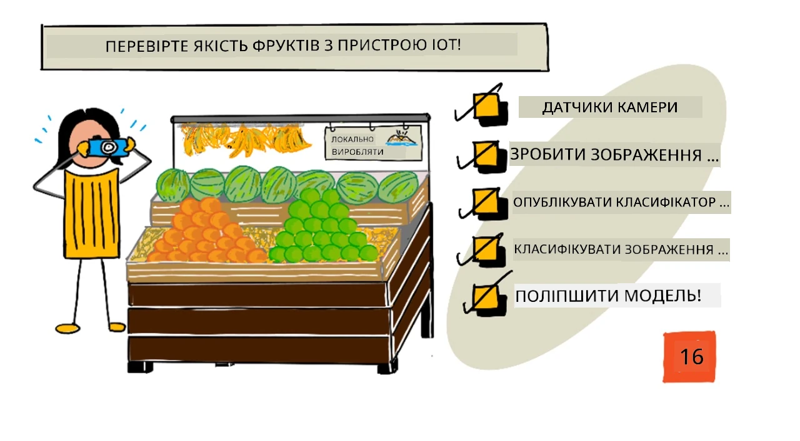
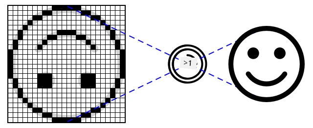
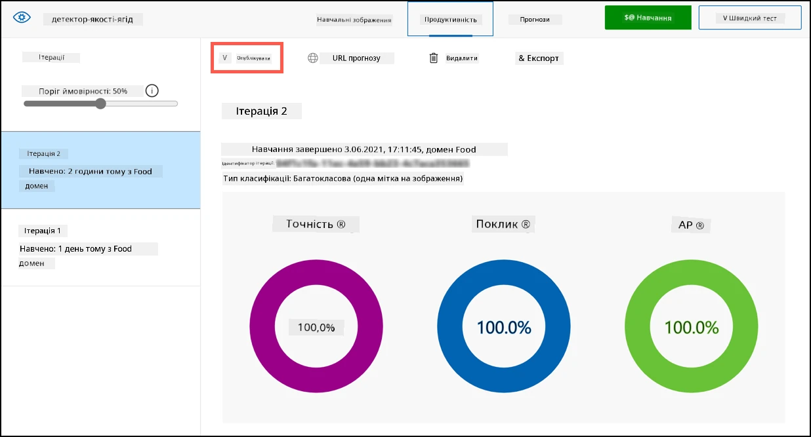
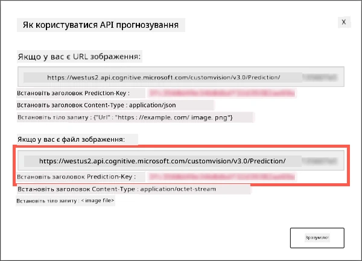
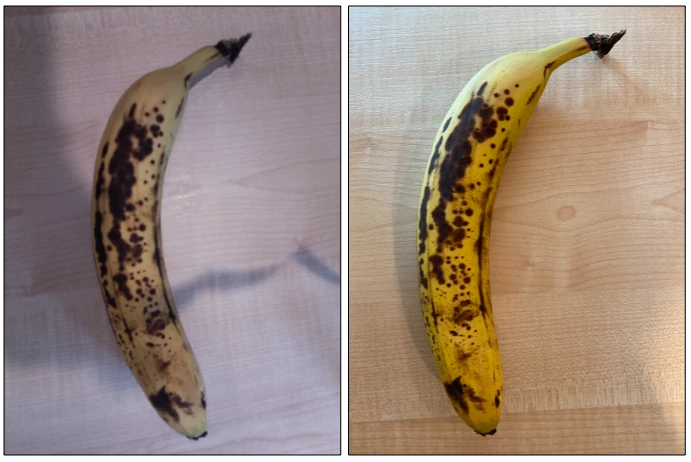

# Перевірте якість фруктів за допомогою IoT-пристрою



> Скетчнот від [Nitya Narasimhan](https://github.com/nitya). Натисніть на зображення, щоб побачити його у більшому розмірі.

## Тест перед лекцією

[Тест перед лекцією](https://black-meadow-040d15503.1.azurestaticapps.net/quiz/31)

## Вступ

На минулому уроці ви дізналися про класифікатори зображень і про те, як натренувати їх розпізнавати якісні й неякісні фрукти. Щоб використати цей класифікатор в IoT-застосунку, потрібно зробити знімок якоюсь камерою і надіслати це зображення в хмару на класифікацію.

У цьому уроці ви дізнаєтеся про сенсори камери та про те, як зробити знімок за їхньою допомогою з IoT-пристрою. Ви також навчитеся викликати класифікатор зображень зі свого IoT-пристрою.

У цьому уроці ми розглянемо:

* [Сенсори камери](#сенсори-камери)
* [Знімок за допомогою IoT-пристрою](#знімок-за-допомогою-iot-пристрою)
* [Публікацію класифікатора зображень](#публікація-класифікатора-зображень)
* [Класифікацію зображень з IoT-пристрою](#класифікація-зображень-з-iot-пристрою)
* [Покращення моделі](#покращення-моделі)

## Сенсори камери

Сенсори камери, як випливає з назви, — це камери, які можна підключити до IoT-пристрою. Вони можуть робити фотографії або знімати потокове відео. Одні повертають необроблені дані зображення, інші стискають їх у файл зображення, наприклад JPEG чи PNG. Зазвичай камери для IoT-пристроїв значно менші й мають нижчу роздільну здатність, ніж ті, до яких ви звикли, але бувають і камери з високою роздільною здатністю, що не поступаються найкращим телефонам. Існують усілякі змінні об'єктиви, системи з кількох камер, інфрачервоні тепловізійні камери та ультрафіолетові камери.



Більшість сенсорів камери використовують сенсори зображення, у яких кожен піксель — це фотодіод. Об'єктив фокусує зображення на сенсорі, і тисячі чи мільйони фотодіодів реєструють світло, що падає на кожен із них, і записують це як дані пікселів.

> 💁 Об'єктиви перевертають зображення, а сенсор камери потім повертає його в правильне положення. Так само працюють і ваші очі: зображення на задній стінці ока перевернуте, а мозок його виправляє.

> 🎓 Сенсор зображення називають активно-піксельним сенсором (Active-Pixel Sensor, APS), а найпопулярніший тип APS — сенсор на основі комплементарної структури метал-оксид-напівпровідник, або CMOS. Можливо, ви чули термін «CMOS-сенсор» щодо камер.

Сенсори камери — цифрові сенсори: вони надсилають зображення як цифрові дані, зазвичай за допомогою бібліотеки, що забезпечує зв'язок. Камери підключаються за протоколами на кшталт SPI, які дають змогу передавати великі обсяги даних: зображення значно більші за окремі числа від сенсора, наприклад сенсора температури.

✅ Які обмеження щодо розміру зображень мають IoT-пристрої? Подумайте про обмеження, особливо на апаратному забезпеченні мікроконтролерів.

## Знімок за допомогою IoT-пристрою

Ви можете використати IoT-пристрій, щоб зробити знімок для класифікації.

### Завдання: зробіть знімок за допомогою IoT-пристрою

Виконайте відповідну інструкцію, щоб зробити знімок за допомогою свого IoT-пристрою:

* [Arduino: Wio Terminal](https://github.com/microsoft/IoT-For-Beginners/blob/main/4-manufacturing/lessons/2-check-fruit-from-device/wio-terminal-camera.md) (ще не адаптовано, оригінал англійською)
* [Одноплатний комп'ютер: Raspberry Pi](https://github.com/microsoft/IoT-For-Beginners/blob/main/4-manufacturing/lessons/2-check-fruit-from-device/pi-camera.md) (ще не адаптовано, оригінал англійською)
* [Одноплатний комп'ютер: віртуальний пристрій](virtual-device-camera.md)

## Публікація класифікатора зображень

> 👩‍🏫 Цю частину показує викладач (демо). Студенти виконують локальний варіант: [Класифікуйте зображення локально моделлю з Teachable Machine](local-classify-image.md). Публікувати модель не потрібно: ви вже експортували її з Teachable Machine в уроці 1.

На минулому уроці ви натренували класифікатор зображень. Перш ніж використовувати його з IoT-пристрою, модель потрібно опублікувати.

### Ітерації моделі

Коли модель тренувалася на минулому уроці, ви могли помітити, що на вкладці **Performance** збоку показано ітерації. Коли ви вперше тренували модель, ви бачили тренування *Iteration 1*. Коли ви покращили модель за допомогою зображень із передбачень, ви бачили тренування *Iteration 2*.

Щоразу, коли ви тренуєте модель, з'являється нова ітерація. Так можна відстежувати різні версії моделі, натреновані на різних наборах даних. Під час **Quick Test** є випадний список, у якому можна вибрати ітерацію й порівняти результати кількох ітерацій.

Коли ітерація вас влаштовує, її можна опублікувати, щоб нею могли користуватися зовнішні застосунки. Так ваші пристрої використовуватимуть опубліковану версію, а ви тим часом працюватимете над новою версією впродовж кількох ітерацій і опублікуєте її, коли вона вас влаштує.

### Завдання: опублікуйте ітерацію

Ітерації публікуються з порталу Custom Vision.

1. Відкрийте портал Custom Vision за адресою [CustomVision.ai](https://customvision.ai) і увійдіть, якщо він ще не відкритий. Потім відкрийте свій проєкт `fruit-quality-detector`.

1. Виберіть вкладку **Performance** серед параметрів угорі.

1. Виберіть останню ітерацію в списку *Iterations* збоку.

1. Натисніть кнопку **Publish** для цієї ітерації.

    

1. У діалозі *Publish Model* у полі *Prediction resource* виберіть ресурс `fruit-quality-detector-prediction`, створений на минулому уроці. Залиште назву `Iteration2` і натисніть кнопку **Publish**.

1. Після публікації натисніть кнопку **Prediction URL**. Вона покаже параметри API передбачень, які знадобляться, щоб викликати модель з IoT-пристрою. Нижня частина має підпис *If you have an image file*, саме ці дані вам і потрібні. Скопіюйте показану URL-адресу, яка матиме приблизно такий вигляд:

    ```output
    https://<location>.api.cognitive.microsoft.com/customvision/v3.0/Prediction/<id>/classify/iterations/Iteration2/image
    ```

    Тут `<location>` — регіон, який ви вказали під час створення ресурсу Custom Vision, а `<id>` — довгий ідентифікатор із літер і цифр.

    Також скопіюйте значення *Prediction-Key*. Це секретний ключ, який потрібно передавати під час виклику моделі. Користуватися моделлю можуть лише застосунки, що передають цей ключ, усі інші отримують відмову.

    

✅ Коли публікується нова ітерація, вона матиме іншу назву. Як, на вашу думку, змінити ітерацію, яку використовує IoT-пристрій?

## Класифікація зображень з IoT-пристрою

Тепер за цими параметрами підключення можна викликати класифікатор зображень зі свого IoT-пристрою.

### Завдання: класифікуйте зображення з IoT-пристрою

Виконайте відповідну інструкцію, щоб класифікувати зображення за допомогою свого IoT-пристрою:

* [Arduino: Wio Terminal](https://github.com/microsoft/IoT-For-Beginners/blob/main/4-manufacturing/lessons/2-check-fruit-from-device/wio-terminal-classify-image.md) (ще не адаптовано, оригінал англійською)
* [Одноплатний комп'ютер: Raspberry Pi або віртуальний IoT-пристрій](single-board-computer-classify-image.md) (Custom Vision, показує викладач)
* [Віртуальний IoT-пристрій: локальна класифікація моделлю з Teachable Machine](local-classify-image.md) (виконують студенти)

## Покращення моделі

Може виявитися, що результати, отримані з камерою на IoT-пристрої, не такі, як ви очікували. Передбачення не завжди такі точні, як для зображень, завантажених із комп'ютера. Річ у тім, що модель тренували на інших даних, ніж ті, що використовуються для передбачень.

Щоб класифікатор зображень працював якнайкраще, тренуйте модель на зображеннях, якомога схожіших на ті, що використовуватимуться для передбачень. Якщо, наприклад, ви знімали тренувальні зображення камерою телефона, то якість, різкість і кольори будуть іншими, ніж у камери, підключеної до IoT-пристрою.



На зображенні вище фото банана ліворуч зроблено камерою Raspberry Pi, а праворуч — той самий банан у тому самому місці, знятий на iPhone. Різниця в якості помітна: фото з iPhone різкіше, з яскравішими кольорами й більшим контрастом.

✅ Що ще може спричинити неправильні передбачення для зображень з IoT-пристрою? Подумайте про середовище, у якому може працювати IoT-пристрій. Які чинники можуть впливати на знімок?

Щоб покращити модель, її можна перенавчити на зображеннях, знятих IoT-пристроєм.

### Завдання: покращте модель

> 👩‍🏫 Ці кроки для Custom Vision показує викладач. Студенти покращують модель у Teachable Machine: див. розділ «Покращте модель» у файлі [local-classify-image.md](local-classify-image.md#покращте-модель).

1. Класифікуйте за допомогою IoT-пристрою кілька зображень як достиглих, так і недостиглих фруктів.

1. На порталі Custom Vision перенавчіть модель на зображеннях із вкладки *Predictions*.

    > ⚠️ За потреби скористайтеся [інструкціями з перенавчання класифікатора з уроку 1](../1-train-fruit-detector/README.md#перенавчання-класифікатора-зображень).

1. Якщо ваші зображення дуже відрізняються від тих, на яких модель тренувалася спочатку, можна видалити всі початкові зображення: виділіть їх на вкладці *Training Images* і натисніть кнопку **Delete**. Щоб виділити зображення, наведіть на нього курсор: з'явиться позначка, натисніть на неї, щоб виділити зображення чи зняти виділення.

1. Натренуйте нову ітерацію моделі й опублікуйте її, як описано вище.

1. Оновіть у коді URL-адресу кінцевої точки та перезапустіть застосунок.

1. Повторюйте ці кроки, доки результати передбачень вас не влаштують.

---

## 🚀 Виклик

Наскільки роздільна здатність зображення чи освітлення впливає на передбачення?

Спробуйте змінити роздільну здатність зображень у коді пристрою й подивіться, чи вплине це на якість зображень. Також спробуйте змінити освітлення.

Якби ви створювали серійний пристрій для продажу фермам чи фабрикам, як би ви забезпечили, щоб він завжди давав стабільні результати?

## Тест після лекції

[Тест після лекції](https://black-meadow-040d15503.1.azurestaticapps.net/quiz/32)

## Огляд і самостійне навчання

Ви тренували модель Custom Vision через портал. Для цього потрібні готові зображення, а в реальному житті може бути неможливо отримати тренувальні дані, схожі на те, що знімає камера пристрою. Обійти це можна, тренуючи модель безпосередньо з пристрою через API тренування, на зображеннях, знятих IoT-пристроєм.

* Прочитайте про API тренування в [швидкому старті з використання Custom Vision SDK](https://learn.microsoft.com/azure/ai-services/custom-vision-service/quickstarts/image-classification?tabs=visual-studio&pivots=programming-language-python).

## Завдання

[Відреагуйте на результати класифікації](assignment.md)
