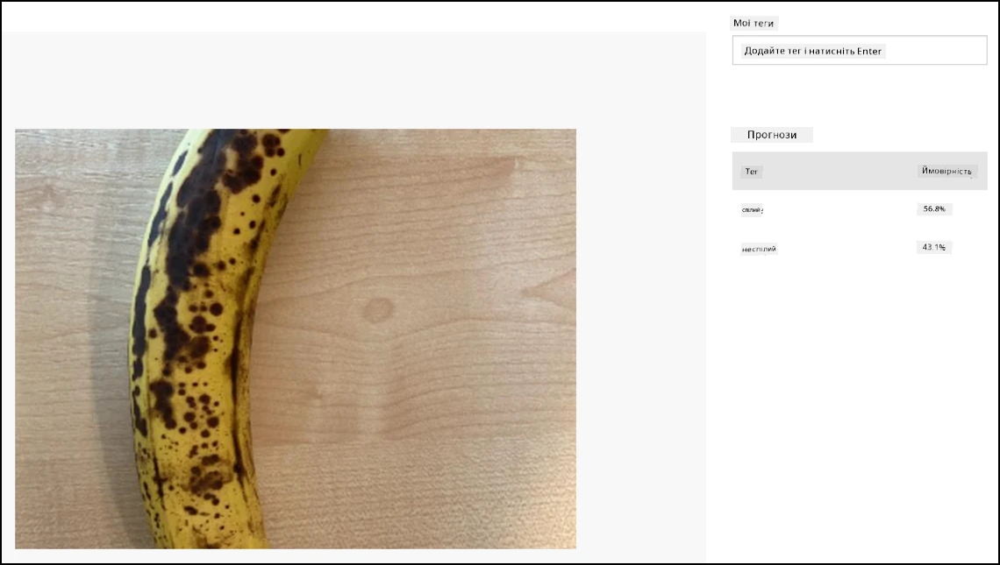

# Класифікуйте зображення: віртуальне IoT-обладнання та Raspberry Pi

> 👩‍🏫 Цю частину показує викладач (демо). Студенти виконують локальний варіант: [Класифікуйте зображення локально моделлю з Teachable Machine](local-classify-image.md).
>
> ⚠️ Сервіс Custom Vision буде виведено з експлуатації 25 вересня 2028 року.

У цій частині уроку ви надсилатимете зображення, зняте камерою, у сервіс Custom Vision, щоб класифікувати його.

## Надсилання зображень у Custom Vision

Сервіс Custom Vision має Python SDK, за допомогою якого можна класифікувати зображення.

### Завдання: надішліть зображення в Custom Vision

1. Відкрийте папку `fruit-quality-detector` у VS Code. Якщо ви використовуєте віртуальний IoT-пристрій, переконайтеся, що в терміналі активовано віртуальне середовище.

1. Python SDK для надсилання зображень у Custom Vision доступний як pip-пакет. Встановіть його такою командою:

    ```sh
    pip install azure-cognitiveservices-vision-customvision
    ```

    > 💁 Разом із ним встановиться пакет `msrest`. Ці пакети встановлюються й працюють на Python 3.14.

1. Додайте на початок файлу `app.py` такі інструкції імпорту:

    ```python
    from msrest.authentication import ApiKeyCredentials
    from azure.cognitiveservices.vision.customvision.prediction import CustomVisionPredictionClient
    ```

    Вони підключають модулі з бібліотек Custom Vision: один для автентифікації за ключем передбачень, а другий надає клас клієнта передбачень, який може викликати Custom Vision.

1. Додайте в кінець файлу такий код:

    ```python
    prediction_url = '<prediction_url>'
    prediction_key = '<prediction key>'
    ```

    Замініть `<prediction_url>` на URL-адресу, скопійовану раніше в цьому уроці з діалогу *Prediction URL*. Замініть `<prediction key>` на ключ передбачень, скопійований із того самого діалогу.

1. URL-адреса з діалогу *Prediction URL* призначена для прямого виклику REST-ендпоінта. Python SDK використовує частини цієї адреси в різних місцях. Додайте такий код, щоб розібрати URL-адресу на потрібні частини:

    ```python
    parts = prediction_url.split('/')
    endpoint = 'https://' + parts[2]
    project_id = parts[6]
    iteration_name = parts[9]
    ```

    Цей код розбиває URL-адресу й витягує з неї ендпоінт `https://<location>.api.cognitive.microsoft.com`, ідентифікатор проєкту та назву опублікованої ітерації.

1. Створіть об'єкт для передбачень за допомогою такого коду:

    ```python
    prediction_credentials = ApiKeyCredentials(in_headers={"Prediction-key": prediction_key})
    predictor = CustomVisionPredictionClient(endpoint, prediction_credentials)
    ```

    Об'єкт `prediction_credentials` містить ключ передбачень. За його допомогою створюється об'єкт клієнта передбачень, що звертається до ендпоінта.

1. Надішліть зображення в Custom Vision за допомогою такого коду:

    ```python
    image.seek(0)
    results = predictor.classify_image(project_id, iteration_name, image)
    ```

    Цей код перемотує зображення на початок і надсилає його клієнту передбачень.

1. Нарешті, виведіть результати за допомогою такого коду:

    ```python
    for prediction in results.predictions:
        print(f'{prediction.tag_name}:\t{prediction.probability * 100:.2f}%')
    ```

    Цей код перебирає всі отримані передбачення й виводить їх у терміналі. Імовірності повертаються як дійсні числа від 0 до 1, де 0 означає 0% імовірності, що зображення відповідає тегу, а 1 — 100%.

    > 💁 Класифікатори зображень повертають відсотки для всіх використаних тегів. Для кожного тегу буде ймовірність того, що зображення йому відповідає.

1. Запустіть код, спрямувавши камеру на фрукти, або встановивши відповідне зображення, або тримаючи фрукт перед вебкамерою, якщо використовуєте віртуальне IoT-обладнання. У консолі ви побачите результат:

    ```output
    (.venv) ➜  fruit-quality-detector python app.py
    ripe:   56.84%
    unripe: 43.16%
    ```

    Зроблене зображення та ці значення можна побачити на вкладці **Predictions** у Custom Vision.

    

> 💁 Цей код є в папці [code-classify/virtual-iot-device](code-classify/virtual-iot-device). Код для Raspberry Pi є в [оригінальному репозиторії](https://github.com/microsoft/IoT-For-Beginners/tree/main/4-manufacturing/lessons/2-check-fruit-from-device/code-classify/pi) (ще не адаптовано).

😀 Ваша програма-класифікатор якості фруктів запрацювала!
