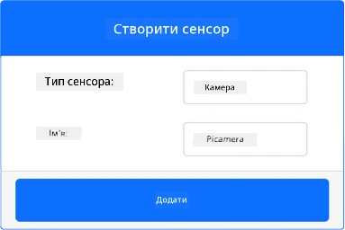
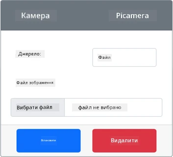
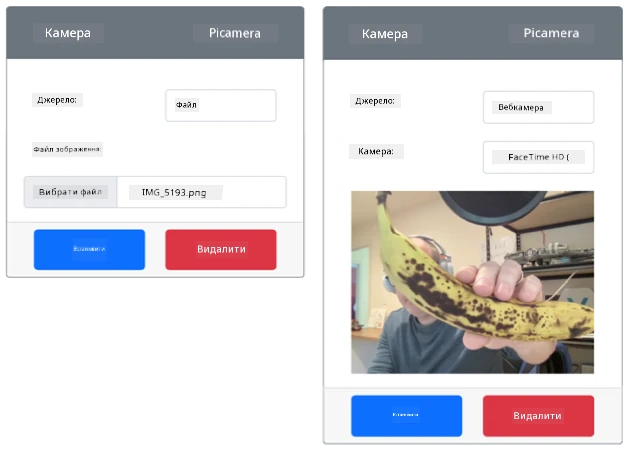

# Зробіть знімок: віртуальне IoT-обладнання

У цій частині уроку ви додасте до свого віртуального IoT-пристрою сенсор камери й зчитуватимете з нього зображення.

## Обладнання

Віртуальний IoT-пристрій використовуватиме симульовану камеру, яка надсилає зображення з файлів або з вебкамери.

### Додайте камеру до CounterFit

Щоб використовувати віртуальну камеру, її потрібно додати в застосунок CounterFit.

#### Завдання: додайте камеру до CounterFit

Додайте камеру в застосунок CounterFit.

1. Створіть на комп'ютері новий Python-застосунок у папці `fruit-quality-detector` з одним файлом `app.py` і віртуальним середовищем Python та встановіть pip-пакети CounterFit.

    > ⚠️ За потреби скористайтеся [інструкціями зі створення й налаштування Python-проєкту для CounterFit з уроку 1](../../../1-getting-started/lessons/1-introduction-to-iot/virtual-device.md).

1. Встановіть додатковий pip-пакет — шим CounterFit, який вміє працювати з камерами, імітуючи частину [pip-пакета Picamera](https://pypi.org/project/picamera/). Встановлюйте його в терміналі з активованим віртуальним середовищем.

    ```sh
    pip install counterfit-shims-picamera
    ```

1. Переконайтеся, що вебзастосунок CounterFit запущено.

1. Створіть камеру:

    1. У блоці *Create sensor* на панелі *Sensors* розгорніть список *Sensor type* і виберіть *Camera*.

    1. Укажіть у полі *Name* значення `Picamera`.

    1. Натисніть кнопку **Add**, щоб створити камеру.

    

    Камеру буде створено, і вона з'явиться в списку сенсорів.

    

## Запрограмуйте камеру

Тепер віртуальний IoT-пристрій можна запрограмувати на роботу з віртуальною камерою.

### Завдання: запрограмуйте камеру

Запрограмуйте пристрій.

1. Переконайтеся, що застосунок `fruit-quality-detector` відкрито у VS Code.

1. Відкрийте файл `app.py`.

1. Додайте на початок `app.py` цей код, щоб підключити застосунок до CounterFit:

    ```python
    from counterfit_connection import CounterFitConnection
    CounterFitConnection.init('127.0.0.1', 5000)
    ```

1. Додайте у файл `app.py` такий код:

    ```python
    import io
    from counterfit_shims_picamera import PiCamera
    ```

    Цей код імпортує потрібні бібліотеки, зокрема клас `PiCamera` з бібліотеки counterfit_shims_picamera.

1. Нижче додайте код, що ініціалізує камеру:

    ```python
    camera = PiCamera()
    camera.resolution = (640, 480)
    camera.rotation = 0
    ```

    Цей код створює об'єкт PiCamera і встановлює роздільну здатність 640x480. Вищі роздільні здатності теж підтримуються, але класифікатор зображень працює зі значно меншими зображеннями (227x227), тож знімати й надсилати більші зображення немає потреби.

    Рядок `camera.rotation = 0` задає поворот зображення в градусах. Якщо зображення з вебкамери чи файлу потрібно повернути, змініть це значення. Наприклад, щоб альбомне зображення банана з вебкамери стало портретним, укажіть `camera.rotation = 90`.

1. Нижче додайте код, що робить знімок і зберігає його як двійкові дані:

    ```python
    image = io.BytesIO()
    camera.capture(image, 'jpeg')
    image.seek(0)
    ```

    Цей код створює об'єкт `BytesIO` для зберігання двійкових даних. Зображення зчитується з камери як JPEG-файл і зберігається в цьому об'єкті. Об'єкт має індикатор позиції, щоб знати, де в даних він перебуває, і за потреби дописувати нові дані в кінець. Тому рядок `image.seek(0)` повертає позицію на початок, щоб пізніше можна було прочитати всі дані.

1. Нижче додайте код, що зберігає зображення у файл:

    ```python
    with open('image.jpg', 'wb') as image_file:
        image_file.write(image.read())
    ```

    Цей код відкриває для запису файл `image.jpg`, читає всі дані з об'єкта `BytesIO` і записує їх у файл.

    > 💁 Можна зберегти знімок одразу у файл, а не в об'єкт `BytesIO`, передавши назву файлу у виклик `camera.capture`. Об'єкт `BytesIO` використовується для того, щоб далі в цьому уроці надіслати зображення класифікатору.

1. Налаштуйте зображення, яке зніматиме камера в CounterFit. Можна встановити для *Source* значення *File* і завантажити файл зображення, а можна встановити *Source* на *WebCam*, і зображення зніматимуться з вашої вебкамери. Вибравши зображення чи вебкамеру, обов'язково натисніть кнопку **Set**.

    

    > 💁 Якщо фруктів під рукою немає, візьміть тестові фотографії бананів із папки [images/testing](../1-train-fruit-detector/images/testing) уроку 1.

1. Запустіть застосунок:

    ```sh
    python app.py
    ```

    Буде зроблено знімок, і він збережеться як `image.jpg` у поточній папці. Ви побачите цей файл у провіднику VS Code. Виберіть файл, щоб переглянути зображення. Якщо його потрібно повернути, змініть рядок `camera.rotation = 0` і зробіть знімок ще раз.

> 💁 Цей код є в папці [code-camera/virtual-iot-device](code-camera/virtual-iot-device).

😀 Ваша програма для камери запрацювала!
