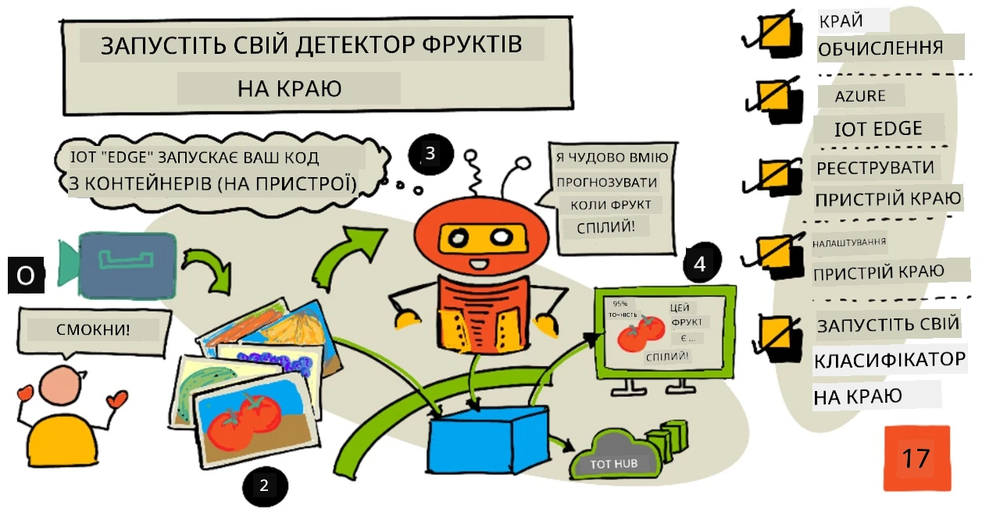
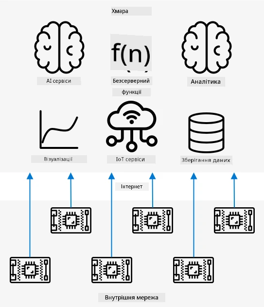
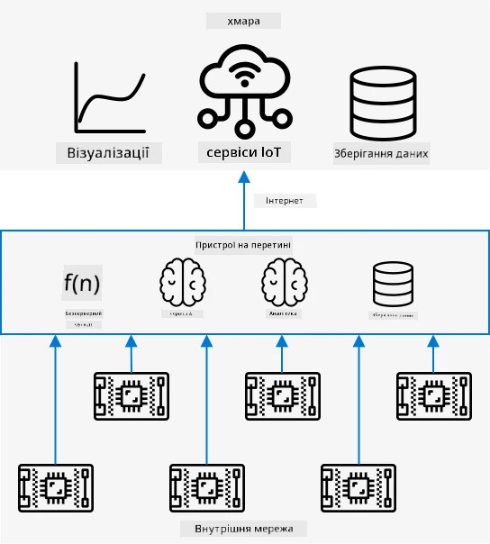
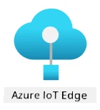
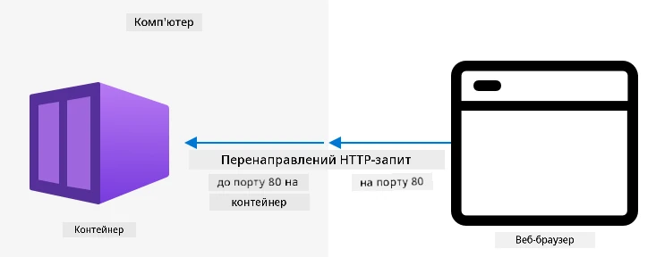
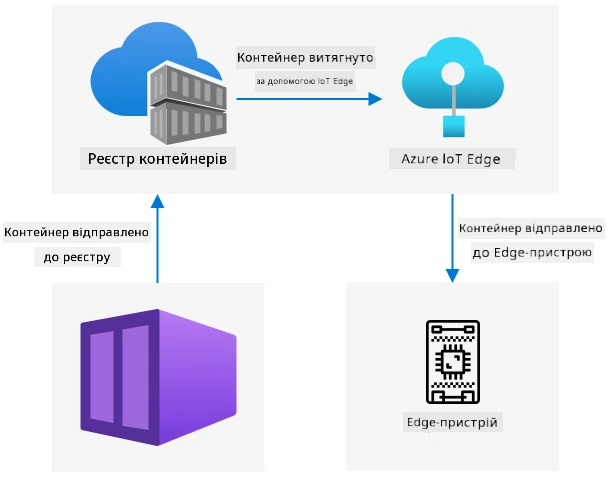
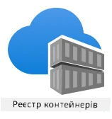

# Запустіть детектор фруктів на периферії



> Скетчнот від [Nitya Narasimhan](https://github.com/nitya). Натисніть на зображення, щоб побачити його у більшому розмірі.

У цьому відео (англійською) коротко показано, як запускати класифікатори зображень на IoT-пристроях, — саме про це цей урок.

[](https://www.youtube.com/watch?v=_K5fqGLO8us)

## Тест перед лекцією

[Тест перед лекцією](https://black-meadow-040d15503.1.azurestaticapps.net/quiz/33)

## Вступ

На минулому уроці ви використали класифікатор зображень, щоб розрізняти достиглі й недостиглі фрукти, надсилаючи знімок із камери IoT-пристрою через Інтернет у хмарний сервіс. Такі виклики потребують часу, коштують грошей і, залежно від того, які зображення ви використовуєте, можуть створювати ризики для приватності.

У цьому уроці ви дізнаєтеся, як запускати моделі машинного навчання (ML) на периферії (edge), тобто на IoT-пристроях у вашій власній мережі, а не в хмарі. Ви дізнаєтеся про переваги й недоліки периферійних обчислень порівняно з хмарними, про те, як розгорнути AI-модель на периферії і як звертатися до неї з IoT-пристрою.

> 👩‍🏫 Теоретичну частину (периферійні обчислення та Azure IoT Edge) вивчають усі. Практичну частину з Azure IoT Edge (реєстрація пристрою, контейнер, розгортання) показує викладач (демо). Студенти виконують локальний варіант: [Ваш комп'ютер як периферійний пристрій](local-edge.md).

У цьому уроці ми розглянемо:

* [Периферійні обчислення](#периферійні-обчислення)
* [Azure IoT Edge](#azure-iot-edge)
* [Реєстрацію пристрою IoT Edge](#реєстрація-пристрою-iot-edge)
* [Налаштування пристрою IoT Edge](#налаштування-пристрою-iot-edge)
* [Експорт моделі](#експорт-моделі)
* [Підготовку контейнера до розгортання](#підготовка-контейнера-до-розгортання)
* [Розгортання контейнера](#розгортання-контейнера)
* [Використання пристрою IoT Edge](#використання-пристрою-iot-edge)

## Периферійні обчислення

Периферійні обчислення (edge computing) означають, що IoT-дані обробляють комп'ютери, розташовані якомога ближче до місця, де ці дані з'являються. Обробка відбувається не в хмарі, а переноситься на край хмари — у вашу внутрішню мережу.



У попередніх уроках пристрої збирали дані й надсилали їх у хмару для аналізу, де працювали безсерверні функції чи AI-моделі.



Периферійні обчислення означають перенесення частини хмарних сервісів із хмари на комп'ютери в тій самій мережі, що й IoT-пристрої, і зв'язок із хмарою лише за потреби. Наприклад, можна запускати AI-моделі на периферійних пристроях, щоб аналізувати достиглість фруктів, і надсилати в хмару лише аналітику, наприклад кількість достиглих і недостиглих фруктів.

✅ Згадайте IoT-застосунки, які ви вже створили. Які їхні частини можна перенести на периферію?

### Переваги

Переваги периферійних обчислень:

1. **Швидкість.** Периферійні обчислення ідеальні для даних, чутливих до часу, бо дії виконуються в тій самій мережі, що й пристрій, а не через виклики в Інтернет. Це дає вищу швидкість: внутрішні мережі можуть працювати значно швидше за інтернет-з'єднання, а дані долають набагато меншу відстань.

    > 💁 Хоча в інтернет-з'єднаннях використовуються оптичні кабелі, якими дані передаються зі швидкістю світла, на подорож даних навколо світу до хмарних провайдерів усе одно потрібен час. Наприклад, якщо ви надсилаєте дані з Європи до хмарних сервісів у США, лише на перетин Атлантики оптичним кабелем потрібно щонайменше 28 мс. І це без урахування часу, щоб доставити дані до трансатлантичного кабелю, перетворити електричні сигнали на світлові й назад на іншому березі, а потім передати дані від кабелю до хмарного провайдера.

    Периферійні обчислення також потребують меншого мережевого трафіку, що зменшує ризик сповільнення через перевантаження обмеженої пропускної здатності інтернет-з'єднання.

1. **Віддалена доступність.** Периферійні обчислення працюють, коли зв'язок обмежений чи відсутній або надто дорогий для постійного використання. Наприклад, під час гуманітарної роботи в зонах лиха з обмеженою інфраструктурою або в країнах, що розвиваються.

1. **Нижчі витрати.** Збір, зберігання й аналіз даних і запуск дій на периферійному пристрої зменшують використання хмарних сервісів, що може знизити загальну вартість IoT-застосунку. Останнім часом з'явилося багато пристроїв, створених для периферійних обчислень, наприклад плати-прискорювачі AI на кшталт [Jetson Nano від NVIDIA](https://developer.nvidia.com/embedded/jetson-nano-developer-kit), які виконують AI-навантаження на апаратному забезпеченні з GPU на пристроях дешевших за 100 доларів США.

1. **Приватність і безпека.** У периферійних обчисленнях дані залишаються у вашій мережі й не завантажуються в хмару. Часто це краще для чутливої та персональної інформації, особливо тому, що після аналізу дані не потрібно зберігати, а це значно зменшує ризик витоку. Приклади — медичні дані та записи з камер спостереження.

1. **Робота з незахищеними пристроями.** Якщо у вас є пристрої з відомими вразливостями, які ви не хочете підключати безпосередньо до своєї мережі чи до Інтернету, їх можна підключити до окремої мережі зі шлюзом — пристроєм IoT Edge. Цей периферійний пристрій може мати й підключення до вашої ширшої мережі чи Інтернету та керувати потоками даних в обидва боки.

1. **Підтримка несумісних пристроїв.** Якщо у вас є пристрої, які не можуть підключитися до IoT Hub, наприклад пристрої, що вміють підключатися лише через HTTP або мають тільки Bluetooth, можна використати пристрій IoT Edge як шлюз, що пересилає повідомлення в IoT Hub.

✅ Дослідіть самостійно: які ще переваги можуть мати периферійні обчислення?

### Недоліки

У периферійних обчислень є й недоліки, через які хмара може бути кращим варіантом:

1. **Масштаб і гнучкість.** Хмарні обчислення можуть у реальному часі пристосовуватися до потреб мережі й даних, додаючи чи прибираючи сервери та інші ресурси. Щоб додати більше периферійних комп'ютерів, потрібно вручну додавати пристрої.

1. **Надійність і стійкість.** Хмарні обчислення забезпечують кілька серверів, часто в кількох місцях, для резервування та відновлення після збоїв. Щоб мати такий самий рівень резервування на периферії, потрібні великі інвестиції та багато роботи з налаштування.

1. **Обслуговування.** Хмарні провайдери самі обслуговують і оновлюють системи.

✅ Дослідіть самостійно: які ще недоліки можуть мати периферійні обчислення?

Недоліки — це, по суті, протилежність переваг хмари: ви маєте самі створювати й обслуговувати ці пристрої, а не покладатися на досвід і масштаб хмарних провайдерів.

Частину ризиків знімає сама природа периферійних обчислень. Наприклад, якщо периферійний пристрій працює на фабриці й збирає дані з обладнання, вам не потрібно продумувати деякі сценарії відновлення після збоїв. Якщо на фабриці зникне живлення, резервний периферійний пристрій не потрібен, бо обладнання, яке генерує дані для обробки, теж залишиться без живлення.

Для IoT-систем часто потрібне поєднання хмарних і периферійних обчислень, де кожен варіант використовується залежно від потреб системи, її клієнтів і тих, хто її обслуговує.

## Azure IoT Edge



Azure IoT Edge — сервіс, який допомагає перенести навантаження з хмари на периферію. Ви налаштовуєте пристрій як периферійний, а потім із хмари розгортаєте на ньому код. Так можна поєднати можливості хмари й периферії.

> 🎓 *Навантаження* (workloads) — загальна назва для будь-якого сервісу, що виконує певну роботу, наприклад AI-моделей, застосунків чи безсерверних функцій.

Наприклад, можна натренувати класифікатор зображень у хмарі, а потім із хмари розгорнути його на периферійному пристрої. Тоді IoT-пристрій надсилає зображення на класифікацію периферійному пристрою, а не через Інтернет. Якщо потрібно розгорнути нову ітерацію моделі, її можна натренувати в хмарі й за допомогою IoT Edge оновити модель на периферійному пристрої.

> 🎓 Програмне забезпечення, розгорнуте в IoT Edge, називається *модулями*. За замовчуванням IoT Edge запускає модулі, що зв'язуються з IoT Hub, наприклад `edgeAgent` і `edgeHub`. Класифікатор зображень розгортається як додатковий модуль.

IoT Edge вбудовано в IoT Hub, тож периферійними пристроями можна керувати тим самим сервісом, що й IoT-пристроями, з тим самим рівнем безпеки.

IoT Edge запускає код із *контейнерів* — самодостатніх застосунків, що працюють ізольовано від решти застосунків на комп'ютері. Запущений контейнер поводиться як окремий комп'ютер усередині вашого комп'ютера, зі своїм програмним забезпеченням, сервісами й застосунками. Здебільшого контейнери не мають доступу до нічого на вашому комп'ютері, якщо ви самі не надасте спільний доступ, наприклад до папки. Контейнер відкриває свої сервіси через відкритий порт, до якого можна підключитися або який можна відкрити для вашої мережі.



Наприклад, у контейнері може працювати вебсайт на порту 80 (стандартному порту HTTP), і ви можете відкрити його на своєму комп'ютері теж на порту 80.

✅ Дослідіть самостійно: почитайте про контейнери та сервіси на кшталт Docker чи Moby.

За допомогою Custom Vision можна завантажити класифікатори зображень і розгорнути їх як контейнери, що працюють безпосередньо на пристрої або розгортаються через IoT Edge. Коли класифікатор працює в контейнері, до нього можна звертатися через той самий REST API, що й до хмарної версії, але ендпоінт вказуватиме на периферійний пристрій, де працює контейнер.

## Реєстрація пристрою IoT Edge

> 👩‍🏫 Розділи з цього до кінця уроку показує викладач (демо). Студенти виконують локальний варіант: [Ваш комп'ютер як периферійний пристрій](local-edge.md).

Щоб використовувати пристрій IoT Edge, його потрібно зареєструвати в IoT Hub.

### Завдання: зареєструйте пристрій IoT Edge

1. Створіть IoT Hub у групі ресурсів `fruit-quality-detector`. Дайте йому унікальну назву на основі `fruit-quality-detector`.

1. Зареєструйте у своєму IoT Hub пристрій IoT Edge з назвою `fruit-quality-detector-edge`. Команда схожа на ту, якою реєструють звичайний пристрій, але з прапорцем `--edge-enabled`.

    ```sh
    az iot hub device-identity create --edge-enabled \
                                      --device-id fruit-quality-detector-edge \
                                      --hub-name <hub_name>
    ```

    Замініть `<hub_name>` на назву свого IoT Hub.

1. Отримайте рядок підключення для пристрою такою командою:

    ```sh
    az iot hub device-identity connection-string show --device-id fruit-quality-detector-edge \
                                                      --output table \
                                                      --hub-name <hub_name>
    ```

    Замініть `<hub_name>` на назву свого IoT Hub.

    Скопіюйте рядок підключення, показаний у виводі.

## Налаштування пристрою IoT Edge

Коли пристрій зареєстровано в IoT Hub, можна налаштувати сам периферійний пристрій.

### Завдання: встановіть і запустіть середовище виконання IoT Edge

**Середовище виконання IoT Edge запускає лише Linux-контейнери.** Його можна запускати в Linux або у Windows через віртуальні машини Linux.

* Якщо ваш IoT-пристрій — Raspberry Pi, він працює під керуванням підтримуваної версії Linux і може запускати середовище виконання IoT Edge. Встановіть IoT Edge і задайте рядок підключення за [інструкцією зі встановлення Azure IoT Edge для Linux у документації Microsoft](https://learn.microsoft.com/azure/iot-edge/how-to-install-iot-edge).

    > 💁 Пам'ятайте: Raspberry Pi OS — це різновид Debian Linux.

* Якщо у вас не Raspberry Pi, а комп'ютер з Linux, на ньому теж можна запустити середовище виконання IoT Edge. Встановіть IoT Edge і задайте рядок підключення за [інструкцією зі встановлення Azure IoT Edge для Linux у документації Microsoft](https://learn.microsoft.com/azure/iot-edge/how-to-install-iot-edge).

* Якщо ви використовуєте Windows, середовище виконання IoT Edge можна встановити у віртуальну машину Linux за розділом [Install and start the IoT Edge runtime зі швидкого старту про розгортання першого модуля IoT Edge на пристрої Windows у документації Microsoft](https://learn.microsoft.com/azure/iot-edge/quickstart#install-and-start-the-iot-edge-runtime). Можете зупинитися, коли дійдете до розділу *Deploy a module*.

* Якщо ви використовуєте macOS, можна створити для пристрою IoT Edge віртуальну машину (VM) у хмарі. Це комп'ютери, які створюються в хмарі й доступні через Інтернет. Можна створити віртуальну машину Linux із встановленим IoT Edge. Як це зробити, описано в [інструкції зі створення віртуальної машини з IoT Edge](vm-iotedge.md).

## Експорт моделі

Щоб запустити класифікатор на периферії, його потрібно експортувати з Custom Vision. Custom Vision може створювати два типи моделей: стандартні й компактні. Компактні моделі за допомогою різних прийомів мають менший розмір, достатньо малий, щоб завантажити й розгорнути їх на IoT-пристроях.

Створюючи класифікатор зображень, ви використали домен *Food* — версію моделі, оптимізовану для тренування на зображеннях їжі. У Custom Vision можна змінити домен проєкту й натренувати на своїх тренувальних даних нову модель із новим доменом. Усі домени, які підтримує Custom Vision, доступні в стандартному й компактному варіантах.

### Завдання: натренуйте модель із доменом Food (compact)

1. Відкрийте портал Custom Vision за адресою [CustomVision.ai](https://customvision.ai) і увійдіть, якщо він ще не відкритий. Потім відкрийте свій проєкт `fruit-quality-detector`.

1. Натисніть кнопку **Settings** (значок ⚙).

1. У списку *Domains* виберіть *Food (compact)*.

1. У розділі *Export Capabilities* переконайтеся, що вибрано *Basic platforms (Tensorflow, CoreML, ONNX, ...)*.

1. Унизу сторінки налаштувань натисніть **Save Changes**.

1. Перенавчіть модель кнопкою **Train**, вибравши *Quick training*.

### Завдання: експортуйте модель

Коли модель натреновано, її потрібно експортувати як контейнер.

1. Виберіть вкладку **Performance** і знайдіть останню ітерацію, натреновану з компактним доменом.

1. Натисніть кнопку **Export** угорі.

1. Виберіть **DockerFile**, а потім версію, що відповідає вашому периферійному пристрою:

    * Якщо IoT Edge працює на комп'ютері з Linux, комп'ютері з Windows або у віртуальній машині, виберіть версію *Linux*.
    * Якщо IoT Edge працює на Raspberry Pi, виберіть версію *ARM (Raspberry Pi 3)*.

    > 🎓 Docker — один із найпопулярніших інструментів для керування контейнерами, а DockerFile — набір інструкцій, як налаштувати контейнер.

1. Натисніть **Export**, щоб Custom Vision створив потрібні файли, а потім **Download**, щоб завантажити їх у ZIP-архіві.

1. Збережіть файли на комп'ютері й розпакуйте архів.

## Підготовка контейнера до розгортання



Завантажену модель потрібно зібрати в контейнер, а потім надіслати в реєстр контейнерів — онлайн-сховище, де можна зберігати контейнери. Потім IoT Edge може завантажити контейнер із реєстру й передати його на ваш пристрій.



У цьому уроці ви використовуватимете реєстр контейнерів Azure Container Registry. Це платний сервіс, тож щоб заощадити гроші, обов'язково [приберіть ресурси проєкту](https://github.com/microsoft/IoT-For-Beginners/blob/main/clean-up.md) (англійською), коли закінчите.

> 💁 Вартість Azure Container Registry можна подивитися на [сторінці цін Azure Container Registry](https://azure.microsoft.com/pricing/details/container-registry/).

### Завдання: встановіть Docker

Щоб зібрати й розгорнути класифікатор, може знадобитися встановити [Docker](https://www.docker.com/).

Це потрібно лише тоді, коли ви збираєте контейнер на іншому пристрої, ніж той, на якому встановлено IoT Edge: під час встановлення IoT Edge Docker встановлюється автоматично.

1. Якщо ви збираєте контейнер Docker не на пристрої IoT Edge, встановіть Docker Desktop або Docker Engine за інструкціями на [сторінці встановлення Docker](https://www.docker.com/products/docker-desktop). Переконайтеся, що після встановлення він запущений.

### Завдання: створіть ресурс реєстру контейнерів

1. Виконайте в терміналі чи командному рядку таку команду, щоб створити ресурс Azure Container Registry:

    ```sh
    az acr create --resource-group fruit-quality-detector \
                  --sku Basic \
                  --name <Container registry name>
    ```

    Замініть `<Container registry name>` на унікальну назву реєстру контейнерів, лише з літер і цифр. Візьміть за основу `fruitqualitydetector`. Ця назва стає частиною URL-адреси реєстру, тож має бути глобально унікальною.

1. Увійдіть в Azure Container Registry такою командою:

    ```sh
    az acr login --name <Container registry name>
    ```

    Замініть `<Container registry name>` на назву свого реєстру контейнерів.

1. Увімкніть для реєстру контейнерів режим адміністратора, щоб можна було згенерувати пароль, такою командою:

    ```sh
    az acr update --admin-enabled true \
                 --name <Container registry name>
    ```

    Замініть `<Container registry name>` на назву свого реєстру контейнерів.

1. Згенеруйте паролі для реєстру контейнерів такою командою:

    ```sh
     az acr credential renew --password-name password \
                             --output table \
                             --name <Container registry name>
    ```

    Замініть `<Container registry name>` на назву свого реєстру контейнерів.

    Скопіюйте значення `PASSWORD`, воно знадобиться пізніше.

### Завдання: зберіть контейнер

З Custom Vision ви завантажили DockerFile з інструкціями, як зібрати контейнер, а також код застосунку, який працюватиме всередині контейнера, розміщуватиме вашу модель Custom Vision і надаватиме REST API для її виклику. За допомогою Docker можна зібрати з DockerFile контейнер із тегом і надіслати його у свій реєстр контейнерів.

> 🎓 Контейнерам призначають тег, який задає їхню назву й версію. Щоб оновити контейнер, можна зібрати його з тим самим тегом, але новішою версією.

1. Відкрийте термінал чи командний рядок і перейдіть до розпакованої моделі, яку ви завантажили з Custom Vision.

1. Виконайте таку команду, щоб зібрати образ і призначити йому тег:

    ```sh
    docker build --platform <platform> -t <Container registry name>.azurecr.io/classifier:v1 .
    ```

    Замініть `<platform>` на платформу, на якій працюватиме контейнер. Якщо IoT Edge працює на Raspberry Pi, укажіть `linux/armhf`, інакше — `linux/amd64`.

    > 💁 Якщо ви виконуєте цю команду на тому самому пристрої, де працює IoT Edge, наприклад на Raspberry Pi, частину `--platform <platform>` можна пропустити, бо за замовчуванням використовується поточна платформа.

    Замініть `<Container registry name>` на назву свого реєстру контейнерів.

    > 💁 У Linux чи Raspberry Pi OS цю команду, можливо, доведеться виконати через `sudo`.

    Docker збере образ, налаштувавши все потрібне програмне забезпечення. Потім образ отримає тег `classifier:v1`.

    ```output
    ➜  d4ccc45da0bb478bad287128e1274c3c.DockerFile.Linux docker build --platform linux/amd64 -t  fruitqualitydetectorjimb.azurecr.io/classifier:v1 .
    [+] Building 102.4s (11/11) FINISHED
     => [internal] load build definition from Dockerfile
     => => transferring dockerfile: 131B
     => [internal] load .dockerignore
     => => transferring context: 2B
     => [internal] load metadata for docker.io/library/python:3.7-slim
     => [internal] load build context
     => => transferring context: 905B
     => [1/6] FROM docker.io/library/python:3.7-slim@sha256:b21b91c9618e951a8cbca5b696424fa5e820800a88b7e7afd66bba0441a764d6
     => => resolve docker.io/library/python:3.7-slim@sha256:b21b91c9618e951a8cbca5b696424fa5e820800a88b7e7afd66bba0441a764d6
     => => sha256:b4d181a07f8025e00e0cb28f1cc14613da2ce26450b80c54aea537fa93cf3bda 27.15MB / 27.15MB
     => => sha256:de8ecf497b753094723ccf9cea8a46076e7cb845f333df99a6f4f397c93c6ea9 2.77MB / 2.77MB
     => => sha256:707b80804672b7c5d8f21e37c8396f319151e1298d976186b4f3b76ead9f10c8 10.06MB / 10.06MB
     => => sha256:b21b91c9618e951a8cbca5b696424fa5e820800a88b7e7afd66bba0441a764d6 1.86kB / 1.86kB
     => => sha256:44073386687709c437586676b572ff45128ff1f1570153c2f727140d4a9accad 1.37kB / 1.37kB
     => => sha256:3d94f0f2ca798607808b771a7766f47ae62a26f820e871dd488baeccc69838d1 8.31kB / 8.31kB
     => => sha256:283715715396fd56d0e90355125fd4ec57b4f0773f306fcd5fa353b998beeb41 233B / 233B
     => => sha256:8353afd48f6b84c3603ea49d204bdcf2a1daada15f5d6cad9cc916e186610a9f 2.64MB / 2.64MB
     => => extracting sha256:b4d181a07f8025e00e0cb28f1cc14613da2ce26450b80c54aea537fa93cf3bda
     => => extracting sha256:de8ecf497b753094723ccf9cea8a46076e7cb845f333df99a6f4f397c93c6ea9
     => => extracting sha256:707b80804672b7c5d8f21e37c8396f319151e1298d976186b4f3b76ead9f10c8
     => => extracting sha256:283715715396fd56d0e90355125fd4ec57b4f0773f306fcd5fa353b998beeb41
     => => extracting sha256:8353afd48f6b84c3603ea49d204bdcf2a1daada15f5d6cad9cc916e186610a9f
     => [2/6] RUN pip install -U pip
     => [3/6] RUN pip install --no-cache-dir numpy~=1.17.5 tensorflow~=2.0.2 flask~=1.1.2 pillow~=7.2.0
     => [4/6] RUN pip install --no-cache-dir mscviplib==2.200731.16
     => [5/6] COPY app /app
     => [6/6] WORKDIR /app
     => exporting to image
     => => exporting layers
     => => writing image sha256:1846b6f134431f78507ba7c079358ed66d944c0e185ab53428276bd822400386
     => => naming to fruitqualitydetectorjimb.azurecr.io/classifier:v1
    ```

### Завдання: надішліть контейнер у реєстр контейнерів

1. Надішліть контейнер у свій реєстр контейнерів такою командою:

    ```sh
    docker push <Container registry name>.azurecr.io/classifier:v1
    ```

    Замініть `<Container registry name>` на назву свого реєстру контейнерів.

    > 💁 У Linux цю команду, можливо, доведеться виконати через `sudo`.

    Контейнер буде надіслано в реєстр контейнерів.

    ```output
    ➜  d4ccc45da0bb478bad287128e1274c3c.DockerFile.Linux docker push fruitqualitydetectorjimb.azurecr.io/classifier:v1
    The push refers to repository [fruitqualitydetectorjimb.azurecr.io/classifier]
    5f70bf18a086: Pushed 
    8a1ba9294a22: Pushed 
    56cf27184a76: Pushed 
    b32154f3f5dd: Pushed 
    36103e9a3104: Pushed 
    e2abb3cacca0: Pushed 
    4213fd357bbe: Pushed 
    7ea163ba4dce: Pushed 
    537313a13d90: Pushed 
    764055ebc9a7: Pushed 
    v1: digest: sha256:ea7894652e610de83a5a9e429618e763b8904284253f4fa0c9f65f0df3a5ded8 size: 2423
    ```

1. Щоб перевірити, що контейнер надіслано, виведіть список контейнерів у реєстрі такою командою:

    ```sh
    az acr repository list --output table \
                           --name <Container registry name> 
    ```

    Замініть `<Container registry name>` на назву свого реєстру контейнерів.

    ```output
    ➜  d4ccc45da0bb478bad287128e1274c3c.DockerFile.Linux az acr repository list --name fruitqualitydetectorjimb --output table
    Result
    ----------
    classifier
    ```

    У виводі ви побачите свій класифікатор.

## Розгортання контейнера

Тепер контейнер можна розгорнути на пристрої IoT Edge. Для розгортання потрібно описати маніфест розгортання — JSON-документ, у якому перелічено модулі, що розгортатимуться на периферійному пристрої.

### Завдання: створіть маніфест розгортання

1. Створіть десь на комп'ютері новий файл `deployment.json`.

1. Додайте в цей файл такий вміст:

    ```json
    {
        "content": {
            "modulesContent": {
                "$edgeAgent": {
                    "properties.desired": {
                        "schemaVersion": "1.1",
                        "runtime": {
                            "type": "docker",
                            "settings": {
                                "minDockerVersion": "v1.25",
                                "loggingOptions": "",
                                "registryCredentials": {
                                    "ClassifierRegistry": {
                                        "username": "<Container registry name>",
                                        "password": "<Container registry password>",
                                        "address": "<Container registry name>.azurecr.io"
                                      }
                                }
                            }
                        },
                        "systemModules": {
                            "edgeAgent": {
                                "type": "docker",
                                "settings": {
                                    "image": "mcr.microsoft.com/azureiotedge-agent:1.6",
                                    "createOptions": "{}"
                                }
                            },
                            "edgeHub": {
                                "type": "docker",
                                "status": "running",
                                "restartPolicy": "always",
                                "settings": {
                                    "image": "mcr.microsoft.com/azureiotedge-hub:1.6",
                                    "createOptions": "{\"HostConfig\":{\"PortBindings\":{\"5671/tcp\":[{\"HostPort\":\"5671\"}],\"8883/tcp\":[{\"HostPort\":\"8883\"}],\"443/tcp\":[{\"HostPort\":\"443\"}]}}}"
                                }
                            }
                        },
                        "modules": {
                            "ImageClassifier": {
                                "version": "1.0",
                                "type": "docker",
                                "status": "running",
                                "restartPolicy": "always",
                                "settings": {
                                    "image": "<Container registry name>.azurecr.io/classifier:v1",
                                    "createOptions": "{\"ExposedPorts\": {\"80/tcp\": {}},\"HostConfig\": {\"PortBindings\": {\"80/tcp\": [{\"HostPort\": \"80\"}]}}}"
                                }
                            }
                        }
                    }
                },
                "$edgeHub": {
                    "properties.desired": {
                        "schemaVersion": "1.1",
                        "routes": {
                            "upstream": "FROM /messages/* INTO $upstream"
                        },
                        "storeAndForwardConfiguration": {
                            "timeToLiveSecs": 7200
                        }
                    }
                }
            }
        }
    }
    ```

    > 💁 Цей файл є в папці [code-deployment/deployment](code-deployment/deployment).

    > 👩‍🏫 **Примітка до цієї версії.** В оригіналі використовувалися образи `azureiotedge-agent:1.1` і `azureiotedge-hub:1.1`. Версія IoT Edge 1.1 більше не підтримується, тому тут указано версію 1.6, яку встановлює шаблон віртуальної машини з [vm-iotedge.md](vm-iotedge.md). Версія модулів має збігатися з версією середовища виконання IoT Edge на вашому пристрої.

    Замініть три входження `<Container registry name>` на назву свого реєстру контейнерів. Одне з них у розділі модуля `ImageClassifier`, два інші — у розділі `registryCredentials`.

    Замініть `<Container registry password>` у розділі `registryCredentials` на пароль свого реєстру контейнерів.

1. У папці з маніфестом розгортання виконайте таку команду:

    ```sh
    az iot edge set-modules --device-id fruit-quality-detector-edge \
                            --content deployment.json \
                            --hub-name <hub_name>
    ```

    Замініть `<hub_name>` на назву свого IoT Hub.

    Модуль класифікатора зображень буде розгорнуто на вашому периферійному пристрої.

### Завдання: перевірте, що класифікатор працює

1. Підключіться до пристрою IoT Edge:

    * Якщо IoT Edge працює на Raspberry Pi, підключіться через ssh з терміналу або через віддалений сеанс SSH у VS Code.
    * Якщо IoT Edge працює в Linux-контейнері у Windows, підключіться до пристрою IoT Edge за кроками з [інструкції з перевірки налаштування](https://learn.microsoft.com/azure/iot-edge/how-to-install-iot-edge-on-windows#verify-successful-configuration).
    * Якщо IoT Edge працює у віртуальній машині, підключіться до неї через SSH з `adminUsername` і `password`, які ви задали під час створення VM, використовуючи IP-адресу або DNS-ім'я:

        ```sh
        ssh <adminUsername>@<IP address>
        ```

        Або:

        ```sh
        ssh <adminUsername>@<DNS Name>
        ```

        Коли з'явиться запит, введіть пароль.

1. Після підключення виконайте таку команду, щоб отримати список модулів IoT Edge:

    ```sh
    iotedge list
    ```

    > 💁 Можливо, цю команду доведеться виконати через `sudo`.

    Ви побачите запущені модулі:

    ```output
    jim@fruit-quality-detector-jimb:~$ iotedge list
    NAME             STATUS           DESCRIPTION      CONFIG
    ImageClassifier  running          Up 42 minutes    fruitqualitydetectorjimb.azurecr.io/classifier:v1
    edgeAgent        running          Up 42 minutes    mcr.microsoft.com/azureiotedge-agent:1.6
    edgeHub          running          Up 42 minutes    mcr.microsoft.com/azureiotedge-hub:1.6
    ```

1. Перегляньте журнали модуля класифікатора зображень такою командою:

    ```sh
    iotedge logs ImageClassifier
    ```

    > 💁 Можливо, цю команду доведеться виконати через `sudo`.

    ```output
    jim@fruit-quality-detector-jimb:~$ iotedge logs ImageClassifier
    2021-07-05 20:30:15.387144: I tensorflow/core/platform/cpu_feature_guard.cc:142] Your CPU supports instructions that this TensorFlow binary was not compiled to use: AVX2 FMA
    2021-07-05 20:30:15.392185: I tensorflow/core/platform/profile_utils/cpu_utils.cc:94] CPU Frequency: 2394450000 Hz
    2021-07-05 20:30:15.392712: I tensorflow/compiler/xla/service/service.cc:168] XLA service 0x55ed9ac83470 executing computations on platform Host. Devices:
    2021-07-05 20:30:15.392806: I tensorflow/compiler/xla/service/service.cc:175]   StreamExecutor device (0): Host, Default Version
    Loading model...Success!
    Loading labels...2 found. Success!
     * Serving Flask app "app" (lazy loading)
     * Environment: production
       WARNING: This is a development server. Do not use it in a production deployment.
       Use a production WSGI server instead.
     * Debug mode: off
     * Running on http://0.0.0.0:80/ (Press CTRL+C to quit)
    ```

### Завдання: протестуйте класифікатор зображень

1. Протестувати класифікатор зображень можна за допомогою CURL, використовуючи IP-адресу або ім'я хоста комп'ютера, на якому працює агент IoT Edge. Знайдіть IP-адресу:

    * Якщо ви працюєте на тому самому комп'ютері, де запущено IoT Edge, як ім'я хоста можна використати `localhost`.
    * Якщо ви використовуєте VM, можна використати IP-адресу або DNS-ім'я віртуальної машини.
    * В інших випадках дізнайтеся IP-адресу комп'ютера, на якому працює IoT Edge:
      * у Windows скористайтеся [інструкцією з пошуку IP-адреси](https://support.microsoft.com/windows/find-your-ip-address-f21a9bbc-c582-55cd-35e0-73431160a1b9);
      * у macOS скористайтеся [інструкцією з пошуку IP-адреси на Mac](https://www.hellotech.com/guide/for/how-to-find-ip-address-on-mac) (англійською);
      * у Linux скористайтеся розділом про пошук приватної IP-адреси в [інструкції з пошуку IP-адреси в Linux](https://opensource.com/article/18/5/how-find-ip-address-linux) (англійською).

1. Протестуйте контейнер на локальному файлі такою командою curl:

    ```sh
    curl --location \
         --request POST 'http://<IP address or name>/image' \
         --header 'Content-Type: image/png' \
         --data-binary '@<file_Name>' 
    ```

    Замініть `<IP address or name>` на IP-адресу або ім'я хоста комп'ютера, на якому працює IoT Edge. Замініть `<file_Name>` на назву файлу для тестування.

    У виводі ви побачите результати передбачення:

    ```output
    {
        "created": "2021-07-05T21:44:39.573181",
        "id": "",
        "iteration": "",
        "predictions": [
            {
                "boundingBox": null,
                "probability": 0.9995615482330322,
                "tagId": "",
                "tagName": "ripe"
            },
            {
                "boundingBox": null,
                "probability": 0.0004384400090202689,
                "tagId": "",
                "tagName": "unripe"
            }
        ],
        "project": ""
    }
    ```

    > 💁 Тут не потрібно передавати ключ передбачень, бо це не ресурс Azure. Натомість безпеку налаштовують у внутрішній мережі відповідно до внутрішніх вимог, а не покладаються на публічний ендпоінт і API-ключ.

## Використання пристрою IoT Edge

Тепер, коли класифікатор зображень розгорнуто на пристрої IoT Edge, ним можна користуватися з IoT-пристрою.

### Завдання: використайте пристрій IoT Edge

Виконайте відповідну інструкцію, щоб класифікувати зображення класифікатором на IoT Edge:

* [Arduino: Wio Terminal](https://github.com/microsoft/IoT-For-Beginners/blob/main/4-manufacturing/lessons/3-run-fruit-detector-edge/wio-terminal.md) (ще не адаптовано, оригінал англійською)
* [Одноплатний комп'ютер: Raspberry Pi або віртуальний IoT-пристрій](single-board-computer.md) (IoT Edge, показує викладач)
* [Ваш комп'ютер як периферійний пристрій](local-edge.md) (виконують студенти)

### Перенавчання моделі

Один із недоліків запуску класифікаторів зображень на IoT Edge — вони не пов'язані з вашим проєктом Custom Vision. На вкладці **Predictions** у Custom Vision ви не побачите зображень, класифікованих периферійним класифікатором.

Так і має бути: зображення не надсилаються в хмару на класифікацію, тож у хмарі їх немає. Одна з переваг IoT Edge — приватність, бо зображення не залишають вашу мережу, інша — можливість працювати офлайн, не залежачи від завантаження зображень, коли пристрій не має підключення до Інтернету. Недолік — складніше покращувати модель: вам доведеться реалізувати інший спосіб зберігати зображення, щоб їх можна було вручну перекласифікувати й перенавчити класифікатор.

✅ Подумайте, як можна завантажувати зображення для перенавчання класифікатора.

---

## 🚀 Виклик

Запуск AI-моделей на периферійних пристроях може бути швидшим, ніж у хмарі, бо мережевий шлях коротший. А може бути й повільнішим, бо обладнання, на якому працює модель, може бути не таким потужним, як у хмарі.

Заміряйте час і порівняйте, чи виклик до периферійного пристрою швидший або повільніший за виклик до хмари. Подумайте, чим пояснити різницю або її відсутність. Дослідіть способи пришвидшити запуск AI-моделей на периферії за допомогою спеціалізованого обладнання.

## Тест після лекції

[Тест після лекції](https://black-meadow-040d15503.1.azurestaticapps.net/quiz/34)

## Огляд і самостійне навчання

* Більше про контейнери читайте на [сторінці OS-level virtualization у Вікіпедії](https://wikipedia.org/wiki/OS-level_virtualization) (англійською).
* Більше про периферійні обчислення, зокрема про те, як 5G допомагає їх розширювати, читайте в статті [What is edge computing and why does it matter? на NetworkWorld](https://www.networkworld.com/article/3224893/what-is-edge-computing-and-how-it-s-changing-the-network.html) (англійською).
* Дізнайтеся більше про запуск AI-сервісів в IoT Edge з [епізоду Learn Live про використання Azure IoT Edge з готовим AI-сервісом для визначення мови на периферії на Microsoft Channel9](https://channel9.msdn.com/Shows/Learn-Live/Sharpen-Your-AI-Edge-Skills-Episode-4-Learn-How-to-Use-Azure-IoT-Edge-on-a-Pre-Built-AI-Service-on-t) (англійською).

## Завдання

[Запустіть інші сервіси на периферії](assignment.md)
