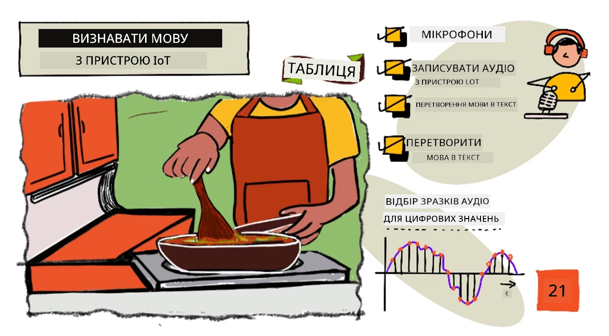
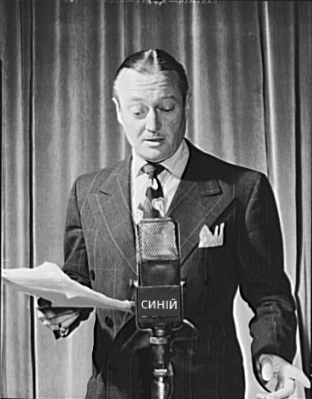
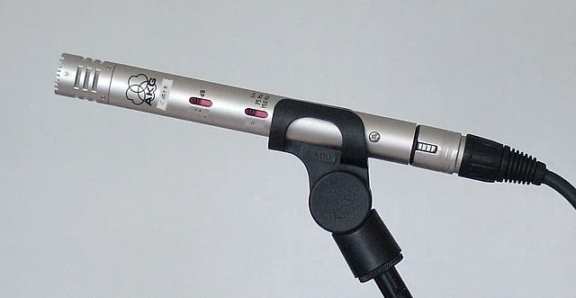
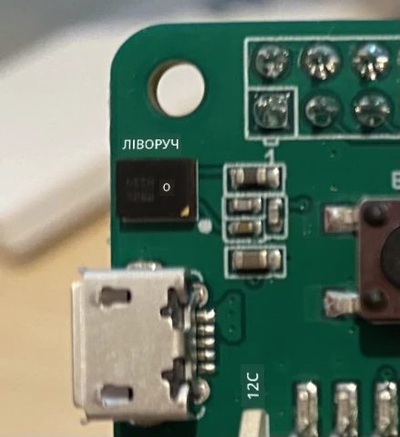
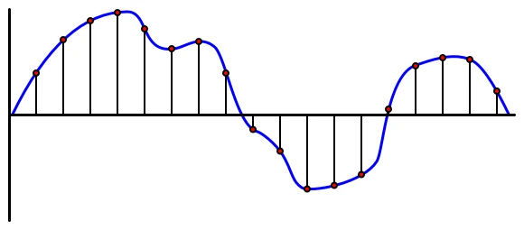
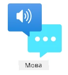

# Розпізнавання мовлення за допомогою IoT-пристрою



> Скетчнот від [Nitya Narasimhan](https://github.com/nitya). Натисніть на зображення, щоб побачити його у більшому розмірі.

У цьому відео (англійською) є огляд сервісу розпізнавання мовлення Azure, який ми розглянемо в цьому уроці:

[](https://www.youtube.com/watch?v=iW0Fw0l3mrA)

> 🎥 Натисніть на зображення вище, щоб переглянути відео.

## Тест перед лекцією

[Тест перед лекцією](https://black-meadow-040d15503.1.azurestaticapps.net/quiz/41)

## Вступ

«Алексо, постав таймер на 12 хвилин»

«Алексо, стан таймера»

«Алексо, постав таймер на 8 хвилин з назвою "броколі на парі"»

Розумні пристрої трапляються дедалі частіше. Це не лише розумні колонки на кшталт HomePod, Echo чи Google Home, а й помічники, вбудовані в наші телефони, годинники і навіть світильники та термостати.

> 💁 У мене вдома щонайменше 19 пристроїв із голосовими помічниками, і це лише ті, про які я знаю!

Голосове керування робить пристрої доступнішими для людей з обмеженою рухливістю. Чи це постійна інвалідність, як-от відсутність рук від народження, чи тимчасова, як зламані руки, чи просто руки, зайняті покупками або маленькими дітьми, — можливість керувати домом голосом, а не руками, відкриває нові можливості. Гукнути «Hey Siri, close my garage door», коли ви перевдягаєте немовля й водночас намагаєтеся вгамувати неслухняного малюка, — невелике, але відчутне полегшення життя.

Одне з найпопулярніших застосувань голосових помічників — таймери, особливо кухонні. Можливість поставити кілька таймерів лише голосом дуже допомагає на кухні: не треба переставати місити тісто чи помішувати суп або відмивати руки від начинки для вареників, щоб скористатися звичайним таймером.

У цьому уроці ви дізнаєтеся, як додати розпізнавання голосу до IoT-пристроїв. Ви познайомитеся з мікрофонами як сенсорами, дізнаєтеся, як записати звук із мікрофона, під'єднаного до IoT-пристрою, і як за допомогою штучного інтелекту перетворити почуте на текст. Упродовж решти цього проєкту ви створюватимете розумний кухонний таймер, якому можна голосом ставити таймери кількома мовами.

> 👩‍🏫 **Як проходити цей урок.** Теоретичну частину читають усі. Сервіс розпізнавання мовлення Azure показує викладач (демо). Студенти виконують [локальний варіант](local-text-input.md): замість мікрофона й хмарного сервісу команди для таймера вводяться з клавіатури, ніби мовлення вже перетворено на текст.

У цьому уроці ми розглянемо:

* [Мікрофони](#мікрофони)
* [Запис звуку з IoT-пристрою](#запис-звуку-з-iot-пристрою)
* [Мовлення в текст](#мовлення-в-текст)
* [Перетворення мовлення на текст](#перетворення-мовлення-на-текст)

## Мікрофони

Мікрофони — це аналогові сенсори, що перетворюють звукові хвилі на електричні сигнали. Коливання повітря змушують деталі мікрофона трохи зміщуватися, а це спричиняє крихітні зміни електричного сигналу. Далі ці зміни підсилюються, і на виході отримується електричний сигнал.

### Типи мікрофонів

Мікрофони бувають різних типів:

* Динамічні. У динамічному мікрофоні до рухомої мембрани прикріплено магніт, який рухається в котушці дроту й створює електричний струм. Це протилежне до того, як працює більшість гучномовців: вони використовують електричний струм, щоб рухати магніт у котушці, а той рухає мембрану й створює звук. Тому гучномовці можна використовувати як динамічні мікрофони, а динамічні мікрофони — як гучномовці. У пристроях на кшталт домофонів, де користувач або слухає, або говорить, але не одночасно, один пристрій може бути і гучномовцем, і мікрофоном.

    Динамічним мікрофонам не потрібне живлення: електричний сигнал повністю створює сам мікрофон.

    

* Стрічкові. Стрічкові мікрофони схожі на динамічні, але замість мембрани в них металева стрічка. Ця стрічка рухається в магнітному полі й створює електричний струм. Як і динамічним, стрічковим мікрофонам не потрібне живлення.

    

* Конденсаторні. У конденсаторному мікрофоні є тонка металева мембрана й нерухома металева задня пластина. На обидві подається напруга, і коли мембрана коливається, статичний заряд між пластинами змінюється, створюючи сигнал. Конденсаторним мікрофонам для роботи потрібне живлення, яке називають *фантомним живленням*.

    

* MEMS. Мікрофони MEMS (мікроелектромеханічні системи) — це мікрофони на чипі. У них чутлива до тиску мембрана витравлена на кремнієвому чипі, і працюють вони подібно до конденсаторних. Такі мікрофони можуть бути крихітними й вбудовуватися в схеми.

    

    На зображенні вище чип з позначкою **LEFT** — це MEMS-мікрофон із крихітною мембраною шириною менше за міліметр.

✅ Дослідіть самостійно: які мікрофони є поруч із вами — у комп'ютері, телефоні, гарнітурі чи інших пристроях? Якого вони типу?

### Цифровий звук

Звук — це аналоговий сигнал, що несе дуже детальну інформацію. Щоб перетворити його на цифровий, звук потрібно вимірювати (дискретизувати) багато тисяч разів на секунду.

> 🎓 Дискретизація — це перетворення звукового сигналу на цифрове значення, яке відображає сигнал у певний момент часу.



Цифровий звук дискретизують за допомогою імпульсно-кодової модуляції (Pulse Code Modulation, PCM). PCM зчитує напругу сигналу й вибирає найближче до неї дискретне значення заданого розміру.

> 💁 PCM можна вважати сенсорною версією широтно-імпульсної модуляції, або ШІМ (PWM; про ШІМ ішлося в [уроці 3 проєкту «Початок роботи»](../../../1-getting-started/lessons/3-sensors-and-actuators/README.md#широтно-імпульсна-модуляція)). PCM перетворює аналоговий сигнал на цифровий, а ШІМ — цифровий на аналоговий.

Наприклад, більшість стримінгових музичних сервісів пропонують 16- або 24-бітний звук. Це означає, що вони перетворюють напругу на значення, яке вміщується в 16-бітне або 24-бітне ціле число. 16-бітний звук записує значення в діапазоні від -32 768 до 32 767, 24-бітний — від −8 388 608 до 8 388 607. Що більше бітів, то ближчий запис до того, що насправді чують наші вуха.

> 💁 Можливо, ви чули про 8-бітний звук, який часто називають LoFi. Це звук, записаний лише 8 бітами, тобто від -128 до 127. Перший комп'ютерний звук через апаратні обмеження був 8-бітним, тому його часто можна почути в ретроіграх.

Ці вимірювання роблять багато тисяч разів на секунду з чітко визначеною частотою дискретизації, яку вимірюють у кілогерцах (тисячах вимірювань на секунду). Стримінгові музичні сервіси для більшості записів використовують 48 кГц, але деякий звук «без втрат» має до 96 кГц або навіть 192 кГц. Що вища частота дискретизації, то ближчий звук до оригіналу, але до певної межі. Тривають суперечки, чи може людина розрізнити звук із частотою понад 48 кГц.

✅ Дослідіть самостійно: якщо ви користуєтеся стримінговим музичним сервісом, яку частоту дискретизації й розрядність він використовує? Якщо ви слухаєте CD, яка частота дискретизації й розрядність CD-аудіо?

Є багато різних форматів звукових даних. Ви, мабуть, чули про файли mp3 — звукові дані, стиснені так, щоб зменшити розмір без помітної втрати якості. Нестиснений звук часто зберігають у файлі WAV: це 44 байти заголовка, а за ними сирі звукові дані. Заголовок містить таку інформацію, як частота дискретизації (наприклад, 16000 для 16 кГц), розрядність (16 для 16 біт) і кількість каналів. Після заголовка у WAV-файлі йдуть сирі звукові дані.

> 🎓 Канали — це кількість окремих звукових потоків, з яких складається звук. Наприклад, у стереозвуку з лівим і правим каналом їх 2. Для об'ємного звуку 7.1 у домашньому кінотеатрі їх 8.

### Розмір звукових даних

Звукові дані займають чимало місця. Наприклад, запис нестисненого 16-бітного звуку з частотою 16 кГц (цього достатньо для моделі перетворення мовлення на текст) займає 32 КБ на кожну секунду звуку:

* 16 біт — це 2 байти на вимірювання (1 байт — це 8 біт).
* 16 кГц — це 16 000 вимірювань на секунду.
* 16 000 × 2 байти = 32 000 байтів на секунду.

Це здається невеликим обсягом, але для мікроконтролера з обмеженою пам'яттю це багато. Наприклад, Wio Terminal має 192 КБ пам'яті, і в ній мають поміститися код програми та змінні. Навіть якби код був крихітним, ви не змогли б записати більше 5 секунд звуку.

Мікроконтролери можуть використовувати додаткові сховища, як-от SD-карти чи флеш-пам'ять. Створюючи IoT-пристрій, що записує звук, треба подбати не лише про додаткове сховище, а й про те, щоб код записував звук із мікрофона безпосередньо в це сховище, а під час надсилання в хмару передавав дані потоком зі сховища у вебзапит. Так можна уникнути нестачі пам'яті, не намагаючись тримати весь запис у пам'яті одночасно.

## Запис звуку з IoT-пристрою

До IoT-пристрою можна під'єднати мікрофон, щоб записувати звук для перетворення на текст. До нього також можна під'єднати гучномовці, щоб відтворювати звук. У наступних уроках вони знадобляться для голосових відповідей, але налаштувати їх варто вже зараз, щоб перевірити мікрофон.

### Завдання: налаштуйте мікрофон і гучномовці

Виконайте відповідну інструкцію, щоб налаштувати мікрофон і гучномовці для вашого IoT-пристрою:

* [Arduino: Wio Terminal](https://github.com/microsoft/IoT-For-Beginners/blob/main/6-consumer/lessons/1-speech-recognition/wio-terminal-microphone.md) (ще не адаптовано, оригінал англійською)
* [Одноплатний комп'ютер: Raspberry Pi](https://github.com/microsoft/IoT-For-Beginners/blob/main/6-consumer/lessons/1-speech-recognition/pi-microphone.md) (ще не адаптовано, оригінал англійською)
* [Одноплатний комп'ютер: віртуальний пристрій](virtual-device-microphone.md)

> 💁 Для локального варіанта мікрофон і гучномовці не потрібні.

### Завдання: запишіть звук

Виконайте відповідну інструкцію, щоб записати звук на вашому IoT-пристрої:

* [Arduino: Wio Terminal](https://github.com/microsoft/IoT-For-Beginners/blob/main/6-consumer/lessons/1-speech-recognition/wio-terminal-audio.md) (ще не адаптовано, оригінал англійською)
* [Одноплатний комп'ютер: Raspberry Pi](https://github.com/microsoft/IoT-For-Beginners/blob/main/6-consumer/lessons/1-speech-recognition/pi-audio.md) (ще не адаптовано, оригінал англійською)
* [Одноплатний комп'ютер: віртуальний пристрій](virtual-device-audio.md)

## Мовлення в текст

Перетворення мовлення на текст, або розпізнавання мовлення, — це використання штучного інтелекту, щоб перетворити слова зі звукового сигналу на текст.

### Моделі розпізнавання мовлення

Щоб перетворити мовлення на текст, вимірювання звукового сигналу групують і передають у модель машинного навчання на основі рекурентної нейронної мережі (Recurrent Neural Network, RNN). Це тип моделі машинного навчання, яка може використовувати попередні дані, щоб ухвалити рішення щодо нових вхідних даних. Наприклад, RNN може розпізнати один блок звукових вимірювань як звук «При», а коли отримає наступний, який вважає звуком «віт», поєднати його з попереднім, з'ясувати, що «Привіт» — справжнє слово, і вибрати його як результат.

Моделі машинного навчання завжди приймають дані однакового розміру. Класифікатор зображень, який ви створювали в одному з попередніх уроків, зменшує зображення до фіксованого розміру й лише потім їх обробляє. Так само й моделі мовлення: вони обробляють звук фрагментами фіксованого розміру. Моделі мовлення мають уміти поєднувати результати кількох передбачень, щоб отримати відповідь і відрізнити, наприклад, «Hi» від «Highway» або «flock» від «floccinaucinihilipilification».

Моделі мовлення також достатньо розвинені, щоб розуміти контекст, і можуть виправляти розпізнані слова, коли обробляють нові звуки. Наприклад, якщо сказати англійською «I went to the shops to get two bananas and an apple too», ви вимовите три слова, які звучать однаково, але пишуться по-різному: to, two і too. Моделі мовлення розуміють контекст і вибирають правильне написання слова.

> 💁 Деякі сервіси розпізнавання мовлення можна налаштувати, щоб вони краще працювали в галасливих місцях, як-от на заводах, або зі спеціальними словами певної галузі, наприклад назвами хімічних речовин. Таке налаштування навчають на прикладах звуку з транскрипцією за допомогою перенесення навчання (transfer learning), так само як ви навчили класифікатор зображень лише на кількох зображеннях в одному з попередніх уроків.

### Приватність

Коли розпізнавання мовлення використовують у побутових IoT-пристроях, приватність надзвичайно важлива. Такі пристрої слухають звук безперервно, і як споживач ви не хочете, щоб усе, що ви кажете, надсилалося в хмару й перетворювалося на текст. Це не лише витрачає багато інтернет-трафіку, а й має величезні наслідки для приватності, особливо коли деякі виробники розумних пристроїв випадково відбирають записи, щоб [люди звіряли їх зі згенерованим текстом і так покращували модель](https://www.theverge.com/2019/4/10/18305378/amazon-alexa-ai-voice-assistant-annotation-listen-private-recordings).

Розумний пристрій має надсилати звук на обробку в хмару лише тоді, коли ви ним користуєтеся, а не коли він чує звуки у вашому домі — серед них можуть бути приватні розмови чи інтимні моменти. Більшість розумних пристроїв працюють зі *словом активації* (wake word) — ключовою фразою на кшталт «Alexa», «Hey Siri» чи «OK Google», після якої пристрій «прокидається» і слухає, що ви кажете, доки не помітить паузу в мовленні, яка означає, що ви закінчили звертатися до пристрою.

> 🎓 Виявлення слова активації також називають *пошуком ключових слів* (keyword spotting) або *розпізнаванням ключових слів* (keyword recognition).

Слова активації виявляються на самому пристрої, а не в хмарі. У розумних пристроях працюють невеликі моделі штучного інтелекту, які слухають слово активації, а коли його виявлено, починають передавати звук потоком у хмару для розпізнавання. Ці моделі дуже спеціалізовані й слухають лише слово активації.

> 💁 Деякі технологічні компанії посилюють приватність своїх пристроїв і виконують частину перетворення мовлення на текст на самому пристрої. Apple оголосила, що в оновленнях iOS і macOS 2021 року підтримуватиме перетворення мовлення на текст на пристрої й зможе обробляти багато запитів без хмари. Це можливо завдяки потужним процесорам у їхніх пристроях, здатним запускати моделі машинного навчання.

✅ Які, на вашу думку, наслідки для приватності й етики має зберігання звуку, надісланого в хмару? Чи варто зберігати такі записи, і якщо так, то як? Чи вважаєте ви використання записів правоохоронними органами виправданим компромісом за втрату приватності?

Для виявлення слова активації зазвичай використовують підхід TinyML, тобто перетворення моделей машинного навчання так, щоб вони могли працювати на мікроконтролерах. Такі моделі мають невеликий розмір і споживають дуже мало енергії.

Щоб уникнути складнощів із навчанням і використанням моделі слова активації, розумний таймер, який ви створюєте в цьому уроці, вмикатиме розпізнавання мовлення кнопкою.

> 💁 Якщо хочете спробувати створити модель виявлення слова активації для Wio Terminal або Raspberry Pi, перегляньте [посібник Edge Impulse про реакцію на голос](https://docs.edgeimpulse.com/docs/responding-to-your-voice). Якщо хочете зробити це на комп'ютері, спробуйте [документацію Microsoft про розпізнавання ключових слів](https://learn.microsoft.com/azure/ai-services/speech-service/keyword-recognition-overview).

## Перетворення мовлення на текст

> 👩‍🏫 Цю частину показує викладач (демо). Студенти виконують [локальний варіант](local-text-input.md).



Як і для класифікації зображень у попередньому проєкті, існують готові сервіси штучного інтелекту, які приймають мовлення у вигляді звукового файлу й перетворюють його на текст. Один із них — сервіс Speech, частина Azure AI services (раніше Cognitive Services), готових сервісів штучного інтелекту, які можна використовувати у своїх застосунках.

### Завдання: налаштуйте ресурс штучного інтелекту для мовлення

1. Створіть групу ресурсів (Resource Group) для цього проєкту з назвою `smart-timer`:

    ```sh
    az group create --name smart-timer --location <location>
    ```

    Замініть `<location>` на розташування, яке ви використовували в попередніх уроках, наприклад `westeurope`.

1. Створіть безкоштовний ресурс Speech такою командою:

    ```sh
    az cognitiveservices account create --name smart-timer \
                                        --resource-group smart-timer \
                                        --kind SpeechServices \
                                        --sku F0 \
                                        --yes \
                                        --location <location>
    ```

    Замініть `<location>` на розташування, яке ви використали під час створення групи ресурсів.

1. Щоб звертатися до ресурсу Speech з коду, потрібен ключ API. Отримайте його такою командою:

    ```sh
    az cognitiveservices account keys list --name smart-timer \
                                           --resource-group smart-timer \
                                           --output table
    ```

    Скопіюйте один із ключів.

### Завдання: перетворіть мовлення на текст

Виконайте відповідну інструкцію, щоб перетворити мовлення на текст на вашому IoT-пристрої:

* [Arduino: Wio Terminal](https://github.com/microsoft/IoT-For-Beginners/blob/main/6-consumer/lessons/1-speech-recognition/wio-terminal-speech-to-text.md) (ще не адаптовано, оригінал англійською)
* [Одноплатний комп'ютер: Raspberry Pi](https://github.com/microsoft/IoT-For-Beginners/blob/main/6-consumer/lessons/1-speech-recognition/pi-speech-to-text.md) (ще не адаптовано, оригінал англійською)
* [Одноплатний комп'ютер: віртуальний пристрій](virtual-device-speech-to-text.md) (демо викладача, потрібен Azure)
* [Локальний варіант без Azure: введення команд з клавіатури](local-text-input.md) (для студентів)

---

## 🚀 Виклик

Розпізнавання мовлення існує вже давно й постійно вдосконалюється. Дослідіть, що воно вміє зараз, і порівняйте, як ці можливості змінювалися з часом, зокрема наскільки точна машинна транскрипція порівняно з людською.

Яким, на вашу думку, буде майбутнє розпізнавання мовлення?

## Тест після лекції

[Тест після лекції](https://black-meadow-040d15503.1.azurestaticapps.net/quiz/42)

## Огляд і самостійне навчання

* Прочитайте про різні типи мікрофонів і про те, як вони працюють, у [статті Musician's HQ про різницю між динамічними й конденсаторними мікрофонами](https://musicianshq.com/whats-the-difference-between-dynamic-and-condenser-microphones/) (англійською).
* Дізнайтеся більше про сервіс Speech з [документації сервісу Speech на Microsoft Learn](https://learn.microsoft.com/azure/ai-services/speech-service/).
* Прочитайте про пошук ключових слів у [документації з розпізнавання ключових слів на Microsoft Learn](https://learn.microsoft.com/azure/ai-services/speech-service/keyword-recognition-overview).

## Завдання

[](assignment.md)

---

> **Про цю версію.** Урок адаптовано українською на основі курсу [IoT for Beginners](https://github.com/microsoft/IoT-For-Beginners) від Microsoft (ліцензія MIT). Порівняно з оригіналом сервіс Speech показує викладач, а студенти виконують локальний варіант із введенням команд з клавіатури; посилання на документацію оновлено на Microsoft Learn, назву Cognitive Services — на Azure AI services, додано команду створення групи ресурсів.
