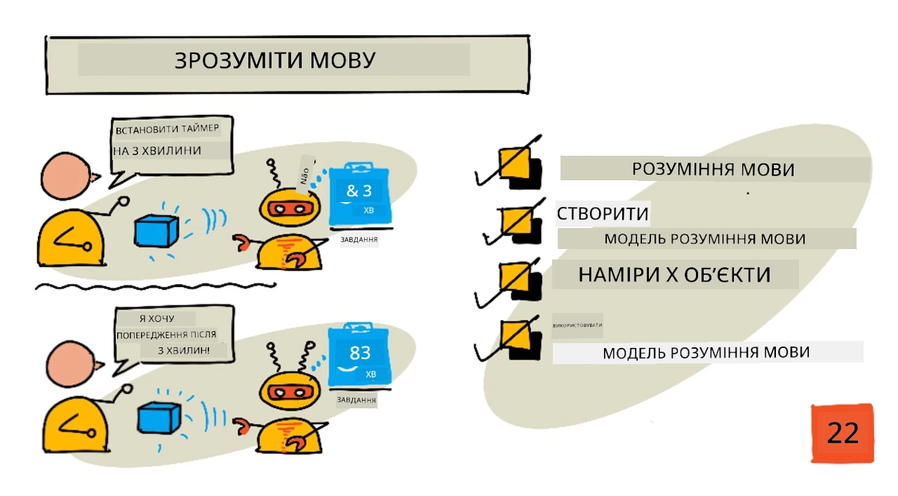
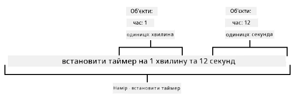

# Розуміння мови



> Скетчнот від [Nitya Narasimhan](https://github.com/nitya). Натисніть на зображення, щоб побачити його у більшому розмірі.

## Тест перед лекцією

[Тест перед лекцією](https://black-meadow-040d15503.1.azurestaticapps.net/quiz/43)

## Вступ

У минулому уроці ви перетворили мовлення на текст. Щоб використати цей текст для програмування розумного таймера, ваш код має розуміти, що саме було сказано. Можна припустити, що користувач вимовлятиме фіксовану фразу, наприклад «Постав таймер на 3 хвилини», і розбирати саме її, щоб дізнатися тривалість таймера, але це не надто зручно для користувача. Якщо людина скаже «Засічи 3 хвилини», ми з вами зрозуміємо, що вона має на увазі, а ваш код — ні, бо очікуватиме фіксовану фразу.

Тут на допомогу приходить розуміння мови: моделі штучного інтелекту, які інтерпретують текст і повертають потрібні подробиці. Наприклад, вони можуть прийняти і «Постав таймер на 3 хвилини», і «Засічи 3 хвилини» та зрозуміти, що потрібен таймер на 3 хвилини.

У цьому уроці ви дізнаєтеся про моделі розуміння мови: як їх створювати, навчати й використовувати з коду.

> 👩‍🏫 **Як проходити цей урок.** Сервіс LUIS, яким користувався оригінальний урок Microsoft, вимкнено 1 жовтня 2025 року. Його наступник, Conversational Language Understanding (CLU) в Azure AI Language, показує викладач (демо). Студенти виконують [локальний варіант](local-language-understanding.md): пишуть просту функцію на Python, яка знаходить у фразі намір і сутності та повертає тривалість таймера в секундах.

У цьому уроці ми розглянемо:

* [Розуміння мови](#розуміння-мови)
* [Створення моделі розуміння мови](#створення-моделі-розуміння-мови)
* [Наміри та сутності](#наміри-та-сутності)
* [Використання моделі розуміння мови](#використання-моделі-розуміння-мови)

## Розуміння мови

Люди спілкуються мовою сотні тисяч років. Ми спілкуємося словами, звуками чи діями й розуміємо сказане: і значення слів, звуків чи дій, і їхній контекст. Ми розрізняємо щирість і сарказм, тож ті самі слова можуть означати різне залежно від тону голосу.

✅ Пригадайте кілька своїх нещодавніх розмов. Яку частину з них комп'ютеру було б важко зрозуміти, бо для цього потрібен контекст?

Розуміння мови, або розуміння природної мови (natural-language understanding), — частина галузі штучного інтелекту, яка називається обробкою природної мови (natural-language processing, NLP). Воно стосується розуміння прочитаного: спроби зрозуміти подробиці слів чи речень. Якщо ви користуєтеся голосовим помічником на кшталт Alexa чи Siri, ви вже користувалися сервісами розуміння мови. Саме ці сервіси штучного інтелекту «за лаштунками» перетворюють фразу «Alexa, play the latest album by Taylor Swift» на те, що моя донька танцює у вітальні під улюблені пісні.

> 💁 Попри всі досягнення, комп'ютерам ще далеко до справжнього розуміння тексту. Коли ми говоримо про розуміння мови комп'ютерами, ми маємо на увазі зовсім не те, що людське спілкування, а лише виділення ключових подробиць із кількох слів.

Люди розуміють мову, не замислюючись. Якби я попросив іншу людину «увімкни останній альбом Тейлор Свіфт», вона б інстинктивно зрозуміла, що я маю на увазі. Комп'ютеру це складніше. Йому треба взяти слова, перетворені з мовлення на текст, і з'ясувати таке:

* Потрібно відтворити музику
* Музика виконавиці Тейлор Свіфт
* Потрібна конкретна музика — цілий альбом із кількох треків по порядку
* У Тейлор Свіфт багато альбомів, тож їх треба впорядкувати за датою й вибрати найновіший

✅ Пригадайте інші речення, якими ви про щось просили, наприклад замовляли каву чи просили когось із рідних щось подати. Спробуйте розкласти їх на частини інформації, які комп'ютер мав би виділити, щоб зрозуміти речення.

Моделі розуміння мови — це моделі штучного інтелекту, навчені виділяти певні подробиці з мови, які потім донавчають під конкретні завдання за допомогою перенесення навчання, так само як ви навчали модель Custom Vision на невеликому наборі зображень. Можна взяти готову модель і навчити її на текстах, які вона має розуміти.

## Створення моделі розуміння мови

> 👩‍🏫 Цю частину показує викладач (демо). Студенти виконують [локальний варіант](local-language-understanding.md).

В оригінальному уроці моделі розуміння мови створювали за допомогою LUIS — сервісу розуміння мови від Microsoft, який входив до Cognitive Services. LUIS вимкнено 1 жовтня 2025 року, і тепер його роль виконує **Conversational Language Understanding (CLU)** — можливість сервісу Azure AI Language. CLU працює з тими самими поняттями, що й LUIS: наміри, сутності та приклади фраз.

### Демо: створення проєкту CLU

Короткий план демонстрації (докладні кроки є в [швидкому старті CLU на Microsoft Learn](https://learn.microsoft.com/azure/ai-services/language-service/conversational-language-understanding/quickstart)):

1. Створіть ресурс Language (Azure AI Language) у групі ресурсів `smart-timer`. Безкоштовний рівень — `F0`. Виберіть регіон, у якому доступний CLU.

    ```sh
    az cognitiveservices account create --name smart-timer-language \
                                        --resource-group smart-timer \
                                        --kind TextAnalytics \
                                        --sku F0 \
                                        --yes \
                                        --location <location>
    ```

1. У порталі для роботи з мовними проєктами (Language Studio / Microsoft Foundry) створіть проєкт **Conversational language understanding** з назвою `smart-timer` і виберіть мову проєкту.

1. Додайте намір `set timer`, сутності для числа й одиниці часу та позначте їх у прикладах фраз (див. наступний розділ).

1. Навчіть модель (**Train**), розгорніть її (**Deploy**) і перевірте кількома фразами на сторінці тестування. У результаті видно найімовірніший намір (top intent) з оцінкою впевненості та знайдені сутності.

> 💁 Як перенести наявні застосунки LUIS у CLU, описано на сторінці [Migrate from LUIS](https://learn.microsoft.com/azure/ai-services/language-service/conversational-language-understanding/how-to/migrate-from-luis).

## Наміри та сутності

Розуміння мови побудоване на *намірах* (intents) і *сутностях* (entities). Намір — це те, чого хоче людина, наприклад відтворити музику, поставити таймер чи замовити їжу. Сутності — це те, чого стосується намір, наприклад альбом, тривалість таймера чи вид їжі. Кожне речення, яке інтерпретує модель, має щонайменше один намір і, можливо, одну чи кілька сутностей.

Кілька прикладів:

| Речення                                                    | Намір                | Сутності                                          |
| ---------------------------------------------------------- | -------------------- | ------------------------------------------------- |
| «Увімкни останній альбом Тейлор Свіфт»                     | *відтворити музику*  | *останній альбом Тейлор Свіфт*                    |
| «Постав таймер на 3 хвилини»                               | *поставити таймер*   | *3 хвилини*                                       |
| «Скасуй мій таймер»                                        | *скасувати таймер*   | Немає                                             |
| «Замов 3 великі піци з ананасами й салат Цезар»            | *замовити їжу*       | *3 великі піци з ананасами*, *салат Цезар*        |

✅ Які наміри й сутності є в реченнях, які ви придумали раніше?

Щоб навчити модель, спочатку задають сутності. Це може бути фіксований список термінів або сутності, яких модель навчається з тексту. Наприклад, можна задати фіксований список страв з вашого меню з варіантами (синонімами) кожного слова, як-от *баклажан* і *синенький* як варіанти слова *баклажан*. Є також готові (prebuilt) сутності, наприклад для чисел і місць.

Для таймера можна використати одну готову сутність для чисел і ще одну — для одиниць часу, як-от хвилин і секунд. Кожна одиниця матиме кілька варіантів, щоб охопити різні форми слова, наприклад *хвилина*, *хвилину*, *хвилини* й *хвилин*.

Коли сутності визначено, створюють наміри. Модель вчиться розпізнавати їх на прикладах речень, які ви надаєте (їх називають висловлюваннями, utterances). Наприклад, для наміру *set timer* можна навести такі речення:

* `set a 1 second timer`
* `set a timer for 1 minute and 12 seconds`
* `set a timer for 3 minutes`
* `set a 9 minute 30 second timer`

Потім ви вказуєте моделі, які частини цих речень відповідають сутностям:



Речення `set a timer for 1 minute and 12 seconds` має намір `set timer`. У ньому також є 2 сутності, кожна з 2 значеннями:

|            | число | одиниця |
| ---------- | ----: | ------- |
| 1 minute   | 1     | minute  |
| 12 seconds | 12    | second  |

Щоб навчити хорошу модель, потрібно багато різних прикладів речень, які охоплюють різні способи попросити про одне й те саме.

> 💁 Як і з будь-якою моделлю штучного інтелекту, що більше даних і що вони точніші, то кращою буде модель.

✅ Подумайте, якими різними способами можна попросити про те саме, щоб людина вас зрозуміла.

### Завдання: додайте сутності й наміри

> 👩‍🏫 У демо викладач додає ці сутності й наміри в проєкт CLU. Студенти задають ті самі сутності й намір у коді в [локальному варіанті](local-language-understanding.md).

Для таймера потрібні 2 сутності: одна для одиниці часу (хвилини чи секунди), друга — для кількості хвилин чи секунд.

1. Сутність для числа: у CLU до сутності можна додати готовий компонент (prebuilt) для чисел.

1. Сутність `time unit` для одиниці часу — список (*List*) з нормалізованими значеннями `minute` і `second` та їхніми синонімами:

    | Нормалізоване значення | Синоніми                                   |
    | ---------------------- | ------------------------------------------ |
    | minute                 | minute, minutes, хвилина, хвилину, хвилини, хвилин |
    | second                 | second, seconds, секунда, секунду, секунди, секунд |

1. Намір `set timer` з прикладами, у яких є і хвилини, і секунди, і їх поєднання. Наприклад:

    * `set a 1 second timer`
    * `set a 4 minute timer`
    * `set a four minute six second timer`
    * `set a 9 minute 30 second timer`
    * `set a timer for 1 minute and 12 seconds`
    * `set a timer for 3 minutes`
    * `set a timer for 3 minutes and 1 second`
    * `set a timer for three minutes and one second`
    * `set a timer for 1 minute and 1 second`
    * `set a timer for 30 seconds`
    * `set a timer for 1 second`

    Змішуйте числа словами й цифрами, щоб модель навчилася розуміти обидва варіанти. Якщо проєкт українською, додайте українські приклади, наприклад `постав таймер на 3 хвилини 30 секунд`.

1. Навчіть і перевірте модель. Для фрази `set a timer for 45 minutes and 12 seconds` модель має повернути намір `set timer`, дві сутності-числа `45` і `12` та дві одиниці часу `minute` і `second`.

## Використання моделі розуміння мови

Після розгортання модель можна викликати з коду. У попередніх уроках ви використовували IoT Hub для зв'язку з хмарними сервісами: надсилали телеметрію й слухали команди. Такий зв'язок дуже асинхронний: надіславши телеметрію, код не чекає відповіді, і якщо хмарний сервіс недоступний, ви про це не дізнаєтеся.

Для розумного таймера відповідь потрібна одразу, щоб сказати користувачеві, що таймер поставлено, або попередити, що хмарні сервіси недоступні. Для цього IoT-пристрій звертатиметься до вебендпоінта безпосередньо, а не через IoT Hub.

Замість того щоб викликати сервіс розуміння мови з IoT-пристрою, можна використати безсерверний код з іншим типом тригера — HTTP-тригером. Тоді застосунок функцій (Functions app) слухає REST-запити й відповідає на них. Така функція стане REST-ендпоінтом, який може викликати ваш пристрій.

> 💁 Хоча сервіс розуміння мови можна викликати безпосередньо з IoT-пристрою, краще використати щось на зразок безсерверного коду. Тоді, якщо ви захочете змінити модель, яку викликаєте, наприклад навчите кращу модель або модель іншою мовою, достатньо буде оновити хмарний код, а не розгортати новий код на тисячах чи мільйонах IoT-пристроїв.

В оригінальному уроці тут створювали застосунок функцій Azure `smart-timer-trigger` з HTTP-тригером `text-to-timer`, який через SDK LUIS отримував передбачення й повертав кількість секунд для таймера. Цей код більше не працює, бо LUIS вимкнено.

> 👩‍🏫 Викладач може показати виклик розгорнутої моделі CLU на сторінці тестування в порталі або через REST API (див. [документацію CLU](https://learn.microsoft.com/azure/ai-services/language-service/conversational-language-understanding/overview)).

### Завдання: використайте модель розуміння мови

Студенти виконують цю частину в [локальному варіанті](local-language-understanding.md). Замість HTTP-функції в хмарі ви напишете звичайну функцію Python `text_to_timer`, яка працює на тому самому комп'ютері, що й код пристрою. Вона виконує те саме, що робила функція в оригінальному уроці: знаходить намір `set timer` і сутності «число» та «одиниця часу», а потім обчислює загальну кількість секунд для таймера. Якщо намір не розпізнано, функція повертає `0`.

---

## 🚀 Виклик

Попросити про одне й те саме, наприклад поставити таймер, можна багатьма способами. Придумайте різні варіанти й перевірте, як із ними впорається модель: у демо їх можна додати як приклади в проєкт CLU, а в локальному варіанті — ввести у вашу функцію й подивитися, які з них вона розуміє.

## Тест після лекції

[Тест після лекції](https://black-meadow-040d15503.1.azurestaticapps.net/quiz/44)

## Огляд і самостійне навчання

* Дізнайтеся більше про CLU, наступника LUIS, та його можливості з [документації Conversational Language Understanding на Microsoft Learn](https://learn.microsoft.com/azure/ai-services/language-service/conversational-language-understanding/overview).
* Прочитайте більше про розуміння мови на [сторінці Вікіпедії про розуміння природної мови](https://wikipedia.org/wiki/Natural-language_understanding) (англійською).
* Прочитайте про HTTP-тригери в [документації HTTP-тригерів Azure Functions на Microsoft Learn](https://learn.microsoft.com/azure/azure-functions/functions-bindings-http-webhook-trigger?pivots=programming-language-python).

## Завдання

[Скасуйте таймер](assignment.md)

---

> **Про цю версію.** Урок адаптовано українською на основі курсу [IoT for Beginners](https://github.com/microsoft/IoT-For-Beginners) від Microsoft (ліцензія MIT). Сервіс LUIS вимкнено 1 жовтня 2025 року, тому покрокові інструкції для порталу LUIS і код функції Azure з SDK LUIS замінено коротким планом демо з Conversational Language Understanding (CLU) і локальним варіантом для студентів — функцією Python, яка розбирає фрази українською та англійською.
