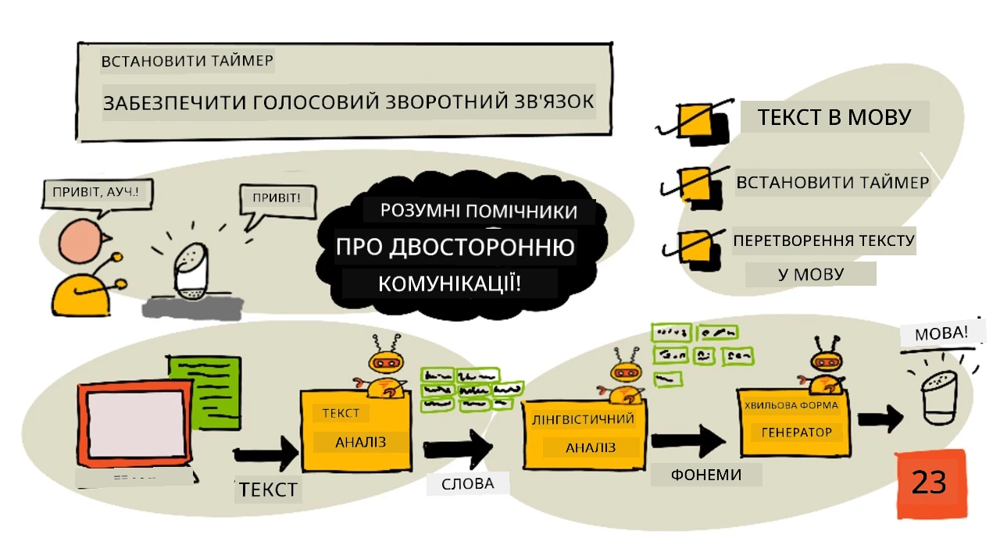
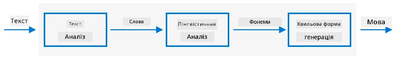

# Встановлення таймера й голосова відповідь



> Скетчнот від [Nitya Narasimhan](https://github.com/nitya). Натисніть на зображення, щоб побачити його у більшому розмірі.

## Тест перед лекцією

[Тест перед лекцією](https://black-meadow-040d15503.1.azurestaticapps.net/quiz/45)

## Вступ

Розумні помічники — це не пристрої одностороннього зв'язку. Ви говорите до них, і вони відповідають:

«Алексо, постав таймер на 3 хвилини»

«Добре, таймер поставлено на 3 хвилини»

У двох попередніх уроках ви навчилися перетворювати мовлення на текст, а потім виділяти з цього тексту запит на встановлення таймера. У цьому уроці ви навчитеся ставити таймер на IoT-пристрої, відповідати користувачеві голосом, підтверджуючи таймер, і повідомляти, коли час вийшов.

> 👩‍🏫 **Як проходити цей урок.** Встановлення таймера виконують усі. Синтез мовлення сервісом Speech показує викладач (демо). У [локальному варіанті](local-text-to-speech.md) студенти не озвучують відповіді, а виводять їх текстом у терміналі.

У цьому уроці ми розглянемо:

* [Текст у мовлення](#текст-у-мовлення)
* [Встановлення таймера](#встановлення-таймера)
* [Перетворення тексту на мовлення](#перетворення-тексту-на-мовлення)

## Текст у мовлення

Перетворення тексту на мовлення (text to speech), як випливає з назви, — це процес перетворення тексту на звук, у якому цей текст вимовлено словами. Основний принцип: розкласти слова тексту на звуки, з яких вони складаються (фонеми), і склеїти звук для цих фонем — або з наперед записаних фрагментів, або згенерований моделями штучного інтелекту.



Системи перетворення тексту на мовлення зазвичай мають 3 етапи:

* Аналіз тексту
* Лінгвістичний аналіз
* Генерація звукової хвилі

### Аналіз тексту

Аналіз тексту — це перетворення наданого тексту на слова, з яких можна згенерувати мовлення. Наприклад, для «Привіт, світе» аналіз тексту не потрібен: ці два слова можна одразу перетворити на мовлення. А от «1234» залежно від контексту треба перетворити або на «тисяча двісті тридцять чотири», або на «один, два, три, чотири». У реченні «У мене 1234 яблука» це буде «тисяча двісті тридцять чотири», а в реченні «Дитина порахувала 1234» — «один, два, три, чотири».

Слова відрізняються не лише залежно від мови, а й від її регіонального варіанта. Наприклад, в американській англійській 120 — це «One hundred twenty», а в британській — «One hundred and twenty», з «and» після сотень.

✅ Серед інших прикладів, що потребують аналізу тексту, — англійське «in» як скорочення від inch (дюйм) і «st» як скорочення від saint (святий) і street (вулиця). Чи можете ви пригадати схожі приклади у своїй мові, де слово без контексту неоднозначне?

Коли слова визначено, їх передають на лінгвістичний аналіз.

### Лінгвістичний аналіз

Лінгвістичний аналіз розкладає слова на фонеми. Фонеми залежать не лише від самих літер, а й від інших літер у слові. Наприклад, в англійській звук «a» в словах «car» і «care» різний. В англійській мові 44 фонеми на 26 літер алфавіту, і деякі з них спільні для різних літер, як-от однаковий звук на початку слів «circle» і «serpent».

✅ Дослідіть самостійно: які фонеми є у вашій мові?

Після перетворення слів на фонеми потрібні додаткові дані для інтонації: зміни тону чи тривалості залежно від контексту. Наприклад, в англійській підвищенням тону можна перетворити речення на запитання: підвищений тон на останньому слові означає запитання.

Наприклад, речення «You have an apple» — це твердження, що у вас є яблуко. Якщо наприкінці тон підвищується на слові apple, воно стає запитанням «You have an apple?», тобто «У вас є яблуко?». Під час лінгвістичного аналізу знак питання в кінці речення використовується, щоб вирішити, що тон треба підвищити.

Коли фонеми згенеровано, їх можна передати на генерацію звукової хвилі, щоб отримати звук.

### Генерація звукової хвилі

Перші електронні системи перетворення тексту на мовлення використовували окремі записи для кожної фонеми, тож голоси звучали дуже монотонно, як у робота. Лінгвістичний аналіз давав фонеми, їхні записи завантажувалися з бази звуків і склеювалися в звук.

✅ Дослідіть самостійно: знайдіть записи ранніх систем синтезу мовлення. Порівняйте їх із сучасним синтезом мовлення, наприклад у розумних помічниках.

Сучасніша генерація звукової хвилі використовує моделі машинного навчання, побудовані за допомогою глибокого навчання (дуже великі нейронні мережі, які працюють подібно до нейронів у мозку), і створює природніші голоси, які буває неможливо відрізнити від людських.

> 💁 Деякі з цих моделей можна донавчити за допомогою перенесення навчання, щоб вони звучали як реальні люди. Тому використовувати голос як засіб захисту, що дедалі частіше пробують робити банки, вже не найкраща ідея: будь-хто з кількома хвилинами запису вашого голосу може вас імітувати.

Ці великі моделі машинного навчання навчають поєднувати всі три етапи в наскрізних (end-to-end) синтезаторах мовлення.

## Встановлення таймера

Щоб поставити таймер, IoT-пристрій має отримати з тексту кількість секунд, а потім поставити таймер на цей час. В оригінальному уроці для цього пристрій викликав REST-ендпоінт безсерверного коду, створеного в минулому уроці. У нашій адаптації (LUIS вимкнено) пристрій викликає функцію `text_to_timer`, яку ви написали в [локальному варіанті уроку 2](../2-language-understanding/local-language-understanding.md).

### Завдання: отримайте час таймера й поставте таймер

Виконайте відповідну інструкцію, щоб отримати з тексту час для таймера й поставити таймер на IoT-пристрої:

* [Arduino: Wio Terminal](https://github.com/microsoft/IoT-For-Beginners/blob/main/6-consumer/lessons/3-spoken-feedback/wio-terminal-set-timer.md) (ще не адаптовано, оригінал англійською)
* [Одноплатний комп'ютер: Raspberry Pi, віртуальний IoT-пристрій або локальний варіант](single-board-computer-set-timer.md)

## Перетворення тексту на мовлення

> 👩‍🏫 Цю частину показує викладач (демо). Студенти виконують [локальний варіант](local-text-to-speech.md).

Той самий сервіс Speech, яким ви перетворювали мовлення на текст, уміє перетворювати текст назад на мовлення, а отриманий звук можна відтворити через гучномовець IoT-пристрою. Текст для перетворення надсилається в сервіс Speech разом із потрібним типом звуку (наприклад, частотою дискретизації), а у відповідь повертаються двійкові дані зі звуком.

Цей запит надсилають мовою *Speech Synthesis Markup Language* (SSML) — мовою розмітки на основі XML для застосунків синтезу мовлення. Вона задає не лише текст для перетворення, а й мову тексту, голос і навіть може змінювати швидкість, гучність і висоту тону для всього тексту чи окремих слів.

Наприклад, цей SSML описує запит перетворити на мовлення текст «Your 3 minute 5 second time has been set» британським англійським голосом `en-GB-MiaNeural`:

```xml
<speak version='1.0' xml:lang='en-GB'>
    <voice xml:lang='en-GB' name='en-GB-MiaNeural'>
        Your 3 minute 5 second time has been set
    </voice>
</speak>
```

> 💁 Більшість систем перетворення тексту на мовлення мають кілька голосів для різних мов із відповідними акцентами, наприклад британський англійський голос з англійським акцентом і новозеландський англійський голос з новозеландським акцентом. Для української мови в сервісі Speech є, наприклад, голоси `uk-UA-PolinaNeural` і `uk-UA-OstapNeural`.

### Завдання: перетворіть текст на мовлення

Виконайте відповідну інструкцію, щоб перетворити текст на мовлення на вашому IoT-пристрої:

* [Arduino: Wio Terminal](https://github.com/microsoft/IoT-For-Beginners/blob/main/6-consumer/lessons/3-spoken-feedback/wio-terminal-text-to-speech.md) (ще не адаптовано, оригінал англійською)
* [Одноплатний комп'ютер: Raspberry Pi](https://github.com/microsoft/IoT-For-Beginners/blob/main/6-consumer/lessons/3-spoken-feedback/pi-text-to-speech.md) (ще не адаптовано, оригінал англійською)
* [Одноплатний комп'ютер: віртуальний пристрій](virtual-device-text-to-speech.md) (демо викладача, потрібен Azure)
* [Локальний варіант без Azure: відповіді текстом у терміналі](local-text-to-speech.md) (для студентів)

---

## 🚀 Виклик

У SSML є способи змінити, як вимовляються слова: виділити окремі слова, додати паузи чи змінити висоту тону. Спробуйте деякі з них, надсилаючи різний SSML зі свого IoT-пристрою, і порівняйте результат. Більше про SSML, зокрема про те, як змінювати вимову слів, можна прочитати в [специфікації Speech Synthesis Markup Language (SSML) версії 1.1 від World Wide Web Consortium](https://www.w3.org/TR/speech-synthesis11/).

## Тест після лекції

[Тест після лекції](https://black-meadow-040d15503.1.azurestaticapps.net/quiz/46)

## Огляд і самостійне навчання

* Прочитайте більше про синтез мовлення на [сторінці Вікіпедії про синтез мовлення](https://wikipedia.org/wiki/Speech_synthesis) (англійською).
* Прочитайте, як зловмисники використовують синтез мовлення для крадіжок, у [статті BBC News про те, як підроблені голоси допомагають кіберзлочинцям красти гроші](https://www.bbc.com/news/technology-48908736) (англійською).
* Дізнайтеся більше про ризики, які синтезовані версії голосів створюють для акторів озвучування, зі [статті Vice про те, як позов проти TikTok показує, що штучний інтелект шкодить акторам озвучування](https://www.vice.com/en/article/z3xqwj/this-tiktok-lawsuit-is-highlighting-how-ai-is-screwing-over-voice-actors) (англійською).

## Завдання

[Скасуйте таймер](assignment.md)

---

> **Про цю версію.** Урок адаптовано українською на основі курсу [IoT for Beginners](https://github.com/microsoft/IoT-For-Beginners) від Microsoft (ліцензія MIT). Оскільки LUIS вимкнено, пристрій отримує час таймера з локальної функції `text_to_timer` з уроку 2, а не з функції Azure. Синтез мовлення сервісом Speech показує викладач, а студенти виводять відповіді пристрою текстом у терміналі.
